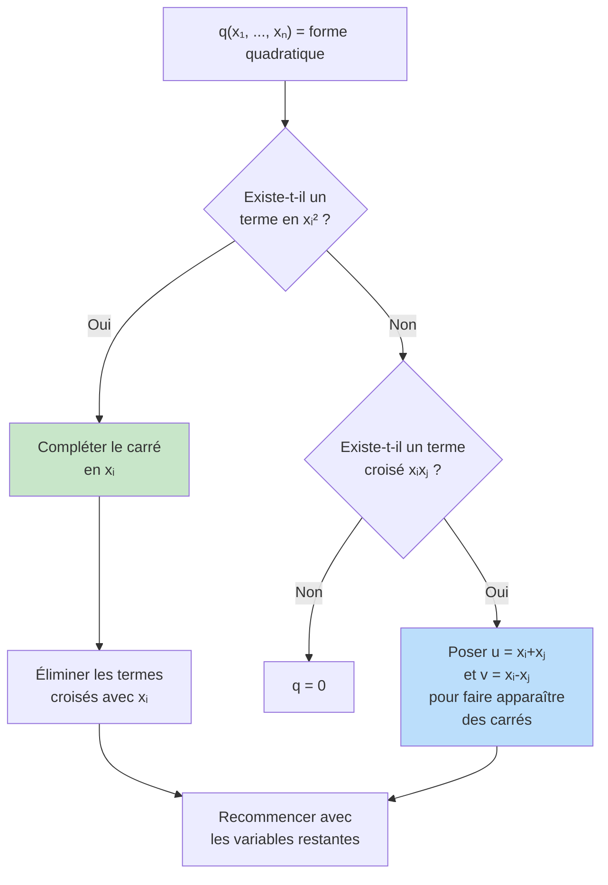
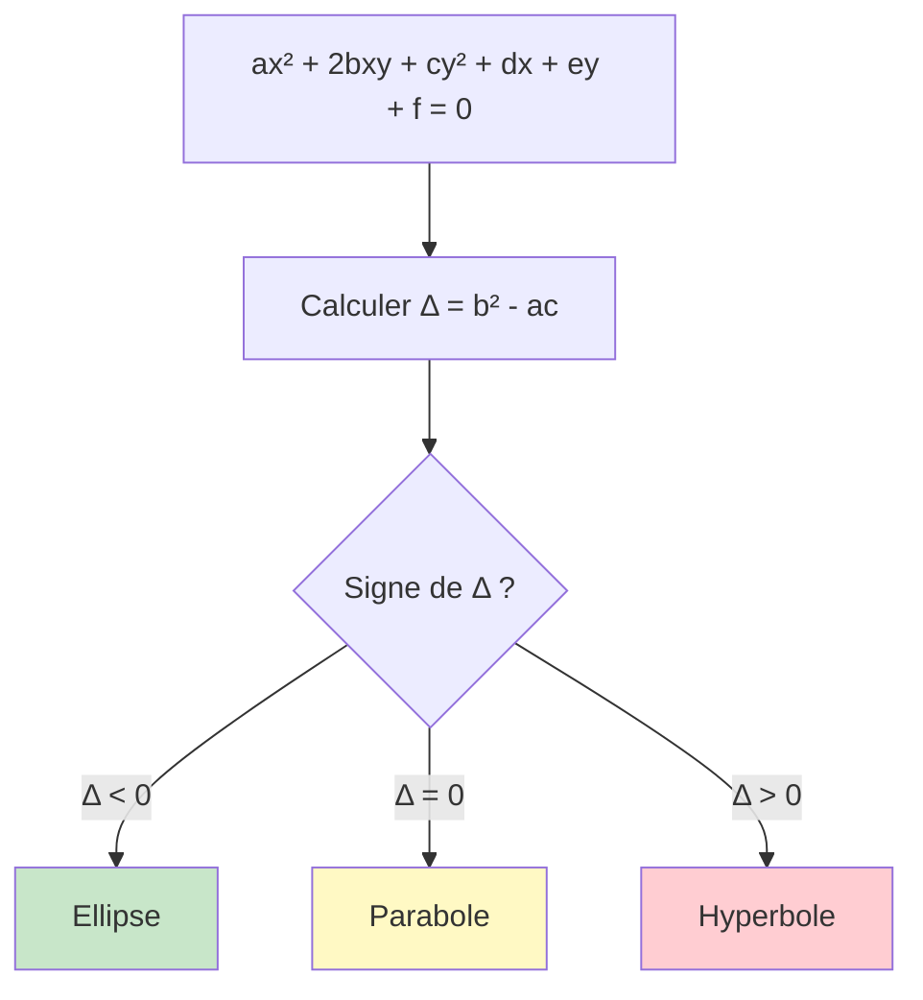

# Formes Bilinéaires et Quadratiques

Les formes bilinéaires et quadratiques généralisent la notion de produit scalaire et permettent de classifier les coniques, quadriques, et de comprendre la géométrie de l'espace en profondeur. Elles sont omniprésentes en physique (énergie cinétique, formes d'inertie) et en optimisation.

> [!quote] Prérequis
> [[Algèbre Linéaire]], [[Matrices et Déterminants]], [[Espaces Euclidiens]], [[Espaces Préhilbertiens]]

## Formes bilinéaires

### Définition

> [!abstract] Définition
> Soit $E$ un $K$-espace vectoriel ($K = \mathbb{R}$ ou $\mathbb{C}$). Une **forme bilinéaire** sur $E$ est une application $\varphi : E \times E \to K$ qui est linéaire en chaque variable :
>
> - $\varphi(\lambda x_1 + x_2, y) = \lambda \varphi(x_1, y) + \varphi(x_2, y)$
> - $\varphi(x, \lambda y_1 + y_2) = \lambda \varphi(x, y_1) + \varphi(x, y_2)$

### Symétrie

$\varphi$ est **symétrique** si $\varphi(x, y) = \varphi(y, x)$ pour tous $x, y$.

$\varphi$ est **antisymétrique** si $\varphi(x, y) = -\varphi(y, x)$ pour tous $x, y$.

> [!tip] Décomposition
> Toute forme bilinéaire se décompose de manière unique :
> $$\varphi = \varphi_s + \varphi_a$$
> avec $\varphi_s(x,y) = \frac{\varphi(x,y) + \varphi(y,x)}{2}$ (symétrique) et $\varphi_a(x,y) = \frac{\varphi(x,y) - \varphi(y,x)}{2}$ (antisymétrique).

### Matrice d'une forme bilinéaire

Dans une base $\mathcal{B} = (e_1, \ldots, e_n)$, la matrice de $\varphi$ est :

$$M = (\varphi(e_i, e_j))_{1 \leq i,j \leq n}$$

Si $x = \sum x_i e_i$ et $y = \sum y_j e_j$, alors :

$$\varphi(x, y) = X^T M Y$$

où $X, Y$ sont les vecteurs colonnes de coordonnées.

> [!important] Changement de base
> Si $P$ est la matrice de passage de $\mathcal{B}$ à $\mathcal{B}'$, alors :
> $$M' = P^T M P$$
> C'est la **congruence** (à ne pas confondre avec la similitude $P^{-1}MP$).

### Non-dégénérescence

> [!abstract] Définition
> $\varphi$ est **non dégénérée** si :
> $$\forall x \in E, \, (\forall y \in E, \, \varphi(x, y) = 0) \implies x = 0$$
>
> Équivalent : la matrice $M$ est **inversible** ($\det M \neq 0$).

Un produit scalaire est une forme bilinéaire symétrique **définie positive** (donc en particulier non dégénérée).

## Formes quadratiques

### Définition

> [!abstract] Définition
> Une **forme quadratique** sur $E$ est une application $q : E \to K$ telle qu'il existe une forme bilinéaire symétrique $\varphi$ avec :
> $$q(x) = \varphi(x, x)$$
> On dit que $\varphi$ est la **forme polaire** de $q$.

### Formules de polarisation

On retrouve $\varphi$ à partir de $q$ :

> [!important] Identité de polarisation
> $$\varphi(x, y) = \frac{1}{2}\left[q(x+y) - q(x) - q(y)\right]$$
>
> Ou de manière équivalente :
> $$\varphi(x, y) = \frac{1}{4}\left[q(x+y) - q(x-y)\right]$$

### Expression matricielle

Si $M$ est la matrice de $\varphi$ dans une base, alors :

$$q(x) = X^T M X = \sum_{i,j} m_{ij} x_i x_j$$

> [!example] Exemple
> $q(x, y, z) = x^2 + 2xy - 3z^2$.
>
> Matrice associée : $M = \begin{pmatrix} 1 & 1 & 0 \\ 1 & 0 & 0 \\ 0 & 0 & -3 \end{pmatrix}$

## Noyau et rang

> [!abstract] Définitions
> - Le **noyau** (ou radical) de $q$ : $\ker q = \{x \in E : \forall y \in E, \, \varphi(x,y) = 0\}$
> - Le **rang** de $q$ : $\text{rg}(q) = \text{rg}(M) = \dim E - \dim \ker q$
> - $q$ est **non dégénérée** si $\ker q = \{0\}$

## Réduction des formes quadratiques

### L'objectif

Trouver une base dans laquelle $q$ s'écrit sous forme diagonale :

$$q(x) = \lambda_1 x_1^2 + \lambda_2 x_2^2 + \cdots + \lambda_n x_n^2$$

C'est-à-dire trouver $P$ inversible telle que $P^T M P$ soit diagonale.

### Méthode de Gauss

> [!abstract] Théorème
> Toute forme quadratique sur un espace de dimension finie peut être réduite en **somme de carrés** par changement de base (algorithme de Gauss).

> [!example] Exemple — Méthode de Gauss
> $q(x, y) = x^2 + 4xy + 3y^2$
>
> **Étape 1 :** Compléter le carré en $x$ :
> $q = (x + 2y)^2 - 4y^2 + 3y^2 = (x + 2y)^2 - y^2$
>
> **Changement :** $u = x + 2y$, $v = y$
>
> **Forme réduite :** $q = u^2 - v^2$

## Signature (théorème de Sylvester)

> [!abstract] Théorème d'inertie de Sylvester
> Soit $q$ une forme quadratique réelle de rang $r$ sur un espace de dimension $n$. Si on écrit $q$ comme somme de carrés :
> $$q = x_1^2 + \cdots + x_p^2 - x_{p+1}^2 - \cdots - x_r^2$$
>
> alors le couple $(p, r-p)$ ne dépend **pas** du choix de la base. Il s'appelle la **signature** de $q$.

- $p$ = nombre de carrés **positifs** (indice positif)
- $r - p$ = nombre de carrés **négatifs** (indice négatif)
- $n - r$ = dimension du noyau

### Classification

| Signature $(p, q)$ | Nom | Condition |
|---|---|---|
| $(n, 0)$ | **Définie positive** | $q(x) > 0$ pour $x \neq 0$ |
| $(0, n)$ | **Définie négative** | $q(x) < 0$ pour $x \neq 0$ |
| $(p, 0)$ avec $p < n$ | Positive | $q(x) \geq 0$ pour tout $x$ |
| $(p, q)$ avec $p, q \geq 1$ | **Indéfinie** | $q$ prend des valeurs $>0$ et $<0$ |

> [!tip] Critère de positivité par les mineurs
> $q$ est **définie positive** ssi tous les **mineurs principaux** de $M$ sont strictement positifs :
> $$m_{11} > 0, \quad \begin{vmatrix} m_{11} & m_{12} \\ m_{21} & m_{22} \end{vmatrix} > 0, \quad \ldots, \quad \det M > 0$$

## Application : classification des coniques

Une conique dans $\mathbb{R}^2$ est l'ensemble des points $(x, y)$ vérifiant :

$$ax^2 + 2bxy + cy^2 + dx + ey + f = 0$$

La nature de la conique dépend de la forme quadratique $q(x, y) = ax^2 + 2bxy + cy^2$ :

| Discriminant $\Delta = b^2 - ac$ | Type |
|---|---|
| $\Delta < 0$ (signature $(2,0)$ ou $(0,2)$) | **Ellipse** (ou cercle, ou vide) |
| $\Delta = 0$ (forme dégénérée) | **Parabole** (ou droites parallèles) |
| $\Delta > 0$ (signature $(1,1)$) | **Hyperbole** (ou droites sécantes) |

## Formes bilinéaires et dualité

### Forme linéaire associée

Toute forme bilinéaire $\varphi$ définit une application linéaire :

$$\Phi : E \to E^*, \quad x \mapsto \varphi(x, \cdot)$$

- Si $\varphi$ est non dégénérée, $\Phi$ est un **isomorphisme** $E \cong E^*$.
- Pour un produit scalaire, c'est le **théorème de représentation de Riesz**.

### Orthogonalité

Pour une forme bilinéaire symétrique (pas nécessairement définie positive) :

$$x \perp y \iff \varphi(x, y) = 0$$

> [!warning] Attention
> Si $\varphi$ n'est pas définie positive, un vecteur non nul peut être orthogonal **à lui-même** (vecteur isotrope : $q(x) = 0$ avec $x \neq 0$).

## Exercices types

> [!example] Exercice 1 — Réduction de Gauss
> Réduire $q(x, y, z) = 2xy + 2xz + 2yz$.
>
> **Solution :** Pas de carré pur. On pose $u = x+y$, $v = x-y$ :
> $2xy = \frac{u^2 - v^2}{2}$, puis on complète avec $z$.
>
> Résultat : $q = \frac{1}{2}(x+y+z)^2 - \frac{1}{2}(x-y)^2 - z^2 + \ldots$
>
> Signature $(1, 2)$ → forme indéfinie.

> [!example] Exercice 2 — Signature
> Déterminer la signature de $q(x, y, z) = x^2 + 2y^2 + 3z^2 + 2xy$.
>
> **Solution :** $q = (x+y)^2 + y^2 + 3z^2$. Signature $(3, 0)$ → **définie positive**.

> [!example] Exercice 3 — Conique
> Identifier la conique $x^2 - 2xy + y^2 - 2x + 1 = 0$.
>
> **Solution :** $\Delta = (-1)^2 - 1 \cdot 1 = 0$ → parabole.
> En fait : $(x - y)^2 = 2x - 1$, c'est bien une parabole.

## À retenir

> [!important] Les points clés
> 1. **Polarisation** : on retrouve $\varphi$ à partir de $q$, et réciproquement
> 2. **Gauss** : toute forme quadratique se réduit en somme de carrés
> 3. **Sylvester** : la signature $(p, q)$ est un invariant (ne dépend pas de la base)
> 4. **Définie positive** ⟺ tous les mineurs principaux $> 0$
> 5. **Congruence** $P^T M P$ (formes quadratiques) ≠ **similitude** $P^{-1}MP$ (endomorphismes)
