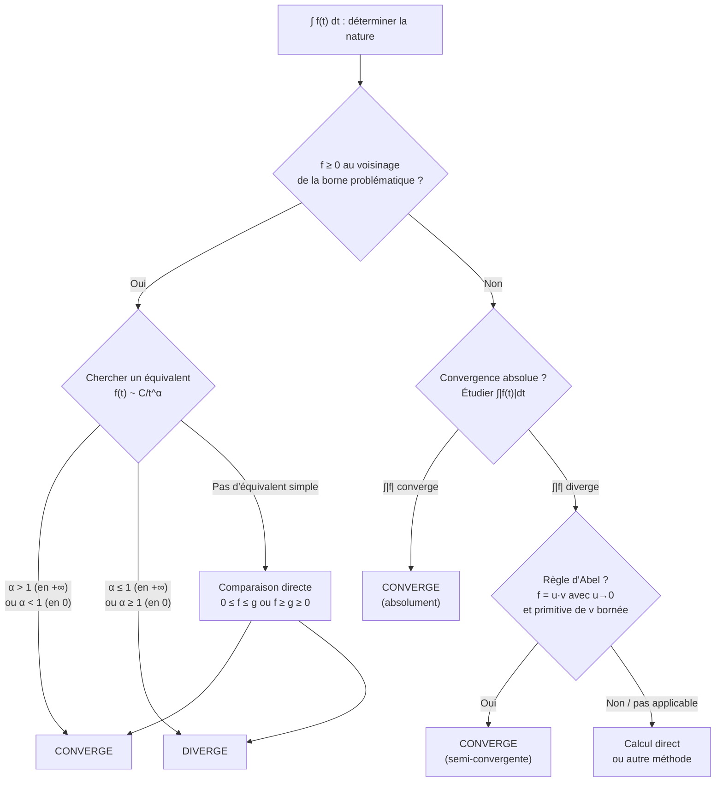

# Intégrales Généralisées

## Motivation

En analyse classique, l'intégrale de Riemann est définie pour des fonctions bornées sur des segments $[a,b]$. Or, de nombreux problèmes exigent d'intégrer :

- sur des **intervalles non bornés** : $\displaystyle\int_1^{+\infty} \frac{1}{x^2}\,dx$
- des **fonctions non bornées** au voisinage d'un point : $\displaystyle\int_0^1 \frac{1}{\sqrt{x}}\,dx$

On parle alors d'**intégrales généralisées** (ou impropres). La question centrale est : **l'intégrale a-t-elle un sens ?** Autrement dit, converge-t-elle ?

## 1. Définitions fondamentales

### 1.1 Intégrale sur un intervalle semi-ouvert $[a, +\infty[$

> [!abstract] Définition
> Soit $f : [a, +\infty[ \to \mathbb{R}$ (ou $\mathbb{C}$) continue par morceaux. On dit que l'intégrale $\displaystyle\int_a^{+\infty} f(t)\,dt$ **converge** si la limite
> $$\lim_{x \to +\infty} \int_a^x f(t)\,dt$$
> existe et est finie. Dans ce cas, on note cette limite $\displaystyle\int_a^{+\infty} f(t)\,dt$.
> Si la limite n'existe pas ou est infinie, on dit que l'intégrale **diverge**.

### 1.2 Intégrale au voisinage d'une singularité

> [!abstract] Définition
> Soit $f : \,]a, b] \to \mathbb{R}$ continue par morceaux, non définie (ou non bornée) en $a$. On dit que $\displaystyle\int_a^b f(t)\,dt$ **converge** si
> $$\lim_{\varepsilon \to 0^+} \int_{a+\varepsilon}^{b} f(t)\,dt$$
> existe et est finie.

### 1.3 Cas de deux singularités

Si $f$ présente des problèmes aux deux bornes, on découpe :

$$\int_a^b f(t)\,dt = \int_a^c f(t)\,dt + \int_c^b f(t)\,dt$$

pour un $c \in \,]a,b[$ quelconque. L'intégrale converge si et seulement si **les deux** intégrales convergent.

> [!warning] Attention
> Le choix de $c$ n'influence pas la convergence ni la valeur, mais il faut bien que les **deux** morceaux convergent. On ne peut **pas** compenser une divergence par l'autre.

## 2. Intégrales de référence

### 2.1 Intégrales de Riemann

> [!important] Intégrales de Riemann en $+\infty$
> $$\int_1^{+\infty} \frac{dt}{t^\alpha} \quad \text{converge} \iff \alpha > 1$$
> Lorsque $\alpha > 1$, on a $\displaystyle\int_1^{+\infty} \frac{dt}{t^\alpha} = \frac{1}{\alpha - 1}$.

**Preuve.** Pour $\alpha \neq 1$ :
$$\int_1^x \frac{dt}{t^\alpha} = \left[\frac{t^{1-\alpha}}{1-\alpha}\right]_1^x = \frac{x^{1-\alpha} - 1}{1-\alpha}$$

- Si $\alpha > 1$ : $1 - \alpha < 0$ donc $x^{1-\alpha} \to 0$ quand $x \to +\infty$, et la limite vaut $\dfrac{1}{\alpha - 1}$.
- Si $\alpha < 1$ : $x^{1-\alpha} \to +\infty$, divergence.
- Si $\alpha = 1$ : $\displaystyle\int_1^x \frac{dt}{t} = \ln x \to +\infty$, divergence. $\blacksquare$

### 2.2 Intégrales de Riemann en $0$

> [!important] Intégrales de Riemann en $0$
> $$\int_0^1 \frac{dt}{t^\alpha} \quad \text{converge} \iff \alpha < 1$$

### 2.3 Intégrale exponentielle

$$\int_0^{+\infty} e^{-t}\,dt = 1$$

Plus généralement, pour $\lambda > 0$ :
$$\int_0^{+\infty} e^{-\lambda t}\,dt = \frac{1}{\lambda}$$

### 2.4 Intégrale de Dirichlet

> [!abstract] Théorème (Intégrale de Dirichlet)
> $$\int_0^{+\infty} \frac{\sin t}{t}\,dt = \frac{\pi}{2}$$
> Cette intégrale est **semi-convergente** : elle converge, mais pas absolument.

## 3. Critères de convergence

### 3.1 Fonctions positives : comparaison

> [!abstract] Théorème (Comparaison)
> Soient $f, g : [a, +\infty[ \to \mathbb{R}$ continues par morceaux avec $0 \leq f(t) \leq g(t)$ pour tout $t \geq a$.
> 1. Si $\displaystyle\int_a^{+\infty} g(t)\,dt$ converge, alors $\displaystyle\int_a^{+\infty} f(t)\,dt$ converge.
> 2. Si $\displaystyle\int_a^{+\infty} f(t)\,dt$ diverge, alors $\displaystyle\int_a^{+\infty} g(t)\,dt$ diverge.

> [!tip] Principe
> Pour les fonctions positives, plus la fonction est « petite », plus l'intégrale a de chances de converger.

### 3.2 Comparaison par équivalents

> [!abstract] Théorème (Équivalents)
> Soient $f, g : [a, +\infty[ \to \mathbb{R}_+^*$ continues par morceaux. Si $f(t) \sim_{t \to +\infty} g(t)$, alors :
> $$\int_a^{+\infty} f(t)\,dt \text{ converge} \iff \int_a^{+\infty} g(t)\,dt \text{ converge}$$

> [!example] Exemple
> Étudier la nature de $\displaystyle\int_1^{+\infty} \frac{dt}{\sqrt{t^3 + t}}$.
>
> Pour $t \to +\infty$ : $\sqrt{t^3 + t} \sim \sqrt{t^3} = t^{3/2}$, donc $\dfrac{1}{\sqrt{t^3+t}} \sim \dfrac{1}{t^{3/2}}$.
>
> Or $\displaystyle\int_1^{+\infty} \frac{dt}{t^{3/2}}$ converge (Riemann avec $\alpha = 3/2 > 1$).
>
> Donc $\displaystyle\int_1^{+\infty} \frac{dt}{\sqrt{t^3+t}}$ **converge**.

### 3.3 Convergence absolue

> [!abstract] Définition
> On dit que $\displaystyle\int_a^{+\infty} f(t)\,dt$ **converge absolument** si $\displaystyle\int_a^{+\infty} |f(t)|\,dt$ converge.

> [!abstract] Théorème
> **La convergence absolue entraîne la convergence.**
>
> Si $\displaystyle\int_a^{+\infty} |f(t)|\,dt$ converge, alors $\displaystyle\int_a^{+\infty} f(t)\,dt$ converge et
> $$\left|\int_a^{+\infty} f(t)\,dt\right| \leq \int_a^{+\infty} |f(t)|\,dt$$

**Esquisse de preuve.** On utilise le critère de Cauchy. Pour $b' > b \geq a$ :
$$\left|\int_b^{b'} f(t)\,dt\right| \leq \int_b^{b'} |f(t)|\,dt$$
La convergence de l'intégrale de $|f|$ assure que le membre de droite tend vers $0$, ce qui donne la condition de Cauchy pour $f$. $\blacksquare$

> [!warning] Réciproque fausse
> L'intégrale $\displaystyle\int_0^{+\infty} \frac{\sin t}{t}\,dt$ converge mais **pas absolument**. On parle d'intégrale **semi-convergente**.

### 3.4 Règle d'Abel

> [!abstract] Théorème (Règle d'Abel)
> Soient $f$ de classe $\mathcal{C}^1$ décroissante tendant vers $0$ en $+\infty$, et $g$ continue par morceaux dont la primitive $G(x) = \int_a^x g(t)\,dt$ est **bornée**. Alors $\displaystyle\int_a^{+\infty} f(t)\,g(t)\,dt$ converge.

> [!example] Application
> L'intégrale $\displaystyle\int_1^{+\infty} \frac{\sin t}{t}\,dt$ converge par la règle d'Abel avec $f(t) = 1/t$ et $g(t) = \sin t$ (dont la primitive $-\cos t$ est bornée).

## 4. Stratégie de détermination de la nature d'une intégrale

## 5. Calcul pratique

### 5.1 Intégration par parties

> [!abstract] Théorème (IPP pour les intégrales généralisées)
> Si $u$ et $v$ sont de classe $\mathcal{C}^1$ sur $[a, +\infty[$ et si $[uv]_a^{+\infty}$ (i.e., $\lim_{x \to +\infty} u(x)v(x) - u(a)v(a)$) existe, alors :
> $$\int_a^{+\infty} u'v\,dt \text{ converge} \iff \int_a^{+\infty} uv'\,dt \text{ converge}$$
> et dans ce cas $\displaystyle\int_a^{+\infty} u'v\,dt = [uv]_a^{+\infty} - \int_a^{+\infty} uv'\,dt$.

> [!example] Exemple
> Calculer $I = \displaystyle\int_0^{+\infty} t\,e^{-t}\,dt$.
>
> IPP avec $u = t$, $v' = e^{-t}$, donc $u' = 1$, $v = -e^{-t}$ :
> $$I = \left[-te^{-t}\right]_0^{+\infty} + \int_0^{+\infty} e^{-t}\,dt = 0 + 1 = 1$$

### 5.2 Changement de variable

> [!abstract] Théorème
> Soit $\varphi : [\alpha, \beta[ \to [a, b[$ un $\mathcal{C}^1$-difféomorphisme. Alors :
> $$\int_a^{b} f(t)\,dt = \int_\alpha^{\beta} f(\varphi(u))\,\varphi'(u)\,du$$
> (les deux intégrales ont même nature).

> [!example] Exemple
> Calculer $\displaystyle\int_0^{+\infty} e^{-t^2}\,dt$ (intégrale de Gauss) : on admet que sa valeur est $\dfrac{\sqrt{\pi}}{2}$.
>
> **Changement utile** : $t = \sqrt{u}$, $dt = \dfrac{du}{2\sqrt{u}}$, transforme $\displaystyle\int_0^{+\infty} e^{-t^2}\,dt$ en $\displaystyle\frac{1}{2}\int_0^{+\infty} \frac{e^{-u}}{\sqrt{u}}\,du = \frac{1}{2}\,\Gamma\!\left(\frac{1}{2}\right)$.

## 6. Fonctions définies par des intégrales à paramètre

### 6.1 Continuité sous le signe intégral

> [!abstract] Théorème (Continuité sous $\int$)
> Soit $f : I \times [a, +\infty[ \to \mathbb{R}$ où $I$ est un intervalle de $\mathbb{R}$. On pose $F(x) = \displaystyle\int_a^{+\infty} f(x, t)\,dt$. Si :
> 1. Pour tout $x \in I$, $t \mapsto f(x,t)$ est continue par morceaux et l'intégrale converge,
> 2. Pour tout $t$, $x \mapsto f(x,t)$ est continue sur $I$,
> 3. **Hypothèse de domination** : il existe $\varphi : [a, +\infty[ \to \mathbb{R}_+$ telle que $\displaystyle\int_a^{+\infty} \varphi(t)\,dt$ converge et $|f(x,t)| \leq \varphi(t)$ pour tous $x \in I$, $t \geq a$,
>
> alors $F$ est **continue** sur $I$.

### 6.2 Dérivation sous le signe intégral

> [!abstract] Théorème (Leibniz)
> Sous des hypothèses analogues (avec domination de $\dfrac{\partial f}{\partial x}$) :
> 1. Pour tout $x \in I$, $t \mapsto f(x,t)$ est continue par morceaux et l'intégrale converge,
> 2. $f$ admet une dérivée partielle $\dfrac{\partial f}{\partial x}(x,t)$ continue,
> 3. Il existe $\psi \geq 0$ intégrable telle que $\left|\dfrac{\partial f}{\partial x}(x,t)\right| \leq \psi(t)$,
>
> alors $F$ est de classe $\mathcal{C}^1$ sur $I$ et :
> $$F'(x) = \int_a^{+\infty} \frac{\partial f}{\partial x}(x, t)\,dt$$

> [!tip] En pratique
> On **dérive sous le signe intégral**, puis on vérifie a posteriori l'hypothèse de domination.

## 7. La fonction Gamma

> [!abstract] Définition
> Pour $s > 0$ (ou $\operatorname{Re}(s) > 0$), on définit la **fonction Gamma** :
> $$\Gamma(s) = \int_0^{+\infty} t^{s-1}\,e^{-t}\,dt$$

### 7.1 Convergence

L'intégrande $f(t) = t^{s-1}e^{-t}$ pose problème :
- **En $0^+$** : $f(t) \sim t^{s-1}$, donc l'intégrale converge en $0$ ssi $s - 1 > -1$, i.e., $s > 0$.
- **En $+\infty$** : $e^{-t}$ l'emporte sur toute puissance, donc convergence pour tout $s$.

Bilan : $\Gamma(s)$ est définie et convergente pour $s > 0$.

### 7.2 Propriétés fondamentales

> [!important] Relation fonctionnelle
> $$\Gamma(s+1) = s\,\Gamma(s) \quad \text{pour tout } s > 0$$

**Preuve.** IPP avec $u = t^s$, $v' = e^{-t}$ :
$$\Gamma(s+1) = \int_0^{+\infty} t^s e^{-t}\,dt = \left[-t^s e^{-t}\right]_0^{+\infty} + s\int_0^{+\infty} t^{s-1} e^{-t}\,dt = s\,\Gamma(s) \quad \blacksquare$$

> [!important] Valeurs remarquables
> - $\Gamma(1) = 1$
> - $\Gamma(n+1) = n!$ pour tout $n \in \mathbb{N}$ (la fonction Gamma prolonge la factorielle)
> - $\Gamma\!\left(\dfrac{1}{2}\right) = \sqrt{\pi}$

### 7.3 Régularité

Par application itérée du théorème de dérivation sous le signe intégral, $\Gamma$ est de classe $\mathcal{C}^\infty$ sur $]0, +\infty[$ et :

$$\Gamma^{(k)}(s) = \int_0^{+\infty} (\ln t)^k\,t^{s-1}\,e^{-t}\,dt$$

## 8. Exercices types corrigés

### Exercice 1 : Nature d'une intégrale (fonctions positives)

> [!example] Énoncé
> Déterminer la nature de $\displaystyle I = \int_2^{+\infty} \frac{dt}{t\,\ln^2 t}$.

**Solution.**

La fonction $f(t) = \dfrac{1}{t\,\ln^2 t}$ est positive et continue sur $[2, +\infty[$.

On calcule directement une primitive. Posons $u = \ln t$, $du = dt/t$ :

$$\int_2^x \frac{dt}{t\,\ln^2 t} = \int_{\ln 2}^{\ln x} \frac{du}{u^2} = \left[-\frac{1}{u}\right]_{\ln 2}^{\ln x} = \frac{1}{\ln 2} - \frac{1}{\ln x}$$

Quand $x \to +\infty$ : $\dfrac{1}{\ln x} \to 0$, donc $I = \dfrac{1}{\ln 2}$. L'intégrale **converge**.

### Exercice 2 : Convergence absolue vs semi-convergence

> [!example] Énoncé
> Montrer que $\displaystyle\int_1^{+\infty} \frac{\sin t}{t}\,dt$ converge mais pas absolument.

**Solution.**

**Convergence** : IPP avec $u(t) = 1/t$, $v'(t) = \sin t$, donc $u'(t) = -1/t^2$, $v(t) = -\cos t$ :

$$\int_1^x \frac{\sin t}{t}\,dt = \left[-\frac{\cos t}{t}\right]_1^x - \int_1^x \frac{\cos t}{t^2}\,dt$$

- $\left[-\cos t / t\right]_1^x = -\cos x / x + \cos 1 \to \cos 1$ quand $x \to +\infty$.
- $|\cos t / t^2| \leq 1/t^2$ et $\int_1^{+\infty} dt/t^2$ converge, donc $\int_1^{+\infty} \cos t / t^2\,dt$ converge absolument.

Donc $\int_1^{+\infty} \sin t / t\,dt$ converge.

**Non convergence absolue** : On minore sur chaque intervalle $[k\pi, (k+1)\pi]$ :

$$\int_{k\pi}^{(k+1)\pi} \frac{|\sin t|}{t}\,dt \geq \frac{1}{(k+1)\pi}\int_{k\pi}^{(k+1)\pi} |\sin t|\,dt = \frac{2}{(k+1)\pi}$$

Or $\displaystyle\sum_{k \geq 1} \frac{2}{(k+1)\pi}$ diverge (série harmonique), donc $\displaystyle\int_1^{+\infty} \frac{|\sin t|}{t}\,dt$ diverge.

### Exercice 3 : Dérivation sous le signe intégral

> [!example] Énoncé
> Soit $F(x) = \displaystyle\int_0^{+\infty} e^{-xt}\,\frac{\sin t}{t}\,dt$ pour $x > 0$. Calculer $F'(x)$ et en déduire $F(x)$.

**Solution.**

On dérive sous le signe intégral (hypothèse de domination vérifiable pour $x \geq x_0 > 0$) :

$$F'(x) = -\int_0^{+\infty} e^{-xt}\,\sin t\,dt$$

On calcule cette intégrale par double IPP (ou par partie imaginaire de $\int_0^{+\infty} e^{-(x-i)t}\,dt$) :

$$\int_0^{+\infty} e^{-xt}\sin t\,dt = \frac{1}{x^2 + 1}$$

Donc $F'(x) = -\dfrac{1}{x^2 + 1}$, ce qui donne $F(x) = -\arctan(x) + C$.

Quand $x \to +\infty$, par convergence dominée $F(x) \to 0$, donc $C = \pi/2$.

$$\boxed{F(x) = \frac{\pi}{2} - \arctan(x)}$$

En particulier, $F(0^+) = \pi/2$, ce qui redonne $\displaystyle\int_0^{+\infty} \frac{\sin t}{t}\,dt = \frac{\pi}{2}$.

### Exercice 4 : Fonction Gamma

> [!example] Énoncé
> Montrer que $\Gamma(1/2) = \sqrt{\pi}$.

**Solution.**

$$\Gamma\!\left(\frac{1}{2}\right) = \int_0^{+\infty} t^{-1/2}\,e^{-t}\,dt$$

Changement de variable $t = u^2$, $dt = 2u\,du$ :

$$\Gamma\!\left(\frac{1}{2}\right) = \int_0^{+\infty} \frac{1}{u}\,e^{-u^2}\,2u\,du = 2\int_0^{+\infty} e^{-u^2}\,du = 2 \cdot \frac{\sqrt{\pi}}{2} = \sqrt{\pi}$$

en utilisant l'intégrale de Gauss $\displaystyle\int_0^{+\infty} e^{-u^2}\,du = \frac{\sqrt{\pi}}{2}$. $\blacksquare$

### Exercice 5 : Intégrale avec singularité en $0$

> [!example] Énoncé
> Nature et calcul de $\displaystyle\int_0^1 \frac{\ln t}{1-t}\,dt$.

**Solution.**

**En $0^+$** : $\ln t / (1-t) \sim \ln t$ qui est intégrable en $0$ (car $\int_0^1 |\ln t|\,dt$ converge : on a $|t^\varepsilon \ln t| \to 0$ pour tout $\varepsilon > 0$).

**En $1^-$** : $\dfrac{\ln t}{1-t} \to -1$ (par le taux d'accroissement de $\ln$ en $1$), donc pas de problème.

L'intégrale converge. Pour la calculer, on développe $\dfrac{1}{1-t} = \sum_{n=0}^{+\infty} t^n$ et on intègre terme à terme (convergence dominée) :

$$\int_0^1 \frac{\ln t}{1-t}\,dt = \sum_{n=0}^{+\infty} \int_0^1 t^n \ln t\,dt = \sum_{n=0}^{+\infty} \left(-\frac{1}{(n+1)^2}\right) = -\frac{\pi^2}{6}$$

où l'on a utilisé $\displaystyle\int_0^1 t^n \ln t\,dt = -\frac{1}{(n+1)^2}$ (IPP). $\blacksquare$

## Résumé des intégrales de référence

| Intégrale | Converge ssi | Valeur |
|---|---|---|
| $\displaystyle\int_1^{+\infty} \frac{dt}{t^\alpha}$ | $\alpha > 1$ | $\dfrac{1}{\alpha - 1}$ |
| $\displaystyle\int_0^1 \frac{dt}{t^\alpha}$ | $\alpha < 1$ | $\dfrac{1}{1 - \alpha}$ |
| $\displaystyle\int_0^{+\infty} e^{-\lambda t}\,dt$ | $\lambda > 0$ | $\dfrac{1}{\lambda}$ |
| $\displaystyle\int_0^{+\infty} t^{s-1} e^{-t}\,dt$ | $s > 0$ | $\Gamma(s)$ |
| $\displaystyle\int_0^{+\infty} \frac{\sin t}{t}\,dt$ | toujours (semi-cv) | $\dfrac{\pi}{2}$ |
| $\displaystyle\int_0^{+\infty} e^{-t^2}\,dt$ | toujours | $\dfrac{\sqrt{\pi}}{2}$ |

*Voir aussi : [[Fonctions de Plusieurs Variables]], [[Probabilités Prépa]]*
