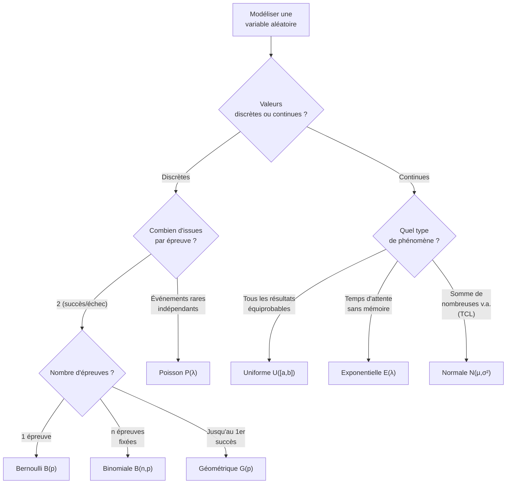
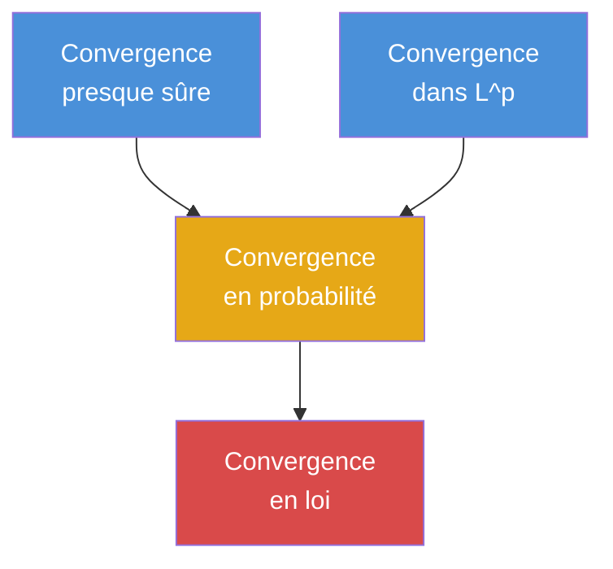

# Probabilités (Math Spé / MP)

## Introduction

Les probabilités formalisent le hasard. Ce chapitre couvre le programme de Math Spé : espaces probabilisés, variables aléatoires discrètes et à densité, convergences et théorèmes limites. On s'appuie sur la théorie de la mesure de manière simplifiée, conformément au programme de prépa.

## 1. Espaces probabilisés

### 1.1 Tribu et mesure de probabilité

> [!abstract] Définitions
> - Un **univers** $\Omega$ est l'ensemble de toutes les issues possibles d'une expérience aléatoire.
> - Une **tribu** (ou $\sigma$-algèbre) $\mathcal{A}$ sur $\Omega$ est une famille de parties de $\Omega$ contenant $\Omega$, stable par complémentaire et par union dénombrable.
> - Une **probabilité** $P$ sur $(\Omega, \mathcal{A})$ est une application $P : \mathcal{A} \to [0, 1]$ telle que :
>   1. $P(\Omega) = 1$
>   2. **$\sigma$-additivité** : pour toute suite $(A_n)$ d'événements deux à deux incompatibles, $P\!\left(\bigcup_{n} A_n\right) = \sum_{n} P(A_n)$
>
> Le triplet $(\Omega, \mathcal{A}, P)$ est un **espace probabilisé**.

### 1.2 Propriétés fondamentales

- $P(\overline{A}) = 1 - P(A)$
- $P(A \cup B) = P(A) + P(B) - P(A \cap B)$
- Si $A \subset B$, alors $P(A) \leq P(B)$ (croissance)
- **Formule des probabilités totales** : si $(B_n)$ est un système complet d'événements, $P(A) = \sum_n P(A \cap B_n) = \sum_n P(A|B_n)\,P(B_n)$
- **Formule de Bayes** : $P(B_k | A) = \dfrac{P(A|B_k)\,P(B_k)}{\sum_n P(A|B_n)\,P(B_n)}$

### 1.3 Indépendance

> [!abstract] Définition
> Deux événements $A, B$ sont **indépendants** si $P(A \cap B) = P(A)\,P(B)$.
>
> Des événements $A_1, \ldots, A_n$ sont **mutuellement indépendants** si pour toute partie $I \subset \{1, \ldots, n\}$ :
> $$P\!\left(\bigcap_{i \in I} A_i\right) = \prod_{i \in I} P(A_i)$$

> [!warning] Attention
> L'indépendance deux à deux ne suffit **pas** pour l'indépendance mutuelle.

## 2. Variables aléatoires discrètes

### 2.1 Définitions

> [!abstract] Définition
> Une **variable aléatoire discrète** $X$ est une application $X : \Omega \to E$ (où $E$ est un ensemble dénombrable) telle que pour tout $x \in E$, $\{X = x\} \in \mathcal{A}$.
>
> La **loi** de $X$ est la donnée des probabilités $P(X = x)$ pour tout $x \in E$.

### 2.2 Espérance, variance

> [!abstract] Définitions
> Pour $X$ à valeurs dans $\mathbb{N}$ ou $\mathbb{Z}$ (ou plus généralement à valeurs dénombrables dans $\mathbb{R}$) :
>
> **Espérance** : $E(X) = \sum_{x} x\,P(X = x)$ (si la série converge absolument)
>
> **Variance** : $V(X) = E\!\left[(X - E(X))^2\right] = E(X^2) - E(X)^2$
>
> **Écart-type** : $\sigma(X) = \sqrt{V(X)}$

> [!important] Propriétés de l'espérance
> - **Linéarité** : $E(aX + bY) = aE(X) + bE(Y)$ (toujours, même sans indépendance)
> - **Positivité** : si $X \geq 0$ p.s., alors $E(X) \geq 0$
> - **Théorème de transfert** : $E(g(X)) = \sum_x g(x)\,P(X = x)$

> [!important] Propriétés de la variance
> - $V(aX + b) = a^2 V(X)$
> - Si $X$ et $Y$ sont **indépendantes** : $V(X + Y) = V(X) + V(Y)$
> - $V(X) = 0 \iff X$ est constante p.s.

### 2.3 Lois classiques discrètes

| Loi | Notation | $P(X = k)$ | $E(X)$ | $V(X)$ |
|---|---|---|---|---|
| Bernoulli | $\mathcal{B}(p)$ | $p^k(1-p)^{1-k}$, $k \in \{0,1\}$ | $p$ | $p(1-p)$ |
| Binomiale | $\mathcal{B}(n, p)$ | $\binom{n}{k}p^k(1-p)^{n-k}$ | $np$ | $np(1-p)$ |
| Poisson | $\mathcal{P}(\lambda)$ | $e^{-\lambda}\dfrac{\lambda^k}{k!}$ | $\lambda$ | $\lambda$ |
| Géométrique | $\mathcal{G}(p)$ | $p(1-p)^{k-1}$, $k \geq 1$ | $\dfrac{1}{p}$ | $\dfrac{1-p}{p^2}$ |

> [!tip] Lien Binomiale-Poisson
> Si $X_n \sim \mathcal{B}(n, \lambda/n)$ avec $\lambda$ fixé, alors $X_n \xrightarrow{\mathcal{L}} \mathcal{P}(\lambda)$ quand $n \to +\infty$.

### 2.4 Fonctions génératrices

> [!abstract] Définition
> Pour $X$ à valeurs dans $\mathbb{N}$, la **fonction génératrice** est :
> $$G_X(s) = E(s^X) = \sum_{k=0}^{+\infty} P(X = k)\,s^k, \quad |s| \leq 1$$

**Propriétés** :
- $G_X(1) = 1$
- $G_X'(1) = E(X)$
- $G_X''(1) = E(X(X-1))$, d'où $V(X) = G_X''(1) + G_X'(1) - [G_X'(1)]^2$
- Si $X \perp Y$ : $G_{X+Y} = G_X \cdot G_Y$
- La fonction génératrice **caractérise** la loi.

## 3. Variables aléatoires à densité

### 3.1 Définition

> [!abstract] Définition
> Une variable aléatoire $X$ est dite **à densité** s'il existe une fonction $f_X : \mathbb{R} \to \mathbb{R}_+$, intégrable, telle que pour tout intervalle $[a, b]$ :
> $$P(a \leq X \leq b) = \int_a^b f_X(t)\,dt$$
> La fonction $f_X$ est la **densité** de $X$. On a $\displaystyle\int_{-\infty}^{+\infty} f_X(t)\,dt = 1$.

### 3.2 Fonction de répartition

> [!abstract] Définition
> La **fonction de répartition** de $X$ est $F_X(x) = P(X \leq x)$.
> - Pour une v.a. à densité : $F_X(x) = \displaystyle\int_{-\infty}^x f_X(t)\,dt$
> - On a $f_X = F_X'$ (presque partout)
> - $F_X$ est croissante, continue à droite, $\lim_{-\infty} F_X = 0$, $\lim_{+\infty} F_X = 1$

### 3.3 Espérance et variance (cas continu)

$$E(X) = \int_{-\infty}^{+\infty} t\,f_X(t)\,dt, \qquad V(X) = \int_{-\infty}^{+\infty} (t - E(X))^2\,f_X(t)\,dt$$

**Théorème de transfert** : $E(g(X)) = \displaystyle\int_{-\infty}^{+\infty} g(t)\,f_X(t)\,dt$.

### 3.4 Lois classiques continues

| Loi | Notation | Densité $f_X(t)$ | $E(X)$ | $V(X)$ |
|---|---|---|---|---|
| Uniforme | $\mathcal{U}([a,b])$ | $\dfrac{1}{b-a}\,\mathbb{1}_{[a,b]}(t)$ | $\dfrac{a+b}{2}$ | $\dfrac{(b-a)^2}{12}$ |
| Exponentielle | $\mathcal{E}(\lambda)$ | $\lambda\,e^{-\lambda t}\,\mathbb{1}_{t \geq 0}$ | $\dfrac{1}{\lambda}$ | $\dfrac{1}{\lambda^2}$ |
| Normale | $\mathcal{N}(\mu, \sigma^2)$ | $\dfrac{1}{\sigma\sqrt{2\pi}}\,e^{-\frac{(t-\mu)^2}{2\sigma^2}}$ | $\mu$ | $\sigma^2$ |

> [!important] Propriété sans mémoire de la loi exponentielle
> Si $X \sim \mathcal{E}(\lambda)$, alors pour $s, t \geq 0$ :
> $$P(X > s + t \mid X > s) = P(X > t)$$
> C'est la seule loi continue à posséder cette propriété.

### 3.5 Arbre de choix de la loi

## 4. Couples de variables aléatoires

### 4.1 Loi conjointe et lois marginales

> [!abstract] Définition
> La **loi conjointe** du couple $(X, Y)$ est la donnée de $P(X \in A, Y \in B)$ pour tous $A, B$.
>
> - **Cas discret** : $P(X = x_i, Y = y_j)$ pour tous $(i, j)$.
> - **Cas continu** : densité conjointe $f_{X,Y}(x, y)$ telle que $P((X,Y) \in D) = \iint_D f_{X,Y}(x,y)\,dx\,dy$.
>
> Les **lois marginales** se retrouvent par sommation / intégration :
> - $P(X = x_i) = \sum_j P(X = x_i, Y = y_j)$
> - $f_X(x) = \int_{-\infty}^{+\infty} f_{X,Y}(x, y)\,dy$

### 4.2 Indépendance de variables aléatoires

> [!abstract] Définition
> $X$ et $Y$ sont **indépendantes** si pour tous $A, B$ :
> $$P(X \in A, Y \in B) = P(X \in A)\,P(Y \in B)$$
> Équivalemment :
> - Cas discret : $P(X = x, Y = y) = P(X = x)\,P(Y = y)$ pour tous $x, y$.
> - Cas continu : $f_{X,Y}(x, y) = f_X(x)\,f_Y(y)$ p.p.

### 4.3 Covariance et corrélation

> [!abstract] Définitions
> $$\operatorname{Cov}(X, Y) = E\!\left[(X - E(X))(Y - E(Y))\right] = E(XY) - E(X)\,E(Y)$$
> $$\rho(X, Y) = \frac{\operatorname{Cov}(X, Y)}{\sigma(X)\,\sigma(Y)} \in [-1, 1]$$

> [!important] Propriétés
> - Si $X \perp Y$ alors $\operatorname{Cov}(X,Y) = 0$ (la réciproque est **fausse** en général)
> - $V(X + Y) = V(X) + V(Y) + 2\operatorname{Cov}(X,Y)$
> - $|\rho(X,Y)| = 1 \iff$ il existe $a, b$ tels que $Y = aX + b$ p.s.

## 5. Convergences de variables aléatoires

### 5.1 Les quatre modes de convergence

> [!abstract] Définitions
> Soit $(X_n)$ une suite de v.a. définies sur le même espace probabilisé, et $X$ une v.a.
>
> 1. **Convergence presque sûre** : $X_n \xrightarrow{p.s.} X$ si $P\!\left(\lim_{n \to \infty} X_n = X\right) = 1$.
>
> 2. **Convergence en probabilité** : $X_n \xrightarrow{P} X$ si pour tout $\varepsilon > 0$, $P(|X_n - X| > \varepsilon) \to 0$.
>
> 3. **Convergence dans $L^p$** : $X_n \xrightarrow{L^p} X$ si $E(|X_n - X|^p) \to 0$.
>
> 4. **Convergence en loi** : $X_n \xrightarrow{\mathcal{L}} X$ si $F_{X_n}(x) \to F_X(x)$ pour tout $x$ point de continuité de $F_X$.

### 5.2 Hiérarchie des convergences

> [!important] Implications (et non-implications)
> - $X_n \xrightarrow{p.s.} X \implies X_n \xrightarrow{P} X \implies X_n \xrightarrow{\mathcal{L}} X$
> - $X_n \xrightarrow{L^p} X \implies X_n \xrightarrow{P} X$ (pour $p \geq 1$)
> - Les réciproques sont **fausses** en général.
> - La convergence p.s. et la convergence dans $L^p$ ne sont pas comparables.
> - Cas particulier : si $X_n \xrightarrow{\mathcal{L}} c$ (constante), alors $X_n \xrightarrow{P} c$.

### 5.3 Inégalités utiles

> [!abstract] Inégalité de Markov
> Pour $X \geq 0$ et $a > 0$ : $P(X \geq a) \leq \dfrac{E(X)}{a}$.

> [!abstract] Inégalité de Bienaymé-Tchebychev
> Pour toute v.a. $X$ d'espérance $\mu$ et de variance $\sigma^2$, pour tout $\varepsilon > 0$ :
> $$P(|X - \mu| \geq \varepsilon) \leq \frac{\sigma^2}{\varepsilon^2}$$

## 6. Loi des grands nombres

### 6.1 Loi faible des grands nombres

> [!abstract] Théorème (Loi faible)
> Soit $(X_n)$ une suite de v.a. i.i.d. (indépendantes et identiquement distribuées) d'espérance $\mu$ et de variance finie $\sigma^2$. Soit $\overline{X}_n = \dfrac{1}{n}\sum_{k=1}^n X_k$. Alors :
> $$\overline{X}_n \xrightarrow{P} \mu$$

**Esquisse de preuve.** Par Bienaymé-Tchebychev :
$$P(|\overline{X}_n - \mu| \geq \varepsilon) \leq \frac{V(\overline{X}_n)}{\varepsilon^2} = \frac{\sigma^2}{n\varepsilon^2} \to 0 \quad \blacksquare$$

### 6.2 Loi forte des grands nombres

> [!abstract] Théorème (Loi forte)
> Sous les mêmes hypothèses (avec seulement l'existence de $E(|X_1|)$), on a :
> $$\overline{X}_n \xrightarrow{p.s.} \mu$$

> [!tip] Interprétation
> La moyenne empirique d'un grand nombre de réalisations converge (presque sûrement) vers l'espérance. C'est le fondement théorique des sondages et des simulations de Monte-Carlo.

## 7. Théorème central limite

> [!abstract] Théorème (TCL)
> Soit $(X_n)$ une suite de v.a. i.i.d. d'espérance $\mu$ et de variance $\sigma^2 > 0$. Alors :
> $$Z_n = \frac{\overline{X}_n - \mu}{\sigma / \sqrt{n}} = \frac{\sum_{k=1}^n X_k - n\mu}{\sigma\sqrt{n}} \xrightarrow{\mathcal{L}} \mathcal{N}(0, 1)$$

> [!important] Interprétation
> Quelle que soit la loi des $X_k$ (pourvu qu'elle ait une variance finie), la somme normalisée converge vers une loi normale. C'est pourquoi la loi normale apparaît si souvent en pratique.

> [!example] Application : approximation normale de la binomiale
> Si $S_n \sim \mathcal{B}(n, p)$, alors pour $n$ grand :
> $$\frac{S_n - np}{\sqrt{np(1-p)}} \approx \mathcal{N}(0, 1)$$
>
> **Exemple numérique** : $S_{100} \sim \mathcal{B}(100, 0.5)$. Calculer $P(S_{100} \geq 55)$.
>
> $$P(S_{100} \geq 55) = P\!\left(\frac{S_{100} - 50}{5} \geq 1\right) \approx 1 - \Phi(1) \approx 1 - 0.8413 = 0.1587$$

## 8. Exercices types corrigés

### Exercice 1 : Formule de Bayes

> [!example] Énoncé
> Un test de dépistage a une sensibilité de 95% ($P(T^+|\text{malade}) = 0.95$) et une spécificité de 90% ($P(T^-|\text{sain}) = 0.90$). La prévalence de la maladie est 1%. Calculer $P(\text{malade}|T^+)$.

**Solution.**

Par Bayes :
$$P(M|T^+) = \frac{P(T^+|M)\,P(M)}{P(T^+|M)\,P(M) + P(T^+|\overline{M})\,P(\overline{M})}$$

$$= \frac{0.95 \times 0.01}{0.95 \times 0.01 + 0.10 \times 0.99} = \frac{0.0095}{0.0095 + 0.099} = \frac{0.0095}{0.1085} \approx 0.0876$$

> [!warning] Résultat contre-intuitif
> Malgré un test performant, la probabilité d'être réellement malade sachant un test positif n'est que d'environ **8.8%** ! Cela est dû à la faible prévalence.

### Exercice 2 : Fonction génératrice

> [!example] Énoncé
> Soit $X \sim \mathcal{P}(\lambda)$. Calculer $G_X(s)$ et retrouver $E(X)$ et $V(X)$.

**Solution.**

$$G_X(s) = \sum_{k=0}^{+\infty} s^k\,e^{-\lambda}\frac{\lambda^k}{k!} = e^{-\lambda}\sum_{k=0}^{+\infty} \frac{(\lambda s)^k}{k!} = e^{-\lambda}\,e^{\lambda s} = e^{\lambda(s-1)}$$

$G_X'(s) = \lambda\,e^{\lambda(s-1)}$, donc $E(X) = G_X'(1) = \lambda$.

$G_X''(s) = \lambda^2\,e^{\lambda(s-1)}$, donc $G_X''(1) = \lambda^2$ et $E(X(X-1)) = \lambda^2$.

$V(X) = E(X^2) - E(X)^2 = E(X(X-1)) + E(X) - E(X)^2 = \lambda^2 + \lambda - \lambda^2 = \lambda$.

### Exercice 3 : Densité d'une fonction de v.a.

> [!example] Énoncé
> Soit $X \sim \mathcal{N}(0, 1)$. Déterminer la loi de $Y = X^2$.

**Solution.**

Pour $y > 0$ : $F_Y(y) = P(X^2 \leq y) = P(-\sqrt{y} \leq X \leq \sqrt{y}) = 2\Phi(\sqrt{y}) - 1$.

En dérivant : $f_Y(y) = 2\,\varphi(\sqrt{y}) \cdot \dfrac{1}{2\sqrt{y}} = \dfrac{1}{\sqrt{2\pi y}}\,e^{-y/2}$ pour $y > 0$.

On reconnaît la **loi du chi-deux à 1 degré de liberté** : $Y \sim \chi^2(1)$, qui est aussi une $\Gamma(1/2, 1/2)$.

### Exercice 4 : Loi des grands nombres

> [!example] Énoncé
> On lance $n$ fois un dé équilibré et on note $\overline{X}_n$ la moyenne des résultats. Déterminer un $n$ tel que $P(|\overline{X}_n - 3.5| < 0.1) \geq 0.95$.

**Solution.**

$X_i \sim \mathcal{U}(\{1, \ldots, 6\})$, $E(X_i) = 3.5$, $V(X_i) = 35/12$.

Par Tchebychev : $P(|\overline{X}_n - 3.5| \geq 0.1) \leq \dfrac{35/12}{n \times 0.01} = \dfrac{3500}{12n}$.

On veut cette probabilité $\leq 0.05$, soit $\dfrac{3500}{12n} \leq 0.05$, d'où $n \geq \dfrac{3500}{0.6} \approx 5834$.

> [!tip]
> L'estimation de Tchebychev est très grossière. Par le TCL, on aurait une bien meilleure borne.

Par le TCL : $\dfrac{\overline{X}_n - 3.5}{\sqrt{35/12}/\sqrt{n}} \approx \mathcal{N}(0,1)$.

$P(|\overline{X}_n - 3.5| < 0.1) \approx 2\Phi\!\left(\dfrac{0.1\sqrt{n}}{\sqrt{35/12}}\right) - 1 \geq 0.95$

$\Phi\!\left(\dfrac{0.1\sqrt{n}}{\sqrt{35/12}}\right) \geq 0.975$, soit $\dfrac{0.1\sqrt{n}}{\sqrt{35/12}} \geq 1.96$.

$\sqrt{n} \geq \dfrac{1.96 \times \sqrt{35/12}}{0.1} = \dfrac{1.96 \times 1.708}{0.1} \approx 33.5$, d'où $n \geq 1123$.

### Exercice 5 : Théorème central limite

> [!example] Énoncé
> Soit $(X_n)$ i.i.d. suivant une loi exponentielle $\mathcal{E}(1)$. Calculer la limite en loi de $Y_n = \sqrt{n}\left(\overline{X}_n - 1\right)$.

**Solution.**

On a $E(X_i) = 1$, $V(X_i) = 1$. Par le TCL :

$$\frac{\sum_{k=1}^n X_k - n}{\sqrt{n}} = \sqrt{n}(\overline{X}_n - 1) = Y_n \xrightarrow{\mathcal{L}} \mathcal{N}(0, 1)$$

*Voir aussi : [[Intégrales Généralisées]], [[Topologie Prépa]]*
