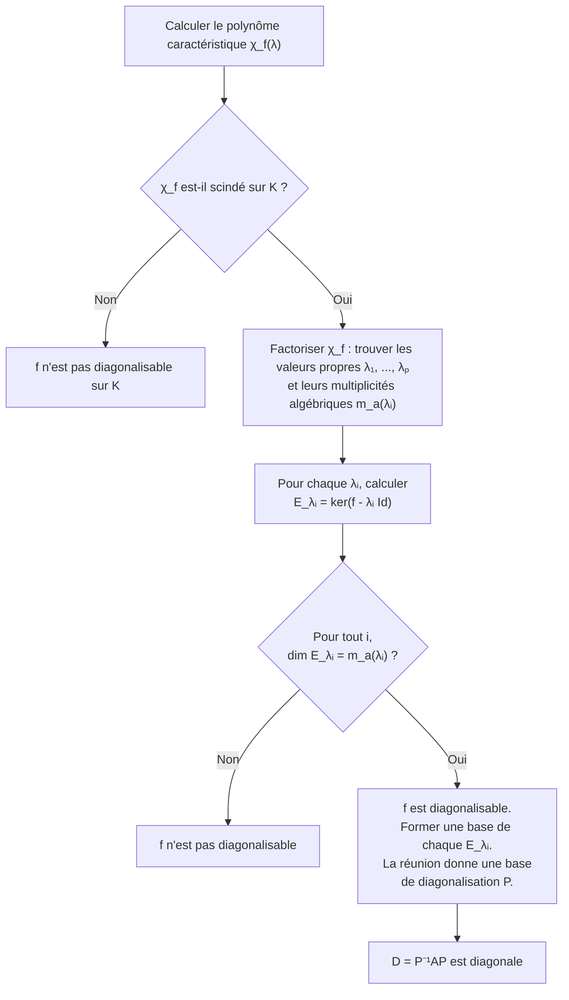
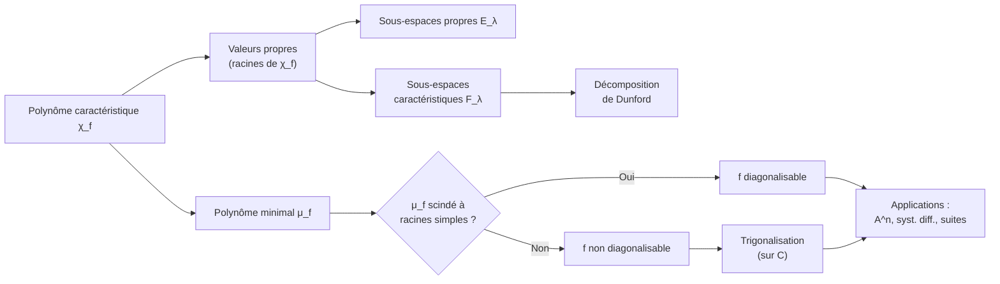

# Réduction des Endomorphismes

La réduction des endomorphismes est l'un des chapitres centraux de l'algèbre linéaire en Math Spé. L'objectif est de trouver une base dans laquelle la matrice d'un endomorphisme est la plus simple possible (diagonale, triangulaire, etc.). Ce chapitre a de nombreuses applications en analyse (systèmes différentiels, suites récurrentes) et en géométrie.


## 1. Rappels fondamentaux

### 1.1 Endomorphismes

Soit $E$ un $\mathbb{K}$-espace vectoriel de dimension finie $n$ ($\mathbb{K} = \mathbb{R}$ ou $\mathbb{C}$).

> [!abstract] Définition
> Un **endomorphisme** de $E$ est une application linéaire $f : E \to E$. L'ensemble des endomorphismes de $E$ est noté $\mathcal{L}(E)$.

On rappelle que $\mathcal{L}(E)$ est une $\mathbb{K}$-algèbre de dimension $n^2$, munie de la composition $\circ$ comme loi interne multiplicative.

### 1.2 Matrice d'un endomorphisme

Soit $\mathcal{B} = (e_1, \ldots, e_n)$ une base de $E$. La matrice de $f$ dans la base $\mathcal{B}$ est :

$$\mathrm{Mat}_{\mathcal{B}}(f) = A = (a_{ij}) \in \mathcal{M}_n(\mathbb{K})$$

où $f(e_j) = \sum_{i=1}^n a_{ij} e_i$.

> [!important] Formule de changement de base
> Si $\mathcal{B}'$ est une autre base de $E$ et $P = \mathrm{Pass}(\mathcal{B}, \mathcal{B}')$ la matrice de passage, alors :
> $$\mathrm{Mat}_{\mathcal{B}'}(f) = P^{-1} A P$$
> Deux matrices $A$ et $B$ sont **semblables** s'il existe $P$ inversible telle que $B = P^{-1}AP$.


## 2. Éléments propres

### 2.1 Valeurs propres et vecteurs propres

> [!abstract] Définition
> Soit $f \in \mathcal{L}(E)$.
> - Un scalaire $\lambda \in \mathbb{K}$ est une **valeur propre** de $f$ s'il existe un vecteur $x \neq 0$ tel que $f(x) = \lambda x$.
> - Un tel vecteur $x$ est appelé **vecteur propre** de $f$ associé à $\lambda$.
> - L'ensemble $\mathrm{Sp}(f) = \{\lambda \in \mathbb{K} \mid \lambda \text{ est valeur propre de } f\}$ est le **spectre** de $f$.

### 2.2 Sous-espaces propres

> [!abstract] Définition
> Le **sous-espace propre** associé à la valeur propre $\lambda$ est :
> $$E_\lambda = \ker(f - \lambda \mathrm{Id}) = \{x \in E \mid f(x) = \lambda x\}$$

> [!tip] Propriétés fondamentales
> 1. $\lambda$ est valeur propre de $f$ si et seulement si $E_\lambda \neq \{0\}$.
> 2. Des vecteurs propres associés à des valeurs propres **distinctes** sont **linéairement indépendants**.
> 3. La somme des sous-espaces propres est **directe** : $\bigoplus_{\lambda \in \mathrm{Sp}(f)} E_\lambda \subset E$.

> [!example] Exemple
> Soit $f : \mathbb{R}^2 \to \mathbb{R}^2$ de matrice $A = \begin{pmatrix} 2 & 1 \\ 0 & 3 \end{pmatrix}$ dans la base canonique.
>
> - $f(e_1) = 2e_1$ donc $\lambda_1 = 2$ est valeur propre et $e_1 \in E_2$.
> - On résout $Ax = 3x$ : on trouve $E_3 = \mathrm{Vect}((1, 1))$.

### Visualisation animée (Manim)

> [!note] Ce que montre l'animation
> On applique au plan l'endomorphisme de matrice $A = \begin{pmatrix}2&1\\1&2\end{pmatrix}$ (valeurs propres $3$ et $1$). Un vecteur **quelconque** (blanc) change de direction sous la transformation. En revanche, les **vecteurs propres** restent sur leur droite : la droite $\mathrm{Vect}(1,1)$ est seulement dilatée d'un facteur $\lambda = 3$, la droite $\mathrm{Vect}(1,-1)$ est invariante ($\lambda = 1$). « Garder sa direction » est exactement la définition d'un vecteur propre.

```manim
# Rendu : manimgl vecteurs_propres.py VecteursPropres
from manimlib import *


class VecteursPropres(Scene):
    def construct(self):
        plan = NumberPlane()
        self.add(plan)

        A = [[2, 1], [1, 2]]   # vp : 3 sur Vect(1,1), 1 sur Vect(1,-1)

        # Droites propres (restent globalement sur elles-mêmes)
        d1 = Line(plan.c2p(-4, -4), plan.c2p(4, 4), color=YELLOW)
        d2 = Line(plan.c2p(-4, 4), plan.c2p(4, -4), color=TEAL)
        # Vecteur propre (jaune) et vecteur quelconque (blanc)
        propre = Arrow(plan.c2p(0, 0), plan.c2p(1, 1), buff=0, color=YELLOW)
        quelconque = Arrow(plan.c2p(0, 0), plan.c2p(-1, 2), buff=0, color=WHITE)
        self.add(d1, d2, propre, quelconque)
        self.wait()

        self.play(
            ApplyMatrix(A, plan),
            ApplyMatrix(A, d1), ApplyMatrix(A, d2),
            ApplyMatrix(A, propre), ApplyMatrix(A, quelconque),
            run_time=4,
        )
        self.wait()

        note = Tex(r"A\vec{v}=\lambda\vec{v}\ :\ \text{le vecteur propre garde sa direction}")
        note.to_corner(UL).set_backstroke()
        self.play(Write(note))
        self.wait(2)
```


## 3. Polynôme caractéristique

### 3.1 Définition et propriétés

> [!abstract] Définition
> Le **polynôme caractéristique** de $f$ (ou de $A = \mathrm{Mat}_{\mathcal{B}}(f)$) est :
> $$\chi_f(\lambda) = \det(f - \lambda \mathrm{Id}) = \det(A - \lambda I_n)$$
> C'est un polynôme de degré $n$ en $\lambda$, unitaire au signe $(-1)^n$ près.

On écrit souvent :

$$\chi_f(\lambda) = (-1)^n \lambda^n + (-1)^{n-1} \mathrm{tr}(A) \lambda^{n-1} + \cdots + \det(A)$$

> [!important] Propriétés
> 1. $\lambda_0$ est valeur propre de $f$ $\iff$ $\chi_f(\lambda_0) = 0$.
> 2. Le polynôme caractéristique est un invariant de similitude.
> 3. $\mathrm{tr}(A) = \sum \lambda_i$ (somme des valeurs propres comptées avec multiplicité).
> 4. $\det(A) = \prod \lambda_i$ (produit des valeurs propres comptées avec multiplicité).

### 3.2 Multiplicité algébrique et géométrique

> [!abstract] Définition
> Soit $\lambda_0$ une valeur propre de $f$.
> - La **multiplicité algébrique** $m_a(\lambda_0)$ est l'ordre de $\lambda_0$ comme racine de $\chi_f$.
> - La **multiplicité géométrique** $m_g(\lambda_0)$ est $\dim E_{\lambda_0}$.

> [!important] Inégalité fondamentale
> Pour toute valeur propre $\lambda_0$ :
> $$1 \leq m_g(\lambda_0) \leq m_a(\lambda_0)$$


## 4. Polynôme minimal

> [!abstract] Définition
> Le **polynôme minimal** de $f$, noté $\mu_f$, est le polynôme unitaire de plus petit degré tel que $\mu_f(f) = 0$.

> [!important] Propriétés du polynôme minimal
> 1. $\mu_f$ divise tout polynôme annulateur de $f$.
> 2. $\mu_f$ divise $\chi_f$ (conséquence du théorème de Cayley-Hamilton).
> 3. $\mu_f$ et $\chi_f$ ont les **mêmes racines** (mais pas nécessairement les mêmes multiplicités).
> 4. $f$ est diagonalisable $\iff$ $\mu_f$ est scindé à racines simples.


## 5. Théorème de Cayley-Hamilton

> [!abstract] Théorème (Cayley-Hamilton)
> Tout endomorphisme $f$ d'un espace vectoriel de dimension finie annule son polynôme caractéristique :
> $$\chi_f(f) = 0$$

> [!tip] Esquisse de démonstration
> **Sur $\mathbb{C}$** : par trigonalisation, on se ramène au cas triangulaire. Si $T$ est triangulaire supérieure de valeurs diagonales $\lambda_1, \ldots, \lambda_n$, on vérifie que $(T - \lambda_1 I)(T - \lambda_2 I) \cdots (T - \lambda_n I) = 0$ en montrant que l'image de ce produit partiel est de dimension décroissante.
>
> **Sur $\mathbb{R}$** : on plonge dans $\mathbb{C}$ et on utilise le fait que l'identité polynomiale reste valable.

> [!example] Application
> Soit $A = \begin{pmatrix} 1 & 2 \\ 0 & 3 \end{pmatrix}$. On a $\chi_A(\lambda) = (\lambda - 1)(\lambda - 3) = \lambda^2 - 4\lambda + 3$.
>
> Par Cayley-Hamilton : $A^2 - 4A + 3I = 0$, donc $A^2 = 4A - 3I$.
>
> Cela permet de calculer toute puissance de $A$ par récurrence.


## 6. Diagonalisation

### 6.1 Condition nécessaire et suffisante

> [!abstract] Théorème
> $f \in \mathcal{L}(E)$ est **diagonalisable** si et seulement si :
> 1. $\chi_f$ est **scindé** sur $\mathbb{K}$, **et**
> 2. Pour chaque valeur propre $\lambda$, on a $m_g(\lambda) = m_a(\lambda)$.
>
> De manière équivalente : $E = \bigoplus_{\lambda \in \mathrm{Sp}(f)} E_\lambda$.

> [!tip] Critères alternatifs de diagonalisabilité
> - $f$ admet $n$ valeurs propres distinctes $\implies$ $f$ est diagonalisable (réciproque fausse).
> - $f$ est diagonalisable $\iff$ $\mu_f$ est scindé à racines simples.
> - Si $f^2 = f$ (projecteur) ou $f^2 = \mathrm{Id}$ (involution), alors $f$ est diagonalisable.

### 6.2 Méthode pratique de diagonalisation



### 6.3 Exemple complet de diagonalisation

> [!example] Diagonalisation d'une matrice $3 \times 3$
> Soit $A = \begin{pmatrix} 4 & 1 & -1 \\ 2 & 5 & -2 \\ 1 & 1 & 2 \end{pmatrix}$.
>
> **Étape 1** : Polynôme caractéristique.
> $$\chi_A(\lambda) = \det(A - \lambda I) = -\lambda^3 + 11\lambda^2 - 39\lambda + 45 = -(\lambda - 3)^2(\lambda - 5)$$
>
> Les valeurs propres sont $\lambda_1 = 3$ (multiplicité algébrique 2) et $\lambda_2 = 5$ (multiplicité 1).
>
> **Étape 2** : Sous-espaces propres.
>
> $E_3 = \ker(A - 3I)$ : on résout $(A - 3I)x = 0$ :
> $$A - 3I = \begin{pmatrix} 1 & 1 & -1 \\ 2 & 2 & -2 \\ 1 & 1 & -1 \end{pmatrix} \implies E_3 = \mathrm{Vect}\left(\begin{pmatrix} 1 \\ -1 \\ 0 \end{pmatrix}, \begin{pmatrix} 1 \\ 0 \\ 1 \end{pmatrix}\right)$$
>
> Donc $\dim E_3 = 2 = m_a(3)$. De même, $E_5 = \mathrm{Vect}\left(\begin{pmatrix} 1 \\ 2 \\ 1 \end{pmatrix}\right)$.
>
> **Conclusion** : $A$ est diagonalisable. En posant $P = \begin{pmatrix} 1 & 1 & 1 \\ -1 & 0 & 2 \\ 0 & 1 & 1 \end{pmatrix}$, on a $P^{-1}AP = \mathrm{diag}(3, 3, 5)$.


## 7. Trigonalisation

### 7.1 Théorème de trigonalisation sur $\mathbb{C}$

> [!abstract] Théorème
> Toute matrice $A \in \mathcal{M}_n(\mathbb{C})$ est **trigonalisable** : il existe $P \in GL_n(\mathbb{C})$ telle que $P^{-1}AP$ est triangulaire supérieure.
>
> De manière équivalente : tout endomorphisme d'un $\mathbb{C}$-espace vectoriel de dimension finie est trigonalisable.

> [!tip] Esquisse de démonstration
> Par récurrence sur $n = \dim E$.
> - **Initialisation** : pour $n = 1$, toute matrice $1 \times 1$ est triangulaire.
> - **Hérédité** : sur $\mathbb{C}$, $\chi_f$ admet une racine $\lambda_1$ (théorème de d'Alembert). Soit $e_1$ un vecteur propre associé. On complète $(e_1)$ en une base de $E$. Dans cette base, la matrice de $f$ a la forme :
> $$\begin{pmatrix} \lambda_1 & * \\ 0 & B \end{pmatrix}$$
> Par hypothèse de récurrence, $B$ est trigonalisable, d'où le résultat.

> [!warning] Attention
> Sur $\mathbb{R}$, une matrice n'est pas toujours trigonalisable. Par exemple, la matrice de rotation $R_\theta = \begin{pmatrix} \cos\theta & -\sin\theta \\ \sin\theta & \cos\theta \end{pmatrix}$ pour $\theta \notin \{0, \pi\}$ n'est pas trigonalisable sur $\mathbb{R}$.

### 7.2 Trigonalisation sur $\mathbb{R}$

> [!abstract] Théorème
> Une matrice $A \in \mathcal{M}_n(\mathbb{R})$ est trigonalisable sur $\mathbb{R}$ si et seulement si $\chi_A$ est scindé sur $\mathbb{R}$.


## 8. Sous-espaces caractéristiques

> [!abstract] Définition
> Soit $\lambda$ une valeur propre de $f$ de multiplicité algébrique $m_a(\lambda)$. Le **sous-espace caractéristique** associé à $\lambda$ est :
> $$F_\lambda = \ker(f - \lambda \mathrm{Id})^{m_a(\lambda)}$$

> [!important] Propriétés
> 1. $E_\lambda \subset F_\lambda$ (tout sous-espace propre est inclus dans le sous-espace caractéristique).
> 2. $\dim F_\lambda = m_a(\lambda)$.
> 3. Si $\chi_f$ est scindé, alors $E = \bigoplus_{\lambda \in \mathrm{Sp}(f)} F_\lambda$ (décomposition de Dunford-Jordan).
> 4. $f$ est diagonalisable $\iff$ pour tout $\lambda$, $E_\lambda = F_\lambda$.


## 9. Applications

### 9.1 Calcul de $A^n$

Si $A = PDP^{-1}$ avec $D = \mathrm{diag}(\lambda_1, \ldots, \lambda_n)$, alors :

$$A^n = P D^n P^{-1} = P \, \mathrm{diag}(\lambda_1^n, \ldots, \lambda_n^n) \, P^{-1}$$

> [!example] Exemple : Puissance d'une matrice
> Avec l'exemple précédent ($A$ diagonalisable en $D = \mathrm{diag}(3, 3, 5)$) :
> $$A^n = P \begin{pmatrix} 3^n & 0 & 0 \\ 0 & 3^n & 0 \\ 0 & 0 & 5^n \end{pmatrix} P^{-1}$$

Pour une matrice **non diagonalisable** mais trigonalisable, on écrit $A = D + N$ avec $D$ diagonale et $N$ nilpotente ($DN = ND$), puis on utilise la formule du binôme :

$$A^n = (D + N)^n = \sum_{k=0}^{p} \binom{n}{k} D^{n-k} N^k$$

où $p$ est l'indice de nilpotence de $N$.

### 9.2 Résolution de systèmes différentiels linéaires

On considère le système $X'(t) = AX(t)$ avec $A \in \mathcal{M}_n(\mathbb{R})$.

**Cas diagonalisable** : Si $A = PDP^{-1}$, on pose $Y = P^{-1}X$, alors $Y' = DY$ et :

$$Y(t) = \begin{pmatrix} c_1 e^{\lambda_1 t} \\ \vdots \\ c_n e^{\lambda_n t} \end{pmatrix} \implies X(t) = PY(t)$$

> [!example] Exemple
> Soit le système $\begin{cases} x' = 2x + y \\ y' = 3y \end{cases}$, soit $A = \begin{pmatrix} 2 & 1 \\ 0 & 3 \end{pmatrix}$.
>
> Valeurs propres : $\lambda_1 = 2$, $\lambda_2 = 3$. $A$ est diagonalisable (2 valeurs propres distinctes en dimension 2).
>
> $E_2 = \mathrm{Vect}(e_1)$, $E_3 = \mathrm{Vect}((1,1)^T)$. On pose $P = \begin{pmatrix} 1 & 1 \\ 0 & 1 \end{pmatrix}$.
>
> Solution : $X(t) = c_1 e^{2t} \begin{pmatrix} 1 \\ 0 \end{pmatrix} + c_2 e^{3t} \begin{pmatrix} 1 \\ 1 \end{pmatrix}$.

**Cas général** : on utilise l'exponentielle de matrice $e^{tA} = \sum_{k=0}^{\infty} \frac{t^k A^k}{k!}$ et la solution est $X(t) = e^{tA} X(0)$.

### 9.3 Suites récurrentes linéaires

Soit la suite récurrente $u_{n+2} = au_{n+1} + bu_n$. On pose $X_n = \begin{pmatrix} u_{n+1} \\ u_n \end{pmatrix}$ et $A = \begin{pmatrix} a & b \\ 1 & 0 \end{pmatrix}$.

Alors $X_n = A^n X_0$, ce qui ramène au calcul de $A^n$.

> [!example] Suite de Fibonacci
> $u_{n+2} = u_{n+1} + u_n$, avec $u_0 = 0$, $u_1 = 1$.
>
> Matrice compagnon : $A = \begin{pmatrix} 1 & 1 \\ 1 & 0 \end{pmatrix}$.
>
> $\chi_A(\lambda) = \lambda^2 - \lambda - 1$, racines $\varphi = \frac{1+\sqrt{5}}{2}$ et $\psi = \frac{1-\sqrt{5}}{2}$.
>
> On obtient la formule de Binet :
> $$u_n = \frac{\varphi^n - \psi^n}{\sqrt{5}} = \frac{1}{\sqrt{5}}\left[\left(\frac{1+\sqrt{5}}{2}\right)^n - \left(\frac{1-\sqrt{5}}{2}\right)^n\right]$$


## 10. Résumé des liens entre notions




## 11. Exercices types corrigés

### Exercice 1 : Diagonalisation et calcul de puissance

> [!example] Énoncé
> Soit $A = \begin{pmatrix} 5 & -6 \\ 3 & -4 \end{pmatrix}$. Montrer que $A$ est diagonalisable et calculer $A^n$ pour tout $n \in \mathbb{N}$.

**Solution** :

$\chi_A(\lambda) = (5 - \lambda)(-4 - \lambda) + 18 = \lambda^2 - \lambda - 2 = (\lambda - 2)(\lambda + 1)$.

Valeurs propres : $\lambda_1 = 2$, $\lambda_2 = -1$. Comme elles sont distinctes, $A$ est diagonalisable.

$E_2 = \ker(A - 2I) = \mathrm{Vect}\begin{pmatrix} 2 \\ 1 \end{pmatrix}$, $E_{-1} = \ker(A + I) = \mathrm{Vect}\begin{pmatrix} 1 \\ 1 \end{pmatrix}$.

On pose $P = \begin{pmatrix} 2 & 1 \\ 1 & 1 \end{pmatrix}$, $P^{-1} = \begin{pmatrix} 1 & -1 \\ -1 & 2 \end{pmatrix}$.

$$A^n = P \begin{pmatrix} 2^n & 0 \\ 0 & (-1)^n \end{pmatrix} P^{-1} = \begin{pmatrix} 2^{n+1} - (-1)^n & -2^{n+1} + 2(-1)^n \\ 2^n - (-1)^n & -2^n + 2(-1)^n \end{pmatrix}$$

**Vérification** : pour $n = 0$, on obtient bien $I_2$, et pour $n = 1$, on retrouve $A$.


### Exercice 2 : Polynôme minimal et diagonalisabilité

> [!example] Énoncé
> Soit $A = \begin{pmatrix} 2 & 1 & 0 \\ 0 & 2 & 0 \\ 0 & 0 & 3 \end{pmatrix}$. Déterminer $\chi_A$, $\mu_A$, et décider si $A$ est diagonalisable.

**Solution** :

$\chi_A(\lambda) = (2 - \lambda)^2(3 - \lambda)$. Valeurs propres : $\lambda_1 = 2$ ($m_a = 2$), $\lambda_2 = 3$ ($m_a = 1$).

$E_2 = \ker(A - 2I) = \mathrm{Vect}(e_1)$, donc $\dim E_2 = 1 \neq 2 = m_a(2)$.

$A$ **n'est pas diagonalisable**.

Pour le polynôme minimal, on vérifie : $(A - 2I)(A - 3I) = \begin{pmatrix} 0 & -1 & 0 \\ 0 & 0 & 0 \\ 0 & 0 & 0 \end{pmatrix} \neq 0$.

Mais $(A - 2I)^2(A - 3I) = 0$. Donc $\mu_A(\lambda) = (\lambda - 2)^2(\lambda - 3) = \chi_A(\lambda)$.

Ici $\mu_A = \chi_A$, ce qui confirme que $A$ n'est pas diagonalisable (car $\mu_A$ n'est pas scindé à racines simples).


### Exercice 3 : Système différentiel

> [!example] Énoncé
> Résoudre le système $\begin{cases} x'(t) = 4x - y \\ y'(t) = 2x + y \end{cases}$.

**Solution** :

Matrice du système : $A = \begin{pmatrix} 4 & -1 \\ 2 & 1 \end{pmatrix}$.

$\chi_A(\lambda) = \lambda^2 - 5\lambda + 6 = (\lambda - 2)(\lambda - 3)$.

$E_2 = \mathrm{Vect}\begin{pmatrix} 1 \\ 2 \end{pmatrix}$, $E_3 = \mathrm{Vect}\begin{pmatrix} 1 \\ 1 \end{pmatrix}$.

Solution générale :

$$\begin{pmatrix} x(t) \\ y(t) \end{pmatrix} = c_1 e^{2t} \begin{pmatrix} 1 \\ 2 \end{pmatrix} + c_2 e^{3t} \begin{pmatrix} 1 \\ 1 \end{pmatrix}$$

Soit $x(t) = c_1 e^{2t} + c_2 e^{3t}$ et $y(t) = 2c_1 e^{2t} + c_2 e^{3t}$.


### Exercice 4 : Cayley-Hamilton et inverse

> [!example] Énoncé
> Soit $A = \begin{pmatrix} 1 & 1 & 0 \\ 0 & 1 & 1 \\ 0 & 0 & 2 \end{pmatrix}$. Utiliser Cayley-Hamilton pour exprimer $A^{-1}$ comme polynôme en $A$.

**Solution** :

$\chi_A(\lambda) = (1 - \lambda)^2(2 - \lambda) = -\lambda^3 + 4\lambda^2 - 5\lambda + 2$.

Par Cayley-Hamilton : $-A^3 + 4A^2 - 5A + 2I = 0$.

Donc $2I = A^3 - 4A^2 + 5A = A(A^2 - 4A + 5I)$.

Ainsi $A^{-1} = \frac{1}{2}(A^2 - 4A + 5I)$.

On vérifie : $A^2 = \begin{pmatrix} 1 & 2 & 1 \\ 0 & 1 & 3 \\ 0 & 0 & 4 \end{pmatrix}$, d'où :

$$A^{-1} = \frac{1}{2}\begin{pmatrix} 1 & 2 & 1 \\ 0 & 1 & 3 \\ 0 & 0 & 4 \end{pmatrix} - 2\begin{pmatrix} 1 & 1 & 0 \\ 0 & 1 & 1 \\ 0 & 0 & 2 \end{pmatrix} + \frac{5}{2}I = \begin{pmatrix} 1 & -1 & \frac{1}{2} \\ 0 & 1 & -\frac{1}{2} \\ 0 & 0 & \frac{1}{2} \end{pmatrix}$$
