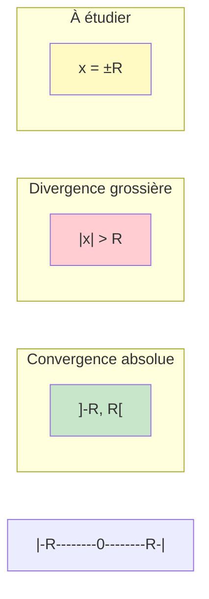
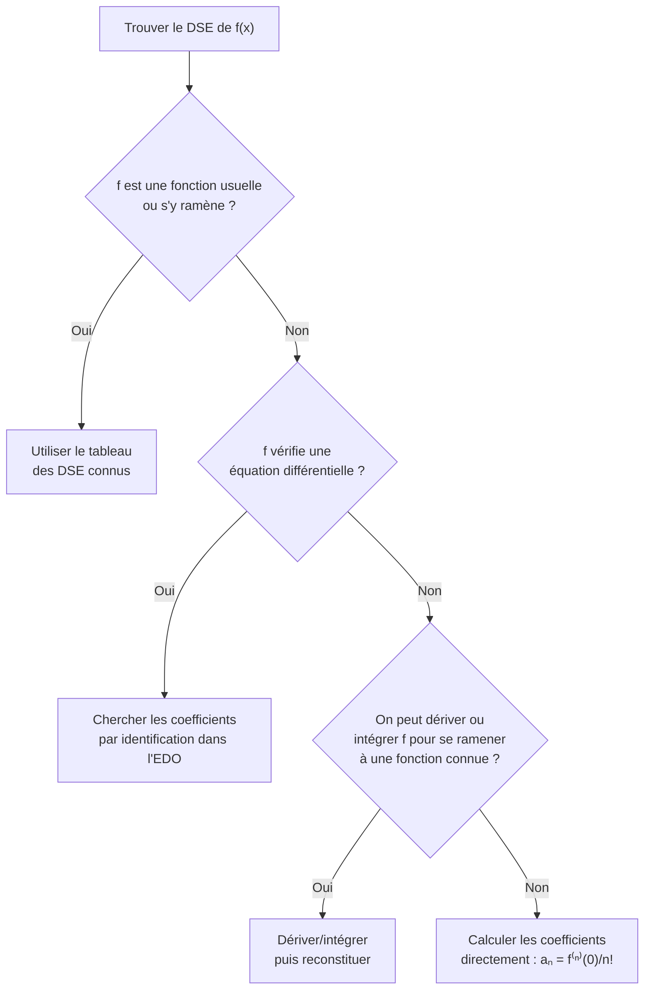

# Séries Entières

Les séries entières généralisent les polynômes à un nombre infini de termes. Elles permettent de représenter des fonctions par des séries de puissances et constituent l'un des outils les plus élégants et puissants de l'analyse.

> [!quote] Prérequis
> [[Suites et Séries Numériques]], [[Développements Limités]], [[Fonctions d'une Variable Réelle]]

## Définition et rayon de convergence

### Définition

> [!abstract] Définition
> Une **série entière** (réelle ou complexe) est une série de fonctions de la forme :
> $$\sum_{n=0}^{+\infty} a_n x^n \quad \text{ou} \quad \sum_{n=0}^{+\infty} a_n z^n$$
> où $(a_n)_{n \geq 0}$ est une suite de nombres réels (ou complexes).

### Rayon de convergence

> [!abstract] Théorème — Lemme d'Abel
> Si la suite $(a_n r^n)$ est **bornée** pour un certain $r > 0$, alors la série $\sum a_n x^n$ **converge absolument** pour tout $|x| < r$.

> [!abstract] Définition — Rayon de convergence
> Le **rayon de convergence** de $\sum a_n x^n$ est :
> $$R = \sup \{ r \geq 0 : (a_n r^n) \text{ est bornée} \} \in [0, +\infty]$$

> [!important] Comportement selon $|x|$
> - Si $|x| < R$ : la série **converge absolument**
> - Si $|x| > R$ : la série **diverge grossièrement** ($a_n x^n \not\to 0$)
> - Si $|x| = R$ : **pas de règle générale** (à étudier au cas par cas)

### Calcul du rayon de convergence

> [!abstract] Règle de d'Alembert (cas le plus fréquent)
> Si $\lim_{n \to +\infty} \left|\dfrac{a_{n+1}}{a_n}\right| = \ell$ existe (avec $0 \leq \ell \leq +\infty$), alors :
> $$R = \frac{1}{\ell}$$
> (avec la convention $1/0 = +\infty$ et $1/+\infty = 0$)

> [!abstract] Formule de Hadamard (cas général)
> $$\frac{1}{R} = \limsup_{n \to +\infty} |a_n|^{1/n}$$

> [!example] Exemples classiques
>
> | Série | $a_n$ | Rayon $R$ |
> |---|---|---|
> | $\sum x^n$ | $1$ | $R = 1$ |
> | $\sum \frac{x^n}{n!}$ | $\frac{1}{n!}$ | $R = +\infty$ |
> | $\sum n! \, x^n$ | $n!$ | $R = 0$ |
> | $\sum \frac{x^n}{n}$ | $\frac{1}{n}$ | $R = 1$ |
> | $\sum \frac{x^n}{n^2}$ | $\frac{1}{n^2}$ | $R = 1$ |
> | $\sum \frac{n^n}{n!} x^n$ | $\frac{n^n}{n!}$ | $R = 1/e$ |

## Propriétés de la somme

Soit $S(x) = \sum_{n=0}^{+\infty} a_n x^n$ pour $|x| < R$.

### Continuité

> [!abstract] Théorème
> $S$ est **continue** sur $]-R, R[$.

En fait, $S$ est bien mieux que continue :

### Dérivabilité terme à terme

> [!abstract] Théorème fondamental
> La série dérivée $\sum n a_n x^{n-1}$ a le **même rayon de convergence** $R$, et :
> $$S'(x) = \sum_{n=1}^{+\infty} n a_n x^{n-1} \quad \text{pour } |x| < R$$
>
> Par récurrence, $S$ est **indéfiniment dérivable** ($C^\infty$) sur $]-R, R[$ et :
> $$S^{(k)}(x) = \sum_{n=k}^{+\infty} \frac{n!}{(n-k)!} a_n x^{n-k}$$

> [!tip] Conséquence
> En évaluant en $x = 0$ : $a_n = \dfrac{S^{(n)}(0)}{n!}$. Les coefficients sont **uniquement déterminés** par la fonction somme.

### Intégration terme à terme

> [!abstract] Théorème
> On peut intégrer terme à terme sur tout segment inclus dans $]-R, R[$ :
> $$\int_0^x S(t) \, dt = \sum_{n=0}^{+\infty} \frac{a_n}{n+1} x^{n+1} \quad \text{pour } |x| < R$$
>
> La série intégrée a aussi le rayon de convergence $R$.

## Développements en séries entières (DSE)

### Définition

> [!abstract] Définition
> $f$ est **développable en série entière** (DSE) au voisinage de $0$ s'il existe $R > 0$ et une suite $(a_n)$ tels que :
> $$f(x) = \sum_{n=0}^{+\infty} a_n x^n \quad \text{pour } |x| < R$$
> On dit que $f$ est **analytique**.

> [!warning] Attention
> $C^\infty$ n'implique **pas** analytique ! La fonction $f(x) = e^{-1/x^2}$ (prolongée par 0 en 0) est $C^\infty$, toutes ses dérivées en 0 sont nulles, mais $f \neq 0$.

### DSE des fonctions usuelles

$$e^x = \sum_{n=0}^{+\infty} \frac{x^n}{n!}, \quad R = +\infty$$

$$\sin x = \sum_{n=0}^{+\infty} (-1)^n \frac{x^{2n+1}}{(2n+1)!}, \quad R = +\infty$$

$$\cos x = \sum_{n=0}^{+\infty} (-1)^n \frac{x^{2n}}{(2n)!}, \quad R = +\infty$$

$$\frac{1}{1-x} = \sum_{n=0}^{+\infty} x^n, \quad R = 1$$

$$\ln(1+x) = \sum_{n=1}^{+\infty} (-1)^{n-1} \frac{x^n}{n}, \quad R = 1$$

$$(1+x)^\alpha = \sum_{n=0}^{+\infty} \binom{\alpha}{n} x^n, \quad R = 1 \text{ (si } \alpha \notin \mathbb{N}\text{)}$$

$$\arctan x = \sum_{n=0}^{+\infty} (-1)^n \frac{x^{2n+1}}{2n+1}, \quad R = 1$$

$$\sinh x = \sum_{n=0}^{+\infty} \frac{x^{2n+1}}{(2n+1)!}, \quad R = +\infty$$

$$\cosh x = \sum_{n=0}^{+\infty} \frac{x^{2n}}{(2n)!}, \quad R = +\infty$$

## Opérations sur les séries entières

### Somme

$$\sum a_n x^n + \sum b_n x^n = \sum (a_n + b_n) x^n$$

Rayon $\geq \min(R_f, R_g)$.

### Produit de Cauchy

$$\left(\sum a_n x^n\right) \cdot \left(\sum b_n x^n\right) = \sum c_n x^n$$

où $c_n = \sum_{k=0}^{n} a_k b_{n-k}$ (produit de convolution).

Rayon $\geq \min(R_f, R_g)$.

### Composition

Si $g(0) = 0$ et $|g(x)| < R_f$ pour $|x| < r$, alors :

$$f(g(x)) = \sum_{n=0}^{+\infty} a_n (g(x))^n$$

## Méthodes pour trouver un DSE

### Méthode 1 : Utiliser les DSE connus + opérations

> [!example] Exemple — DSE de $\frac{1}{(1-x)^2}$
> On dérive $\frac{1}{1-x} = \sum x^n$ :
> $$\frac{1}{(1-x)^2} = \sum_{n=1}^{+\infty} n x^{n-1} = \sum_{n=0}^{+\infty} (n+1) x^n, \quad R = 1$$

### Méthode 2 : Équation différentielle

> [!example] Exemple — DSE de $\arcsin x$
> On sait que $(\arcsin x)' = \frac{1}{\sqrt{1-x^2}} = (1-x^2)^{-1/2}$.
>
> Par le binôme généralisé : $(1-x^2)^{-1/2} = \sum_{n=0}^{+\infty} \binom{-1/2}{n} (-x^2)^n$
>
> On intègre terme à terme pour obtenir le DSE de $\arcsin$.

### Méthode 3 : Identification dans une EDO

Pour $f$ vérifiant $y' = P(x, y)$, on pose $f(x) = \sum a_n x^n$, on substitue dans l'EDO, et on identifie les coefficients.

## Séries entières et équations différentielles

> [!example] Exemple classique — Fonction de Bessel $J_0$
> L'équation de Bessel d'ordre 0 : $xy'' + y' + xy = 0$.
>
> On pose $y = \sum a_n x^n$, on substitue, et par identification :
> $$a_{2n} = \frac{(-1)^n}{(n!)^2 \cdot 4^n}, \quad a_{2n+1} = 0$$
>
> $$J_0(x) = \sum_{n=0}^{+\infty} \frac{(-1)^n}{(n!)^2} \left(\frac{x}{2}\right)^{2n}$$

## Théorème d'Abel radial

> [!abstract] Théorème d'Abel
> Si $\sum a_n R^n$ converge (en un bord du disque), alors :
> $$\lim_{x \to R^-} \sum_{n=0}^{+\infty} a_n x^n = \sum_{n=0}^{+\infty} a_n R^n$$
>
> La somme est **continue à gauche en $R$**.

> [!example] Application
> $\sum_{n=1}^{+\infty} \frac{(-1)^{n-1}}{n} x^n = \ln(1+x)$ pour $|x| < 1$.
>
> La série converge aussi en $x = 1$ (Leibniz). Par Abel :
> $$\sum_{n=1}^{+\infty} \frac{(-1)^{n-1}}{n} = \ln 2$$

## Exercices types

> [!example] Exercice 1 — Rayon de convergence
> Déterminer le rayon de $\sum \dfrac{n^2}{3^n} x^n$.
>
> **Solution :** $\left|\dfrac{a_{n+1}}{a_n}\right| = \dfrac{(n+1)^2}{n^2} \cdot \dfrac{1}{3} \to \dfrac{1}{3}$, donc $R = 3$.

> [!example] Exercice 2 — Calcul de somme
> Calculer $S(x) = \sum_{n=0}^{+\infty} (n+1) x^n$ pour $|x| < 1$.
>
> **Solution :** $S(x) = \left(\sum x^{n+1}\right)' = \left(\dfrac{x}{1-x}\right)' = \dfrac{1}{(1-x)^2}$

> [!example] Exercice 3 — DSE par EDO
> Trouver le DSE de $f(x) = \arctan(x)$.
>
> **Solution :** $f'(x) = \dfrac{1}{1+x^2} = \sum_{n=0}^{+\infty} (-1)^n x^{2n}$ pour $|x| < 1$.
>
> En intégrant : $\arctan(x) = \sum_{n=0}^{+\infty} (-1)^n \dfrac{x^{2n+1}}{2n+1}$, $R = 1$.

> [!example] Exercice 4 — Somme classique
> Calculer $\sum_{n=1}^{+\infty} \dfrac{n}{2^n}$.
>
> **Solution :** $\sum n x^n = \dfrac{x}{(1-x)^2}$. En $x = 1/2$ : $\sum \dfrac{n}{2^n} = \dfrac{1/2}{(1/2)^2} = 2$.

## À retenir

> [!important] Les points clés
> 1. **Lemme d'Abel** : fondement théorique du rayon de convergence
> 2. La somme d'une série entière est **$C^\infty$** sur $]-R, R[$
> 3. On peut **dériver** et **intégrer** terme à terme (même rayon $R$)
> 4. Les coefficients sont **uniques** : $a_n = S^{(n)}(0)/n!$
> 5. $C^\infty$ n'implique pas analytique ($e^{-1/x^2}$ est le contre-exemple classique)
> 6. **Théorème d'Abel radial** : continuité au bord si la série y converge
