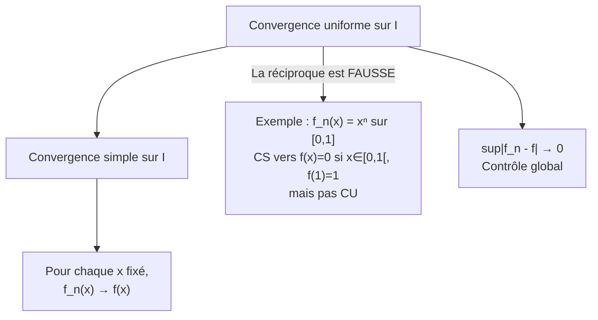

# Séries de Fonctions

Ce chapitre traite des suites et séries de fonctions, et en particulier des conditions sous lesquelles on peut intervertir les opérations de passage à la limite avec la continuité, l'intégration et la dérivation. Ces résultats sont fondamentaux pour justifier rigoureusement les manipulations sur les [[Séries Entières]], les séries de Fourier et de nombreuses autres constructions analytiques.


## 1. Suites de fonctions

### 1.1 Convergence simple

> [!abstract] Définition
> Soit $(f_n)_{n \in \mathbb{N}}$ une suite de fonctions de $I \subset \mathbb{R}$ dans $\mathbb{R}$ (ou $\mathbb{C}$). On dit que $(f_n)$ **converge simplement** (CS) vers $f : I \to \mathbb{R}$ si :
> $$\forall x \in I, \quad \lim_{n \to +\infty} f_n(x) = f(x)$$
> Autrement dit : $\forall x \in I, \, \forall \varepsilon > 0, \, \exists N \in \mathbb{N}$ (dépendant de $x$ et $\varepsilon$) tel que $n \geq N \implies |f_n(x) - f(x)| < \varepsilon$.

### 1.2 Convergence uniforme

> [!abstract] Définition
> La suite $(f_n)$ **converge uniformément** (CU) vers $f$ sur $I$ si :
> $$\sup_{x \in I} |f_n(x) - f(x)| \xrightarrow[n \to +\infty]{} 0$$
> Autrement dit : $\forall \varepsilon > 0, \, \exists N \in \mathbb{N}$ (dépendant **uniquement** de $\varepsilon$) tel que $\forall n \geq N, \, \forall x \in I, \, |f_n(x) - f(x)| < \varepsilon$.

> [!warning] Différence fondamentale
> - Convergence simple : le rang $N$ dépend de $x$ et $\varepsilon$.
> - Convergence uniforme : le rang $N$ ne dépend que de $\varepsilon$ (uniformité en $x$).



> [!example] Exemple classique
> $f_n(x) = x^n$ sur $[0, 1]$.
> - **CS** : $f_n(x) \to 0$ si $x \in [0, 1[$ et $f_n(1) = 1$. La limite simple est $f(x) = \begin{cases} 0 & \text{si } x \in [0,1[ \\ 1 & \text{si } x = 1\end{cases}$.
> - **Pas CU** : $\sup_{[0,1]} |f_n(x) - f(x)| = \sup_{[0,1[} x^n = 1 \not\to 0$.
> - De plus, chaque $f_n$ est continue mais la limite $f$ est **discontinue** : la convergence simple ne préserve pas la continuité.

### 1.3 Critère pratique de non-uniformité

> [!tip] Méthode
> Pour montrer que la convergence n'est **pas** uniforme, il suffit de trouver une suite $(x_n)$ dans $I$ telle que $|f_n(x_n) - f(x_n)| \not\to 0$.


## 2. Théorèmes fondamentaux pour les suites de fonctions

### 2.1 Convergence uniforme et continuité

> [!abstract] Théorème (Double limite)
> Si $(f_n)$ est une suite de fonctions **continues** sur $I$ qui converge **uniformément** vers $f$ sur $I$, alors $f$ est **continue** sur $I$.

> [!tip] Démonstration
> Soit $a \in I$ et $\varepsilon > 0$.
> - Par CU, il existe $N$ tel que pour tout $n \geq N$ et tout $x \in I$ : $|f_n(x) - f(x)| < \varepsilon/3$.
> - Par continuité de $f_N$ en $a$, il existe $\delta > 0$ tel que $|x - a| < \delta \implies |f_N(x) - f_N(a)| < \varepsilon/3$.
> - Alors pour $|x - a| < \delta$ :
> $$|f(x) - f(a)| \leq |f(x) - f_N(x)| + |f_N(x) - f_N(a)| + |f_N(a) - f(a)| < \varepsilon$$

> [!warning] La réciproque est fausse
> La convergence simple d'une suite de fonctions continues vers une fonction continue **n'implique pas** la convergence uniforme.

### 2.2 Interversion limite-intégrale

> [!abstract] Théorème
> Soit $(f_n)$ une suite de fonctions **continues** sur un segment $[a, b]$ convergeant **uniformément** vers $f$ sur $[a, b]$. Alors :
> $$\lim_{n \to +\infty} \int_a^b f_n(t) \, dt = \int_a^b f(t) \, dt = \int_a^b \lim_{n \to +\infty} f_n(t) \, dt$$

> [!tip] Démonstration
> $$\left|\int_a^b f_n(t) \, dt - \int_a^b f(t) \, dt\right| \leq \int_a^b |f_n(t) - f(t)| \, dt \leq (b-a) \sup_{[a,b]} |f_n - f| \xrightarrow[n \to +\infty]{} 0$$

### 2.3 Interversion limite-dérivée

> [!abstract] Théorème
> Soit $(f_n)$ une suite de fonctions de classe $\mathcal{C}^1$ sur un intervalle $I$ telle que :
> 1. Il existe $x_0 \in I$ tel que $(f_n(x_0))$ converge.
> 2. $(f_n')$ converge **uniformément** sur tout segment de $I$ vers une fonction $g$.
>
> Alors $(f_n)$ converge uniformément sur tout segment de $I$ vers une fonction $f$ de classe $\mathcal{C}^1$, et $f' = g$. Autrement dit :
> $$\left(\lim_{n \to +\infty} f_n\right)' = \lim_{n \to +\infty} f_n'$$

> [!warning] Attention
> L'hypothèse de convergence uniforme porte sur les **dérivées** $f_n'$, pas sur les $f_n$ elles-mêmes. La convergence (ponctuelle) en un point suffit pour les $f_n$.


## 3. Séries de fonctions

### 3.1 Définitions

Soit $(f_n)_{n \geq 0}$ une suite de fonctions de $I$ dans $\mathbb{R}$. On s'intéresse à la série $\sum f_n$, dont la somme partielle est $S_N(x) = \sum_{n=0}^{N} f_n(x)$.

> [!abstract] Définitions
> - La série $\sum f_n$ **converge simplement** si $(S_N)$ converge simplement.
> - La série $\sum f_n$ **converge uniformément** sur $I$ si $(S_N)$ converge uniformément sur $I$.
> - La série $\sum f_n$ **converge normalement** sur $I$ si $\sum_{n \geq 0} \|f_n\|_\infty < +\infty$, où $\|f_n\|_\infty = \sup_{x \in I} |f_n(x)|$.

### 3.2 Hiérarchie des convergences

```mermaid
flowchart TD
    A["Convergence NORMALE<br/>∑ ‖fₙ‖∞ converge"] ==> B["Convergence UNIFORME<br/>sup|Sₙ - S| → 0"]
    B ==> C["Convergence SIMPLE<br/>∀x, Sₙ(x) → S(x)"]
    A -- "Réciproque FAUSSE" -.-> D["Contre-ex : ∑(-1)ⁿ/n<br/>sur un singleton"]
    B -- "Réciproque FAUSSE" -.-> E["Contre-ex : fₙ = xⁿ/n<br/>sur [0,1]"]
```

> [!important] Convergence normale implique convergence uniforme
> **Démonstration** : Si $\sum \|f_n\|_\infty$ converge, alors pour tout $x \in I$ et tout $N$ :
> $$\left|\sum_{n=N+1}^{+\infty} f_n(x)\right| \leq \sum_{n=N+1}^{+\infty} |f_n(x)| \leq \sum_{n=N+1}^{+\infty} \|f_n\|_\infty \xrightarrow[N \to +\infty]{} 0$$
> Le majorant est indépendant de $x$, d'où la convergence uniforme.

### 3.3 Critère de Weierstrass (convergence normale)

> [!abstract] Théorème (Weierstrass)
> S'il existe une série numérique convergente $\sum a_n$ ($a_n \geq 0$) telle que pour tout $n$ et tout $x \in I$ : $|f_n(x)| \leq a_n$, alors $\sum f_n$ converge normalement (donc uniformément) sur $I$.

> [!tip] C'est le critère le plus utilisé en pratique
> On cherche un majorant $a_n$ de $\|f_n\|_\infty$ tel que $\sum a_n$ converge.

### 3.4 Condition nécessaire de convergence uniforme

> [!abstract] Proposition (Critère de Cauchy uniforme)
> Si $\sum f_n$ converge uniformément sur $I$, alors $\|f_n\|_\infty \to 0$.
>
> (C'est l'analogue du critère du terme général pour les séries numériques.)


## 4. Théorèmes de régularité pour les séries de fonctions

### 4.1 Continuité de la somme

> [!abstract] Théorème
> Si les $f_n$ sont **continues** sur $I$ et si $\sum f_n$ converge **uniformément** sur $I$ (ou sur tout segment de $I$), alors la somme $S = \sum_{n=0}^{+\infty} f_n$ est **continue** sur $I$.

### 4.2 Intégration terme à terme

> [!abstract] Théorème
> Si les $f_n$ sont **continues** sur un segment $[a, b]$ et si $\sum f_n$ converge **uniformément** sur $[a, b]$, alors :
> $$\int_a^b \left(\sum_{n=0}^{+\infty} f_n(t)\right) dt = \sum_{n=0}^{+\infty} \int_a^b f_n(t) \, dt$$

> [!example] Exemple
> Calculer $\int_0^1 \frac{1}{1+t^2} \, dt$ en utilisant le développement en série.
>
> On a $\frac{1}{1+t^2} = \sum_{n=0}^{+\infty} (-1)^n t^{2n}$ pour $|t| < 1$.
>
> Sur $[0, x]$ pour $x < 1$, la convergence est normale (donc uniforme). On intègre terme à terme :
> $$\arctan x = \sum_{n=0}^{+\infty} \frac{(-1)^n x^{2n+1}}{2n+1}$$
>
> (La validité en $x = 1$ nécessite un argument supplémentaire, par exemple le théorème d'Abel.)

### 4.3 Dérivation terme à terme

> [!abstract] Théorème
> Soit $(f_n)$ une suite de fonctions de classe $\mathcal{C}^1$ sur un intervalle $I$. On suppose que :
> 1. $\sum f_n$ converge **simplement** en au moins un point de $I$.
> 2. $\sum f_n'$ converge **uniformément** sur tout segment de $I$.
>
> Alors $\sum f_n$ converge uniformément sur tout segment de $I$ vers une fonction $S$ de classe $\mathcal{C}^1$, et :
> $$S'(x) = \sum_{n=0}^{+\infty} f_n'(x)$$

> [!warning] Remarque importante
> L'hypothèse de convergence uniforme porte sur la série des **dérivées** $\sum f_n'$, pas sur $\sum f_n$ elle-même.


## 5. Théorème de convergence dominée

> [!abstract] Théorème (Convergence dominée de Lebesgue -- énoncé admis)
> Soit $(f_n)$ une suite de fonctions **continues par morceaux** sur un intervalle $I$ (éventuellement non borné) telle que :
> 1. $(f_n)$ converge **simplement** vers $f$ sur $I$.
> 2. Il existe $\varphi : I \to \mathbb{R}^+$ **intégrable** sur $I$ telle que pour tout $n$ et tout $x \in I$ : $|f_n(x)| \leq \varphi(x)$.
>
> Alors $f$ est intégrable sur $I$ et :
> $$\lim_{n \to +\infty} \int_I f_n(t) \, dt = \int_I f(t) \, dt$$

> [!tip] Utilité
> Ce théorème est plus puissant que l'interversion sous convergence uniforme, car il ne requiert que la convergence **simple** (mais avec une hypothèse de **domination**). Il est indispensable sur les intervalles non bornés.


## 6. Approximation uniforme : théorème de Stone-Weierstrass

> [!abstract] Théorème (Weierstrass, version classique)
> Toute fonction **continue** sur un segment $[a, b]$ est limite **uniforme** d'une suite de polynômes.
>
> Autrement dit, l'algèbre $\mathbb{R}[X]$ est **dense** dans $(\mathcal{C}([a,b], \mathbb{R}), \|\cdot\|_\infty)$.

> [!abstract] Théorème (Stone-Weierstrass, version générale -- énoncé admis)
> Soit $K$ un espace compact et $\mathcal{A}$ une sous-algèbre de $\mathcal{C}(K, \mathbb{R})$ qui :
> 1. Contient les constantes.
> 2. **Sépare les points** de $K$ : pour tous $x \neq y$ dans $K$, il existe $f \in \mathcal{A}$ telle que $f(x) \neq f(y)$.
>
> Alors $\mathcal{A}$ est **dense** dans $\mathcal{C}(K, \mathbb{R})$ pour la norme uniforme.


## 7. Introduction aux séries de Fourier

Les séries de fonctions trouvent une application majeure dans l'analyse harmonique.

### 7.1 Coefficients de Fourier

Soit $f : \mathbb{R} \to \mathbb{R}$ une fonction $2\pi$-périodique et intégrable sur $[0, 2\pi]$. Ses **coefficients de Fourier** sont :

$$a_0 = \frac{1}{2\pi} \int_0^{2\pi} f(t) \, dt, \quad a_n = \frac{1}{\pi} \int_0^{2\pi} f(t) \cos(nt) \, dt, \quad b_n = \frac{1}{\pi} \int_0^{2\pi} f(t) \sin(nt) \, dt$$

La **série de Fourier** de $f$ est :

$$S_f(x) = a_0 + \sum_{n=1}^{+\infty} \left(a_n \cos(nx) + b_n \sin(nx)\right)$$

### 7.2 Convergence

> [!important] Résultats fondamentaux (admis ici)
> - **Convergence en norme $L^2$** (Parseval) : $\|f\|_2^2 = a_0^2 + \frac{1}{2}\sum_{n=1}^{+\infty}(a_n^2 + b_n^2)$.
> - **Convergence ponctuelle** (Dirichlet) : sous des hypothèses de régularité ($f$ de classe $\mathcal{C}^1$ par morceaux), la série de Fourier converge en tout point.
> - **Convergence normale** : si $f$ est de classe $\mathcal{C}^2$, alors la série de Fourier converge normalement vers $f$.


## 8. Résumé des théorèmes d'interversion

| Hypothèse sur $f_n$ | Type de convergence | Continuité | Intégration | Dérivation |
|---|---|---|---|---|
| $f_n$ continues | Uniforme | Oui | Oui (segment) | -- |
| $f_n \in \mathcal{C}^1$, $f_n'$ CU | CU des dérivées | Oui | Oui | Oui |
| $f_n$ continues par morceaux | Dominée (CS) | -- | Oui | -- |


## 9. Exercices types corrigés

### Exercice 1 : Convergence simple et uniforme

> [!example] Énoncé
> Étudier la convergence simple et uniforme de $f_n(x) = \frac{nx}{1 + n^2 x^2}$ sur $[0, +\infty[$.

**Solution** :

**Convergence simple** : Pour $x = 0$, $f_n(0) = 0$. Pour $x > 0$ : $f_n(x) = \frac{nx}{1 + n^2 x^2} = \frac{1}{nx + \frac{1}{nx}} \to 0$ quand $n \to +\infty$. Donc $(f_n)$ converge simplement vers $f = 0$.

**Convergence uniforme ?** : On calcule $\|f_n\|_\infty$. On dérive : $f_n'(x) = \frac{n(1 - n^2x^2)}{(1 + n^2 x^2)^2}$, qui s'annule en $x_n = 1/n$.

$f_n(x_n) = f_n(1/n) = \frac{n \cdot 1/n}{1 + 1} = \frac{1}{2}$.

Donc $\|f_n\|_\infty \geq 1/2 \not\to 0$. La convergence **n'est pas uniforme** sur $[0, +\infty[$.

**Sur $[a, +\infty[$ avec $a > 0$** : $\sup_{x \geq a} f_n(x) \leq \frac{1}{na} \to 0$. Donc la convergence est uniforme sur tout $[a, +\infty[$ avec $a > 0$.


### Exercice 2 : Convergence normale d'une série

> [!example] Énoncé
> Étudier la convergence de $\sum_{n \geq 1} \frac{\sin(nx)}{n^2}$ sur $\mathbb{R}$.

**Solution** :

$\left\|\frac{\sin(nx)}{n^2}\right\|_\infty = \sup_{x \in \mathbb{R}} \frac{|\sin(nx)|}{n^2} = \frac{1}{n^2}$.

Or $\sum \frac{1}{n^2}$ converge (série de Riemann, $p = 2 > 1$). Par le critère de Weierstrass, $\sum \frac{\sin(nx)}{n^2}$ converge **normalement** (donc uniformément) sur $\mathbb{R}$.

Chaque $f_n(x) = \frac{\sin(nx)}{n^2}$ est continue, donc la somme $S(x) = \sum_{n=1}^{+\infty} \frac{\sin(nx)}{n^2}$ est **continue** sur $\mathbb{R}$.


### Exercice 3 : Intégration terme à terme

> [!example] Énoncé
> Calculer $\int_0^1 \ln(1-t) \, \frac{dt}{t}$ en utilisant un développement en série.

**Solution** :

Pour $t \in [0, 1[$, on a $\ln(1-t) = -\sum_{n=1}^{+\infty} \frac{t^n}{n}$.

Donc $\frac{\ln(1-t)}{t} = -\sum_{n=1}^{+\infty} \frac{t^{n-1}}{n} = -\sum_{n=0}^{+\infty} \frac{t^n}{n+1}$.

On souhaite intégrer sur $[0, 1]$. Sur $[0, r]$ pour $r < 1$, la convergence est normale :

$$\int_0^r \frac{\ln(1-t)}{t} \, dt = -\sum_{n=0}^{+\infty} \frac{r^{n+1}}{(n+1)^2}$$

On fait tendre $r \to 1^-$ (convergence monotone ou théorème d'Abel) :

$$\int_0^1 \frac{\ln(1-t)}{t} \, dt = -\sum_{n=1}^{+\infty} \frac{1}{n^2} = -\frac{\pi^2}{6}$$


### Exercice 4 : Dérivation terme à terme

> [!example] Énoncé
> Soit $S(x) = \sum_{n=1}^{+\infty} \frac{(-1)^{n+1}}{n} e^{-nx}$ pour $x > 0$. Montrer que $S$ est de classe $\mathcal{C}^1$ et calculer $S'(x)$.

**Solution** :

Posons $f_n(x) = \frac{(-1)^{n+1}}{n} e^{-nx}$. Chaque $f_n$ est $\mathcal{C}^1$ sur $]0, +\infty[$.

**Convergence simple de $\sum f_n$** : pour $x > 0$ fixé, c'est une série alternée dont le terme général tend vers 0 et est décroissant (en module) pour $n$ assez grand. Donc $\sum f_n(x)$ converge.

**Convergence uniforme de $\sum f_n'$** : $f_n'(x) = (-1)^n e^{-nx}$. Sur $[a, +\infty[$ avec $a > 0$ :

$$|f_n'(x)| = e^{-nx} \leq e^{-na}$$

Or $\sum e^{-na}$ converge (série géométrique de raison $e^{-a} < 1$). Par Weierstrass, $\sum f_n'$ converge normalement (donc uniformément) sur $[a, +\infty[$.

Par le théorème de dérivation terme à terme, $S$ est $\mathcal{C}^1$ sur $]0, +\infty[$ et :

$$S'(x) = \sum_{n=1}^{+\infty} (-1)^n e^{-nx} = -\sum_{n=1}^{+\infty} (-e^{-x})^n = -\frac{-e^{-x}}{1+e^{-x}} = \frac{e^{-x}}{1+e^{-x}} = \frac{1}{1 + e^x}$$

On reconnaît que $S(x) = \ln(1 + e^{-x}) = \ln\left(\frac{e^x + 1}{e^x}\right) = \ln(1 + e^x) - x$.
