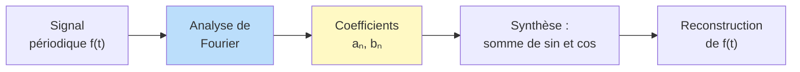
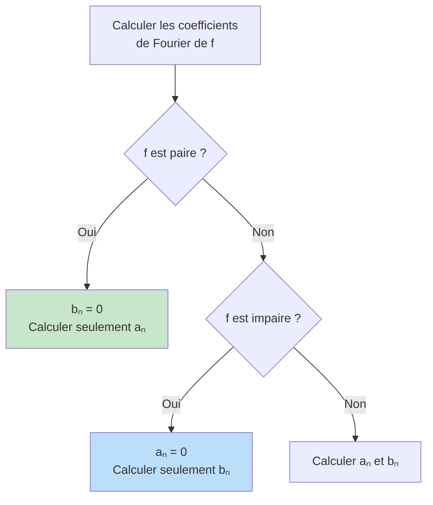

# Séries de Fourier

L'analyse de Fourier décompose une fonction périodique en somme (infinie) de fonctions sinusoïdales. C'est l'un des outils les plus puissants et les plus beaux des mathématiques, avec des applications en physique (ondes, chaleur), traitement du signal, et analyse harmonique.

> [!quote] Prérequis
> [[Intégration]], [[Séries de Fonctions]], [[Espaces Préhilbertiens]], [[Trigonométrie]]


## Intuition

> [!tip] L'idée fondamentale
> Toute fonction périodique "raisonnable" peut s'écrire comme une **superposition d'ondes sinusoïdales** de fréquences multiples. La série de Fourier décompose le signal en ses composantes fréquentielles.




## Fonctions périodiques et espace $L^2$

### Fonctions $T$-périodiques

On travaille avec des fonctions $f : \mathbb{R} \to \mathbb{R}$ (ou $\mathbb{C}$) de période $T > 0$. On note $\omega = \frac{2\pi}{T}$ la pulsation fondamentale.

Par convention, on prend souvent $T = 2\pi$ (i.e. $\omega = 1$).

### Produit scalaire et norme

Sur l'espace des fonctions $2\pi$-périodiques continues par morceaux, on définit :

$$\langle f, g \rangle = \frac{1}{2\pi} \int_0^{2\pi} f(t) \overline{g(t)} \, dt$$

$$\|f\|_2 = \sqrt{\langle f, f \rangle} = \sqrt{\frac{1}{2\pi} \int_0^{2\pi} |f(t)|^2 \, dt}$$

> [!important] Base orthonormale trigonométrique
> La famille $\{1, \cos(nt), \sin(nt)\}_{n \geq 1}$ est **orthogonale** pour ce produit scalaire :
>
> $$\langle \cos(nt), \cos(mt) \rangle = \begin{cases} 0 & \text{si } n \neq m \\ 1/2 & \text{si } n = m \geq 1 \\ 1 & \text{si } n = m = 0 \end{cases}$$
>
> $$\langle \sin(nt), \sin(mt) \rangle = \begin{cases} 0 & \text{si } n \neq m \\ 1/2 & \text{si } n = m \geq 1 \end{cases}$$
>
> $$\langle \cos(nt), \sin(mt) \rangle = 0 \quad \text{toujours}$$

### Base exponentielle

La famille $\{e^{int}\}_{n \in \mathbb{Z}}$ est orthonormale : $\langle e^{int}, e^{imt} \rangle = \delta_{nm}$.


## Coefficients de Fourier

### Coefficients trigonométriques

> [!abstract] Définition
> Soit $f$ une fonction $2\pi$-périodique intégrable. Ses **coefficients de Fourier** sont :
>
> $$a_0(f) = \frac{1}{2\pi} \int_0^{2\pi} f(t) \, dt$$
>
> $$a_n(f) = \frac{1}{\pi} \int_0^{2\pi} f(t) \cos(nt) \, dt \quad (n \geq 1)$$
>
> $$b_n(f) = \frac{1}{\pi} \int_0^{2\pi} f(t) \sin(nt) \, dt \quad (n \geq 1)$$

### Coefficients exponentiels (complexes)

$$c_n(f) = \frac{1}{2\pi} \int_0^{2\pi} f(t) e^{-int} \, dt \quad (n \in \mathbb{Z})$$

**Lien :** $c_0 = a_0$, et pour $n \geq 1$ : $c_n = \frac{a_n - ib_n}{2}$, $c_{-n} = \frac{a_n + ib_n}{2} = \overline{c_n}$ (si $f$ est réelle).

### Série de Fourier

La **série de Fourier** de $f$ est :

$$S_N f(t) = a_0 + \sum_{n=1}^{N} \left[ a_n \cos(nt) + b_n \sin(nt) \right] = \sum_{n=-N}^{N} c_n e^{int}$$

> [!warning] Question fondamentale
> La série de Fourier converge-t-elle ? Et si oui, vers $f$ ?


## Simplifications par parité et symétrie

> [!tip] Exploiter la parité
> - Si $f$ est **paire** : $b_n = 0$ pour tout $n$ (série en cosinus uniquement)
> - Si $f$ est **impaire** : $a_n = 0$ pour tout $n$ (série en sinus uniquement)




## Théorèmes de convergence

### Convergence en moyenne quadratique (toujours)

> [!abstract] Théorème de Parseval
> Si $f$ est continue par morceaux et $2\pi$-périodique :
> $$\|f\|_2^2 = |a_0|^2 + \frac{1}{2} \sum_{n=1}^{+\infty} (a_n^2 + b_n^2) = \sum_{n \in \mathbb{Z}} |c_n|^2$$
>
> Autrement dit : $\|S_N f - f\|_2 \to 0$ (convergence en norme $L^2$).

> [!important] Inégalité de Bessel (avant Parseval)
> $$|a_0|^2 + \frac{1}{2} \sum_{n=1}^{N} (a_n^2 + b_n^2) \leq \|f\|_2^2$$
> Parseval est le passage à la limite dans Bessel.

### Convergence ponctuelle : théorème de Dirichlet

> [!abstract] Théorème de Dirichlet
> Si $f$ est $2\pi$-périodique, **continue par morceaux** et **de classe $C^1$ par morceaux**, alors pour tout $t \in \mathbb{R}$ :
> $$S_N f(t) \xrightarrow[N \to +\infty]{} \frac{f(t^+) + f(t^-)}{2}$$
>
> En particulier, aux points de **continuité** : $S_N f(t) \to f(t)$.

> [!warning] Phénomène de Gibbs
> Aux points de discontinuité, les sommes partielles présentent des oscillations (dépassement d'environ 9%) qui ne disparaissent pas quand $N \to \infty$. La convergence ponctuelle est vers la demi-somme des limites à gauche et à droite, mais la convergence n'est **pas uniforme** au voisinage du saut.

### Convergence normale

> [!abstract] Théorème
> Si $f$ est $C^1$ et $2\pi$-périodique, alors la série de Fourier converge **normalement** (donc uniformément) vers $f$.
>
> Plus généralement, si $f$ est $C^k$, alors $|c_n| = O(1/n^k)$, et la série converge normalement dès que $k \geq 2$.


## Exemples classiques

### Fonction créneau

$$f(t) = \begin{cases} 1 & \text{si } 0 < t < \pi \\ -1 & \text{si } -\pi < t < 0 \end{cases}$$

$f$ est impaire, donc $a_n = 0$. On calcule :

$$b_n = \begin{cases} \frac{4}{n\pi} & \text{si } n \text{ impair} \\ 0 & \text{si } n \text{ pair} \end{cases}$$

$$f(t) = \frac{4}{\pi} \sum_{k=0}^{+\infty} \frac{\sin((2k+1)t)}{2k+1}$$

> [!example] Application : calcul de série
> En évaluant en $t = \pi/2$ : $1 = \frac{4}{\pi}\left(1 - \frac{1}{3} + \frac{1}{5} - \cdots\right)$
>
> D'où la **formule de Leibniz** : $\displaystyle\sum_{k=0}^{+\infty} \frac{(-1)^k}{2k+1} = \frac{\pi}{4}$

### Visualisation animée (Manim)

> [!note] Ce que montre l'animation
> On superpose une à une les harmoniques pour construire la série de Fourier du créneau. La somme partielle $S_N$ part d'une simple sinusoïde ($S_1$) et, à mesure que $N$ augmente, épouse de mieux en mieux le signal carré. On voit aussi naître le **phénomène de Gibbs** : les oscillations près des discontinuités (en $0$ et $\pm\pi$) ne disparaissent jamais, illustrant l'absence de convergence uniforme.

```manim
# Rendu : manimgl fourier_creneau.py SommesPartiellesCreneau
from manimlib import *
import numpy as np


class SommesPartiellesCreneau(Scene):
    def construct(self):
        axes = Axes(x_range=(-PI, PI, PI / 2), y_range=(-1.5, 1.5),
                    height=5, width=12)
        self.add(axes)

        # Somme partielle du créneau : (4/pi) * somme des sin((2k+1)t)/(2k+1)
        def partial_sum(N):
            def s(t):
                return (4 / PI) * sum(np.sin(k * t) / k for k in range(1, N + 1, 2))
            return axes.get_graph(s, color=YELLOW)

        graphe = partial_sum(1)
        label = Tex("S_1").to_corner(UR).set_backstroke()
        self.play(ShowCreation(graphe), Write(label))
        self.wait()

        for N in [3, 5, 11, 25, 51]:
            nouveau = partial_sum(N)
            nouveau_label = Tex(f"S_{{{N}}}").to_corner(UR).set_backstroke()
            self.play(Transform(graphe, nouveau),
                      Transform(label, nouveau_label), run_time=1.2)
            self.wait(0.4)

        note = Tex(r"S_N(t)=\frac{4}{\pi}\sum_{k=0}^{N}\frac{\sin((2k+1)t)}{2k+1}")
        note.to_edge(UP).set_backstroke()
        self.play(Write(note))
        self.wait(2)
```

### Fonction dent de scie

$$f(t) = t \quad \text{sur } ]-\pi, \pi[$$

$f$ est impaire : $a_n = 0$ et $b_n = \frac{2(-1)^{n+1}}{n}$.

$$f(t) = 2\sum_{n=1}^{+\infty} \frac{(-1)^{n+1}}{n} \sin(nt)$$

### Fonction $|t|$ sur $[-\pi, \pi]$

$f$ est paire : $b_n = 0$ et $a_0 = \pi/2$.

$$a_n = \begin{cases} -\frac{4}{n^2 \pi} & \text{si } n \text{ impair} \\ 0 & \text{si } n \text{ pair} \end{cases}$$

$$|t| = \frac{\pi}{2} - \frac{4}{\pi} \sum_{k=0}^{+\infty} \frac{\cos((2k+1)t)}{(2k+1)^2}$$

> [!example] Application (Parseval)
> Par Parseval appliqué à $f(t) = |t|$ :
> $$\frac{\pi^2}{3} = \frac{\pi^2}{4} + \frac{16}{\pi^2} \sum_{k=0}^{+\infty} \frac{1}{(2k+1)^4}$$
>
> D'où : $\displaystyle\sum_{k=0}^{+\infty} \frac{1}{(2k+1)^4} = \frac{\pi^4}{96}$, et on retrouve $\displaystyle\sum_{n=1}^{+\infty} \frac{1}{n^4} = \frac{\pi^4}{90}$.


## Propriétés des coefficients de Fourier

| Propriété de $f$ | Conséquence sur les coefficients |
|---|---|
| $f$ réelle | $c_{-n} = \overline{c_n}$ |
| $f$ paire | $b_n = 0$, $c_{-n} = c_n$ |
| $f$ impaire | $a_n = 0$, $c_{-n} = -c_n$ |
| $f$ de classe $C^k$ | $c_n = o(1/n^k)$ (Riemann-Lebesgue) |
| $f(t+\pi) = -f(t)$ | $a_{2n} = b_{2n} = 0$ (harmoniques impaires) |

> [!abstract] Lemme de Riemann-Lebesgue
> Si $f$ est intégrable, alors $c_n(f) \to 0$ quand $|n| \to +\infty$.
>
> Plus $f$ est régulière, plus la décroissance est rapide.


## Dérivation et intégration

### Dérivation

Si $f$ est $C^1$ et $2\pi$-périodique, les coefficients de $f'$ sont :

$$c_n(f') = in \cdot c_n(f)$$

(Dériver "en fréquence" = multiplier par $in$.)

### Intégration

$$c_n\left(\int_0^t f(s) \, ds - a_0 t\right) = \frac{c_n(f)}{in} \quad (n \neq 0)$$


## Exercices types

> [!example] Exercice 1 — Calcul de coefficients
> Calculer la série de Fourier de $f(t) = t^2$ sur $[-\pi, \pi]$.
>
> **Solution :** $f$ paire, donc $b_n = 0$. On trouve $a_0 = \pi^2/3$ et $a_n = \frac{4(-1)^n}{n^2}$.
>
> $$t^2 = \frac{\pi^2}{3} + 4\sum_{n=1}^{+\infty} \frac{(-1)^n}{n^2} \cos(nt)$$
>
> En $t = \pi$ : $\pi^2 = \frac{\pi^2}{3} + 4\sum \frac{1}{n^2}$, d'où $\sum_{n=1}^{\infty} \frac{1}{n^2} = \frac{\pi^2}{6}$ (problème de Bâle).

> [!example] Exercice 2 — Parseval
> En appliquant Parseval à $f(t) = t^2$, calculer $\sum \frac{1}{n^4}$.
>
> **Solution :** $\|f\|_2^2 = \frac{1}{2\pi}\int_{-\pi}^{\pi} t^4 \, dt = \frac{\pi^4}{5}$.
>
> Parseval : $\frac{\pi^4}{9} + \frac{1}{2} \sum \frac{16}{n^4} = \frac{\pi^4}{5}$, d'où $\sum \frac{1}{n^4} = \frac{\pi^4}{90}$.

> [!example] Exercice 3 — Convergence
> Montrer que la série de Fourier du créneau converge en tout point de continuité mais pas uniformément.
>
> **Idée :** Dirichlet s'applique ($C^1$ par morceaux). Pas de convergence uniforme car $f$ est discontinue (Gibbs).


## À retenir

> [!important] Les points clés
> 1. Les coefficients de Fourier mesurent le "poids" de chaque fréquence dans le signal
> 2. **Parseval** = théorème de Pythagore en dimension infinie : $\|f\|^2 = \sum |c_n|^2$
> 3. **Dirichlet** : convergence ponctuelle vers $\frac{f(t^+)+f(t^-)}{2}$
> 4. Plus $f$ est régulière, plus les $c_n$ décroissent vite
> 5. Les séries de Fourier permettent de calculer des sommes de séries numériques ($\zeta(2), \zeta(4)$, etc.)
