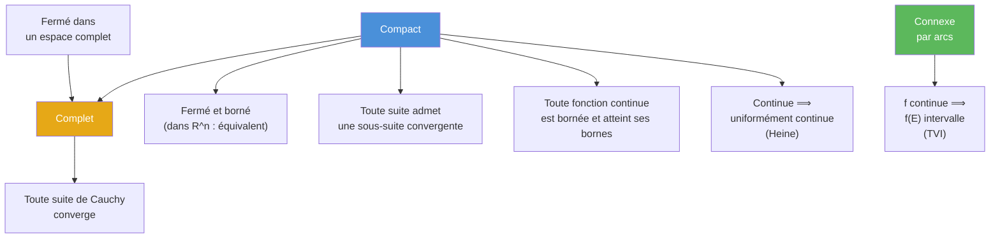

# Topologie des espaces métriques (Math Spé / MP)

## Introduction

La topologie fournit le cadre rigoureux pour parler de « proximité », de convergence et de continuité, au-delà de $\mathbb{R}$. En prépa, on travaille dans les **espaces métriques**, qui généralisent $\mathbb{R}^n$ muni de ses normes. Ce chapitre est fondamental : il sous-tend l'analyse fonctionnelle, les équations différentielles, et la théorie de l'intégration.

## 1. Espaces métriques

### 1.1 Distance

> [!abstract] Définition
> Soit $E$ un ensemble. Une **distance** (ou métrique) sur $E$ est une application $d : E \times E \to \mathbb{R}_+$ vérifiant pour tous $x, y, z \in E$ :
> 1. **Séparation** : $d(x, y) = 0 \iff x = y$
> 2. **Symétrie** : $d(x, y) = d(y, x)$
> 3. **Inégalité triangulaire** : $d(x, z) \leq d(x, y) + d(y, z)$
>
> Le couple $(E, d)$ est un **espace métrique**.

### 1.2 Exemples fondamentaux

| Espace | Distance | Notation |
|---|---|---|
| $\mathbb{R}^n$ euclidien | $d_2(x,y) = \sqrt{\sum (x_i - y_i)^2}$ | $({\mathbb{R}^n}, d_2)$ |
| $\mathbb{R}^n$ norme sup | $d_\infty(x,y) = \max_i |x_i - y_i|$ | $({\mathbb{R}^n}, d_\infty)$ |
| $\mathcal{C}([a,b], \mathbb{R})$ | $d_\infty(f,g) = \sup_{t \in [a,b]} |f(t) - g(t)|$ | Convergence uniforme |
| $\mathcal{C}([a,b], \mathbb{R})$ | $d_1(f,g) = \int_a^b |f(t) - g(t)|\,dt$ | Convergence en moyenne |

> [!tip] Remarque
> Tout espace vectoriel normé $(E, \|\cdot\|)$ est un espace métrique pour $d(x,y) = \|x - y\|$. Mais il existe des espaces métriques qui ne proviennent pas d'une norme (par exemple la distance discrète).

### 1.3 Distance discrète

> [!example] Exemple
> La **distance discrète** sur un ensemble $E$ quelconque : $d(x,y) = 0$ si $x = y$, $d(x,y) = 1$ sinon. Elle vérifie les trois axiomes. Tout sous-ensemble est à la fois ouvert et fermé.

## 2. Boules, voisinages, ouverts, fermés

### 2.1 Boules

> [!abstract] Définition
> - **Boule ouverte** : $B(a, r) = \{x \in E : d(x, a) < r\}$
> - **Boule fermée** : $\overline{B}(a, r) = \{x \in E : d(x, a) \leq r\}$
> - **Sphère** : $S(a, r) = \{x \in E : d(x, a) = r\}$

### 2.2 Ouverts

> [!abstract] Définition
> $U \subset E$ est un **ouvert** si pour tout $x \in U$, il existe $r > 0$ tel que $B(x, r) \subset U$.

> [!abstract] Propriétés des ouverts
> 1. $\varnothing$ et $E$ sont ouverts.
> 2. Toute **union** (même infinie) d'ouverts est un ouvert.
> 3. Toute **intersection finie** d'ouverts est un ouvert.
> 4. Les boules ouvertes sont des ouverts.

> [!warning] Attention
> Une intersection **infinie** d'ouverts n'est pas nécessairement ouverte.
> Exemple : $\displaystyle\bigcap_{n=1}^{+\infty} \left]-\frac{1}{n}, \frac{1}{n}\right[ = \{0\}$, qui n'est pas ouvert dans $\mathbb{R}$.

### 2.3 Fermés

> [!abstract] Définition
> $F \subset E$ est un **fermé** si $E \setminus F$ est un ouvert.

> [!abstract] Propriétés des fermés
> 1. $\varnothing$ et $E$ sont fermés.
> 2. Toute **intersection** (même infinie) de fermés est un fermé.
> 3. Toute **union finie** de fermés est un fermé.

### 2.4 Adhérence, intérieur, frontière

> [!abstract] Définitions
> - L'**adhérence** $\overline{A}$ est le plus petit fermé contenant $A$ :
>   $$\overline{A} = \{x \in E : \forall r > 0,\, B(x, r) \cap A \neq \varnothing\}$$
> - L'**intérieur** $\mathring{A}$ est le plus grand ouvert contenu dans $A$.
> - La **frontière** $\partial A = \overline{A} \setminus \mathring{A}$.
> - $A$ est **dense** dans $E$ si $\overline{A} = E$.

> [!example] Exemples dans $\mathbb{R}$
> - $\overline{\mathbb{Q}} = \mathbb{R}$ (les rationnels sont denses dans $\mathbb{R}$)
> - $\mathring{\mathbb{Q}} = \varnothing$
> - $\overline{]0,1[} = [0,1]$, $\partial\,]0,1[ = \{0, 1\}$

## 3. Suites dans un espace métrique

### 3.1 Convergence

> [!abstract] Définition
> $(x_n)$ **converge** vers $\ell \in E$ si $d(x_n, \ell) \to 0$, i.e. :
> $$\forall \varepsilon > 0,\, \exists N \in \mathbb{N},\, \forall n \geq N, \quad d(x_n, \ell) < \varepsilon$$

> [!important] Unicité de la limite
> Dans un espace métrique, la limite est unique (conséquence de la séparation).

### 3.2 Valeurs d'adhérence

> [!abstract] Définition
> $\ell$ est une **valeur d'adhérence** de $(x_n)$ s'il existe une sous-suite $(x_{\varphi(n)})$ convergeant vers $\ell$.

### 3.3 Caractérisation séquentielle des fermés

> [!abstract] Théorème
> $F \subset E$ est fermé si et seulement si toute suite d'éléments de $F$ qui converge dans $E$ a sa limite dans $F$.

**Preuve.**

$(\Rightarrow)$ Soit $(x_n) \subset F$ avec $x_n \to \ell$. Si $\ell \notin F$, alors $\ell \in E \setminus F$ qui est ouvert, donc il existe $r > 0$ avec $B(\ell, r) \subset E \setminus F$. Mais $x_n \to \ell$ implique $x_n \in B(\ell, r)$ pour $n$ assez grand, contradiction avec $x_n \in F$.

$(\Leftarrow)$ Montrons que $E \setminus F$ est ouvert. Si $x \in E \setminus F$ et qu'il n'existe pas de boule $B(x, r) \subset E \setminus F$, alors pour tout $n$, il existe $x_n \in B(x, 1/n) \cap F$. Alors $x_n \to x$ et $x_n \in F$, donc $x \in F$ par hypothèse, contradiction. $\blacksquare$

### 3.4 Caractérisation séquentielle de l'adhérence

> [!abstract] Proposition
> $x \in \overline{A}$ si et seulement s'il existe une suite $(a_n) \subset A$ telle que $a_n \to x$.

## 4. Continuité

### 4.1 Définition

> [!abstract] Définition
> Soient $(E, d_E)$ et $(F, d_F)$ deux espaces métriques. $f : E \to F$ est **continue en $a \in E$** si :
> $$\forall \varepsilon > 0,\, \exists \delta > 0,\, \forall x \in E, \quad d_E(x, a) < \delta \implies d_F(f(x), f(a)) < \varepsilon$$

### 4.2 Caractérisation séquentielle

> [!abstract] Théorème
> $f : E \to F$ est continue en $a$ si et seulement si pour toute suite $(x_n)$ convergeant vers $a$ dans $E$, la suite $(f(x_n))$ converge vers $f(a)$ dans $F$.

> [!tip] Utilité
> La caractérisation séquentielle est souvent **plus facile à utiliser** que la définition $\varepsilon$-$\delta$. Elle est aussi très utile pour montrer qu'une fonction **n'est pas** continue (il suffit d'exhiber une suite).

### 4.3 Caractérisation topologique

> [!abstract] Théorème
> $f : E \to F$ est continue (sur tout $E$) si et seulement si l'image réciproque de tout ouvert de $F$ est un ouvert de $E$.
>
> Équivalemment : l'image réciproque de tout fermé est un fermé.

## 5. Continuité uniforme et fonctions lipschitziennes

### 5.1 Continuité uniforme

> [!abstract] Définition
> $f : E \to F$ est **uniformément continue** si :
> $$\forall \varepsilon > 0,\, \exists \delta > 0,\, \forall x, y \in E, \quad d_E(x, y) < \delta \implies d_F(f(x), f(y)) < \varepsilon$$

> [!warning] Différence avec la continuité simple
> La continuité simple dit : « pour chaque $a$, il existe $\delta$ (qui peut dépendre de $a$) ». La continuité **uniforme** dit : « il existe $\delta$ qui marche pour **tous** les $a$ en même temps ».

### 5.2 Fonctions lipschitziennes

> [!abstract] Définition
> $f : E \to F$ est **$k$-lipschitzienne** (avec $k \geq 0$) si :
> $$\forall x, y \in E, \quad d_F(f(x), f(y)) \leq k\,d_E(x, y)$$

> [!important] Implications
> $$\text{lipschitzienne} \implies \text{uniformément continue} \implies \text{continue}$$
> Les réciproques sont fausses en général. Exemple : $\sqrt{x}$ est uniformément continue sur $[0, +\infty[$ mais pas lipschitzienne.

## 6. Compacité

### 6.1 Définition par recouvrement ouvert

> [!abstract] Définition
> $(E, d)$ est **compact** si de tout recouvrement ouvert de $E$, on peut extraire un sous-recouvrement **fini**.
>
> Formellement : si $E \subset \bigcup_{i \in I} U_i$ avec les $U_i$ ouverts, alors il existe $i_1, \ldots, i_n$ tels que $E \subset U_{i_1} \cup \cdots \cup U_{i_n}$.

### 6.2 Caractérisation séquentielle (Bolzano-Weierstrass)

> [!abstract] Théorème (Bolzano-Weierstrass)
> Dans un espace métrique, $K$ est compact si et seulement si toute suite d'éléments de $K$ admet une **sous-suite convergente** (vers un élément de $K$).

> [!tip] En pratique
> C'est cette caractérisation séquentielle qu'on utilise le plus souvent en prépa.

### 6.3 Théorème de Heine-Borel

> [!abstract] Théorème (Heine-Borel)
> Dans $\mathbb{R}^n$ (muni d'une norme quelconque) :
> $$K \text{ compact} \iff K \text{ fermé et borné}$$

> [!warning] Spécificité de la dimension finie
> Ce théorème est **faux en dimension infinie**. Par exemple, dans $\ell^2$, la boule unité fermée est fermée et bornée mais **pas** compacte.

### 6.4 Propriétés des compacts

> [!abstract] Théorème (Image continue d'un compact)
> Si $f : E \to F$ est continue et $K \subset E$ est compact, alors $f(K)$ est compact.

**Conséquences immédiates :**

> [!important] Théorème des bornes atteintes
> Si $f : K \to \mathbb{R}$ est continue et $K$ est compact non vide, alors $f$ est **bornée** et atteint ses bornes. Il existe $a, b \in K$ tels que $f(a) = \min_K f$ et $f(b) = \max_K f$.

> [!abstract] Théorème de Heine
> Si $f : K \to F$ est continue et $K$ est compact, alors $f$ est **uniformément continue**.

**Esquisse de preuve du théorème de Heine.** Par l'absurde. Si $f$ n'est pas uniformément continue, il existe $\varepsilon_0 > 0$ et des suites $(x_n), (y_n)$ dans $K$ avec $d(x_n, y_n) < 1/n$ mais $d(f(x_n), f(y_n)) \geq \varepsilon_0$. Par compacité (Bolzano-Weierstrass), on extrait une sous-suite $x_{\varphi(n)} \to \ell$. Alors $y_{\varphi(n)} \to \ell$ aussi (car $d(x_{\varphi(n)}, y_{\varphi(n)}) \to 0$). Par continuité de $f$ en $\ell$ : $f(x_{\varphi(n)}) \to f(\ell)$ et $f(y_{\varphi(n)}) \to f(\ell)$, donc $d(f(x_{\varphi(n)}), f(y_{\varphi(n)})) \to 0$. Contradiction avec $\geq \varepsilon_0$. $\blacksquare$

## 7. Connexité par arcs

> [!abstract] Définition
> $(E, d)$ est **connexe par arcs** si pour tous $x, y \in E$, il existe un **chemin continu** $\gamma : [0, 1] \to E$ tel que $\gamma(0) = x$ et $\gamma(1) = y$.

> [!important] Propriétés
> - Un ouvert connexe par arcs de $\mathbb{R}^n$ est simplement appelé **domaine**.
> - Les **convexes** sont connexes par arcs (chemin : le segment $[x, y]$).
> - L'image continue d'un connexe par arcs est connexe par arcs.
> - **Théorème des valeurs intermédiaires** (généralisé) : si $f : E \to \mathbb{R}$ est continue et $E$ connexe par arcs, alors $f(E)$ est un intervalle.

## 8. Complétude

### 8.1 Suites de Cauchy

> [!abstract] Définition
> Une suite $(x_n)$ dans $(E, d)$ est une **suite de Cauchy** si :
> $$\forall \varepsilon > 0,\, \exists N \in \mathbb{N},\, \forall m, n \geq N, \quad d(x_m, x_n) < \varepsilon$$

> [!important] Propriétés
> - Toute suite convergente est de Cauchy.
> - La réciproque est **fausse** en général (mais vraie dans les espaces complets).
> - Toute suite de Cauchy est bornée.
> - Si une suite de Cauchy admet une valeur d'adhérence, alors elle converge.

### 8.2 Espaces complets

> [!abstract] Définition
> Un espace métrique $(E, d)$ est **complet** si toute suite de Cauchy dans $E$ converge dans $E$.

> [!example] Exemples
> - $(\mathbb{R}, |\cdot|)$ est complet (propriété fondamentale de $\mathbb{R}$).
> - $(\mathbb{R}^n, \|\cdot\|)$ est complet (pour toute norme).
> - $(\mathcal{C}([a,b], \mathbb{R}), d_\infty)$ est complet : une suite de Cauchy pour la norme sup converge uniformément.
> - $(\mathbb{Q}, |\cdot|)$ n'est **pas** complet.

> [!important] Propriétés
> - Un compact est complet (et borné).
> - Un sous-espace fermé d'un espace complet est complet.
> - Un sous-espace complet d'un espace métrique est fermé.

### 8.3 Théorème du point fixe de Banach

> [!abstract] Théorème (Point fixe de Banach / Contraction)
> Soit $(E, d)$ un espace métrique **complet** et $f : E \to E$ une application **contractante**, i.e., il existe $k \in [0, 1[$ tel que :
> $$\forall x, y \in E, \quad d(f(x), f(y)) \leq k\,d(x, y)$$
> Alors :
> 1. $f$ admet un **unique** point fixe $\ell \in E$ : $f(\ell) = \ell$.
> 2. Pour tout $x_0 \in E$, la suite $x_{n+1} = f(x_n)$ converge vers $\ell$.
> 3. **Estimation d'erreur** : $d(x_n, \ell) \leq \dfrac{k^n}{1 - k}\,d(x_0, x_1)$.

**Preuve.**

*Existence et convergence.* Montrons que $(x_n)$ est de Cauchy. On a $d(x_{n+1}, x_n) \leq k\,d(x_n, x_{n-1}) \leq \cdots \leq k^n\,d(x_1, x_0)$. Pour $m > n$ :

$$d(x_m, x_n) \leq \sum_{j=n}^{m-1} d(x_{j+1}, x_j) \leq d(x_1, x_0)\sum_{j=n}^{m-1} k^j \leq \frac{k^n}{1-k}\,d(x_1, x_0) \to 0$$

Comme $E$ est complet, $(x_n)$ converge vers un $\ell \in E$.

*Point fixe.* Par continuité de $f$ (elle est lipschitzienne) : $f(\ell) = f(\lim x_n) = \lim f(x_n) = \lim x_{n+1} = \ell$.

*Unicité.* Si $f(\ell) = \ell$ et $f(\ell') = \ell'$, alors $d(\ell, \ell') = d(f(\ell), f(\ell')) \leq k\,d(\ell, \ell')$, ce qui impose $d(\ell, \ell') = 0$ car $k < 1$. $\blacksquare$

> [!example] Application : méthode de Newton simplifiée
> Pour résoudre $g(x) = 0$, on réécrit sous la forme $x = \varphi(x)$ avec $|\varphi'(x)| < 1$ sur un intervalle contenant la racine, puis on itère $x_{n+1} = \varphi(x_n)$.
>
> Exemple : résoudre $x = \cos(x)$. On pose $\varphi(x) = \cos(x)$. On a $|\varphi'(x)| = |\sin(x)| \leq \sin(1) \approx 0.84 < 1$ sur $[0, 1]$. Le théorème de Banach garantit l'existence d'un unique point fixe et la convergence de la suite itérée.

## 9. Relations entre les propriétés topologiques

## 10. Exercices types corrigés

### Exercice 1 : Ouverts et fermés

> [!example] Énoncé
> Dans $(\mathbb{R}^2, d_2)$, montrer que $A = \{(x, y) : x^2 + y^2 < 1\}$ est ouvert et que $B = \{(x,y) : x^2 + y^2 \leq 1\}$ est fermé.

**Solution.**

*$A$ est ouvert.* Soit $(x_0, y_0) \in A$, donc $r_0 = \sqrt{x_0^2 + y_0^2} < 1$. Posons $\varepsilon = 1 - r_0 > 0$. Pour tout $(x,y) \in B((x_0,y_0), \varepsilon)$ :

$$\sqrt{x^2 + y^2} \leq \sqrt{x_0^2 + y_0^2} + \sqrt{(x-x_0)^2 + (y-y_0)^2} < r_0 + \varepsilon = 1$$

(par l'inégalité triangulaire), donc $(x,y) \in A$. Ainsi $B((x_0,y_0), \varepsilon) \subset A$.

*$B$ est fermé.* On montre que $\mathbb{R}^2 \setminus B = \{(x,y) : x^2 + y^2 > 1\}$ est ouvert par un argument similaire. Alternativement : $B = f^{-1}(]-\infty, 1])$ où $f(x,y) = x^2 + y^2$ est continue, et $]-\infty, 1]$ est fermé, donc $B$ est fermé.

### Exercice 2 : Caractérisation séquentielle

> [!example] Énoncé
> Montrer que $\mathbb{Q}$ n'est ni ouvert ni fermé dans $\mathbb{R}$.

**Solution.**

*$\mathbb{Q}$ n'est pas ouvert.* Pour tout $q \in \mathbb{Q}$ et tout $r > 0$, l'intervalle $]q-r, q+r[$ contient des irrationnels (densité de $\mathbb{R} \setminus \mathbb{Q}$), donc $B(q, r) \not\subset \mathbb{Q}$.

*$\mathbb{Q}$ n'est pas fermé.* Il existe des suites de rationnels qui convergent vers un irrationnel (par exemple $q_n$ les troncatures décimales de $\sqrt{2}$ : $1, 1.4, 1.41, \ldots$). Donc $\mathbb{Q}$ ne contient pas toutes ses valeurs d'adhérence.

### Exercice 3 : Complétude

> [!example] Énoncé
> Montrer que $(\mathcal{C}([0,1], \mathbb{R}), \|\cdot\|_\infty)$ est complet.

**Solution.**

Soit $(f_n)$ une suite de Cauchy pour $\|\cdot\|_\infty$.

**Étape 1** : Pour chaque $t \in [0,1]$, $(f_n(t))$ est de Cauchy dans $\mathbb{R}$ (car $|f_n(t) - f_m(t)| \leq \|f_n - f_m\|_\infty$). Comme $\mathbb{R}$ est complet, $f_n(t)$ converge. On pose $f(t) = \lim_n f_n(t)$.

**Étape 2** : Montrons que $f_n \to f$ uniformément. Soit $\varepsilon > 0$. Il existe $N$ tel que pour $m, n \geq N$ : $\|f_n - f_m\|_\infty < \varepsilon$. En faisant $m \to +\infty$ dans $|f_n(t) - f_m(t)| < \varepsilon$ (pour tout $t$), on obtient $|f_n(t) - f(t)| \leq \varepsilon$ pour tout $t$ et tout $n \geq N$. Donc $\|f_n - f\|_\infty \leq \varepsilon$.

**Étape 3** : $f$ est continue car elle est limite uniforme de fonctions continues. $\blacksquare$

### Exercice 4 : Théorème du point fixe

> [!example] Énoncé
> Soit $f : [0,1] \to [0,1]$ de classe $\mathcal{C}^1$ avec $|f'(x)| \leq k < 1$ pour tout $x \in [0,1]$. Montrer que $f$ admet un unique point fixe.

**Solution.**

$[0,1]$ est fermé dans $\mathbb{R}$ complet, donc complet. $f$ est $k$-lipschitzienne avec $k < 1$ (par le théorème des accroissements finis : $|f(x) - f(y)| \leq k|x-y|$), et $f([0,1]) \subset [0,1]$.

Par le théorème du point fixe de Banach, $f$ admet un unique point fixe dans $[0,1]$.

De plus, pour tout $x_0 \in [0,1]$, la suite $x_{n+1} = f(x_n)$ converge vers ce point fixe avec $|x_n - \ell| \leq \dfrac{k^n}{1-k}|f(x_0) - x_0|$.

### Exercice 5 : Compacité et continuité

> [!example] Énoncé
> Soit $f : \mathbb{R} \to \mathbb{R}$ continue telle que $\lim_{|x| \to +\infty} f(x) = +\infty$. Montrer que $f$ atteint son minimum.

**Solution.**

Comme $f(x) \to +\infty$ quand $|x| \to +\infty$, il existe $R > 0$ tel que $f(x) \geq f(0)$ pour tout $|x| \geq R$.

Le minimum de $f$ sur $\mathbb{R}$ est donc le même que le minimum de $f$ sur $[-R, R]$.

Or $[-R, R]$ est compact (fermé borné dans $\mathbb{R}$) et $f$ est continue, donc par le théorème des bornes atteintes, $f$ atteint son minimum sur $[-R, R]$, disons en $a \in [-R, R]$.

Pour tout $x \in \mathbb{R}$ : si $|x| \leq R$, $f(x) \geq f(a)$ par définition. Si $|x| > R$, $f(x) \geq f(0) \geq f(a)$. Donc $a$ est un minimum global. $\blacksquare$

### Exercice 6 : Application de Heine

> [!example] Énoncé
> Montrer que $f(x) = \sqrt{x}$ est uniformément continue sur $[0, +\infty[$.

**Solution.**

**Sur $[0, 1]$** : $[0,1]$ est compact et $f$ y est continue, donc uniformément continue par le théorème de Heine.

**Sur $[1, +\infty[$** : pour $x, y \geq 1$, $|\sqrt{x} - \sqrt{y}| = \dfrac{|x-y|}{\sqrt{x}+\sqrt{y}} \leq \dfrac{|x-y|}{2}$, donc $f$ est $\frac{1}{2}$-lipschitzienne sur $[1, +\infty[$, a fortiori uniformément continue.

**Recollement** : soit $\varepsilon > 0$. Il existe $\delta_1 > 0$ tel que pour $x, y \in [0,1]$ avec $|x-y| < \delta_1$, $|\sqrt{x}-\sqrt{y}| < \varepsilon$. Sur $[1, +\infty[$, $\delta_2 = 2\varepsilon$ convient. Posons $\delta = \min(\delta_1, \delta_2, 1)$.

Pour $x, y \in [0, +\infty[$ avec $|x-y| < \delta$ : si les deux sont dans $[0,1]$ ou les deux dans $[1, +\infty[$, c'est traité. Si l'un est dans $[0,1]$ et l'autre dans $[1, +\infty[$, alors $|x-y| < 1$ force les deux dans $[0, 2]$ qui est compact, et on conclut de même. $\blacksquare$

## Résumé des implications

| Propriété | Implique |
|---|---|
| Compact | Complet, fermé, borné, séquentiellement compact |
| Complet + borné (dim. finie) | Compact (si fermé) |
| Lipschitzienne | Uniformément continue |
| Uniformément continue | Continue |
| Continue sur compact | Uniformément continue (Heine) |
| Continue sur compact vers $\mathbb{R}$ | Bornée et atteint ses bornes |
| Contraction sur espace complet | Unique point fixe |

*Voir aussi : [[Fonctions de Plusieurs Variables]], [[Probabilités Prépa]], [[Intégrales Généralisées]]*
