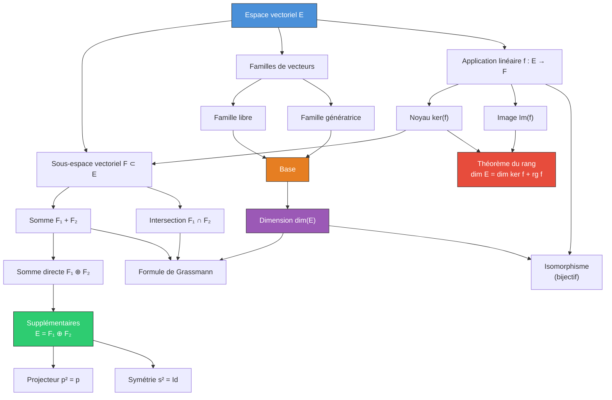

# Algèbre Linéaire

L'algèbre linéaire constitue le socle fondamental des mathématiques de MPSI. Elle fournit un cadre abstrait et puissant pour l'étude des systèmes linéaires, de la géométrie et de l'analyse.

> [!abstract] Programme
> Ce chapitre couvre : espaces vectoriels, sous-espaces vectoriels, bases et dimension, applications linéaires, théorème du rang, somme directe et supplémentaires, projecteurs et symétries.

## 1. Espaces vectoriels

### 1.1 Définition axiomatique

> [!abstract] Définition — Espace vectoriel
> Soit $K$ un corps (typiquement $\mathbb{R}$ ou $\mathbb{C}$). Un **$K$-espace vectoriel** est un ensemble $E$ muni de deux lois :
> - une loi interne $+ : E \times E \to E$ (addition)
> - une loi externe $\cdot : K \times E \to E$ (multiplication scalaire)
>
> vérifiant les axiomes suivants pour tous $u, v, w \in E$ et $\lambda, \mu \in K$ :
>
> **(A1)** $(u + v) + w = u + (v + w)$ (associativité)
> **(A2)** $u + v = v + u$ (commutativité)
> **(A3)** $\exists\, 0_E \in E,\; u + 0_E = u$ (élément neutre)
> **(A4)** $\exists\, (-u) \in E,\; u + (-u) = 0_E$ (symétrique)
> **(S1)** $\lambda \cdot (\mu \cdot u) = (\lambda \mu) \cdot u$
> **(S2)** $1_K \cdot u = u$
> **(D1)** $\lambda \cdot (u + v) = \lambda \cdot u + \lambda \cdot v$
> **(D2)** $(\lambda + \mu) \cdot u = \lambda \cdot u + \mu \cdot u$

### 1.2 Exemples fondamentaux

| Espace | Corps | Description |
|--------|-------|-------------|
| $\mathbb{R}^n$ | $\mathbb{R}$ | $n$-uplets de réels |
| $K[X]$ | $K$ | Polynômes à coefficients dans $K$ |
| $K_n[X]$ | $K$ | Polynômes de degré $\leq n$ |
| $\mathcal{M}_{n,p}(K)$ | $K$ | Matrices $n \times p$ |
| $\mathcal{F}(E, K)$ | $K$ | Fonctions de $E$ dans $K$ |
| $\mathcal{C}^0([a,b], \mathbb{R})$ | $\mathbb{R}$ | Fonctions continues sur $[a,b]$ |

> [!example] Exemple
> L'espace $\mathbb{R}^3$ est un $\mathbb{R}$-espace vectoriel avec les opérations :
> $$(x_1, y_1, z_1) + (x_2, y_2, z_2) = (x_1 + x_2, y_1 + y_2, z_1 + z_2)$$
> $$\lambda \cdot (x, y, z) = (\lambda x, \lambda y, \lambda z)$$

> [!warning] Attention
> $\mathbb{R}$ est un $\mathbb{Q}$-espace vectoriel (de dimension infinie !), mais $\mathbb{Q}$ n'est **pas** un $\mathbb{R}$-espace vectoriel (la multiplication d'un rationnel par un irrationnel sort de $\mathbb{Q}$).

### 1.3 Propriétés élémentaires

Pour tout espace vectoriel $E$ sur $K$ :

- $0_K \cdot u = 0_E$ pour tout $u \in E$
- $\lambda \cdot 0_E = 0_E$ pour tout $\lambda \in K$
- $(-1) \cdot u = -u$
- $\lambda \cdot u = 0_E \implies \lambda = 0_K$ ou $u = 0_E$

## 2. Sous-espaces vectoriels

### 2.1 Définition et caractérisation

> [!abstract] Définition — Sous-espace vectoriel
> Soit $E$ un $K$-espace vectoriel. Un sous-ensemble $F \subset E$ est un **sous-espace vectoriel** (sev) de $E$ si :
> 1. $F \neq \varnothing$ (en pratique, $0_E \in F$)
> 2. $F$ est stable par combinaison linéaire : $\forall\, u, v \in F,\; \forall\, \lambda, \mu \in K,\; \lambda u + \mu v \in F$

> [!tip] Caractérisation pratique (en une condition)
> $F$ est un sev de $E$ si et seulement si :
> - $F \neq \varnothing$
> - $\forall\, (u, v) \in F^2,\; \forall\, \lambda \in K,\; u + \lambda v \in F$

### 2.2 Opérations sur les sous-espaces vectoriels

> [!abstract] Théorème — Intersection de sev
> L'intersection d'une famille quelconque de sous-espaces vectoriels de $E$ est un sous-espace vectoriel de $E$.

> [!warning] Attention
> La **réunion** de deux sev n'est en général **pas** un sev. Par exemple, dans $\mathbb{R}^2$, l'axe des abscisses $\cup$ l'axe des ordonnées n'est pas un sev (le vecteur $(1,0) + (0,1) = (1,1)$ n'y appartient pas).

**Sous-espace engendré.** Soit $S \subset E$ une partie. Le sous-espace vectoriel engendré par $S$ est :
$$\text{Vect}(S) = \bigcap_{\substack{F \text{ sev de } E \\ S \subset F}} F = \left\{ \sum_{i=1}^{p} \lambda_i s_i \;\middle|\; p \in \mathbb{N}^*,\; \lambda_i \in K,\; s_i \in S \right\}$$

### 2.3 Somme de sous-espaces vectoriels

> [!abstract] Définition — Somme
> Soient $F_1, F_2$ deux sev de $E$. La **somme** $F_1 + F_2$ est :
> $$F_1 + F_2 = \{u_1 + u_2 \mid u_1 \in F_1,\; u_2 \in F_2\}$$
> C'est le plus petit sev contenant $F_1$ et $F_2$.

> [!abstract] Formule de Grassmann
> $$\dim(F_1 + F_2) = \dim(F_1) + \dim(F_2) - \dim(F_1 \cap F_2)$$

## 3. Familles de vecteurs

### 3.1 Combinaisons linéaires

Une **combinaison linéaire** des vecteurs $v_1, \ldots, v_p$ est un vecteur de la forme $\lambda_1 v_1 + \cdots + \lambda_p v_p$ avec $\lambda_i \in K$.

### 3.2 Famille libre

> [!abstract] Définition — Famille libre
> Une famille $(v_1, \ldots, v_p)$ de vecteurs de $E$ est **libre** (ou **linéairement indépendante**) si :
> $$\lambda_1 v_1 + \cdots + \lambda_p v_p = 0_E \implies \lambda_1 = \cdots = \lambda_p = 0$$

### 3.3 Famille génératrice

> [!abstract] Définition — Famille génératrice
> $(v_1, \ldots, v_p)$ est **génératrice** de $E$ si $\text{Vect}(v_1, \ldots, v_p) = E$, i.e. tout vecteur de $E$ s'écrit comme combinaison linéaire des $v_i$.

### 3.4 Base

> [!abstract] Définition — Base
> Une **base** de $E$ est une famille à la fois libre et génératrice. Tout vecteur $u \in E$ s'écrit alors de manière **unique** :
> $$u = \lambda_1 v_1 + \cdots + \lambda_n v_n$$
> Les scalaires $\lambda_1, \ldots, \lambda_n$ sont les **coordonnées** de $u$ dans la base $(v_1, \ldots, v_n)$.

> [!example] Exemples de bases
> - **Base canonique** de $\mathbb{R}^n$ : $e_1 = (1, 0, \ldots, 0)$, ..., $e_n = (0, \ldots, 0, 1)$
> - **Base canonique** de $K_n[X]$ : $(1, X, X^2, \ldots, X^n)$ — dimension $n+1$
> - $K[X]$ admet la base $(1, X, X^2, \ldots)$ — dimension infinie

## 4. Dimension

### 4.1 Théorème fondamental

> [!abstract] Théorème — Invariance de la dimension
> Toutes les bases d'un espace vectoriel de dimension finie ont le même nombre d'éléments. Ce nombre s'appelle la **dimension** de $E$, notée $\dim(E)$ ou $\dim_K(E)$.

### 4.2 Résultats clés

Soit $E$ un $K$-espace vectoriel de dimension $n$.

| Propriété | Énoncé |
|-----------|--------|
| Famille libre | Au plus $n$ vecteurs |
| Famille génératrice | Au moins $n$ vecteurs |
| Base | Exactement $n$ vecteurs |
| Libre de $n$ vecteurs | Automatiquement base |
| Génératrice de $n$ vecteurs | Automatiquement base |

### 4.3 Théorème de la base incomplète

> [!abstract] Théorème de la base incomplète
> Soit $E$ un espace vectoriel de dimension finie $n$.
> 1. Toute famille **libre** peut être **complétée** en une base de $E$.
> 2. De toute famille **génératrice**, on peut **extraire** une base de $E$.

> [!tip] Esquisse de preuve (complétion)
> Soit $(v_1, \ldots, v_p)$ une famille libre avec $p < n$. Si elle n'est pas génératrice, $\exists\, v_{p+1} \in E \setminus \text{Vect}(v_1, \ldots, v_p)$. Alors $(v_1, \ldots, v_{p+1})$ est libre. On itère. En au plus $n - p$ étapes, on obtient une famille libre de $n$ vecteurs, donc une base.

### 4.4 Dimension d'un sous-espace vectoriel

> [!abstract] Théorème
> Soit $F$ un sev de $E$ avec $\dim(E) = n$ :
> - $\dim(F) \leq n$
> - $\dim(F) = n \iff F = E$
> - $\dim(F) = 0 \iff F = \{0_E\}$

## 5. Applications linéaires

### 5.1 Définition

> [!abstract] Définition — Application linéaire
> Soient $E, F$ deux $K$-espaces vectoriels. Une application $f : E \to F$ est **linéaire** si :
> $$\forall\, u, v \in E,\; \forall\, \lambda \in K,\quad f(\lambda u + v) = \lambda f(u) + f(v)$$

Notations : $\mathcal{L}(E, F)$ désigne l'ensemble des applications linéaires de $E$ dans $F$. On note $\mathcal{L}(E) = \mathcal{L}(E, E)$ l'algèbre des **endomorphismes**.

| Nom | Type |
|-----|------|
| Endomorphisme | $f : E \to E$ |
| Isomorphisme | $f$ linéaire et bijective |
| Automorphisme | Endomorphisme bijectif |
| Forme linéaire | $f : E \to K$ |

### 5.2 Noyau et image

> [!abstract] Définition
> Soit $f \in \mathcal{L}(E, F)$ :
> - **Noyau** : $\ker(f) = \{u \in E \mid f(u) = 0_F\}$ — c'est un sev de $E$
> - **Image** : $\text{Im}(f) = \{f(u) \mid u \in E\} = f(E)$ — c'est un sev de $F$

> [!important] Injectivité et noyau
> $f$ est **injective** $\iff$ $\ker(f) = \{0_E\}$

### 5.3 Détermination d'une application linéaire par les images d'une base

> [!abstract] Théorème
> Soit $(e_1, \ldots, e_n)$ une base de $E$ et $f_1, \ldots, f_n \in F$ des vecteurs quelconques. Alors il existe une **unique** application linéaire $f : E \to F$ telle que $f(e_i) = f_i$ pour tout $i$.

Ce théorème montre qu'une application linéaire est entièrement déterminée par les images des vecteurs d'une base.

## 6. Théorème du rang

> [!abstract] Théorème du rang
> Soit $f \in \mathcal{L}(E, F)$ avec $E$ de dimension finie. Alors $\text{Im}(f)$ est de dimension finie et :
> $$\boxed{\dim(E) = \dim(\ker f) + \dim(\text{Im}\, f)}$$
> Le **rang** de $f$ est $\text{rg}(f) = \dim(\text{Im}\, f)$.

> [!tip] Esquisse de preuve
> Soit $(e_1, \ldots, e_p)$ une base de $\ker(f)$. Par la base incomplète, on la complète en une base $(e_1, \ldots, e_p, e_{p+1}, \ldots, e_n)$ de $E$. On montre que $(f(e_{p+1}), \ldots, f(e_n))$ est une base de $\text{Im}(f)$.
>
> **Liberté :** Si $\sum_{i=p+1}^n \lambda_i f(e_i) = 0$, alors $f\!\left(\sum \lambda_i e_i\right) = 0$, donc $\sum \lambda_i e_i \in \ker(f)$, d'où $\sum \lambda_i e_i = \sum_{j=1}^p \mu_j e_j$. Par liberté de la base, $\lambda_i = 0$ pour tout $i$.
>
> **Génération :** Tout $y \in \text{Im}(f)$ s'écrit $y = f\!\left(\sum_{i=1}^n \alpha_i e_i\right) = \sum_{i=p+1}^n \alpha_i f(e_i)$.
>
> Conclusion : $\dim(\text{Im}\,f) = n - p$, d'où le résultat.

> [!example] Application
> Soit $f : \mathbb{R}^3 \to \mathbb{R}^2$ définie par $f(x, y, z) = (x + y, y + z)$.
> - $\ker(f) = \{(x,y,z) \mid x+y=0,\; y+z=0\} = \text{Vect}(1, -1, 1)$
> - Donc $\dim(\ker f) = 1$
> - Par le théorème du rang : $\text{rg}(f) = 3 - 1 = 2$
> - Comme $\dim(\mathbb{R}^2) = 2$, on a $\text{Im}(f) = \mathbb{R}^2$ : $f$ est surjective.

### 6.1 Conséquences

> [!important] Corollaire — Bijectivité en dimension finie
> Soit $f \in \mathcal{L}(E, F)$ avec $\dim(E) = \dim(F) = n$. Alors :
> $$f \text{ injective} \iff f \text{ surjective} \iff f \text{ bijective}$$

## 7. Isomorphismes

> [!abstract] Définition
> Un **isomorphisme** est une application linéaire bijective. Deux espaces sont **isomorphes** s'il existe un isomorphisme entre eux.

> [!abstract] Théorème
> Deux $K$-espaces vectoriels de dimension finie sont isomorphes si et seulement s'ils ont la **même dimension**.
>
> En particulier, tout $K$-espace vectoriel de dimension $n$ est isomorphe à $K^n$.

## 8. Somme directe et supplémentaires

### 8.1 Somme directe

> [!abstract] Définition — Somme directe
> La somme $F_1 + F_2$ est **directe** (notée $F_1 \oplus F_2$) si :
> $$F_1 \cap F_2 = \{0_E\}$$
> Cela signifie que tout élément de $F_1 + F_2$ s'écrit de manière **unique** comme $u_1 + u_2$ avec $u_1 \in F_1$ et $u_2 \in F_2$.

### 8.2 Sous-espaces supplémentaires

> [!abstract] Définition — Supplémentaires
> $F_1$ et $F_2$ sont **supplémentaires** dans $E$ si $E = F_1 \oplus F_2$, i.e. :
> $$F_1 + F_2 = E \quad \text{et} \quad F_1 \cap F_2 = \{0_E\}$$

En dimension finie : $E = F_1 \oplus F_2 \iff \dim(F_1) + \dim(F_2) = \dim(E)$ et $F_1 \cap F_2 = \{0\}$.

> [!abstract] Théorème — Existence de supplémentaires
> En dimension finie, tout sous-espace vectoriel admet (au moins) un supplémentaire.

> [!warning] Attention
> Le supplémentaire n'est **pas unique** en général. Par exemple dans $\mathbb{R}^2$, toute droite passant par l'origine est un supplémentaire de toute autre droite distincte passant par l'origine.

### 8.3 Somme directe de plusieurs sous-espaces

La somme $F_1 + F_2 + \cdots + F_p$ est directe si tout vecteur de la somme admet une **unique** décomposition. Caractérisation :
$$F_1 + \cdots + F_p \text{ est directe} \iff \forall\, i,\; F_i \cap \left(\sum_{j \neq i} F_j\right) = \{0\}$$

## 9. Projecteurs et symétries

### 9.1 Projecteurs

> [!abstract] Définition — Projecteur
> Soit $E = F_1 \oplus F_2$. Le **projecteur** sur $F_1$ parallèlement à $F_2$ est l'endomorphisme $p$ tel que pour tout $u = u_1 + u_2$ (avec $u_1 \in F_1$, $u_2 \in F_2$) :
> $$p(u) = u_1$$

**Caractérisation :** $p \in \mathcal{L}(E)$ est un projecteur $\iff$ $p^2 = p$ (idempotent).

Propriétés :
- $\ker(p) = F_2$ et $\text{Im}(p) = F_1$
- $\text{Id}_E - p$ est le projecteur sur $F_2$ parallèlement à $F_1$
- $p$ et $\text{Id}_E - p$ sont complémentaires : $p + (\text{Id}_E - p) = \text{Id}_E$

### 9.2 Symétries

> [!abstract] Définition — Symétrie
> Soit $E = F_1 \oplus F_2$. La **symétrie** par rapport à $F_1$ parallèlement à $F_2$ est l'endomorphisme $s$ tel que pour $u = u_1 + u_2$ :
> $$s(u) = u_1 - u_2$$

**Caractérisation :** $s \in \mathcal{L}(E)$ est une symétrie $\iff$ $s^2 = \text{Id}_E$ (involution).

Lien projecteur-symétrie : $s = 2p - \text{Id}_E$ et $p = \frac{1}{2}(\text{Id}_E + s)$.

## 10. Vue d'ensemble : relations entre les concepts

## 11. Exercices types corrigés

### Exercice 1 : Montrer qu'un ensemble est un sev

> [!example] Énoncé
> Soit $F = \{(x, y, z) \in \mathbb{R}^3 \mid x + 2y - z = 0\}$. Montrer que $F$ est un sev de $\mathbb{R}^3$, en déterminer une base et la dimension.

**Solution :**

**1) $F$ est un sev.** On vérifie :
- $0_{\mathbb{R}^3} = (0,0,0) \in F$ car $0 + 0 - 0 = 0$. Donc $F \neq \varnothing$.
- Soient $u = (x_1, y_1, z_1) \in F$, $v = (x_2, y_2, z_2) \in F$ et $\lambda \in \mathbb{R}$.
  Alors $u + \lambda v = (x_1 + \lambda x_2,\; y_1 + \lambda y_2,\; z_1 + \lambda z_2)$.
  On vérifie : $(x_1 + \lambda x_2) + 2(y_1 + \lambda y_2) - (z_1 + \lambda z_2) = \underbrace{(x_1 + 2y_1 - z_1)}_{=0} + \lambda \underbrace{(x_2 + 2y_2 - z_2)}_{=0} = 0$.

Donc $F$ est un sev de $\mathbb{R}^3$.

**2) Base et dimension.** De $x + 2y - z = 0$, on tire $x = -2y + z$. Donc :
$$(x, y, z) = (-2y + z,\; y,\; z) = y(-2, 1, 0) + z(1, 0, 1)$$

La famille $\{(-2, 1, 0),\; (1, 0, 1)\}$ est génératrice de $F$. Elle est libre car les deux vecteurs ne sont pas colinéaires. C'est donc une **base** de $F$, et $\dim(F) = 2$.

### Exercice 2 : Application du théorème du rang

> [!example] Énoncé
> Soit $f : \mathbb{R}^4 \to \mathbb{R}^3$ définie par $f(x,y,z,t) = (x+y+z, 2x+y+t, x-z+t)$.
> Déterminer $\ker(f)$, $\text{Im}(f)$, et le rang de $f$.

**Solution :**

**Noyau :** On résout $f(x,y,z,t) = (0,0,0)$ :
$$\begin{cases} x + y + z = 0 \\ 2x + y + t = 0 \\ x - z + t = 0 \end{cases}$$

$L_2 \leftarrow L_2 - 2L_1$ : $-y - 2z + t = 0$
$L_3 \leftarrow L_3 - L_1$ : $-y - 2z + t = 0$

$L_3$ est identique à $L_2$, donc le système se réduit à :
$$\begin{cases} x + y + z = 0 \\ -y - 2z + t = 0 \end{cases}$$

On paramètre par $z = s$ et $t = r$ :
- $y = -2s + r$
- $x = -y - z = 2s - r - s = s - r$

Donc $\ker(f) = \{(s-r, -2s+r, s, r) \mid s, r \in \mathbb{R}\} = \text{Vect}((1,-2,1,0), (-1,1,0,1))$.

$\dim(\ker f) = 2$.

**Théorème du rang :** $\text{rg}(f) = \dim(\mathbb{R}^4) - \dim(\ker f) = 4 - 2 = 2$.

Donc $\text{Im}(f)$ est un sous-espace de dimension $2$ de $\mathbb{R}^3$. On peut vérifier que $\text{Im}(f) = \text{Vect}(f(1,0,0,0), f(0,1,0,0)) = \text{Vect}((1,2,1), (1,1,-1))$.

### Exercice 3 : Projecteur

> [!example] Énoncé
> Dans $\mathbb{R}^3$, soit $F = \text{Vect}((1,1,0), (0,1,1))$ et $G = \text{Vect}((1,0,-1))$. Montrer que $\mathbb{R}^3 = F \oplus G$ et déterminer le projecteur sur $F$ parallèlement à $G$.

**Solution :**

**Somme directe :** $\dim(F) = 2$, $\dim(G) = 1$, et $\dim(F) + \dim(G) = 3 = \dim(\mathbb{R}^3)$. Il suffit de vérifier que $F \cap G = \{0\}$.

Si $v \in F \cap G$, alors $v = \alpha(1,1,0) + \beta(0,1,1) = \gamma(1,0,-1)$, ce qui donne :
$$\begin{cases} \alpha = \gamma \\ \alpha + \beta = 0 \\ \beta = -\gamma \end{cases}$$

De $\alpha = \gamma$ et $\beta = -\gamma$ : $\alpha + \beta = \gamma - \gamma = 0$ (cohérent). Mais $\alpha = \gamma$ et $\beta = -\alpha$, et la deuxième équation donne $0 = 0$. Il faut un calcul plus fin.

Reprenons : $(\alpha, \alpha + \beta, \beta) = (\gamma, 0, -\gamma)$. Donc $\alpha = \gamma$, $\alpha + \beta = 0$ d'où $\beta = -\alpha = -\gamma$. Et $\beta = -\gamma$ est cohérent. Donc les trois vecteurs forment un système lié ? Non : il faut vérifier si le déterminant est nul.

$$\det\begin{pmatrix} 1 & 0 & 1 \\ 1 & 1 & 0 \\ 0 & 1 & -1 \end{pmatrix} = 1(-1-0) - 0(-1-0) + 1(1-0) = -1 + 1 = 0$$

Le déterminant est nul. Les trois vecteurs sont liés, donc $F \cap G \neq \{0\}$. Prenons plutôt $G = \text{Vect}((1, 0, 0))$.

$$\det\begin{pmatrix} 1 & 0 & 1 \\ 1 & 1 & 0 \\ 0 & 1 & 0 \end{pmatrix} = 1(0-0) - 0(0-0) + 1(1-0) = 1 \neq 0$$

Donc $\mathbb{R}^3 = F \oplus G$ avec $G = \text{Vect}((1,0,0))$.

**Projecteur :** Soit $u = (x,y,z) \in \mathbb{R}^3$. On cherche $u = u_F + u_G$ avec $u_F \in F$ et $u_G \in G$ :
$$u_F = \alpha(1,1,0) + \beta(0,1,1), \quad u_G = \gamma(1,0,0)$$

$$\begin{cases} \alpha + \gamma = x \\ \alpha + \beta = y \\ \beta = z \end{cases}$$

D'où $\beta = z$, $\alpha = y - z$, $\gamma = x - y + z$. Donc :
$$p(x,y,z) = u_F = (y-z, y, z)$$

Vérification : $p^2(x,y,z) = p(y-z, y, z) = (y-z, y, z) = p(x,y,z)$. C'est bien un projecteur.

## Liens

- [[Matrices et Déterminants]] : matrice d'une application linéaire, changement de base
- [[Suites et Séries Numériques]] : espaces de suites
- [[Fonctions d'une Variable Réelle]] : espaces de fonctions comme ev
