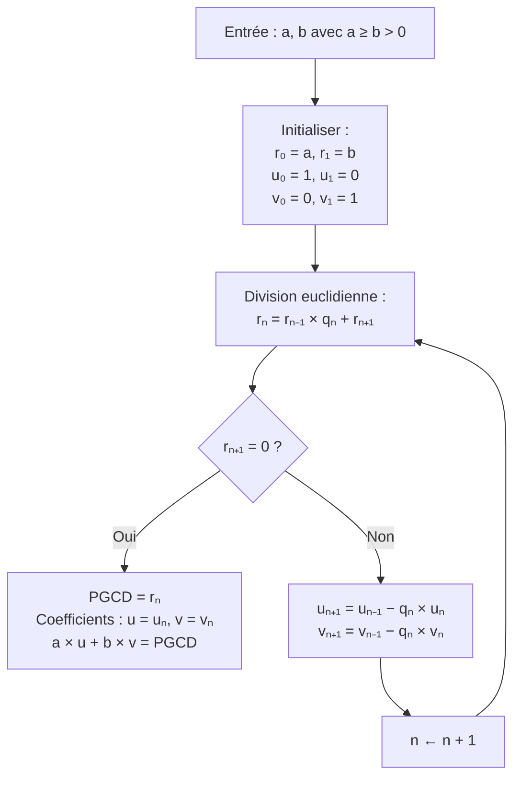

# Arithmétique

L'arithmétique étudie les propriétés des entiers, en particulier la divisibilité, les nombres premiers et les congruences. Ce chapitre est fondamental pour la théorie des nombres et possède des applications modernes majeures (cryptographie).

## 1. Divisibilité dans $\mathbb{Z}$

### 1.1 Définition

> [!abstract] Définition
> Soient $a, b \in \mathbb{Z}$. On dit que $a$ **divise** $b$ (noté $a \mid b$) s'il existe $k \in \mathbb{Z}$ tel que $b = ka$.

Propriétés immédiates :
- $a \mid 0$ pour tout $a$.
- $1 \mid a$ et $a \mid a$ pour tout $a$.
- Si $a \mid b$ et $b \mid c$, alors $a \mid c$ (transitivité).
- Si $a \mid b$ et $a \mid c$, alors $a \mid (b + c)$ et $a \mid (\lambda b + \mu c)$ pour tous $\lambda, \mu \in \mathbb{Z}$ (combinaison linéaire).
- Si $a \mid b$ et $b \mid a$, alors $a = \pm b$.

### 1.2 Division euclidienne

> [!abstract] Théorème (Division euclidienne)
> Soient $a \in \mathbb{Z}$ et $b \in \mathbb{Z} \setminus \{0\}$. Il existe un **unique** couple $(q, r) \in \mathbb{Z} \times \mathbb{N}$ tel que :
> $$a = bq + r \qquad \text{avec} \quad 0 \leq r < |b|$$
> $q$ est le **quotient** et $r$ le **reste** de la division euclidienne de $a$ par $b$.

> [!tip] Esquisse de preuve (existence)
> Considérer l'ensemble $\{a - bk \mid k \in \mathbb{Z}\} \cap \mathbb{N}$, qui est non vide (car non borné supérieurement) et admet donc un plus petit élément $r$. On pose $q$ tel que $r = a - bq$. Si $r \geq |b|$, alors $r - |b| \geq 0$ et $r - |b| < r$, contradiction avec la minimalité.

> [!example] Exemple
> Division de $a = 47$ par $b = 5$ : $47 = 5 \times 9 + 2$, donc $q = 9$, $r = 2$.
>
> Division de $a = -47$ par $b = 5$ : $-47 = 5 \times (-10) + 3$, donc $q = -10$, $r = 3$.

## 2. PGCD et PPCM

### 2.1 PGCD

> [!abstract] Définition
> Le **plus grand commun diviseur** de $a$ et $b$ (avec $(a,b) \neq (0,0)$), noté $\gcd(a, b)$ ou $a \wedge b$, est le plus grand entier positif divisant à la fois $a$ et $b$.

Propriétés :
- $\gcd(a, 0) = |a|$
- $\gcd(a, b) = \gcd(b, a) = \gcd(|a|, |b|)$
- $\gcd(a, b) = \gcd(a, b - qa)$ pour tout $q \in \mathbb{Z}$
- $a$ et $b$ sont **premiers entre eux** (ou copremiers) si $\gcd(a, b) = 1$

### 2.2 Algorithme d'Euclide

> [!abstract] Algorithme
> Pour calculer $\gcd(a, b)$ avec $a \geq b > 0$ :
> 1. Effectuer la division euclidienne : $a = bq + r$
> 2. Si $r = 0$ : $\gcd(a, b) = b$. Stop.
> 3. Sinon : remplacer $(a, b)$ par $(b, r)$ et retourner en 1.

> [!example] Exemple : $\gcd(252, 198)$
> $252 = 198 \times 1 + 54$
> $198 = 54 \times 3 + 36$
> $54 = 36 \times 1 + 18$
> $36 = 18 \times 2 + 0$
>
> Donc $\gcd(252, 198) = 18$.

### 2.3 PPCM

> [!abstract] Définition
> Le **plus petit commun multiple** de $a$ et $b$ (non nuls), noté $\mathrm{ppcm}(a, b)$ ou $a \vee b$, est le plus petit entier strictement positif divisible par $a$ et par $b$.

> [!abstract] Théorème
> $$\gcd(a, b) \times \mathrm{ppcm}(a, b) = |ab|$$

## 3. Théorème de Bézout et lemme de Gauss

### 3.1 Théorème de Bézout

> [!abstract] Théorème (Bézout)
> Soient $a, b \in \mathbb{Z}$ non tous deux nuls. Alors il existe $u, v \in \mathbb{Z}$ tels que :
> $$au + bv = \gcd(a, b)$$
>
> En particulier, $a$ et $b$ sont premiers entre eux si et seulement si $\exists u, v \in \mathbb{Z},\; au + bv = 1$.

> [!tip] Les coefficients de Bézout se trouvent en "remontant" l'algorithme d'Euclide.

> [!example] Exemple : Coefficients de Bézout pour $\gcd(252, 198) = 18$
> En remontant :
> $18 = 54 - 36 \times 1$
> $36 = 198 - 54 \times 3$, donc $18 = 54 - (198 - 54 \times 3) = 4 \times 54 - 198$
> $54 = 252 - 198$, donc $18 = 4(252 - 198) - 198 = 4 \times 252 - 5 \times 198$
>
> Vérification : $4 \times 252 - 5 \times 198 = 1008 - 990 = 18$. Correct.

### 3.2 Algorithme d'Euclide étendu

### 3.3 Lemme de Gauss

> [!abstract] Théorème (Lemme de Gauss)
> Si $a \mid bc$ et $\gcd(a, b) = 1$, alors $a \mid c$.

> [!tip] Preuve
> Par Bézout, $\exists u, v \in \mathbb{Z},\; au + bv = 1$. Multipliant par $c$ : $acu + bcv = c$. Or $a \mid acu$ et $a \mid bcv$ (car $a \mid bc$), donc $a \mid c$. $\blacksquare$

> [!important] Corollaire
> Si $p$ est premier et $p \mid ab$, alors $p \mid a$ ou $p \mid b$.

## 4. Nombres premiers

### 4.1 Définition

> [!abstract] Définition
> Un entier $p \geq 2$ est **premier** si ses seuls diviseurs positifs sont $1$ et $p$.

Les premiers nombres premiers : $2, 3, 5, 7, 11, 13, 17, 19, 23, 29, 31, 37, \ldots$

### 4.2 Infinité des nombres premiers

> [!abstract] Théorème (Euclide)
> Il existe une infinité de nombres premiers.

> [!tip] Preuve
> Supposons par l'absurde qu'il n'existe qu'un nombre fini de nombres premiers : $p_1, p_2, \ldots, p_r$. Considérons $N = p_1 p_2 \cdots p_r + 1$. Alors $N \geq 2$, donc $N$ admet un diviseur premier $p$. Ce $p$ est l'un des $p_i$, donc $p \mid (p_1 \cdots p_r)$. Mais $p \mid N$, donc $p \mid (N - p_1 \cdots p_r) = 1$. Contradiction car $p \geq 2$. $\blacksquare$

### 4.3 Crible d'Ératosthène

> [!tip] Méthode pratique
> Pour trouver tous les premiers $\leq N$ : tester la divisibilité par tous les premiers $p \leq \sqrt{N}$. Tout nombre composé $n \leq N$ admet un facteur premier $\leq \sqrt{n} \leq \sqrt{N}$.

### 4.4 Théorème fondamental de l'arithmétique

> [!abstract] Théorème
> Tout entier $n \geq 2$ s'écrit de manière **unique** (à l'ordre près) comme produit de nombres premiers :
> $$n = p_1^{\alpha_1} p_2^{\alpha_2} \cdots p_k^{\alpha_k}$$
> avec $p_1 < p_2 < \cdots < p_k$ premiers et $\alpha_i \geq 1$.

> [!tip] Esquisse de preuve
> **Existence** : par récurrence forte (cf. [[Logique et Raisonnement]]). Si $n$ est premier, c'est fait. Sinon $n = ab$ avec $2 \leq a, b < n$, et on applique l'hypothèse de récurrence.
>
> **Unicité** : par le corollaire du lemme de Gauss. Si $p_1^{\alpha_1} \cdots = q_1^{\beta_1} \cdots$, alors $p_1$ divise le produit de droite, donc $p_1$ divise l'un des $q_j$, et comme $q_j$ est premier, $p_1 = q_j$. On simplifie et on itère.

> [!important] Applications de la décomposition
> Si $n = p_1^{\alpha_1} \cdots p_k^{\alpha_k}$ et $m = p_1^{\beta_1} \cdots p_k^{\beta_k}$ (avec $\alpha_i, \beta_i \geq 0$) :
> $$\gcd(n, m) = \prod_{i=1}^{k} p_i^{\min(\alpha_i, \beta_i)} \qquad \mathrm{ppcm}(n, m) = \prod_{i=1}^{k} p_i^{\max(\alpha_i, \beta_i)}$$

## 5. Congruences

### 5.1 Définition

> [!abstract] Définition
> Soient $a, b \in \mathbb{Z}$ et $n \geq 1$. On dit que $a$ est **congru** à $b$ modulo $n$, noté $a \equiv b \pmod{n}$, si $n \mid (a - b)$.

### 5.2 Compatibilité avec les opérations

> [!abstract] Théorème
> Si $a \equiv a' \pmod{n}$ et $b \equiv b' \pmod{n}$, alors :
> - $a + b \equiv a' + b' \pmod{n}$
> - $a \times b \equiv a' \times b' \pmod{n}$
> - $a^k \equiv (a')^k \pmod{n}$ pour tout $k \in \mathbb{N}$

> [!warning]
> On ne peut **pas** simplifier par un facteur non premier avec $n$. Si $ca \equiv cb \pmod{n}$, alors $a \equiv b \pmod{n/\gcd(c,n)}$.

### 5.3 Inversibles modulo $n$

> [!abstract] Théorème
> $\overline{a}$ est inversible dans $\mathbb{Z}/n\mathbb{Z}$ si et seulement si $\gcd(a, n) = 1$.
>
> L'inverse se calcule à l'aide des coefficients de Bézout : si $au + nv = 1$, alors $\overline{a}^{-1} = \overline{u}$.

> [!example] Exemple
> Inverse de $\overline{7}$ modulo $15$ : on cherche $u$ tel que $7u \equiv 1 \pmod{15}$.
>
> Algorithme d'Euclide : $15 = 7 \times 2 + 1$, donc $1 = 15 - 7 \times 2$, d'où $7 \times (-2) \equiv 1 \pmod{15}$, soit $\overline{7}^{-1} = \overline{13}$.

## 6. Petit théorème de Fermat

> [!abstract] Théorème (Petit théorème de Fermat)
> Soit $p$ un nombre premier et $a \in \mathbb{Z}$ tel que $p \nmid a$. Alors :
> $$a^{p-1} \equiv 1 \pmod{p}$$
>
> De manière équivalente : $\forall a \in \mathbb{Z},\; a^p \equiv a \pmod{p}$.

> [!tip] Preuve
> Considérons les éléments $a, 2a, 3a, \ldots, (p-1)a$ modulo $p$. Comme $\gcd(a, p) = 1$, la multiplication par $a$ est une bijection de $\{1, \ldots, p-1\}$ (modulo $p$). Donc :
> $$a \cdot 2a \cdot 3a \cdots (p-1)a \equiv 1 \cdot 2 \cdot 3 \cdots (p-1) \pmod{p}$$
> Soit $a^{p-1} (p-1)! \equiv (p-1)! \pmod{p}$. Comme $\gcd((p-1)!, p) = 1$, on simplifie : $a^{p-1} \equiv 1 \pmod{p}$. $\blacksquare$

> [!example] Application : Calcul de $3^{100} \pmod{7}$
> Par Fermat : $3^6 \equiv 1 \pmod{7}$. Or $100 = 6 \times 16 + 4$.
>
> Donc $3^{100} = (3^6)^{16} \cdot 3^4 \equiv 1^{16} \cdot 81 \equiv 81 \pmod{7}$.
>
> $81 = 11 \times 7 + 4$, donc $3^{100} \equiv 4 \pmod{7}$.

## 7. Théorème d'Euler et indicatrice d'Euler

### 7.1 Indicatrice d'Euler

> [!abstract] Définition
> L'**indicatrice d'Euler** $\varphi(n)$ est le nombre d'entiers de $\{1, \ldots, n\}$ premiers avec $n$ :
> $$\varphi(n) = |\{k \in \{1, \ldots, n\} \mid \gcd(k, n) = 1\}|$$

Valeurs remarquables :
- Si $p$ est premier : $\varphi(p) = p - 1$
- $\varphi(p^k) = p^k - p^{k-1} = p^{k-1}(p - 1)$
- **Multiplicativité** : si $\gcd(m, n) = 1$, alors $\varphi(mn) = \varphi(m)\varphi(n)$

> [!abstract] Formule générale
> Si $n = p_1^{\alpha_1} \cdots p_k^{\alpha_k}$, alors :
> $$\varphi(n) = n \prod_{i=1}^{k} \left(1 - \frac{1}{p_i}\right)$$

> [!example] Exemple
> $\varphi(60) = \varphi(2^2 \cdot 3 \cdot 5) = 60 \left(1 - \frac{1}{2}\right)\left(1 - \frac{1}{3}\right)\left(1 - \frac{1}{5}\right) = 60 \cdot \frac{1}{2} \cdot \frac{2}{3} \cdot \frac{4}{5} = 16$.

### 7.2 Théorème d'Euler

> [!abstract] Théorème (Euler)
> Soit $n \geq 2$ et $a \in \mathbb{Z}$ avec $\gcd(a, n) = 1$. Alors :
> $$a^{\varphi(n)} \equiv 1 \pmod{n}$$

> [!tip]
> Le petit théorème de Fermat est le cas particulier $n = p$ premier (car $\varphi(p) = p - 1$).

## 8. Théorème chinois des restes

> [!abstract] Théorème (Restes chinois)
> Soient $n_1, n_2, \ldots, n_k$ des entiers $\geq 2$ deux à deux premiers entre eux. Pour tous $a_1, \ldots, a_k \in \mathbb{Z}$, le système :
> $$\begin{cases} x \equiv a_1 \pmod{n_1} \\ x \equiv a_2 \pmod{n_2} \\ \vdots \\ x \equiv a_k \pmod{n_k} \end{cases}$$
> admet une solution, unique modulo $N = n_1 n_2 \cdots n_k$.

> [!tip] Méthode de résolution (cas $k = 2$)
> Résoudre $x \equiv a_1 \pmod{n_1}$ et $x \equiv a_2 \pmod{n_2}$ :
> 1. Écrire $x = a_1 + n_1 t$.
> 2. Substituer dans la seconde : $a_1 + n_1 t \equiv a_2 \pmod{n_2}$, soit $n_1 t \equiv a_2 - a_1 \pmod{n_2}$.
> 3. Comme $\gcd(n_1, n_2) = 1$, on inverse $n_1$ modulo $n_2$ par Bézout.

> [!example] Exemple
> Résoudre $\begin{cases} x \equiv 2 \pmod{3} \\ x \equiv 3 \pmod{5} \end{cases}$
>
> $x = 2 + 3t$. Condition : $2 + 3t \equiv 3 \pmod{5}$, soit $3t \equiv 1 \pmod{5}$.
>
> Inverse de $3$ modulo $5$ : $3 \times 2 = 6 \equiv 1 \pmod{5}$, donc $t \equiv 2 \pmod{5}$.
>
> $t = 2 + 5s$, d'où $x = 2 + 3(2 + 5s) = 8 + 15s$. Solution : $x \equiv 8 \pmod{15}$.
>
> Vérification : $8 = 3 \times 2 + 2$ et $8 = 5 \times 1 + 3$. Correct.

## 9. Applications

### 9.1 Tests de divisibilité classiques

| Diviseur | Critère |
|---|---|
| $2$ | Dernier chiffre pair |
| $3$ | Somme des chiffres divisible par $3$ |
| $4$ | Nombre formé par les deux derniers chiffres divisible par $4$ |
| $9$ | Somme des chiffres divisible par $9$ |
| $11$ | Somme alternée des chiffres divisible par $11$ |

> [!tip] Justification (critère par 9)
> $10 \equiv 1 \pmod{9}$, donc $10^k \equiv 1 \pmod{9}$. Ainsi $\overline{a_n \cdots a_1 a_0} = \sum a_k \cdot 10^k \equiv \sum a_k \pmod{9}$.

### 9.2 Notion de cryptographie RSA

> [!abstract] Principe RSA (simplifié)
> 1. Choisir deux grands premiers $p$ et $q$. Poser $n = pq$.
> 2. Calculer $\varphi(n) = (p-1)(q-1)$.
> 3. Choisir $e$ avec $\gcd(e, \varphi(n)) = 1$. Calculer $d \equiv e^{-1} \pmod{\varphi(n)}$.
> 4. **Clé publique** : $(n, e)$. **Clé privée** : $d$.
> 5. **Chiffrement** : $c \equiv m^e \pmod{n}$.
> 6. **Déchiffrement** : $m \equiv c^d \pmod{n}$ (fonctionne car $m^{ed} \equiv m \pmod{n}$ par Euler).

> [!important]
> La sécurité repose sur la difficulté de **factoriser** $n = pq$ quand $p$ et $q$ sont très grands.

## 10. Exercices types corrigés

> [!example] Exercice 1 — Algorithme d'Euclide
> Calculer $\gcd(1071, 462)$ et trouver les coefficients de Bézout.
>
> **Solution.** $1071 = 462 \times 2 + 147$, puis $462 = 147 \times 3 + 21$, puis $147 = 21 \times 7 + 0$.
>
> Donc $\gcd(1071, 462) = 21$.
>
> Remontée : $21 = 462 - 147 \times 3 = 462 - (1071 - 462 \times 2) \times 3 = 7 \times 462 - 3 \times 1071$.
>
> Vérification : $7 \times 462 - 3 \times 1071 = 3234 - 3213 = 21$. Correct.

> [!example] Exercice 2 — Petit théorème de Fermat
> Déterminer le reste de la division de $2^{340}$ par $11$.
>
> **Solution.** Par Fermat : $2^{10} \equiv 1 \pmod{11}$. Or $340 = 10 \times 34$, donc $2^{340} = (2^{10})^{34} \equiv 1 \pmod{11}$.
>
> Le reste est $1$.

> [!example] Exercice 3 — Théorème chinois
> Trouver le plus petit entier $n > 0$ tel que $n \equiv 2 \pmod{3}$, $n \equiv 3 \pmod{5}$ et $n \equiv 2 \pmod{7}$.
>
> **Solution.** Des deux premiers : $n \equiv 8 \pmod{15}$ (voir exemple ci-dessus).
>
> Puis $8 + 15t \equiv 2 \pmod{7}$, soit $15t \equiv -6 \pmod{7}$, soit $t \equiv -6 \pmod{7}$ (car $15 \equiv 1$), donc $t \equiv 1 \pmod{7}$.
>
> $n = 8 + 15(1 + 7s) = 23 + 105s$. Le plus petit positif est $n = 23$.
>
> Vérification : $23 = 7 \times 3 + 2$, $23 = 5 \times 4 + 3$, $23 = 3 \times 7 + 2$. Correct.

## Liens

- [[Logique et Raisonnement]] — Récurrence, absurde, contraposée
- [[Ensembles et Applications]] — $\mathbb{Z}/n\mathbb{Z}$ et relations d'équivalence
- [[Structures Algébriques]] — L'anneau $\mathbb{Z}/n\mathbb{Z}$, corps $\mathbb{F}_p$
- [[Polynômes]] — Division euclidienne et PGCD de polynômes
