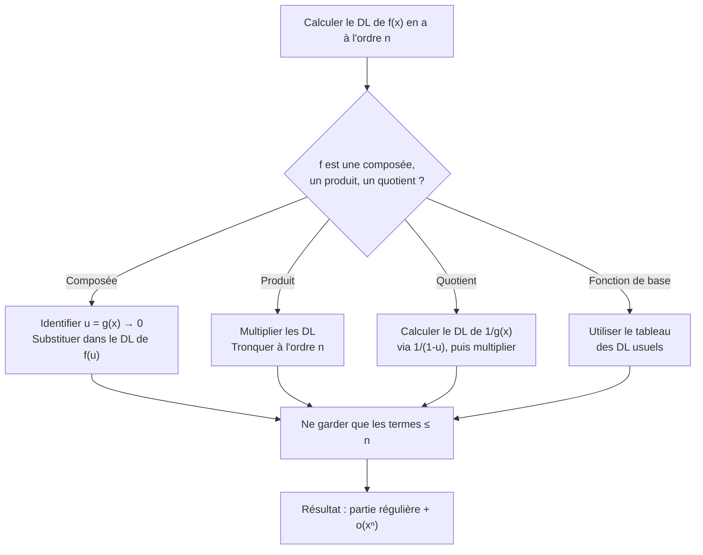

# Développements Limités

Les développements limités (DL) sont l'un des outils les plus puissants de l'analyse. Ils permettent d'approcher localement une fonction par un polynôme, et sont indispensables pour calculer des limites, étudier des fonctions au voisinage d'un point, et lever des formes indéterminées.

> [!quote] Prérequis
> [[Fonctions d'une Variable Réelle]], [[Exponentielle et Logarithme]], [[Trigonométrie]]

## Comparaison asymptotique

Avant les DL, il faut maîtriser les notations de comparaison.

### Notation de Landau

Soit $f, g : I \to \mathbb{R}$ et $a$ un point ou $\pm\infty$.

| Notation | Signification | Interprétation |
|---|---|---|
| $f = o(g)$ en $a$ | $\dfrac{f(x)}{g(x)} \to 0$ quand $x \to a$ | $f$ est **négligeable** devant $g$ |
| $f = O(g)$ en $a$ | $\left\|\dfrac{f(x)}{g(x)}\right\|$ est borné | $f$ est **dominée** par $g$ |
| $f \sim g$ en $a$ | $\dfrac{f(x)}{g(x)} \to 1$ quand $x \to a$ | $f$ est **équivalente** à $g$ |

> [!important] Relations entre les notations
> $$f \sim g \implies f = O(g) \implies \text{(rien de plus en général)}$$
> $$f = o(g) \implies f = O(g)$$
> $$f \sim g \iff f = g + o(g)$$

### Échelle de comparaison en $+\infty$

$$(\ln x)^\alpha \ll x^\beta \ll e^{\gamma x} \quad \text{pour } \alpha, \beta, \gamma > 0$$

> [!tip] Croissances comparées
> - $\lim_{x \to +\infty} \dfrac{(\ln x)^\alpha}{x^\beta} = 0$ pour tous $\alpha > 0, \beta > 0$
> - $\lim_{x \to +\infty} \dfrac{x^\beta}{e^{\gamma x}} = 0$ pour tous $\beta > 0, \gamma > 0$

## Définition du développement limité

> [!abstract] Définition
> $f$ admet un **développement limité à l'ordre $n$ en $a$** (noté DL$_n(a)$) s'il existe des réels $c_0, c_1, \ldots, c_n$ tels que :
> $$f(x) = c_0 + c_1(x-a) + c_2(x-a)^2 + \cdots + c_n(x-a)^n + o((x-a)^n)$$

La **partie régulière** est le polynôme $T_n(x) = \sum_{k=0}^{n} c_k (x-a)^k$.

> [!important] Unicité
> Si un DL existe, les coefficients sont uniques. De plus, si $f$ est $n$ fois dérivable en $a$ (formule de Taylor-Young) :
> $$c_k = \frac{f^{(k)}(a)}{k!}$$

## DL des fonctions usuelles en 0

> [!important] Tableau à connaître par coeur

$$e^x = 1 + x + \frac{x^2}{2!} + \frac{x^3}{3!} + \cdots + \frac{x^n}{n!} + o(x^n)$$

$$\sin x = x - \frac{x^3}{3!} + \frac{x^5}{5!} - \cdots + (-1)^n \frac{x^{2n+1}}{(2n+1)!} + o(x^{2n+2})$$

$$\cos x = 1 - \frac{x^2}{2!} + \frac{x^4}{4!} - \cdots + (-1)^n \frac{x^{2n}}{(2n)!} + o(x^{2n+1})$$

$$\frac{1}{1-x} = 1 + x + x^2 + \cdots + x^n + o(x^n)$$

$$\frac{1}{1+x} = 1 - x + x^2 - \cdots + (-1)^n x^n + o(x^n)$$

$$\ln(1+x) = x - \frac{x^2}{2} + \frac{x^3}{3} - \cdots + (-1)^{n-1} \frac{x^n}{n} + o(x^n)$$

$$(1+x)^\alpha = 1 + \alpha x + \frac{\alpha(\alpha-1)}{2!}x^2 + \cdots + \binom{\alpha}{n} x^n + o(x^n)$$

$$\tan x = x + \frac{x^3}{3} + \frac{2x^5}{15} + o(x^6)$$

$$\arctan x = x - \frac{x^3}{3} + \frac{x^5}{5} - \cdots + (-1)^n \frac{x^{2n+1}}{2n+1} + o(x^{2n+2})$$

$$\sinh x = x + \frac{x^3}{3!} + \frac{x^5}{5!} + \cdots + \frac{x^{2n+1}}{(2n+1)!} + o(x^{2n+2})$$

$$\cosh x = 1 + \frac{x^2}{2!} + \frac{x^4}{4!} + \cdots + \frac{x^{2n}}{(2n)!} + o(x^{2n+1})$$

> [!tip] Mnémotechnique
> - $\sin$ et $\sinh$ : termes **impairs** seulement
> - $\cos$ et $\cosh$ : termes **pairs** seulement
> - $\sin$ alterne les signes, $\sinh$ garde le $+$
> - $\cos$ alterne les signes, $\cosh$ garde le $+$

## Opérations sur les DL

### Somme et combinaison linéaire

Si $f$ et $g$ admettent un DL$_n(0)$, alors $\alpha f + \beta g$ admet un DL$_n(0)$ obtenu par combinaison linéaire des parties régulières.

### Produit

On multiplie les parties régulières et on ne garde que les termes de degré $\leq n$.

> [!example] Exemple
> DL$_3(0)$ de $e^x \sin x$ :
>
> $e^x = 1 + x + \frac{x^2}{2} + \frac{x^3}{6} + o(x^3)$
>
> $\sin x = x - \frac{x^3}{6} + o(x^3)$
>
> Produit (on garde jusqu'à $x^3$) :
> $$e^x \sin x = x + x^2 + \frac{x^3}{2} - \frac{x^3}{6} + o(x^3) = x + x^2 + \frac{x^3}{3} + o(x^3)$$

### Quotient

On effectue une division suivant les puissances croissantes, ou on utilise $\frac{1}{1-u}$.

> [!example] Exemple
> DL$_2(0)$ de $\dfrac{e^x}{\cos x}$ :
>
> $\cos x = 1 - \frac{x^2}{2} + o(x^2)$, donc $\frac{1}{\cos x} = \frac{1}{1 - x^2/2 + \cdots} = 1 + \frac{x^2}{2} + o(x^2)$
>
> $e^x = 1 + x + \frac{x^2}{2} + o(x^2)$
>
> $$\frac{e^x}{\cos x} = (1 + x + \frac{x^2}{2})(1 + \frac{x^2}{2}) + o(x^2) = 1 + x + x^2 + o(x^2)$$

### Composition

Si $f$ a un DL$_n(0)$ et $g(x) \to 0$ quand $x \to 0$ avec $g$ ayant un DL$_n(0)$ **sans terme constant**, alors $f \circ g$ a un DL$_n(0)$. On substitue $g(x)$ dans le DL de $f$.

> [!example] Exemple
> DL$_3(0)$ de $e^{\sin x}$ :
>
> $\sin x = x - \frac{x^3}{6} + o(x^3)$
>
> $e^u = 1 + u + \frac{u^2}{2} + \frac{u^3}{6} + o(u^3)$ avec $u = \sin x$
>
> $$e^{\sin x} = 1 + \left(x - \frac{x^3}{6}\right) + \frac{x^2}{2} + \frac{x^3}{6} + o(x^3) = 1 + x + \frac{x^2}{2} + o(x^3)$$

### Intégration

Si $f(x) = c_0 + c_1 x + \cdots + c_n x^n + o(x^n)$, alors :

$$\int_0^x f(t) \, dt = c_0 x + \frac{c_1}{2} x^2 + \cdots + \frac{c_n}{n+1} x^{n+1} + o(x^{n+1})$$

> [!warning] On ne peut pas dériver un DL
> L'intégration d'un DL donne un DL d'ordre supérieur. Mais la **dérivation** d'un DL n'est en général **pas licite** (le $o$ n'est pas dérivable).

## Méthode générale

## Applications

### 1. Calcul de limites

Les DL sont **l'arme absolue** pour lever les formes indéterminées.

> [!example] Exemple — Forme 0/0
> $$\lim_{x \to 0} \frac{\tan x - \sin x}{x^3}$$
>
> $\tan x = x + \frac{x^3}{3} + o(x^3)$, $\sin x = x - \frac{x^3}{6} + o(x^3)$
>
> $$\frac{\tan x - \sin x}{x^3} = \frac{\frac{x^3}{3} + \frac{x^3}{6} + o(x^3)}{x^3} = \frac{1}{3} + \frac{1}{6} + o(1) = \frac{1}{2}$$

### 2. Étude locale d'une courbe

Le DL permet de déterminer :
- **Tangente** : donnée par les termes de degré 0 et 1
- **Position par rapport à la tangente** : donnée par le premier terme non nul après la tangente

> [!example] Exemple
> $f(x) = e^x$ en $0$ : $f(x) = 1 + x + \frac{x^2}{2} + o(x^2)$
>
> Tangente : $y = 1 + x$. Position : $f(x) - (1+x) = \frac{x^2}{2} + o(x^2) > 0$ au voisinage de 0.
>
> La courbe est **au-dessus** de sa tangente (cohérent avec la convexité de $e^x$).

### 3. Développements asymptotiques

Pour $x \to +\infty$, on pose $u = 1/x \to 0$ et on fait le DL en $u$.

> [!example] Exemple
> Asymptote de $f(x) = \sqrt{x^2 + x}$ en $+\infty$ :
>
> $f(x) = x\sqrt{1 + 1/x} = x\left(1 + \frac{1}{2x} - \frac{1}{8x^2} + o(1/x^2)\right) = x + \frac{1}{2} - \frac{1}{8x} + o(1/x)$
>
> Asymptote oblique : $y = x + \frac{1}{2}$, et la courbe est **en dessous** (car $-\frac{1}{8x} < 0$ pour $x > 0$).

## Exercices types

> [!example] Exercice 1 — Limite
> Calculer $\displaystyle\lim_{x \to 0} \frac{e^x - 1 - x}{x^2}$.
>
> **Solution :** $e^x = 1 + x + \frac{x^2}{2} + o(x^2)$, donc $\frac{e^x - 1 - x}{x^2} = \frac{1}{2} + o(1) \to \boxed{\frac{1}{2}}$

> [!example] Exercice 2 — DL par composition
> DL$_4(0)$ de $\ln(\cos x)$.
>
> **Solution :** $\cos x = 1 - \frac{x^2}{2} + \frac{x^4}{24} + o(x^4)$. On pose $u = -\frac{x^2}{2} + \frac{x^4}{24} + o(x^4)$.
>
> $\ln(1+u) = u - \frac{u^2}{2} + o(u^2)$
>
> $u = -\frac{x^2}{2} + \frac{x^4}{24}$, $u^2 = \frac{x^4}{4} + o(x^4)$
>
> $$\ln(\cos x) = -\frac{x^2}{2} + \frac{x^4}{24} - \frac{x^4}{8} + o(x^4) = -\frac{x^2}{2} - \frac{x^4}{12} + o(x^4)$$

> [!example] Exercice 3 — Équivalent
> Trouver un équivalent de $(\cos x)^{1/x^2}$ quand $x \to 0$.
>
> **Solution :** $(\cos x)^{1/x^2} = e^{\frac{\ln(\cos x)}{x^2}} = e^{\frac{-x^2/2 + o(x^2)}{x^2}} = e^{-1/2 + o(1)} \to \boxed{e^{-1/2} = \frac{1}{\sqrt{e}}}$

## À retenir

> [!important] Les points clés
> 1. **Connaître par coeur** les DL des fonctions usuelles
> 2. **Opérations** : somme, produit, composition, quotient, intégration — mais **pas dérivation**
> 3. Le DL est l'outil n°1 pour les **limites** et les **formes indéterminées**
> 4. Le premier terme non nul après la tangente donne la **position de la courbe**
> 5. Pour les développements asymptotiques en $+\infty$, poser $u = 1/x$
