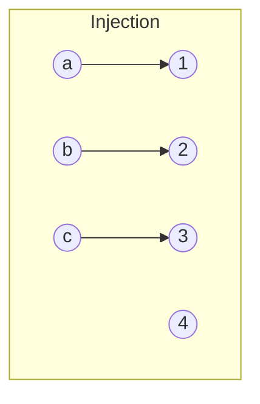
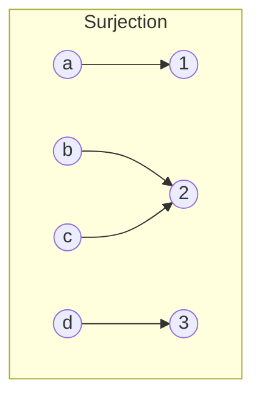
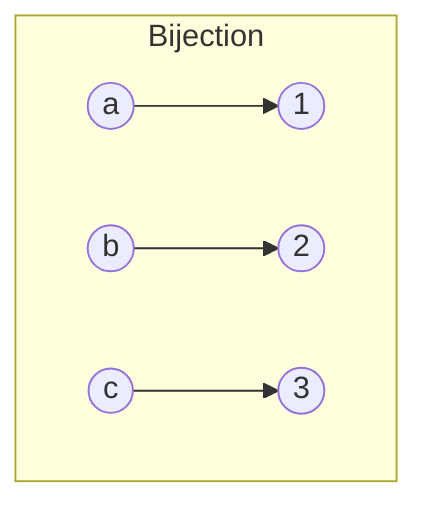

# Ensembles et Applications

La théorie des ensembles et des applications forme le langage fondamental des mathématiques modernes. Ce chapitre couvre les opérations ensemblistes, la notion d'application, le dénombrement et les relations.

## 1. Ensembles : opérations

### 1.1 Définitions de base

> [!abstract] Définition
> Un **ensemble** est une collection d'objets appelés **éléments**. On note $x \in E$ si $x$ est un élément de $E$ et $x \notin E$ sinon.

Ensembles classiques : $\mathbb{N}$, $\mathbb{Z}$, $\mathbb{Q}$, $\mathbb{R}$, $\mathbb{C}$.

L'**ensemble vide** $\emptyset$ ne contient aucun élément. C'est une partie de tout ensemble.

### 1.2 Inclusion

> [!abstract] Définition
> On dit que $A$ est une **partie** (ou un sous-ensemble) de $E$, noté $A \subset E$, si :
> $$\forall x \in A,\; x \in E$$

L'ensemble des parties de $E$ est noté $\mathcal{P}(E)$.

### 1.3 Opérations ensemblistes

Soient $A$ et $B$ deux parties d'un ensemble $E$.

| Opération | Notation | Définition |
|---|---|---|
| Réunion | $A \cup B$ | $\{x \in E \mid x \in A \text{ ou } x \in B\}$ |
| Intersection | $A \cap B$ | $\{x \in E \mid x \in A \text{ et } x \in B\}$ |
| Différence | $A \setminus B$ | $\{x \in E \mid x \in A \text{ et } x \notin B\}$ |
| Complémentaire | $\overline{A}$ ou $A^c$ | $E \setminus A = \{x \in E \mid x \notin A\}$ |
| Différence symétrique | $A \triangle B$ | $(A \setminus B) \cup (B \setminus A)$ |

### 1.4 Lois de De Morgan

> [!abstract] Théorème (Lois de De Morgan)
> Soient $A$ et $B$ des parties de $E$. Alors :
> $$\overline{A \cup B} = \overline{A} \cap \overline{B}$$
> $$\overline{A \cap B} = \overline{A} \cup \overline{B}$$
>
> Plus généralement, pour une famille $(A_i)_{i \in I}$ :
> $$\overline{\bigcup_{i \in I} A_i} = \bigcap_{i \in I} \overline{A_i} \qquad\text{et}\qquad \overline{\bigcap_{i \in I} A_i} = \bigcup_{i \in I} \overline{A_i}$$

> [!tip] Esquisse de preuve
> On procède par double inclusion. Pour $\overline{A \cup B} \subset \overline{A} \cap \overline{B}$ : si $x \notin A \cup B$, alors $x \notin A$ et $x \notin B$, donc $x \in \overline{A} \cap \overline{B}$. La réciproque est analogue.

### 1.5 Produit cartésien

> [!abstract] Définition
> Le **produit cartésien** de $E$ et $F$ est :
> $$E \times F = \{(x, y) \mid x \in E,\; y \in F\}$$

Plus généralement : $E_1 \times E_2 \times \cdots \times E_n = \{(x_1, \ldots, x_n) \mid x_i \in E_i\}$.

## 2. Applications

### 2.1 Définition

> [!abstract] Définition
> Une **application** $f : E \to F$ est une relation qui à **tout** élément $x \in E$ associe **un unique** élément $f(x) \in F$.
>
> - $E$ est l'**ensemble de départ**, $F$ l'**ensemble d'arrivée**.
> - Le **graphe** de $f$ est $\Gamma_f = \{(x, f(x)) \mid x \in E\} \subset E \times F$.

### 2.2 Image directe et image réciproque

> [!abstract] Définition
> Soit $f : E \to F$.
> - L'**image directe** d'une partie $A \subset E$ est $f(A) = \{f(x) \mid x \in A\}$.
> - L'**image réciproque** d'une partie $B \subset F$ est $f^{-1}(B) = \{x \in E \mid f(x) \in B\}$.

> [!important] Propriétés fondamentales
> - $f^{-1}(B_1 \cup B_2) = f^{-1}(B_1) \cup f^{-1}(B_2)$
> - $f^{-1}(B_1 \cap B_2) = f^{-1}(B_1) \cap f^{-1}(B_2)$
> - $f^{-1}(\overline{B}) = \overline{f^{-1}(B)}$
> - $A \subset f^{-1}(f(A))$ (avec égalité si $f$ est injective)
> - $f(f^{-1}(B)) \subset B$ (avec égalité si $f$ est surjective)

> [!warning]
> En général, $f(A_1 \cap A_2) \neq f(A_1) \cap f(A_2)$. On a seulement l'inclusion $f(A_1 \cap A_2) \subset f(A_1) \cap f(A_2)$. L'égalité est vraie si $f$ est injective.

### 2.3 Injection, surjection, bijection

> [!abstract] Définitions
> Soit $f : E \to F$.
> - $f$ est **injective** si $\forall x_1, x_2 \in E,\; f(x_1) = f(x_2) \Rightarrow x_1 = x_2$.
> - $f$ est **surjective** si $\forall y \in F,\; \exists x \in E,\; f(x) = y$.
> - $f$ est **bijective** si elle est à la fois injective et surjective.

> [!tip] Caractérisations pratiques
> - $f$ est injective $\Leftrightarrow$ $\forall y \in F$, l'équation $f(x) = y$ admet **au plus** une solution.
> - $f$ est surjective $\Leftrightarrow$ $\forall y \in F$, l'équation $f(x) = y$ admet **au moins** une solution.
> - $f$ est bijective $\Leftrightarrow$ $\forall y \in F$, l'équation $f(x) = y$ admet **exactement** une solution.

### 2.4 Composition d'applications

> [!abstract] Définition
> Soient $f : E \to F$ et $g : F \to G$. La **composée** $g \circ f : E \to G$ est définie par $(g \circ f)(x) = g(f(x))$.

> [!abstract] Théorème
> - Si $f$ et $g$ sont injectives, alors $g \circ f$ est injective.
> - Si $f$ et $g$ sont surjectives, alors $g \circ f$ est surjective.
> - Si $f$ et $g$ sont bijectives, alors $g \circ f$ est bijective et $(g \circ f)^{-1} = f^{-1} \circ g^{-1}$.

> [!important] Résultats utiles sur la composée
> - Si $g \circ f$ est injective, alors $f$ est injective.
> - Si $g \circ f$ est surjective, alors $g$ est surjective.

### 2.5 Application réciproque

> [!abstract] Théorème
> Soit $f : E \to F$ bijective. Il existe une unique application $f^{-1} : F \to E$ telle que :
> $$f^{-1} \circ f = \mathrm{Id}_E \qquad \text{et} \qquad f \circ f^{-1} = \mathrm{Id}_F$$
> $f^{-1}$ est appelée l'**application réciproque** de $f$.

## 3. Ensembles finis et dénombrement

### 3.1 Cardinal

> [!abstract] Définition
> Un ensemble $E$ est **fini** s'il existe $n \in \mathbb{N}$ et une bijection de $\{1, \ldots, n\}$ vers $E$. L'entier $n$ est le **cardinal** de $E$, noté $|E|$ ou $\mathrm{Card}(E)$. Par convention, $|\emptyset| = 0$.

### 3.2 Formules de dénombrement

Soient $A$ et $B$ des parties finies d'un ensemble $E$ fini.

| Formule | Résultat |
|---|---|
| $|A \cup B|$ | $|A| + |B| - |A \cap B|$ |
| $|A \times B|$ | $|A| \cdot |B|$ |
| $|\overline{A}|$ | $|E| - |A|$ |
| $|\mathcal{P}(E)|$ | $2^{|E|}$ |

### 3.3 Formule d'inclusion-exclusion (crible de Poincaré)

> [!abstract] Théorème
> Pour $n$ parties $A_1, \ldots, A_n$ d'un ensemble fini :
> $$\left|\bigcup_{i=1}^{n} A_i\right| = \sum_{i} |A_i| - \sum_{i < j} |A_i \cap A_j| + \sum_{i < j < k} |A_i \cap A_j \cap A_k| - \cdots + (-1)^{n+1} |A_1 \cap \cdots \cap A_n|$$

> [!example] Exemple : Nombre d'entiers de $\{1, \ldots, 100\}$ divisibles par 2 ou 3
> $A = \{k \in \{1,\ldots,100\} : 2 \mid k\}$, $|A| = 50$.
>
> $B = \{k \in \{1,\ldots,100\} : 3 \mid k\}$, $|B| = 33$.
>
> $A \cap B = \{k : 6 \mid k\}$, $|A \cap B| = 16$.
>
> Donc $|A \cup B| = 50 + 33 - 16 = 67$.

### 3.4 Cardinal et applications

> [!abstract] Théorème
> Soient $E$ et $F$ deux ensembles finis de même cardinal et $f : E \to F$. Alors :
> $$f \text{ injective} \Leftrightarrow f \text{ surjective} \Leftrightarrow f \text{ bijective}$$

> [!tip] Principe des tiroirs (Dirichlet)
> Si $n$ objets sont répartis dans $p$ tiroirs avec $n > p$, alors au moins un tiroir contient au moins $2$ objets.
>
> Formellement : s'il existe $f : E \to F$ avec $|E| > |F|$ et $E, F$ finis, alors $f$ n'est pas injective.

## 4. Dénombrabilité

### 4.1 Ensembles dénombrables

> [!abstract] Définition
> Un ensemble $E$ est **dénombrable** s'il existe une bijection $\varphi : \mathbb{N} \to E$. On dit aussi que $E$ est en bijection avec $\mathbb{N}$.

> [!abstract] Théorème
> - $\mathbb{N}$ est dénombrable (trivialement).
> - $\mathbb{Z}$ est dénombrable : bijection $n \mapsto \begin{cases} n/2 & \text{si } n \text{ pair} \\ -(n+1)/2 & \text{si } n \text{ impair} \end{cases}$.
> - $\mathbb{Q}$ est dénombrable (argument par diagonale de Cantor / serpent).
> - Toute partie infinie de $\mathbb{N}$ est dénombrable.
> - L'union dénombrable d'ensembles dénombrables est dénombrable.

### 4.2 $\mathbb{R}$ n'est pas dénombrable

> [!abstract] Théorème (Cantor, 1891)
> $\mathbb{R}$ n'est pas dénombrable. En particulier, $\mathbb{R}$ n'est pas en bijection avec $\mathbb{N}$.

> [!tip] Esquisse de preuve — Argument diagonal de Cantor
> Il suffit de montrer que $]0, 1[$ n'est pas dénombrable. Supposons par l'absurde qu'il le soit : on peut lister ses éléments $r_1, r_2, r_3, \ldots$ avec leurs développements décimaux :
>
> $r_1 = 0{,}a_{11} a_{12} a_{13} \ldots$
> $r_2 = 0{,}a_{21} a_{22} a_{23} \ldots$
> $r_3 = 0{,}a_{31} a_{32} a_{33} \ldots$
>
> Construisons $s = 0{,}b_1 b_2 b_3 \ldots$ avec $b_n \neq a_{nn}$ (et $b_n \notin \{0, 9\}$ pour éviter les ambiguïtés). Alors $s \in\; ]0, 1[$ mais $s \neq r_n$ pour tout $n$ (ils diffèrent au rang $n$). Contradiction avec l'exhaustivité de la liste. $\blacksquare$

## 5. Relations

### 5.1 Relations d'équivalence

> [!abstract] Définition
> Une relation $\mathcal{R}$ sur $E$ est une **relation d'équivalence** si elle est :
> 1. **Réflexive** : $\forall x \in E,\; x\;\mathcal{R}\; x$
> 2. **Symétrique** : $\forall x, y \in E,\; x\;\mathcal{R}\; y \Rightarrow y\;\mathcal{R}\; x$
> 3. **Transitive** : $\forall x, y, z \in E,\; (x\;\mathcal{R}\; y \text{ et } y\;\mathcal{R}\; z) \Rightarrow x\;\mathcal{R}\; z$

> [!abstract] Définition — Classe d'équivalence
> La **classe d'équivalence** de $x$ est $\overline{x} = \{y \in E \mid y\;\mathcal{R}\; x\}$.
>
> L'**ensemble quotient** est $E / \mathcal{R} = \{\overline{x} \mid x \in E\}$.

> [!important]
> Les classes d'équivalence forment une **partition** de $E$ : elles sont non vides, deux à deux disjointes, et leur réunion vaut $E$.

> [!example] Exemple : Congruence modulo $n$
> Sur $\mathbb{Z}$, la relation $a \equiv b \pmod{n}$ (c'est-à-dire $n \mid (a - b)$) est une relation d'équivalence. Les classes sont $\overline{0}, \overline{1}, \ldots, \overline{n-1}$ et l'ensemble quotient est $\mathbb{Z}/n\mathbb{Z}$.

### 5.2 Relations d'ordre

> [!abstract] Définition
> Une relation $\leq$ sur $E$ est une **relation d'ordre** si elle est :
> 1. **Réflexive** : $\forall x \in E,\; x \leq x$
> 2. **Antisymétrique** : $\forall x, y \in E,\; (x \leq y \text{ et } y \leq x) \Rightarrow x = y$
> 3. **Transitive** : $\forall x, y, z \in E,\; (x \leq y \text{ et } y \leq z) \Rightarrow x \leq z$

- L'ordre est **total** si $\forall x, y \in E,\; x \leq y$ ou $y \leq x$. Exemple : $(\mathbb{R}, \leq)$.
- Sinon, l'ordre est **partiel**. Exemple : $(\mathcal{P}(E), \subset)$.

> [!abstract] Définitions
> Soit $(E, \leq)$ un ensemble ordonné et $A \subset E$.
> - $m \in A$ est un **minimum** de $A$ si $\forall x \in A,\; m \leq x$.
> - $M \in A$ est un **maximum** de $A$ si $\forall x \in A,\; x \leq M$.
> - $b \in E$ est un **majorant** de $A$ si $\forall x \in A,\; x \leq b$.
> - La **borne supérieure** $\sup A$ est le plus petit des majorants (s'il existe).

## 6. Exercices types

> [!example] Exercice 1 — Opérations ensemblistes
> Soient $A$, $B$, $C$ des parties de $E$. Montrer que :
> $$A \cap (B \cup C) = (A \cap B) \cup (A \cap C)$$
> *Indication* : procéder par double inclusion.

> [!example] Exercice 2 — Injection et surjection
> Soit $f : \mathbb{R} \to \mathbb{R}$ définie par $f(x) = x^2 - 3x + 2$.
> 1. $f$ est-elle injective ? Surjective ?
> 2. Trouver un ensemble de départ et un ensemble d'arrivée pour lesquels $f$ est bijective.

> [!example] Exercice 3 — Image et image réciproque
> Soit $f : \mathbb{R} \to \mathbb{R}$ définie par $f(x) = x^2$.
> 1. Calculer $f([−2, 3])$ et $f^{-1}([1, 4])$.
> 2. Montrer sur un exemple que $f(A \cap B) \neq f(A) \cap f(B)$ en général.

> [!example] Exercice 4 — Inclusion-exclusion
> Dans une classe de 40 élèves, 25 étudient l'anglais, 18 l'espagnol, 8 les deux. Combien n'étudient ni l'anglais ni l'espagnol ?

> [!example] Exercice 5 — Relation d'équivalence
> Sur $\mathbb{Z} \times \mathbb{Z}^*$, on définit $(a, b) \mathcal{R} (c, d) \Leftrightarrow ad = bc$.
> 1. Montrer que $\mathcal{R}$ est une relation d'équivalence.
> 2. Que représente l'ensemble quotient ?
>
> *Indication* : C'est la construction de $\mathbb{Q}$.

> [!example] Exercice 6 — Cardinal et bijection
> Soit $E$ un ensemble fini de cardinal $n$. Montrer que le nombre de bijections de $E$ dans lui-même est $n!$.

## Liens

- [[Logique et Raisonnement]] — Les quantificateurs et raisonnements sous-jacents
- [[Structures Algébriques]] — Groupes quotients, morphismes
- [[Arithmétique]] — $\mathbb{Z}/n\mathbb{Z}$ et congruences
