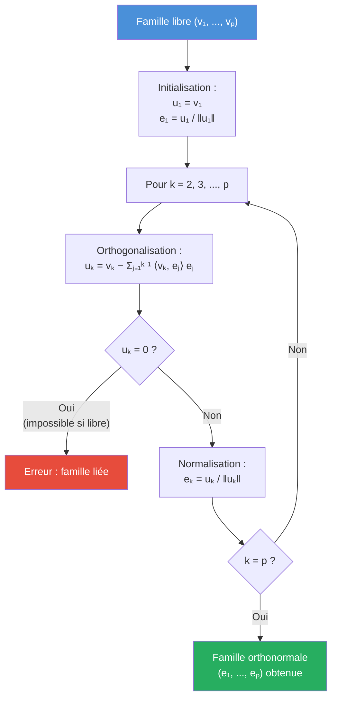

# Espaces Euclidiens

Les espaces euclidiens généralisent la géométrie du plan et de l'espace usuel à la dimension $n$. Le produit scalaire permet de définir des notions métriques (distance, angle, orthogonalité) dans un cadre algébrique rigoureux.

## 1. Produit scalaire

### 1.1. Définition axiomatique

> [!abstract] Définition -- Produit scalaire
> Soit $E$ un $\mathbb{R}$-espace vectoriel. Un **produit scalaire** sur $E$ est une application $\langle \cdot, \cdot \rangle : E \times E \to \mathbb{R}$ vérifiant :
>
> 1. **Bilinéarité** : $\langle \cdot, \cdot \rangle$ est linéaire en chaque variable
> 2. **Symétrie** : $\forall x, y \in E, \; \langle x, y \rangle = \langle y, x \rangle$
> 3. **Positivité** : $\forall x \in E, \; \langle x, x \rangle \geqslant 0$
> 4. **Définie** : $\langle x, x \rangle = 0 \iff x = 0_E$
>
> Le couple $(E, \langle \cdot, \cdot \rangle)$ est appelé **espace préhilbertien réel**. Si $E$ est de dimension finie, on parle d'**espace euclidien**.

> [!tip] Forme condensée
> Un produit scalaire est une **forme bilinéaire symétrique définie positive**.

### 1.2. Exemples fondamentaux

> [!example] Exemples de produits scalaires
> **1. Produit scalaire canonique sur $\mathbb{R}^n$.**
> $$\langle x, y \rangle = \sum_{i=1}^{n} x_i y_i = x^T y$$
>
> **2. Produit scalaire sur $\mathcal{C}([a, b], \mathbb{R})$.**
> $$\langle f, g \rangle = \int_a^b f(t)\, g(t)\, dt$$
>
> (La définie positivité utilise la stricte positivité de l'intégrale pour les fonctions continues.)
>
> **3. Produit scalaire sur $\mathcal{M}_n(\mathbb{R})$.**
> $$\langle A, B \rangle = \text{tr}(A^T B)$$
>
> **4. Produit scalaire pondéré sur $\mathbb{R}^n$.**
> Pour des poids $w_i > 0$ : $\langle x, y \rangle_w = \displaystyle\sum_{i=1}^{n} w_i x_i y_i$.

## 2. Norme euclidienne

### 2.1. Définition

> [!abstract] Définition -- Norme associée
> La **norme euclidienne** associée au produit scalaire est :
> $$\|x\| = \sqrt{\langle x, x \rangle}$$

On a les propriétés immédiates :
- $\|x\| \geqslant 0$, avec égalité ssi $x = 0$
- $\|\lambda x\| = |\lambda| \cdot \|x\|$ (homogénéité)

La **distance** entre $x$ et $y$ est $d(x, y) = \|x - y\|$.

### 2.2. Inégalité de Cauchy-Schwarz

> [!abstract] Théorème -- Inégalité de Cauchy-Schwarz
> Pour tous $x, y \in E$ :
> $$|\langle x, y \rangle| \leqslant \|x\| \cdot \|y\|$$
> avec égalité si et seulement si $x$ et $y$ sont **colinéaires** (liés).

> [!tip] Preuve
> Pour tout $t \in \mathbb{R}$, $\|x + ty\|^2 \geqslant 0$, c'est-à-dire :
> $$\|x\|^2 + 2t\langle x, y\rangle + t^2\|y\|^2 \geqslant 0$$
> Ce trinôme en $t$ est positif, donc son discriminant $\Delta = 4\langle x, y\rangle^2 - 4\|x\|^2\|y\|^2 \leqslant 0$, ce qui donne le résultat. L'égalité correspond à $\Delta = 0$, soit $x + t_0 y = 0$ pour un certain $t_0$.

> [!important] Conséquence -- Inégalité triangulaire
> $$\|x + y\| \leqslant \|x\| + \|y\|$$
> *Preuve* : $\|x+y\|^2 = \|x\|^2 + 2\langle x,y\rangle + \|y\|^2 \leqslant \|x\|^2 + 2\|x\|\|y\| + \|y\|^2 = (\|x\|+\|y\|)^2$.

### 2.3. Identités remarquables

> [!abstract] Identités
> - **Identité de polarisation** : $\langle x, y \rangle = \dfrac{1}{2}\big(\|x + y\|^2 - \|x\|^2 - \|y\|^2\big) = \dfrac{1}{4}\big(\|x+y\|^2 - \|x-y\|^2\big)$
> - **Identité du parallélogramme** : $\|x + y\|^2 + \|x - y\|^2 = 2(\|x\|^2 + \|y\|^2)$
> - **Théorème de Pythagore** : si $\langle x, y\rangle = 0$, alors $\|x + y\|^2 = \|x\|^2 + \|y\|^2$

## 3. Orthogonalité

### 3.1. Vecteurs orthogonaux

> [!abstract] Définition
> Deux vecteurs $x, y \in E$ sont **orthogonaux**, noté $x \perp y$, si $\langle x, y \rangle = 0$.
>
> Une **famille orthogonale** est une famille $(e_1, \dots, e_p)$ telle que $\langle e_i, e_j \rangle = 0$ pour $i \neq j$.
>
> Une **famille orthonormale** (ou **orthonormée**, en abrégé **BON**) est une famille orthogonale dont tous les vecteurs sont de norme $1$ :
> $$\langle e_i, e_j \rangle = \delta_{ij} = \begin{cases} 1 & \text{si } i = j \\ 0 & \text{si } i \neq j \end{cases}$$

> [!important] Théorème
> Toute famille orthogonale de vecteurs **non nuls** est **libre** (linéairement indépendante).

> [!tip] Preuve
> Si $\sum \lambda_i e_i = 0$, on prend le produit scalaire avec $e_j$ : $\lambda_j \|e_j\|^2 = 0$, donc $\lambda_j = 0$ (car $e_j \neq 0$).

### 3.2. Base orthonormale

> [!abstract] Théorème
> Tout espace euclidien $(E, \langle\cdot,\cdot\rangle)$ de dimension $n$ admet une **base orthonormale** $(e_1, \dots, e_n)$. Dans une telle base :
> - $\langle x, y \rangle = \displaystyle\sum_{i=1}^{n} x_i y_i$ (coordonnées de $x$ et $y$ dans la BON)
> - $\|x\|^2 = \displaystyle\sum_{i=1}^{n} x_i^2$
> - Les coordonnées de $x$ sont $x_i = \langle x, e_i \rangle$

## 4. Procédé de Gram-Schmidt

### 4.1. Énoncé

> [!abstract] Théorème -- Procédé d'orthonormalisation de Gram-Schmidt
> Soit $(v_1, \dots, v_p)$ une famille **libre** dans un espace euclidien $E$. Il existe une unique famille orthonormale $(e_1, \dots, e_p)$ telle que :
> 1. Pour tout $k \in \{1, \dots, p\}$ : $\text{Vect}(e_1, \dots, e_k) = \text{Vect}(v_1, \dots, v_k)$
> 2. $\langle v_k, e_k \rangle > 0$ pour tout $k$

### 4.2. Algorithme

**Étape 1 : Orthogonalisation.** On construit des vecteurs $u_k$ orthogonaux :

$$u_1 = v_1$$

$$u_k = v_k - \sum_{j=1}^{k-1} \frac{\langle v_k, u_j \rangle}{\langle u_j, u_j \rangle}\, u_j \quad \text{pour } k \geqslant 2$$

**Étape 2 : Normalisation.**

$$e_k = \frac{u_k}{\|u_k\|}$$

> [!example] Exemple -- Gram-Schmidt dans $\mathbb{R}^3$
> Orthonormaliser la famille $v_1 = (1, 1, 0)$, $v_2 = (1, 0, 1)$, $v_3 = (0, 1, 1)$ pour le produit scalaire canonique.
>
> **Étape 1** : $u_1 = (1, 1, 0)$, $\|u_1\| = \sqrt{2}$, $e_1 = \dfrac{1}{\sqrt{2}}(1, 1, 0)$.
>
> **Étape 2** : $\langle v_2, e_1\rangle = \dfrac{1}{\sqrt{2}}(1 + 0 + 0) = \dfrac{1}{\sqrt{2}}$.
>
> $u_2 = v_2 - \langle v_2, e_1\rangle e_1 = (1, 0, 1) - \dfrac{1}{2}(1, 1, 0) = \left(\dfrac{1}{2}, -\dfrac{1}{2}, 1\right)$.
>
> $\|u_2\| = \sqrt{\dfrac{1}{4} + \dfrac{1}{4} + 1} = \sqrt{\dfrac{3}{2}}$, $e_2 = \dfrac{1}{\sqrt{6}}(1, -1, 2)$.
>
> **Étape 3** : $\langle v_3, e_1\rangle = \dfrac{1}{\sqrt{2}}(0 + 1 + 0) = \dfrac{1}{\sqrt{2}}$, $\langle v_3, e_2\rangle = \dfrac{1}{\sqrt{6}}(0 - 1 + 2) = \dfrac{1}{\sqrt{6}}$.
>
> $u_3 = v_3 - \dfrac{1}{\sqrt{2}} e_1 - \dfrac{1}{\sqrt{6}} e_2 = (0,1,1) - \dfrac{1}{2}(1,1,0) - \dfrac{1}{6}(1,-1,2)$
>
> $= \left(-\dfrac{1}{2} - \dfrac{1}{6},\; 1 - \dfrac{1}{2} + \dfrac{1}{6},\; 1 - \dfrac{1}{3}\right) = \left(-\dfrac{2}{3},\; \dfrac{2}{3},\; \dfrac{2}{3}\right)$.
>
> $\|u_3\| = \dfrac{2}{3}\sqrt{3}$, $e_3 = \dfrac{1}{\sqrt{3}}(-1, 1, 1)$.
>
> **Résultat** : $e_1 = \dfrac{1}{\sqrt{2}}(1,1,0)$, $e_2 = \dfrac{1}{\sqrt{6}}(1,-1,2)$, $e_3 = \dfrac{1}{\sqrt{3}}(-1,1,1)$.

## 5. Projection orthogonale

### 5.1. Supplémentaire orthogonal

> [!abstract] Définition -- Orthogonal d'un sous-espace
> Soit $F$ un sous-espace de $E$. L'**orthogonal** de $F$ est :
> $$F^\perp = \{x \in E \mid \forall y \in F,\; \langle x, y \rangle = 0\}$$

> [!abstract] Théorème -- Supplémentaire orthogonal
> Soit $E$ un espace euclidien et $F$ un sous-espace vectoriel de $E$. Alors :
> 1. $F^\perp$ est un sous-espace vectoriel de $E$
> 2. $E = F \oplus F^\perp$ (somme directe orthogonale, notée $F \overset{\perp}{\oplus} F^\perp$)
> 3. $\dim F^\perp = \dim E - \dim F$
> 4. $(F^\perp)^\perp = F$

> [!tip] Preuve de $E = F \oplus F^\perp$
> Soit $(e_1, \dots, e_r)$ une BON de $F$. Pour $x \in E$, on pose :
> $$x_F = \sum_{i=1}^{r} \langle x, e_i\rangle\, e_i \quad \text{et} \quad x_{F^\perp} = x - x_F$$
> On vérifie que $x_F \in F$ et $\langle x_{F^\perp}, e_j\rangle = \langle x, e_j\rangle - \langle x, e_j\rangle = 0$, donc $x_{F^\perp} \in F^\perp$. De plus, $F \cap F^\perp = \{0\}$ (si $x \in F \cap F^\perp$, $\langle x, x\rangle = 0$).

### 5.2. Projecteur orthogonal

> [!abstract] Définition -- Projection orthogonale
> Le **projecteur orthogonal** sur $F$ est l'application linéaire $p_F : E \to E$ définie par :
> $$p_F(x) = x_F = \sum_{i=1}^{r} \langle x, e_i \rangle\, e_i$$
> où $(e_1, \dots, e_r)$ est une BON de $F$.

> [!abstract] Théorème -- Caractérisation par la distance
> Pour tout $x \in E$, $p_F(x)$ est l'unique élément de $F$ qui minimise la distance à $x$ :
> $$\|x - p_F(x)\| = \min_{y \in F} \|x - y\| = d(x, F)$$

> [!tip] Preuve
> Pour $y \in F$, $x - y = (x - p_F(x)) + (p_F(x) - y)$ avec $x - p_F(x) \in F^\perp$ et $p_F(x) - y \in F$. Par Pythagore :
> $$\|x - y\|^2 = \|x - p_F(x)\|^2 + \|p_F(x) - y\|^2 \geqslant \|x - p_F(x)\|^2$$
> avec égalité ssi $y = p_F(x)$.

> [!example] Exemple -- Projection dans $\mathbb{R}^3$
> Soit $F = \text{Vect}\!\left((1, 0, 1), (0, 1, 1)\right)$ dans $\mathbb{R}^3$ muni du produit scalaire canonique. Calculer la projection de $x = (1, 2, 3)$ sur $F$.
>
> On commence par orthonormaliser une base de $F$ par Gram-Schmidt.
>
> $v_1 = (1,0,1)$, $e_1 = \dfrac{1}{\sqrt{2}}(1,0,1)$.
>
> $u_2 = (0,1,1) - \dfrac{\langle(0,1,1), e_1\rangle}{\|e_1\|^2}\cdot v_1 = (0,1,1) - \dfrac{1}{2}(1,0,1) = (-1/2, 1, 1/2)$.
>
> $e_2 = \dfrac{1}{\sqrt{3/2}}(-1/2, 1, 1/2) = \dfrac{1}{\sqrt{6}}(-1, 2, 1)$.
>
> Projection : $p_F(x) = \langle x, e_1\rangle e_1 + \langle x, e_2\rangle e_2$.
>
> $\langle x, e_1\rangle = \dfrac{1+3}{\sqrt{2}} = \dfrac{4}{\sqrt{2}} = 2\sqrt{2}$.
>
> $\langle x, e_2\rangle = \dfrac{-1+4+3}{\sqrt{6}} = \dfrac{6}{\sqrt{6}} = \sqrt{6}$.
>
> $p_F(x) = 2\sqrt{2} \cdot \dfrac{1}{\sqrt{2}}(1,0,1) + \sqrt{6}\cdot\dfrac{1}{\sqrt{6}}(-1,2,1) = 2(1,0,1) + (-1,2,1) = (1, 2, 3)$.
>
> On trouve $p_F(x) = x$ : le vecteur $(1,2,3)$ appartient déjà à $F$. En effet, $(1,2,3) = (1,0,1) + 2(0,1,1)$.

## 6. Matrices orthogonales et groupe orthogonal

### 6.1. Définition

> [!abstract] Définition -- Matrice orthogonale
> Une matrice $M \in \mathcal{M}_n(\mathbb{R})$ est **orthogonale** si :
> $$M^T M = I_n \quad \iff \quad M^{-1} = M^T$$
> L'ensemble des matrices orthogonales forme le **groupe orthogonal** $O(n)$.

> [!abstract] Propriétés des matrices orthogonales
> Soit $M \in O(n)$.
> 1. $\det(M) = \pm 1$
> 2. Les **colonnes** de $M$ forment une BON de $\mathbb{R}^n$ (pour le produit scalaire canonique)
> 3. Les **lignes** de $M$ forment une BON de $\mathbb{R}^n$
> 4. $M$ conserve le produit scalaire : $\langle Mx, My\rangle = \langle x, y\rangle$
> 5. $M$ conserve la norme : $\|Mx\| = \|x\|$

> [!tip] Preuve de (1)
> $\det(M^T M) = \det(I_n) = 1$, et $\det(M^T) = \det(M)$, donc $\det(M)^2 = 1$.

> [!abstract] Définition -- Groupe spécial orthogonal
> Le **groupe spécial orthogonal** est $SO(n) = \{M \in O(n) \mid \det(M) = 1\}$. Ses éléments sont les **rotations** (ou isométries directes).

### 6.2. Changement de base orthonormale

> [!abstract] Théorème
> La matrice de passage d'une BON à une autre BON est une matrice orthogonale. Réciproquement, si $P \in O(n)$ et $(e_1, \dots, e_n)$ est une BON, alors les colonnes de $P$ (exprimées dans cette BON) forment une BON.

## 7. Isométries vectorielles

### 7.1. Définition

> [!abstract] Définition -- Isométrie vectorielle (automorphisme orthogonal)
> Un endomorphisme $f \in \mathcal{L}(E)$ est une **isométrie vectorielle** si :
> $$\forall x \in E, \quad \|f(x)\| = \|x\|$$
> De manière équivalente : $\forall x, y \in E, \; \langle f(x), f(y)\rangle = \langle x, y\rangle$.

> [!abstract] Caractérisations
> Pour $f \in \mathcal{L}(E)$, les propriétés suivantes sont équivalentes :
> 1. $f$ est une isométrie
> 2. $f$ conserve le produit scalaire
> 3. $f$ transforme toute BON en BON
> 4. La matrice de $f$ dans toute BON est orthogonale

### 7.2. Isométries du plan ($n = 2$)

> [!abstract] Théorème -- Classification des isométries de $\mathbb{R}^2$
> Toute matrice de $O(2)$ est de l'une des deux formes suivantes :
>
> | Type | Matrice | $\det$ | Nom |
> |---|---|---|---|
> | **Rotation** d'angle $\theta$ | $R_\theta = \begin{pmatrix} \cos\theta & -\sin\theta \\ \sin\theta & \cos\theta \end{pmatrix}$ | $+1$ | Isométrie directe |
> | **Réflexion** d'axe faisant l'angle $\theta/2$ avec $Ox$ | $S_\theta = \begin{pmatrix} \cos\theta & \sin\theta \\ \sin\theta & -\cos\theta \end{pmatrix}$ | $-1$ | Isométrie indirecte |

> [!tip] Vérification
> On vérifie aisément que $R_\theta^T R_\theta = I_2$ et $S_\theta^T S_\theta = I_2$.

> [!important] Propriétés des rotations
> - $R_\theta \circ R_\phi = R_{\theta + \phi}$ (le groupe $(SO(2), \circ)$ est commutatif)
> - $R_\theta^{-1} = R_{-\theta}$
> - Le groupe $SO(2)$ est isomorphe à $(\mathbb{R}/2\pi\mathbb{Z}, +)$, ou au cercle unité $\mathbb{U}$ via $\theta \mapsto e^{i\theta}$

### 7.3. Isométries de l'espace ($n = 3$)

> [!abstract] Théorème -- Réduction des isométries de $\mathbb{R}^3$
> Soit $f$ une isométrie de $\mathbb{R}^3$.
>
> **Cas 1 : $f \in SO(3)$ (rotation).** Il existe une BON dans laquelle la matrice de $f$ est :
> $$\begin{pmatrix} 1 & 0 & 0 \\ 0 & \cos\theta & -\sin\theta \\ 0 & \sin\theta & \cos\theta \end{pmatrix}$$
> C'est la **rotation d'angle $\theta$ autour de l'axe** $\text{Ker}(f - \text{Id})$ (qui est une droite).
>
> **Cas 2 : $f \in O(3) \setminus SO(3)$ ($\det f = -1$).** Il existe une BON dans laquelle la matrice de $f$ est :
> $$\begin{pmatrix} -1 & 0 & 0 \\ 0 & \cos\theta & -\sin\theta \\ 0 & \sin\theta & \cos\theta \end{pmatrix}$$
> C'est la composée d'une rotation d'angle $\theta$ et de la **réflexion** par rapport au plan orthogonal à l'axe.

> [!warning] Cas particuliers importants pour $\det = -1$
> - $\theta = 0$ : **réflexion** par rapport à un plan (symétrie orthogonale)
> - $\theta = \pi$ : **anti-rotation** (demi-tour composé avec la réflexion), aussi appelée **retournement**
> - $\theta$ quelconque : **rotation impropre**

> [!abstract] Théorème -- Valeurs propres d'une isométrie
> Les valeurs propres d'une isométrie sont $\pm 1$. Plus précisément :
> - Si $f \in SO(3)$ : $1$ est valeur propre (il existe un axe fixe)
> - Si $f \in O(3) \setminus SO(3)$ : $-1$ est valeur propre

## 8. Résultats complémentaires

### 8.1. Matrice de Gram

> [!abstract] Définition -- Matrice de Gram
> La **matrice de Gram** d'une famille $(v_1, \dots, v_p)$ est la matrice $G \in \mathcal{M}_p(\mathbb{R})$ définie par :
> $$G_{ij} = \langle v_i, v_j \rangle$$

> [!abstract] Propriétés
> - $G$ est symétrique positive
> - $\det(G) > 0$ si et seulement si $(v_1, \dots, v_p)$ est **libre**
> - Si $(v_1, \dots, v_p)$ est une BON, alors $G = I_p$
> - Le volume du parallélotope engendré par $(v_1, \dots, v_p)$ est $\sqrt{\det G}$

### 8.2. Adjoint d'un endomorphisme

> [!abstract] Théorème -- Adjoint
> Pour tout endomorphisme $f$ d'un espace euclidien $E$, il existe un unique endomorphisme $f^*$, appelé **adjoint** de $f$, tel que :
> $$\forall x, y \in E, \quad \langle f(x), y \rangle = \langle x, f^*(y) \rangle$$
> Dans une BON, la matrice de $f^*$ est la **transposée** de la matrice de $f$.

> [!important] Caractérisations via l'adjoint
> - $f$ est une **isométrie** $\iff$ $f^* \circ f = \text{Id}$ $\iff$ $f^* = f^{-1}$
> - $f$ est **symétrique** (ou **auto-adjoint**) $\iff$ $f^* = f$ (matrice symétrique dans une BON)

### 8.3. Théorème spectral

> [!abstract] Théorème spectral (admis en MPSI)
> Tout endomorphisme **symétrique** d'un espace euclidien est **diagonalisable dans une base orthonormale**. De manière équivalente : toute matrice symétrique réelle est orthogonalement diagonalisable.

## 9. Exercices types corrigés

### Exercice 1 : Vérification de produit scalaire

> [!example] Exercice
> Montrer que $\langle P, Q \rangle = \displaystyle\int_0^1 P(t) Q(t)\, dt$ est un produit scalaire sur $\mathbb{R}_n[X]$.
>
> **Bilinéarité** : découle de la linéarité de l'intégrale.
>
> **Symétrie** : $\langle P, Q\rangle = \int_0^1 PQ = \int_0^1 QP = \langle Q, P\rangle$.
>
> **Positivité** : $\langle P, P\rangle = \int_0^1 P(t)^2\, dt \geqslant 0$ car $P^2 \geqslant 0$.
>
> **Définie** : si $\langle P, P\rangle = 0$, alors $\int_0^1 P(t)^2\, dt = 0$. Comme $P^2$ est continue et positive, $P^2 = 0$ sur $[0,1]$, donc $P = 0$ sur $[0,1]$. Or un polynôme ayant une infinité de zéros est le polynôme nul (pour $n \geqslant 1$, $[0,1]$ est infini).

### Exercice 2 : Gram-Schmidt dans un espace de polynômes

> [!example] Exercice -- Polynômes de Legendre
> Orthonormaliser $(1, X, X^2)$ dans $\mathbb{R}_2[X]$ pour le produit scalaire $\langle P, Q\rangle = \displaystyle\int_{-1}^{1} P(t)Q(t)\, dt$.
>
> **Étape 1** : $v_1 = 1$, $\|v_1\|^2 = \displaystyle\int_{-1}^{1} 1\, dt = 2$, $e_1 = \dfrac{1}{\sqrt{2}}$.
>
> **Étape 2** : $\langle X, e_1\rangle = \dfrac{1}{\sqrt{2}}\displaystyle\int_{-1}^1 t\, dt = 0$ (fonction impaire).
>
> Donc $u_2 = X$, $\|u_2\|^2 = \displaystyle\int_{-1}^1 t^2\, dt = \dfrac{2}{3}$, $e_2 = \sqrt{\dfrac{3}{2}}\, X$.
>
> **Étape 3** : $\langle X^2, e_1\rangle = \dfrac{1}{\sqrt{2}}\displaystyle\int_{-1}^1 t^2\, dt = \dfrac{1}{\sqrt{2}} \cdot \dfrac{2}{3} = \dfrac{\sqrt{2}}{3}$.
>
> $\langle X^2, e_2\rangle = \sqrt{\dfrac{3}{2}}\displaystyle\int_{-1}^1 t^3\, dt = 0$ (fonction impaire).
>
> $u_3 = X^2 - \dfrac{\sqrt{2}}{3} \cdot \dfrac{1}{\sqrt{2}} = X^2 - \dfrac{1}{3}$.
>
> $\|u_3\|^2 = \displaystyle\int_{-1}^1 \left(t^2 - \dfrac{1}{3}\right)^2 dt = \int_{-1}^1 \left(t^4 - \dfrac{2t^2}{3} + \dfrac{1}{9}\right) dt = \dfrac{2}{5} - \dfrac{4}{9} + \dfrac{2}{9} = \dfrac{8}{45}$.
>
> $e_3 = \sqrt{\dfrac{45}{8}}\left(X^2 - \dfrac{1}{3}\right) = \dfrac{3\sqrt{5}}{2\sqrt{8}}\left(X^2 - \dfrac{1}{3}\right) = \dfrac{3\sqrt{10}}{4}\left(X^2 - \dfrac{1}{3}\right) = \dfrac{\sqrt{10}}{4}(3X^2 - 1)$.
>
> On retrouve (à normalisation près) les **polynômes de Legendre** : $P_0 = 1$, $P_1 = X$, $P_2 = \dfrac{1}{2}(3X^2 - 1)$.

### Exercice 3 : Distance à un sous-espace

> [!example] Exercice
> Dans $\mathbb{R}^3$ muni du produit scalaire canonique, calculer la distance du point $M = (1, 1, 1)$ au plan $F : x + y - z = 0$.
>
> $F = \text{Ker}(\varphi)$ avec $\varphi(x, y, z) = x + y - z$. Un vecteur normal est $n = (1, 1, -1)$.
>
> La projection de $M$ sur $F^\perp = \text{Vect}(n)$ est :
> $$p_{F^\perp}(M) = \frac{\langle M, n\rangle}{\|n\|^2}\, n = \frac{1 + 1 - 1}{3}(1, 1, -1) = \frac{1}{3}(1, 1, -1)$$
>
> La distance est : $d(M, F) = \|p_{F^\perp}(M)\| = \dfrac{1}{3}\sqrt{3} = \dfrac{1}{\sqrt{3}} = \dfrac{\sqrt{3}}{3}$.
>
> On peut vérifier par la formule directe : $d = \dfrac{|1 + 1 - 1|}{\sqrt{1^2 + 1^2 + (-1)^2}} = \dfrac{1}{\sqrt{3}}$.

### Exercice 4 : Matrice orthogonale

> [!example] Exercice -- Caractérisation d'une rotation
> Soit $M = \dfrac{1}{3}\begin{pmatrix} 2 & -1 & 2 \\ 2 & 2 & -1 \\ -1 & 2 & 2 \end{pmatrix}$. Montrer que $M \in SO(3)$ et déterminer l'angle et l'axe de la rotation.
>
> **Vérification** : $M^T M = \dfrac{1}{9}\begin{pmatrix} 2 & 2 & -1 \\ -1 & 2 & 2 \\ 2 & -1 & 2 \end{pmatrix}\begin{pmatrix} 2 & -1 & 2 \\ 2 & 2 & -1 \\ -1 & 2 & 2 \end{pmatrix} = \dfrac{1}{9}\begin{pmatrix} 9 & 0 & 0 \\ 0 & 9 & 0 \\ 0 & 0 & 9 \end{pmatrix} = I_3$.
>
> Donc $M \in O(3)$. De plus, $\det(M) = \dfrac{1}{27}(2(4+2) + 1(4-1) + 2(4+2)) = \dfrac{1}{27} \cdot 27 = 1$. Donc $M \in SO(3)$.
>
> **Axe** : on résout $Mv = v$, soit $(M - I)v = 0$.
>
> $M - I = \dfrac{1}{3}\begin{pmatrix} -1 & -1 & 2 \\ 2 & -1 & -1 \\ -1 & 2 & -1 \end{pmatrix}$. On vérifie que $v = (1, 1, 1)$ est solution. L'axe de rotation est $\text{Vect}(1, 1, 1)$.
>
> **Angle** : $\text{tr}(M) = \dfrac{2 + 2 + 2}{3} = 2$. Or pour une rotation d'angle $\theta$ dans $\mathbb{R}^3$ : $\text{tr}(M) = 1 + 2\cos\theta$.
>
> Donc $2\cos\theta = 1$, soit $\cos\theta = 1/2$ et $\theta = \pm \pi/3$.
>
> Pour déterminer le signe, on vérifie l'orientation. La rotation est d'angle $\theta = \pi/3$ autour de l'axe $(1,1,1)$ (avec convention d'orientation directe).

## 10. Liens

- [[Intégration]] -- le produit scalaire $L^2$ repose sur l'intégrale
- [[Équations Différentielles]] -- les systèmes différentiels utilisent la diagonalisation orthogonale
- [[Réduction des endomorphismes]] -- lien avec le théorème spectral
- [[Matrices]] -- les matrices orthogonales sont un sous-groupe de $GL_n(\mathbb{R})$
