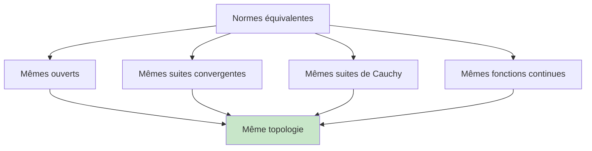
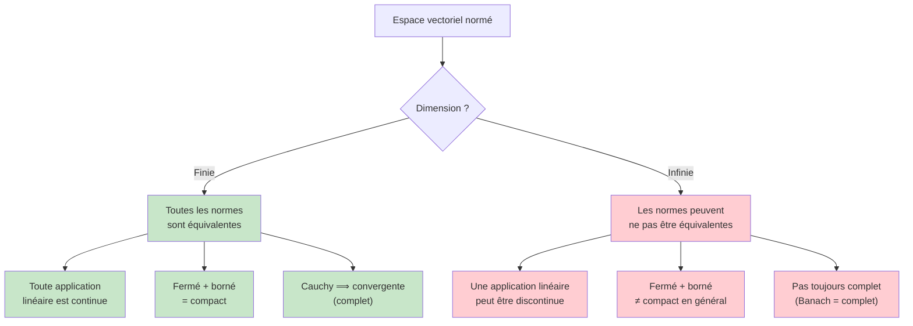

# Espaces Vectoriels Normés

Les espaces vectoriels normés (EVN) sont le cadre naturel de l'analyse en prépa. Ils généralisent $\mathbb{R}^n$ en munissant un espace vectoriel d'une notion de **distance** via une norme. Ce chapitre fait le pont entre l'algèbre linéaire et la topologie.

> [!quote] Prérequis
> [[Algèbre Linéaire]], [[Fonctions d'une Variable Réelle]], [[Suites et Séries Numériques]]

## Normes

### Définition

> [!abstract] Définition — Norme
> Soit $E$ un $\mathbb{R}$-espace vectoriel (ou $\mathbb{C}$-ev). Une **norme** sur $E$ est une application $\|\cdot\| : E \to \mathbb{R}_+$ vérifiant :
>
> 1. **Séparation :** $\|x\| = 0 \iff x = 0_E$
> 2. **Homogénéité :** $\|\lambda x\| = |\lambda| \cdot \|x\|$ pour tout $\lambda \in \mathbb{K}$, $x \in E$
> 3. **Inégalité triangulaire :** $\|x + y\| \leq \|x\| + \|y\|$
>
> Le couple $(E, \|\cdot\|)$ est un **espace vectoriel normé**.

### Normes classiques sur $\mathbb{R}^n$

Pour $x = (x_1, \ldots, x_n) \in \mathbb{R}^n$ :

| Norme | Notation | Formule |
|---|---|---|
| Norme 1 | $\|x\|_1$ | $\|x\|_1 = \sum_{i=1}^n \|x_i\|$ |
| Norme 2 (euclidienne) | $\|x\|_2$ | $\|x\|_2 = \sqrt{\sum_{i=1}^n x_i^2}$ |
| Norme infinie | $\|x\|_\infty$ | $\|x\|_\infty = \max_{1 \leq i \leq n} \|x_i\|$ |

> [!tip] Visualisation en dimension 2
> La "boule unité" $\{x \in \mathbb{R}^2 : \|x\| \leq 1\}$ a une forme différente selon la norme :
> - Norme 1 : losange (carré tourné à 45°)
> - Norme 2 : disque (cercle)
> - Norme $\infty$ : carré

### Autres exemples importants

**Sur $C([a,b], \mathbb{R})$ (fonctions continues sur $[a,b]$) :**

| Norme | Formule |
|---|---|
| Norme sup | $\|f\|_\infty = \sup_{t \in [a,b]} \|f(t)\|$ |
| Norme $L^1$ | $\|f\|_1 = \int_a^b \|f(t)\| \, dt$ |
| Norme $L^2$ | $\|f\|_2 = \sqrt{\int_a^b f(t)^2 \, dt}$ |

**Sur $\mathcal{M}_n(\mathbb{R})$ (matrices) :**
- Norme subordonnée : $\|\|A\|\| = \sup_{\|x\| = 1} \|Ax\|$
- Norme de Frobenius : $\|A\|_F = \sqrt{\sum_{i,j} a_{ij}^2}$

## Distance associée

Toute norme induit une **distance** :

$$d(x, y) = \|x - y\|$$

qui vérifie les axiomes d'une distance (séparation, symétrie, inégalité triangulaire).

> [!important] Inégalité triangulaire inversée
> $$\big| \|x\| - \|y\| \big| \leq \|x - y\|$$
> C'est une conséquence directe de l'inégalité triangulaire. Très utile pour les minorations.

## Boules et topologie

### Boules

> [!abstract] Définition
> Soient $(E, \|\cdot\|)$ un EVN, $a \in E$ et $r > 0$ :
> - **Boule ouverte :** $B(a, r) = \{x \in E : \|x - a\| < r\}$
> - **Boule fermée :** $\bar{B}(a, r) = \{x \in E : \|x - a\| \leq r\}$
> - **Sphère :** $S(a, r) = \{x \in E : \|x - a\| = r\}$

### Ouverts et fermés

> [!abstract] Définitions
> - $U \subset E$ est **ouvert** si pour tout $x \in U$, il existe $r > 0$ tel que $B(x, r) \subset U$.
> - $F \subset E$ est **fermé** si son complémentaire $E \setminus F$ est ouvert.
> - Équivalent : $F$ est fermé ssi toute suite convergente d'éléments de $F$ a sa limite dans $F$.

> [!warning] Attention
> Un ensemble peut être ni ouvert ni fermé (ex: $[0, 1[$ dans $\mathbb{R}$).
> Un ensemble peut être ouvert ET fermé (ex: $\emptyset$ et $E$).

## Suites dans un EVN

### Convergence

> [!abstract] Définition
> La suite $(x_n)$ d'éléments de $(E, \|\cdot\|)$ **converge** vers $\ell \in E$ si :
> $$\|x_n - \ell\| \xrightarrow[n \to +\infty]{} 0$$
> C'est-à-dire : $\forall \varepsilon > 0, \, \exists N \in \mathbb{N}, \, \forall n \geq N, \quad \|x_n - \ell\| < \varepsilon$

### Suites de Cauchy

> [!abstract] Définition
> $(x_n)$ est une **suite de Cauchy** si :
> $$\forall \varepsilon > 0, \, \exists N \in \mathbb{N}, \, \forall p, q \geq N, \quad \|x_p - x_q\| < \varepsilon$$

> [!important] Convergence et Cauchy
> - Toute suite convergente est de Cauchy
> - La réciproque est vraie dans un **espace complet** (espace de Banach)
> - $\mathbb{R}^n$ muni de n'importe quelle norme est complet

## Normes équivalentes

> [!abstract] Définition
> Deux normes $\|\cdot\|_a$ et $\|\cdot\|_b$ sur $E$ sont **équivalentes** s'il existe $\alpha, \beta > 0$ tels que :
> $$\forall x \in E, \quad \alpha \|x\|_a \leq \|x\|_b \leq \beta \|x\|_a$$

> [!abstract] Théorème fondamental (dimension finie)
> **En dimension finie, toutes les normes sont équivalentes.**

C'est un résultat crucial qui simplifie énormément l'analyse en dimension finie : convergence, continuité, compacité... ne dépendent pas du choix de la norme.

> [!warning] Faux en dimension infinie
> Sur $C([0,1], \mathbb{R})$, les normes $\|\cdot\|_1$ et $\|\cdot\|_\infty$ ne sont **pas** équivalentes.
>
> Considérer $f_n(x) = x^n$ : $\|f_n\|_\infty = 1$ mais $\|f_n\|_1 = \frac{1}{n+1} \to 0$.

### Inégalités classiques sur $\mathbb{R}^n$

Pour $x \in \mathbb{R}^n$ :

$$\|x\|_\infty \leq \|x\|_2 \leq \|x\|_1 \leq n \|x\|_\infty$$

$$\|x\|_\infty \leq \|x\|_2 \leq \sqrt{n} \|x\|_\infty$$

$$\|x\|_2 \leq \|x\|_1 \leq \sqrt{n} \|x\|_2$$

## Continuité dans un EVN

### Applications linéaires continues

> [!abstract] Théorème
> Soit $f : (E, \|\cdot\|_E) \to (F, \|\cdot\|_F)$ une application **linéaire**. Les assertions suivantes sont **équivalentes** :
> 1. $f$ est continue
> 2. $f$ est continue en $0$
> 3. $f$ est lipschitzienne
> 4. $f$ est bornée sur la boule unité : $\exists M > 0, \, \forall x, \, \|f(x)\|_F \leq M \|x\|_E$

> [!abstract] Théorème (dimension finie)
> **En dimension finie, toute application linéaire est continue.**

C'est une conséquence directe de l'équivalence des normes.

> [!warning] Faux en dimension infinie
> Soit $\varphi : (C([0,1]), \|\cdot\|_1) \to \mathbb{R}$ définie par $\varphi(f) = f(0)$.
> C'est une forme linéaire, mais elle n'est **pas** continue pour la norme $\|\cdot\|_1$.

### Norme d'opérateur (norme subordonnée)

Pour $f$ linéaire continue, on définit la **norme d'opérateur** :

$$\|\|f\|\| = \sup_{\|x\| = 1} \|f(x)\| = \sup_{x \neq 0} \frac{\|f(x)\|}{\|x\|}$$

Elle vérifie : $\|f(x)\| \leq \|\|f\|\| \cdot \|x\|$ pour tout $x$.

## Compacité en dimension finie

> [!abstract] Théorème de Heine-Borel (dans $\mathbb{R}^n$)
> Une partie de $\mathbb{R}^n$ est **compacte** si et seulement si elle est **fermée et bornée**.

> [!abstract] Théorème de Bolzano-Weierstrass
> De toute suite **bornée** dans $\mathbb{R}^n$, on peut extraire une sous-suite **convergente**.

> [!abstract] Conséquences
> - Toute fonction continue sur un compact est **bornée** et atteint ses bornes
> - Toute fonction continue sur un compact est **uniformément continue** (Heine)

> [!warning] Faux en dimension infinie
> La boule unité fermée de $(C([0,1]), \|\cdot\|_\infty)$ est fermée et bornée mais **pas** compacte (théorème de Riesz).

## Séries dans un EVN

### Convergence

> [!abstract] Définition
> La série $\sum x_n$ (avec $x_n \in E$) **converge** si la suite des sommes partielles $S_N = \sum_{n=0}^{N} x_n$ converge dans $(E, \|\cdot\|)$.

### Convergence absolue

> [!abstract] Définition
> $\sum x_n$ **converge absolument** si la série numérique $\sum \|x_n\|$ converge.

> [!abstract] Théorème
> Dans un espace de **Banach** (EVN complet), la convergence absolue implique la convergence.
>
> $\mathbb{R}^n$ est un Banach. $(C([a,b]), \|\cdot\|_\infty)$ est un Banach.

### Séries de matrices et exponentielle

> [!example] Exponentielle de matrice
> Pour $A \in \mathcal{M}_n(\mathbb{R})$ :
> $$e^A = \sum_{k=0}^{+\infty} \frac{A^k}{k!}$$
> Cette série converge absolument pour toute norme d'opérateur (car $\mathcal{M}_n(\mathbb{R})$ est un Banach en dimension finie).
>
> Application majeure : la solution de $X'(t) = AX(t)$ avec $X(0) = X_0$ est $X(t) = e^{tA} X_0$.

## Résumé : dimension finie vs infinie

## Exercices types

> [!example] Exercice 1 — Vérifier qu'une norme est une norme
> Montrer que $\|f\|_\infty = \sup_{[0,1]} |f|$ est une norme sur $C([0,1], \mathbb{R})$.
>
> **Idée :** Vérifier les 3 axiomes. La séparation utilise la continuité de $f$.

> [!example] Exercice 2 — Normes non équivalentes
> Montrer que $\|\cdot\|_1$ et $\|\cdot\|_\infty$ ne sont pas équivalentes sur $C([0,1])$.
>
> **Idée :** Considérer $f_n(x) = x^n$. Calculer $\|f_n\|_\infty = 1$ et $\|f_n\|_1 = 1/(n+1) \to 0$.

> [!example] Exercice 3 — Continuité d'une forme linéaire
> Soit $\varphi : \mathbb{R}^n \to \mathbb{R}$ linéaire. Montrer que $\varphi$ est continue.
>
> **Idée :** $\varphi(x) = \sum a_i x_i$ (coordonnées dans une base). Par Cauchy-Schwarz : $|\varphi(x)| \leq \|a\|_2 \|x\|_2$, donc $\varphi$ est lipschitzienne.

## À retenir

> [!important] Les points clés
> 1. **En dimension finie, toutes les normes sont équivalentes** — résultat fondamental
> 2. Toute application linéaire en dimension finie est **automatiquement continue**
> 3. En dimension finie : fermé + borné = **compact** (Heine-Borel)
> 4. En dimension infinie, tout peut mal tourner (normes non équivalentes, Riesz, discontinuité)
> 5. La convergence absolue implique la convergence dans un **Banach**
