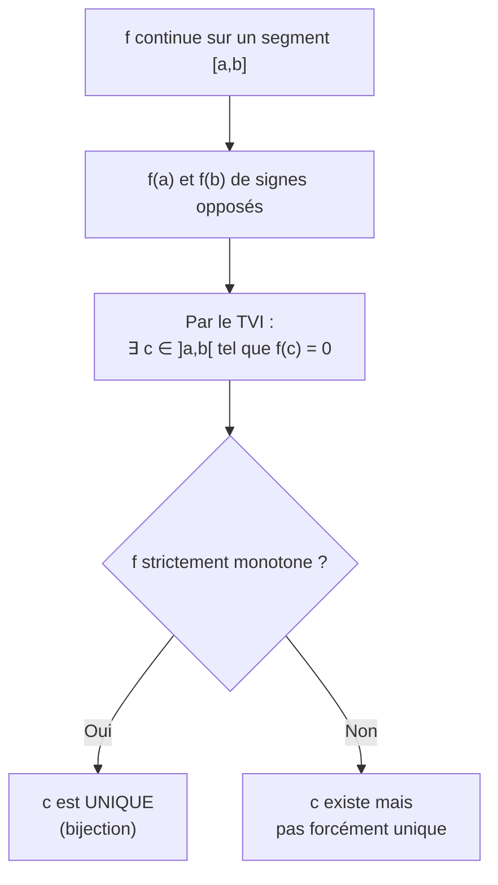
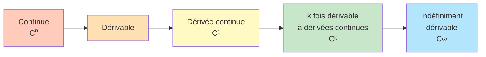
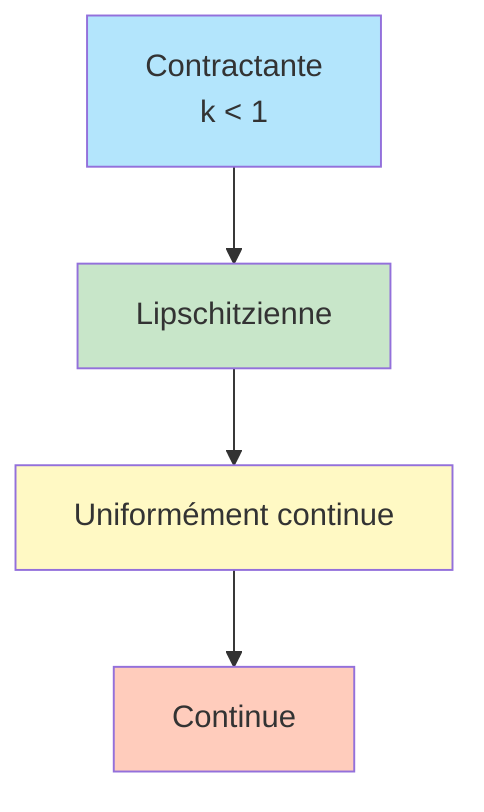

# Fonctions d'une Variable Réelle

L'étude rigoureuse des fonctions d'une variable réelle constitue le coeur de l'analyse en Math Sup. On formalise ici les notions de limite, continuité et dérivabilité vues au lycée avec la rigueur $\varepsilon$-$\delta$.

> [!quote] Prérequis
> [[Fonctions]], [[Limites et Continuité]], [[Dérivation]], [[Ensembles et Applications]]

## Limites de fonctions

### Définition formelle

> [!abstract] Définition — Limite finie en un point
> Soit $f : I \to \mathbb{R}$ et $a \in \bar{I}$ (adhérence de $I$). On dit que $f$ admet la **limite** $\ell \in \mathbb{R}$ en $a$ si :
> $$\forall \varepsilon > 0, \, \exists \delta > 0, \, \forall x \in I, \quad |x - a| < \delta \implies |f(x) - \ell| < \varepsilon$$

> [!abstract] Définition — Limite en $+\infty$
> $$\lim_{x \to +\infty} f(x) = \ell \iff \forall \varepsilon > 0, \, \exists A > 0, \, \forall x \geq A, \quad |f(x) - \ell| < \varepsilon$$

> [!abstract] Définition — Limite infinie
> $$\lim_{x \to a} f(x) = +\infty \iff \forall M > 0, \, \exists \delta > 0, \, \forall x \in I, \quad |x - a| < \delta \implies f(x) > M$$

### Propriétés

- **Unicité** : si la limite existe, elle est unique
- **Caractérisation séquentielle** : $\lim_{x \to a} f(x) = \ell$ ssi pour toute suite $(x_n)$ convergeant vers $a$ (avec $x_n \neq a$), on a $\lim f(x_n) = \ell$

> [!tip] La caractérisation séquentielle est très utile
> Pour **prouver** qu'une limite existe, on utilise la définition $\varepsilon$-$\delta$.
> Pour **montrer qu'une limite n'existe pas**, on exhibe deux suites tendant vers $a$ dont les images tendent vers des limites différentes.

### Opérations sur les limites

Les limites sont compatibles avec les opérations algébriques (somme, produit, quotient, composition) sauf dans les **formes indéterminées** :

$$+\infty - \infty, \quad 0 \times \infty, \quad \frac{\infty}{\infty}, \quad \frac{0}{0}, \quad 0^0, \quad 1^{\infty}, \quad \infty^0$$

## Continuité

### Définition

> [!abstract] Définition
> $f : I \to \mathbb{R}$ est **continue en** $a \in I$ si :
> $$\lim_{x \to a} f(x) = f(a)$$
> C'est-à-dire : $\forall \varepsilon > 0, \, \exists \delta > 0, \, \forall x \in I, \quad |x - a| < \delta \implies |f(x) - f(a)| < \varepsilon$

$f$ est **continue sur** $I$ si elle est continue en tout point de $I$.

### Prolongement par continuité

Si $\lim_{x \to a} f(x) = \ell$ existe mais $f$ n'est pas définie en $a$, on peut définir $\tilde{f}(a) = \ell$ pour obtenir une fonction continue. C'est le **prolongement par continuité**.

### Théorèmes fondamentaux

> [!abstract] Théorème des valeurs intermédiaires (TVI)
> Si $f : [a, b] \to \mathbb{R}$ est **continue** et si $f(a) \leq k \leq f(b)$ (ou $f(b) \leq k \leq f(a)$), alors il existe $c \in [a, b]$ tel que $f(c) = k$.

> [!abstract] Théorème — Image d'un segment
> Si $f : [a, b] \to \mathbb{R}$ est continue, alors $f([a, b])$ est un **segment** $[m, M]$ où :
> - $m = \min_{[a,b]} f$ et $M = \max_{[a,b]} f$
>
> En particulier, $f$ est **bornée** et atteint ses bornes.

> [!abstract] Théorème de la bijection
> Si $f : I \to \mathbb{R}$ est **continue et strictement monotone** sur un intervalle $I$, alors $f$ réalise une **bijection** de $I$ sur $f(I)$, et $f^{-1}$ est continue et strictement monotone de même sens.

### Continuité uniforme

> [!abstract] Définition
> $f : I \to \mathbb{R}$ est **uniformément continue** sur $I$ si :
> $$\forall \varepsilon > 0, \, \exists \delta > 0, \, \forall (x, y) \in I^2, \quad |x - y| < \delta \implies |f(x) - f(y)| < \varepsilon$$

La différence avec la continuité simple : $\delta$ ne dépend **pas** du point, mais seulement de $\varepsilon$.

> [!abstract] Théorème de Heine
> Toute fonction **continue** sur un **segment** $[a, b]$ est **uniformément continue** sur $[a, b]$.

> [!warning] Attention
> $f(x) = x^2$ est continue sur $\mathbb{R}$ mais **pas** uniformément continue sur $\mathbb{R}$.
> $f(x) = \sin(1/x)$ est continue sur $]0, 1]$ mais pas uniformément continue.

## Dérivabilité

### Définition rigoureuse

> [!abstract] Définition
> $f : I \to \mathbb{R}$ est **dérivable en** $a \in I$ si la limite suivante existe (et est finie) :
> $$f'(a) = \lim_{h \to 0} \frac{f(a + h) - f(a)}{h} = \lim_{x \to a} \frac{f(x) - f(a)}{x - a}$$

### Classes de régularité

> [!warning] Implications strictes
> - Dérivable $\implies$ continue (mais la réciproque est **fausse** : $|x|$)
> - Dérivable $\not\implies$ dérivée continue (ex: $x^2 \sin(1/x)$)
> - $C^1 \implies$ dérivable, mais dérivable $\not\implies$ $C^1$

### Dérivées des fonctions composées

Si $f$ est dérivable en $a$ et $g$ dérivable en $f(a)$, alors $g \circ f$ est dérivable en $a$ et :

$$(g \circ f)'(a) = g'(f(a)) \cdot f'(a)$$

### Dérivée de la réciproque

Si $f$ est bijective et dérivable en $a$ avec $f'(a) \neq 0$, alors $f^{-1}$ est dérivable en $f(a)$ et :

$$(f^{-1})'(f(a)) = \frac{1}{f'(a)}$$

## Théorèmes fondamentaux du calcul différentiel

### Théorème de Rolle

> [!abstract] Théorème de Rolle
> Si $f : [a, b] \to \mathbb{R}$ est :
> - continue sur $[a, b]$
> - dérivable sur $]a, b[$
> - $f(a) = f(b)$
>
> Alors il existe $c \in ]a, b[$ tel que $f'(c) = 0$.

### Théorème des accroissements finis (TAF)

> [!abstract] Théorème des accroissements finis (Lagrange)
> Si $f : [a, b] \to \mathbb{R}$ est continue sur $[a, b]$ et dérivable sur $]a, b[$, alors il existe $c \in ]a, b[$ tel que :
> $$f(b) - f(a) = f'(c)(b - a)$$

**Interprétation géométrique :** il existe un point où la tangente est parallèle à la sécante $(A, B)$.

### Inégalité des accroissements finis

> [!abstract] Corollaire
> Si $|f'(x)| \leq M$ pour tout $x \in ]a, b[$, alors :
> $$|f(b) - f(a)| \leq M |b - a|$$

> [!tip] Applications du TAF
> 1. **Lien dérivée-monotonie** : $f' \geq 0$ sur $I$ $\iff$ $f$ croissante sur $I$
> 2. **Dérivée nulle** : $f' = 0$ sur $I$ $\iff$ $f$ constante sur $I$
> 3. **Majoration d'erreurs** et encadrements

## Fonctions lipschitziennes

> [!abstract] Définition
> $f : I \to \mathbb{R}$ est **$k$-lipschitzienne** ($k > 0$) si :
> $$\forall (x, y) \in I^2, \quad |f(x) - f(y)| \leq k |x - y|$$

> [!tip] Critère pratique
> Si $f$ est dérivable et $|f'| \leq k$ sur $I$, alors $f$ est $k$-lipschitzienne (par l'IAF).

## Convexité

### Définition

> [!abstract] Définition
> $f : I \to \mathbb{R}$ est **convexe** si pour tous $x, y \in I$ et $t \in [0, 1]$ :
> $$f(tx + (1-t)y) \leq tf(x) + (1-t)f(y)$$

**Interprétation :** la courbe est en dessous de toute corde.

### Caractérisations

| Condition | Convexe | Strictement convexe |
|---|---|---|
| $f$ dérivable | $f'$ croissante | $f'$ strictement croissante |
| $f$ deux fois dérivable | $f'' \geq 0$ | $f'' > 0$ (suffisant) |

### Inégalités classiques issues de la convexité

> [!important] Inégalité de Jensen
> Si $f$ est convexe et $\lambda_1 + \cdots + \lambda_n = 1$ avec $\lambda_i \geq 0$ :
> $$f\left(\sum_{i=1}^n \lambda_i x_i\right) \leq \sum_{i=1}^n \lambda_i f(x_i)$$

Applications : inégalité arithmético-géométrique, inégalité de Young, Hölder.

## Formules de Taylor

### Taylor-Lagrange

> [!abstract] Théorème — Taylor avec reste de Lagrange
> Si $f \in C^n([a, b])$ et $f^{(n+1)}$ existe sur $]a, b[$, alors il existe $c \in ]a, b[$ tel que :
> $$f(b) = \sum_{k=0}^{n} \frac{f^{(k)}(a)}{k!}(b-a)^k + \frac{f^{(n+1)}(c)}{(n+1)!}(b-a)^{n+1}$$

### Taylor-Young

> [!abstract] Théorème — Taylor-Young
> Si $f$ est $n$ fois dérivable en $a$, alors au voisinage de $a$ :
> $$f(x) = \sum_{k=0}^{n} \frac{f^{(k)}(a)}{k!}(x-a)^k + o((x-a)^n)$$

C'est le lien avec les [[Développements Limités]].

### Taylor avec reste intégral

> [!abstract] Théorème — Taylor avec reste intégral
> Si $f \in C^{n+1}([a, b])$, alors :
> $$f(b) = \sum_{k=0}^{n} \frac{f^{(k)}(a)}{k!}(b-a)^k + \int_a^b \frac{(b-t)^n}{n!} f^{(n+1)}(t) \, dt$$

Le reste intégral est souvent le plus pratique pour les **majorations fines**.

## Exercices types

> [!example] Exercice 1 — Continuité uniforme
> Montrer que $f(x) = \sqrt{x}$ est uniformément continue sur $[0, +\infty[$.
>
> **Idée :** Sur $[0, 1]$ par Heine ; sur $[1, +\infty[$, $f$ est $\frac{1}{2}$-lipschitzienne car $|f'(x)| = \frac{1}{2\sqrt{x}} \leq \frac{1}{2}$.

> [!example] Exercice 2 — Application du TAF
> Montrer que pour tout $x > 0$ : $\dfrac{x}{1+x} < \ln(1+x) < x$.
>
> **Idée :** Appliquer l'IAF à $f(t) = \ln(1+t)$ sur $[0, x]$ avec $f'(t) = \frac{1}{1+t}$.

> [!example] Exercice 3 — Convexité
> Montrer l'inégalité arithmético-géométrique : $\sqrt{ab} \leq \dfrac{a+b}{2}$ pour $a, b > 0$.
>
> **Idée :** Appliquer l'inégalité de Jensen à $f(x) = -\ln(x)$ (convexe).

## À retenir

> [!important] Les points clés
> 1. La **caractérisation séquentielle** est l'outil principal pour les limites
> 2. **Heine** : continue sur un segment $\implies$ uniformément continue
> 3. **TVI** : existence de solutions ; **bijection** : unicité si strictement monotone
> 4. **TAF** : le pont entre $f'$ et le comportement global de $f$
> 5. **Taylor** : trois formes selon l'usage (Young pour les DL, Lagrange pour les majorations, intégral pour la précision)
> 6. Hiérarchie : contractante $\subset$ lipschitzienne $\subset$ unif. continue $\subset$ continue
