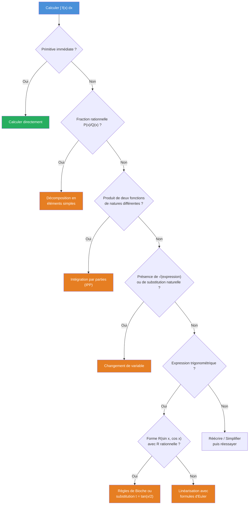

# Intégration

L'intégration est l'un des piliers de l'analyse mathématique. Ce chapitre développe la théorie de l'intégrale de Riemann sur un segment, ses propriétés fondamentales, le lien avec les primitives via le théorème fondamental de l'analyse, et les techniques de calcul au programme de MPSI.


## 1. Intégrale de Riemann

### 1.1. Subdivisions et sommes de Darboux

Soit $f : [a, b] \to \mathbb{R}$ une fonction bornée. Une **subdivision** de $[a, b]$ est une suite finie $\sigma = (x_0, x_1, \dots, x_n)$ avec :

$$a = x_0 < x_1 < \cdots < x_n = b$$

> [!abstract] Définition -- Sommes de Darboux
> Pour une subdivision $\sigma = (x_0, \dots, x_n)$ et $f$ bornée sur $[a, b]$, on pose :
> - $m_k = \inf_{x \in [x_{k-1}, x_k]} f(x)$ et $M_k = \sup_{x \in [x_{k-1}, x_k]} f(x)$
> - **Somme de Darboux inférieure** : $s(f, \sigma) = \displaystyle\sum_{k=1}^{n} m_k (x_k - x_{k-1})$
> - **Somme de Darboux supérieure** : $S(f, \sigma) = \displaystyle\sum_{k=1}^{n} M_k (x_k - x_{k-1})$

On a toujours $s(f, \sigma) \leqslant S(f, \sigma)$.

> [!important] Propriété de raffinement
> Si $\sigma'$ est plus fine que $\sigma$ (c'est-à-dire $\sigma \subset \sigma'$), alors :
> $$s(f, \sigma) \leqslant s(f, \sigma') \leqslant S(f, \sigma') \leqslant S(f, \sigma)$$
> Autrement dit, raffiner une subdivision resserre l'encadrement.

### Visualisation animée (Manim)

> [!note] Ce que montre l'animation
> Pour une fonction croissante, la **somme de Darboux inférieure** $s(f,\sigma)$ (rectangles verts, échantillon à gauche) sous-estime l'aire, et la **supérieure** $S(f,\sigma)$ (rectangles bleus, échantillon à droite) la surestime. En raffinant la subdivision, l'écart $S(f,\sigma) - s(f,\sigma)$ tend vers $0$ : les deux sommes se rejoignent vers l'intégrale, ce qui est précisément le critère d'intégrabilité de Riemann.

```manim
# Rendu : manimgl darboux.py SommesDeDarboux
from manimlib import *


class SommesDeDarboux(Scene):
    def construct(self):
        def f(x):
            return 0.25 * x**2 + 0.4        # croissante sur [0.5, 4]

        axes = Axes(x_range=(0, 4.5), y_range=(0, 6), height=6, width=10)
        courbe = axes.get_graph(f, x_range=(0.5, 4), color=YELLOW)
        self.play(ShowCreation(axes), ShowCreation(courbe))
        a, b = 0.5, 4

        def darboux(dx):
            # f croissante : échantillon "gauche" = inf, "droite" = sup
            bas = axes.get_riemann_rectangles(
                courbe, x_range=(a, b), dx=dx, input_sample_type="left",
                colors=(GREEN, GREEN), fill_opacity=0.5, stroke_width=1)
            haut = axes.get_riemann_rectangles(
                courbe, x_range=(a, b), dx=dx, input_sample_type="right",
                colors=(BLUE, BLUE), fill_opacity=0.25, stroke_width=1)
            return bas, haut

        bas, haut = darboux(0.5)
        self.play(FadeIn(haut), FadeIn(bas))
        legende = VGroup(
            Tex(r"s(f,\sigma)", color=GREEN),
            Tex(r"S(f,\sigma)", color=BLUE),
        ).arrange(DOWN, aligned_edge=LEFT).to_corner(UL).set_backstroke()
        self.play(Write(legende))
        self.wait()

        for dx in [0.25, 0.1, 0.05]:
            nb, nh = darboux(dx)
            self.play(Transform(bas, nb), Transform(haut, nh), run_time=1.3)
            self.wait(0.3)

        note = Tex(r"S(f,\sigma) - s(f,\sigma) \xrightarrow[\|\sigma\| \to 0]{} 0")
        note.to_edge(UP).set_backstroke()
        self.play(Write(note))
        self.wait(2)
```

### 1.2. Fonctions en escalier

> [!abstract] Définition -- Fonction en escalier
> Une fonction $\varphi : [a, b] \to \mathbb{R}$ est dite **en escalier** s'il existe une subdivision $\sigma = (x_0, \dots, x_n)$ de $[a, b]$ telle que $\varphi$ est constante sur chaque intervalle ouvert $]x_{k-1}, x_k[$. On note $\mathcal{E}([a, b])$ l'ensemble des fonctions en escalier sur $[a, b]$.

L'intégrale d'une fonction en escalier $\varphi$, constante égale à $c_k$ sur $]x_{k-1}, x_k[$, est :

$$\int_a^b \varphi(t)\, dt = \sum_{k=1}^{n} c_k (x_k - x_{k-1})$$

Cette valeur ne dépend pas de la subdivision adaptée choisie.

### 1.3. Intégrabilité au sens de Riemann

> [!abstract] Définition -- Intégrabilité
> Une fonction bornée $f : [a, b] \to \mathbb{R}$ est **intégrable au sens de Riemann** si :
> $$\sup_\sigma s(f, \sigma) = \inf_\sigma S(f, \sigma)$$
> Cette valeur commune est notée $\displaystyle\int_a^b f(t)\, dt$.
>
> De manière équivalente, $f$ est intégrable si et seulement si :
> $$\forall \varepsilon > 0, \; \exists \sigma, \quad S(f, \sigma) - s(f, \sigma) < \varepsilon$$


## 2. Classes de fonctions intégrables

> [!abstract] Théorème -- Intégrabilité des fonctions continues
> Toute fonction **continue** sur $[a, b]$ est intégrable sur $[a, b]$.

> [!tip] Esquisse de preuve
> Une fonction continue sur un segment est **uniformément continue** (théorème de Heine). Pour $\varepsilon > 0$, il existe $\delta > 0$ tel que $|x - y| < \delta \Rightarrow |f(x) - f(y)| < \varepsilon / (b - a)$. On choisit une subdivision de pas $< \delta$, et l'on obtient $S(f, \sigma) - s(f, \sigma) < \varepsilon$.

> [!abstract] Théorème -- Intégrabilité des fonctions monotones
> Toute fonction **monotone** sur $[a, b]$ est intégrable sur $[a, b]$.

> [!tip] Esquisse de preuve
> Si $f$ est croissante, pour une subdivision régulière $(x_k = a + k(b-a)/n)$, on a $m_k = f(x_{k-1})$ et $M_k = f(x_k)$. Alors :
> $$S(f,\sigma) - s(f,\sigma) = \frac{b-a}{n}\sum_{k=1}^n \big(f(x_k) - f(x_{k-1})\big) = \frac{b-a}{n}\big(f(b) - f(a)\big) \xrightarrow[n\to\infty]{} 0$$

> [!abstract] Théorème -- Intégrabilité des fonctions continues par morceaux
> Toute fonction **continue par morceaux** sur $[a, b]$ est intégrable sur $[a, b]$.


## 3. Propriétés de l'intégrale

Soient $f, g$ intégrables sur $[a, b]$ et $\lambda \in \mathbb{R}$.

### 3.1. Linéarité

$$\int_a^b \big(\lambda f(t) + g(t)\big)\, dt = \lambda \int_a^b f(t)\, dt + \int_a^b g(t)\, dt$$

### 3.2. Positivité et croissance

> [!abstract] Théorème -- Positivité
> Si $f \geqslant 0$ sur $[a, b]$, alors $\displaystyle\int_a^b f(t)\, dt \geqslant 0$.

> [!important] Corollaire -- Croissance
> Si $f \leqslant g$ sur $[a, b]$, alors $\displaystyle\int_a^b f(t)\, dt \leqslant \int_a^b g(t)\, dt$.

> [!abstract] Théorème -- Stricte positivité
> Si $f$ est **continue**, $f \geqslant 0$ sur $[a, b]$, et $f \neq 0$, alors $\displaystyle\int_a^b f(t)\, dt > 0$.

### 3.3. Relation de Chasles

Pour tout $c \in [a, b]$ :

$$\int_a^b f(t)\, dt = \int_a^c f(t)\, dt + \int_c^b f(t)\, dt$$

Plus généralement, cette relation vaut pour $a, b, c$ dans un ordre quelconque, en posant $\displaystyle\int_b^a f(t)\, dt = -\int_a^b f(t)\, dt$.

### 3.4. Inégalité triangulaire intégrale

> [!abstract] Théorème -- Inégalité triangulaire
> Si $f$ est intégrable sur $[a, b]$, alors $|f|$ l'est aussi, et :
> $$\left|\int_a^b f(t)\, dt\right| \leqslant \int_a^b |f(t)|\, dt$$

### 3.5. Valeur moyenne

> [!abstract] Définition -- Valeur moyenne
> La **valeur moyenne** de $f$ sur $[a, b]$ est :
> $$\mu(f) = \frac{1}{b - a}\int_a^b f(t)\, dt$$

> [!abstract] Théorème -- Valeur intermédiaire pour les intégrales
> Si $f$ est **continue** sur $[a, b]$, il existe $c \in [a, b]$ tel que :
> $$\int_a^b f(t)\, dt = (b - a) f(c)$$


## 4. Théorème fondamental de l'analyse

C'est le résultat central de ce chapitre : il relie intégration et dérivation.

> [!abstract] Théorème fondamental de l'analyse (première forme)
> Soit $f$ **continue** sur $[a, b]$. La fonction $F$ définie par :
> $$F(x) = \int_a^x f(t)\, dt$$
> est l'unique primitive de $f$ sur $[a, b]$ qui s'annule en $a$. En particulier, $F$ est de classe $\mathcal{C}^1$ et $F'(x) = f(x)$.

> [!tip] Esquisse de preuve
> On écrit le taux d'accroissement :
> $$\frac{F(x+h) - F(x)}{h} = \frac{1}{h}\int_x^{x+h} f(t)\, dt$$
> Par le théorème de la valeur moyenne, il existe $c_h$ entre $x$ et $x + h$ tel que cette expression vaut $f(c_h)$. Quand $h \to 0$, $c_h \to x$ et $f(c_h) \to f(x)$ par continuité.

> [!abstract] Théorème fondamental (seconde forme)
> Si $f$ est continue sur $[a, b]$ et $G$ est une primitive quelconque de $f$, alors :
> $$\int_a^b f(t)\, dt = G(b) - G(a) = \big[G(t)\big]_a^b$$

> [!example] Exemple
> Calculer $\displaystyle\int_0^1 t^2\, dt$.
>
> Une primitive de $t \mapsto t^2$ est $G(t) = \dfrac{t^3}{3}$. Donc :
> $$\int_0^1 t^2\, dt = \frac{1^3}{3} - \frac{0^3}{3} = \frac{1}{3}$$


## 5. Formules de Taylor

### 5.1. Formule de Taylor avec reste intégral

> [!abstract] Théorème -- Taylor avec reste intégral
> Si $f$ est de classe $\mathcal{C}^{n+1}$ sur $[a, b]$, alors pour tout $x \in [a, b]$ :
> $$f(x) = \sum_{k=0}^{n} \frac{f^{(k)}(a)}{k!}(x - a)^k + \int_a^x \frac{(x - t)^n}{n!} f^{(n+1)}(t)\, dt$$

> [!tip] Esquisse de preuve
> Par récurrence sur $n$. Le cas $n = 0$ est simplement $f(x) = f(a) + \int_a^x f'(t)\, dt$. Le passage de $n$ à $n+1$ se fait par une intégration par parties du reste intégral.

### 5.2. Inégalité de Taylor-Lagrange

> [!abstract] Corollaire -- Inégalité de Taylor-Lagrange
> Sous les mêmes hypothèses, si $\|f^{(n+1)}\|_\infty = M_{n+1}$, alors :
> $$\left|f(x) - \sum_{k=0}^n \frac{f^{(k)}(a)}{k!}(x-a)^k\right| \leqslant M_{n+1} \frac{|x - a|^{n+1}}{(n+1)!}$$


## 6. Techniques d'intégration

### 6.1. Intégration par parties (IPP)

> [!abstract] Théorème -- Intégration par parties
> Soient $u, v$ de classe $\mathcal{C}^1$ sur $[a, b]$. Alors :
> $$\int_a^b u(t) v'(t)\, dt = \big[u(t)v(t)\big]_a^b - \int_a^b u'(t) v(t)\, dt$$

> [!example] Exemple -- Calcul de $\int_0^1 t e^t\, dt$
> On pose $u(t) = t$ (donc $u'(t) = 1$) et $v'(t) = e^t$ (donc $v(t) = e^t$).
>
> $$\int_0^1 t e^t\, dt = \big[t e^t\big]_0^1 - \int_0^1 e^t\, dt = e - \big[e^t\big]_0^1 = e - (e - 1) = 1$$

> [!tip] Astuce mnémotechnique
> On choisit $u$ comme la fonction qui se simplifie en dérivant (polynôme, $\ln$, $\arctan$) et $v'$ comme celle qui se primitive facilement ($e^x$, $\sin$, $\cos$).

### 6.2. Changement de variable

> [!abstract] Théorème -- Changement de variable
> Soit $\varphi : [\alpha, \beta] \to [a, b]$ de classe $\mathcal{C}^1$, avec $\varphi(\alpha) = a$ et $\varphi(\beta) = b$. Si $f$ est continue sur $[a, b]$, alors :
> $$\int_a^b f(t)\, dt = \int_\alpha^\beta f\big(\varphi(u)\big)\,\varphi'(u)\, du$$

> [!example] Exemple -- Calcul de $\int_0^1 \sqrt{1 - t^2}\, dt$
> On pose $t = \sin u$, donc $dt = \cos u\, du$. Quand $t = 0$, $u = 0$ ; quand $t = 1$, $u = \pi/2$.
>
> $$\int_0^1 \sqrt{1 - t^2}\, dt = \int_0^{\pi/2} \cos^2 u\, du = \int_0^{\pi/2} \frac{1 + \cos(2u)}{2}\, du = \frac{\pi}{4}$$
>
> On retrouve bien l'aire d'un quart de disque unité.

### 6.3. Décomposition en éléments simples

Pour intégrer une fraction rationnelle $\dfrac{P(x)}{Q(x)}$, on procède en trois étapes :

1. **Division euclidienne** si $\deg P \geqslant \deg Q$
2. **Décomposition** de la partie fractionnaire en éléments simples
3. **Intégration** de chaque élément simple

> [!tip] Primitives des éléments simples (sur $\mathbb{R}$)
> | Élément simple | Primitive |
> |---|---|
> | $\dfrac{1}{x - a}$ | $\ln|x - a|$ |
> | $\dfrac{1}{(x - a)^n}$, $n \geqslant 2$ | $\dfrac{-1}{(n-1)(x-a)^{n-1}}$ |
> | $\dfrac{\alpha x + \beta}{x^2 + px + q}$ ($\Delta < 0$) | $\dfrac{\alpha}{2}\ln(x^2+px+q) + \dfrac{2\beta - \alpha p}{\sqrt{4q-p^2}}\arctan\dfrac{2x+p}{\sqrt{4q-p^2}}$ |

> [!example] Exemple -- $\int \frac{dx}{x^2 - 1}$
> On décompose : $\dfrac{1}{x^2 - 1} = \dfrac{1}{(x-1)(x+1)} = \dfrac{1/2}{x-1} - \dfrac{1/2}{x+1}$.
>
> Donc : $\displaystyle\int \frac{dx}{x^2-1} = \frac{1}{2}\ln|x-1| - \frac{1}{2}\ln|x+1| + C = \frac{1}{2}\ln\left|\frac{x-1}{x+1}\right| + C$.


### 6.4. Arbre de décision : choix de la technique




## 7. Sommes de Riemann

> [!abstract] Théorème -- Convergence des sommes de Riemann
> Si $f$ est **continue** sur $[a, b]$, alors pour toute suite de subdivisions $(\sigma_n)$ dont le pas tend vers $0$, et pour tout choix de points intermédiaires $\xi_k \in [x_{k-1}, x_k]$ :
> $$\sum_{k=1}^{n} f(\xi_k)(x_k - x_{k-1}) \xrightarrow[n \to \infty]{} \int_a^b f(t)\, dt$$

En pratique, sur une subdivision régulière de $[0, 1]$, avec $\xi_k = k/n$ :

$$\frac{1}{n}\sum_{k=1}^{n} f\!\left(\frac{k}{n}\right) \xrightarrow[n \to \infty]{} \int_0^1 f(t)\, dt$$

et plus généralement sur $[a, b]$ :

$$\frac{b - a}{n}\sum_{k=0}^{n-1} f\!\left(a + k\frac{b-a}{n}\right) \xrightarrow[n \to \infty]{} \int_a^b f(t)\, dt$$

> [!example] Exemple -- Calcul de limite par sommes de Riemann
> Calculer $\displaystyle\lim_{n \to \infty} \sum_{k=1}^{n} \frac{n}{n^2 + k^2}$.
>
> On factorise : $\displaystyle\sum_{k=1}^{n} \frac{n}{n^2 + k^2} = \frac{1}{n}\sum_{k=1}^{n} \frac{1}{1 + (k/n)^2}$.
>
> C'est une somme de Riemann pour $f(t) = \dfrac{1}{1 + t^2}$ sur $[0, 1]$.
>
> Donc la limite vaut : $\displaystyle\int_0^1 \frac{dt}{1 + t^2} = \big[\arctan t\big]_0^1 = \frac{\pi}{4}$.


## 8. Inégalités intégrales classiques

### 8.1. Inégalité de Cauchy-Schwarz intégrale

> [!abstract] Théorème -- Inégalité de Cauchy-Schwarz intégrale
> Soient $f, g$ continues sur $[a, b]$. Alors :
> $$\left(\int_a^b f(t) g(t)\, dt\right)^2 \leqslant \left(\int_a^b f(t)^2\, dt\right)\left(\int_a^b g(t)^2\, dt\right)$$
> avec égalité si et seulement si $f$ et $g$ sont proportionnelles (c'est-à-dire $\exists \lambda \in \mathbb{R},\; f = \lambda g$ ou $g = 0$).

> [!tip] Esquisse de preuve
> Pour tout $\lambda \in \mathbb{R}$, on a $\displaystyle\int_a^b (f + \lambda g)^2 \geqslant 0$. On développe :
> $$\int_a^b f^2 + 2\lambda\int_a^b fg + \lambda^2 \int_a^b g^2 \geqslant 0$$
> Ce trinôme en $\lambda$ est positif, donc son discriminant est négatif ou nul, ce qui donne l'inégalité.

> [!example] Application -- Inégalité de Cauchy-Schwarz
> Montrer que pour $f$ continue sur $[0, 1]$ : $\displaystyle\left(\int_0^1 f(t)\, dt\right)^2 \leqslant \int_0^1 f(t)^2\, dt$.
>
> Il suffit d'appliquer Cauchy-Schwarz avec $g = 1$ : $\displaystyle\left(\int_0^1 f \cdot 1\right)^2 \leqslant \int_0^1 f^2 \cdot \int_0^1 1 = \int_0^1 f^2$.

### 8.2. Inégalités de la moyenne

> [!abstract] Théorème -- Encadrement intégral
> Si $m \leqslant f(t) \leqslant M$ pour tout $t \in [a, b]$ (avec $a < b$), alors :
> $$m(b - a) \leqslant \int_a^b f(t)\, dt \leqslant M(b - a)$$


## 9. Exercices types corrigés

### Exercice 1 : IPP itérée

> [!example] Exercice -- Calcul de $I_n = \int_0^{\pi/2} \sin^n(t)\, dt$ (intégrales de Wallis)
> **Relation de récurrence par IPP.** On écrit $\sin^n t = \sin^{n-1} t \cdot \sin t$, puis on pose $u = \sin^{n-1} t$ et $v' = \sin t$ :
>
> $$I_n = \big[-\sin^{n-1}(t)\cos(t)\big]_0^{\pi/2} + (n-1)\int_0^{\pi/2} \sin^{n-2}(t) \cos^2(t)\, dt$$
>
> Le crochet s'annule. On utilise $\cos^2 t = 1 - \sin^2 t$ :
>
> $$I_n = (n-1)(I_{n-2} - I_n)$$
>
> D'où la relation de récurrence : $\boxed{I_n = \dfrac{n-1}{n}\, I_{n-2}}$
>
> Avec $I_0 = \dfrac{\pi}{2}$ et $I_1 = 1$, on obtient par exemple :
> - $I_2 = \dfrac{\pi}{4}$, $I_3 = \dfrac{2}{3}$, $I_4 = \dfrac{3\pi}{16}$, $I_5 = \dfrac{8}{15}$.

### Exercice 2 : Changement de variable

> [!example] Exercice -- Calcul de $\int_0^1 \frac{\ln(1+t)}{1+t^2}\, dt$
> On note $I = \displaystyle\int_0^1 \frac{\ln(1+t)}{1+t^2}\, dt$. On effectue le changement de variable $t = \tan\theta$, $dt = \dfrac{d\theta}{\cos^2\theta}$ :
>
> $$I = \int_0^{\pi/4} \frac{\ln(1 + \tan\theta)}{1 + \tan^2\theta} \cdot \frac{d\theta}{\cos^2\theta} = \int_0^{\pi/4} \ln(1 + \tan\theta)\, d\theta$$
>
> car $1 + \tan^2\theta = 1/\cos^2\theta$. On utilise alors la substitution $\theta \mapsto \pi/4 - \theta$ :
>
> $$I = \int_0^{\pi/4} \ln\!\left(1 + \tan\!\left(\frac{\pi}{4} - \theta\right)\right) d\theta = \int_0^{\pi/4} \ln\!\left(\frac{2}{1 + \tan\theta}\right) d\theta$$
>
> En additionnant : $2I = \displaystyle\int_0^{\pi/4} \ln 2\, d\theta = \frac{\pi}{4}\ln 2$, d'où $\boxed{I = \dfrac{\pi}{8}\ln 2}$.

### Exercice 3 : Somme de Riemann

> [!example] Exercice -- Limite de $\prod_{k=1}^{n}\left(1 + \frac{k}{n}\right)^{1/n}$
> Soit $P_n = \displaystyle\prod_{k=1}^{n}\left(1 + \frac{k}{n}\right)^{1/n}$. On passe au logarithme :
>
> $$\ln P_n = \frac{1}{n}\sum_{k=1}^{n} \ln\!\left(1 + \frac{k}{n}\right)$$
>
> C'est une somme de Riemann pour $f(t) = \ln(1 + t)$ sur $[0, 1]$ :
>
> $$\ln P_n \xrightarrow[n \to \infty]{} \int_0^1 \ln(1+t)\, dt = \big[(1+t)\ln(1+t) - (1+t)\big]_0^1 = 2\ln 2 - 1$$
>
> Donc $\boxed{P_n \to e^{2\ln 2 - 1} = \dfrac{4}{e}}$.

### Exercice 4 : Formule de Taylor

> [!example] Exercice -- Encadrement de $e$
> En appliquant l'inégalité de Taylor-Lagrange à $f(x) = e^x$ au point $a = 0$, à l'ordre $n$ :
>
> $$\left|e^1 - \sum_{k=0}^{n} \frac{1}{k!}\right| \leqslant \frac{e}{(n+1)!}$$
>
> car $\|f^{(n+1)}\|_{\infty, [0,1]} = e$. Pour $n = 4$ :
>
> $$\sum_{k=0}^{4} \frac{1}{k!} = 1 + 1 + \frac{1}{2} + \frac{1}{6} + \frac{1}{24} = \frac{65}{24} \approx 2{,}7083$$
>
> L'erreur est majorée par $e/120 < 3/120 = 0{,}025$, soit $e \in [2{,}683;\; 2{,}733]$.


## 10. Liens

- [[Équations Différentielles]] -- l'intégration est au coeur de la résolution des EDO
- [[Espaces Euclidiens]] -- le produit scalaire $L^2$ utilise l'intégrale
- [[Suites et Séries Numériques]] -- comparaison série-intégrale
- [[Développements Limités]] -- lien avec la formule de Taylor
