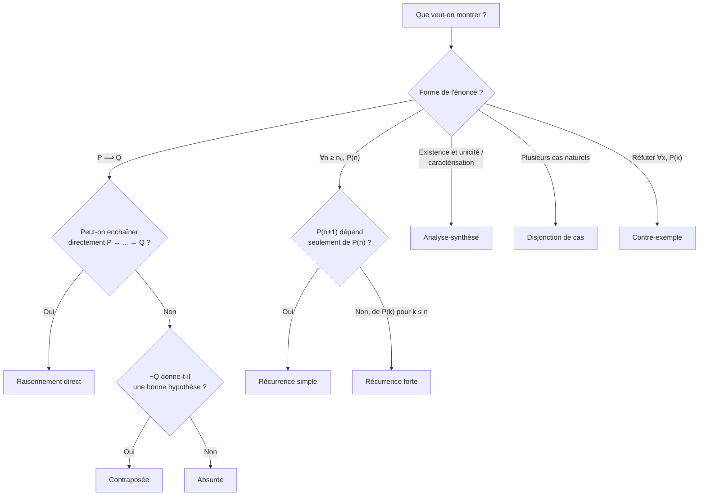

# Logique et Raisonnement

La logique mathématique constitue le socle de toute démonstration rigoureuse. Ce chapitre pose les fondations du langage et des méthodes de preuve utilisés dans l'ensemble du programme de Math Sup.

## 1. Propositions et connecteurs logiques

### 1.1 Propositions

> [!abstract] Définition
> Une **proposition** (ou assertion) est un énoncé mathématique qui est soit **vrai** (V), soit **faux** (F). On parle de **valeur de vérité**.

Exemples :
- "$2 + 3 = 5$" est une proposition vraie.
- "$\sqrt{2} \in \mathbb{Q}$" est une proposition fausse.
- "$x > 3$" n'est **pas** une proposition : c'est un **prédicat** (sa valeur de vérité dépend de $x$).

### 1.2 Connecteurs logiques

Soient $P$ et $Q$ deux propositions.

| Connecteur | Notation | Lecture |
|---|---|---|
| Négation | $\lnot P$ | "non $P$" |
| Conjonction | $P \land Q$ | "$P$ et $Q$" |
| Disjonction | $P \lor Q$ | "$P$ ou $Q$" (inclusif) |
| Implication | $P \Rightarrow Q$ | "si $P$ alors $Q$" |
| Équivalence | $P \Leftrightarrow Q$ | "$P$ si et seulement si $Q$" |

> [!important]
> L'implication $P \Rightarrow Q$ est **fausse uniquement** lorsque $P$ est vraie et $Q$ est fausse. En particulier, si $P$ est fausse, alors $P \Rightarrow Q$ est **toujours vraie** (ex falso quodlibet).

### 1.3 Tables de vérité

| $P$ | $Q$ | $\lnot P$ | $P \land Q$ | $P \lor Q$ | $P \Rightarrow Q$ | $P \Leftrightarrow Q$ |
|---|---|---|---|---|---|---|
| V | V | F | V | V | V | V |
| V | F | F | F | V | F | F |
| F | V | V | F | V | V | F |
| F | F | V | F | F | V | V |

> [!tip] Astuce mnémotechnique
> - $P \Rightarrow Q$ est équivalente à $\lnot P \lor Q$.
> - $P \Leftrightarrow Q$ signifie $(P \Rightarrow Q) \land (Q \Rightarrow P)$.

### 1.4 Propriétés fondamentales

Pour toutes propositions $P$, $Q$, $R$ :

- **Double négation** : $\lnot(\lnot P) \Leftrightarrow P$
- **Lois de De Morgan** :
$$\lnot(P \land Q) \Leftrightarrow (\lnot P) \lor (\lnot Q)$$
$$\lnot(P \lor Q) \Leftrightarrow (\lnot P) \land (\lnot Q)$$
- **Contraposée** : $(P \Rightarrow Q) \Leftrightarrow (\lnot Q \Rightarrow \lnot P)$
- **Distributivité** :
$$P \land (Q \lor R) \Leftrightarrow (P \land Q) \lor (P \land R)$$
$$P \lor (Q \land R) \Leftrightarrow (P \lor Q) \land (P \lor R)$$

## 2. Quantificateurs

### 2.1 Quantificateur universel $\forall$

> [!abstract] Définition
> Soit $P(x)$ un prédicat sur un ensemble $E$. La proposition $\forall x \in E,\; P(x)$ est **vraie** si $P(x)$ est vraie pour **tout** élément $x$ de $E$.

### 2.2 Quantificateur existentiel $\exists$

> [!abstract] Définition
> La proposition $\exists x \in E,\; P(x)$ est **vraie** s'il existe **au moins un** élément $x$ de $E$ tel que $P(x)$ soit vraie.

Le quantificateur $\exists !$ désigne l'existence et l'unicité : "$\exists ! x \in E,\; P(x)$" signifie qu'il existe un **unique** $x$ vérifiant $P(x)$.

### 2.3 Négation des quantificateurs

> [!important] Règles de négation
> $$\lnot\bigl(\forall x \in E,\; P(x)\bigr) \Leftrightarrow \exists x \in E,\; \lnot P(x)$$
> $$\lnot\bigl(\exists x \in E,\; P(x)\bigr) \Leftrightarrow \forall x \in E,\; \lnot P(x)$$

> [!example] Exemple
> **Proposition** : $\forall \varepsilon > 0,\; \exists N \in \mathbb{N},\; \forall n \geq N,\; |u_n - \ell| < \varepsilon$
>
> **Négation** : $\exists \varepsilon > 0,\; \forall N \in \mathbb{N},\; \exists n \geq N,\; |u_n - \ell| \geq \varepsilon$
>
> La première proposition exprime que la suite $(u_n)$ converge vers $\ell$. La seconde exprime qu'elle **ne converge pas** vers $\ell$.

### 2.4 Ordre des quantificateurs

> [!warning] Attention
> L'ordre des quantificateurs est crucial. En général :
> $$\forall x,\; \exists y,\; P(x,y) \quad \not\Leftrightarrow \quad \exists y,\; \forall x,\; P(x,y)$$
>
> **Exemple** : "$\forall x \in \mathbb{R},\; \exists y \in \mathbb{R},\; y > x$" est vraie ($y$ dépend de $x$), mais "$\exists y \in \mathbb{R},\; \forall x \in \mathbb{R},\; y > x$" est fausse (il n'existe pas de plus grand réel).

## 3. Types de raisonnement

### 3.1 Raisonnement direct

> [!abstract] Principe
> Pour montrer $P \Rightarrow Q$, on suppose $P$ vraie et on en déduit $Q$ par une chaîne d'implications logiques.

> [!example] Exemple : Somme de deux entiers pairs
> **Proposition** : Si $n$ et $m$ sont pairs, alors $n + m$ est pair.
>
> **Démonstration.** Supposons $n$ et $m$ pairs. Il existe $a, b \in \mathbb{Z}$ tels que $n = 2a$ et $m = 2b$. Alors $n + m = 2a + 2b = 2(a + b)$, qui est pair. $\blacksquare$

### 3.2 Raisonnement par contraposée

> [!abstract] Principe
> Pour montrer $P \Rightarrow Q$, on montre la contraposée $\lnot Q \Rightarrow \lnot P$, qui lui est logiquement équivalente.

> [!tip] Quand l'utiliser ?
> Ce raisonnement est utile lorsque la conclusion $Q$ est difficile à exploiter directement, mais $\lnot Q$ donne une hypothèse plus maniable.

> [!example] Exemple : Si $n^2$ est pair, alors $n$ est pair
> **Démonstration par contraposée.** Montrons : si $n$ est impair, alors $n^2$ est impair.
>
> Supposons $n$ impair : $n = 2k + 1$ pour un certain $k \in \mathbb{Z}$.
> Alors $n^2 = (2k+1)^2 = 4k^2 + 4k + 1 = 2(2k^2 + 2k) + 1$, qui est impair. $\blacksquare$

### 3.3 Raisonnement par l'absurde (reductio ad absurdum)

> [!abstract] Principe
> Pour montrer une proposition $P$, on suppose $\lnot P$ et on aboutit à une **contradiction** (c'est-à-dire une proposition de la forme $Q \land \lnot Q$).

> [!example] Exemple classique : Irrationalité de $\sqrt{2}$
> **Proposition** : $\sqrt{2} \notin \mathbb{Q}$.
>
> **Démonstration.** Supposons par l'absurde que $\sqrt{2} \in \mathbb{Q}$. Alors il existe $p, q \in \mathbb{Z}$, $q \neq 0$, avec $\gcd(p, q) = 1$ (fraction irréductible), tels que $\sqrt{2} = \frac{p}{q}$.
>
> En élevant au carré : $2 = \frac{p^2}{q^2}$, d'où $p^2 = 2q^2$.
>
> Donc $p^2$ est pair, donc $p$ est pair (par contraposée du résultat précédent). Écrivons $p = 2k$.
>
> Alors $4k^2 = 2q^2$, soit $q^2 = 2k^2$. Donc $q^2$ est pair, donc $q$ est pair.
>
> Mais alors $p$ et $q$ sont tous deux pairs, ce qui contredit $\gcd(p, q) = 1$. Contradiction. $\blacksquare$

### 3.4 Raisonnement par récurrence

#### Récurrence simple

> [!abstract] Théorème (Principe de récurrence)
> Soit $P(n)$ un prédicat défini pour $n \geq n_0$. Si :
> 1. **Initialisation** : $P(n_0)$ est vraie,
> 2. **Hérédité** : $\forall n \geq n_0,\; P(n) \Rightarrow P(n+1)$,
>
> alors $\forall n \geq n_0,\; P(n)$.

> [!example] Exemple : Somme des $n$ premiers entiers
> **Proposition** : $\forall n \geq 1,\; \displaystyle\sum_{k=1}^{n} k = \frac{n(n+1)}{2}$.
>
> **Initialisation.** Pour $n = 1$ : $\sum_{k=1}^{1} k = 1 = \frac{1 \cdot 2}{2}$. OK.
>
> **Hérédité.** Supposons $P(n)$ vraie pour un $n \geq 1$ fixé. Alors :
> $$\sum_{k=1}^{n+1} k = \sum_{k=1}^{n} k + (n+1) = \frac{n(n+1)}{2} + (n+1) = \frac{n(n+1) + 2(n+1)}{2} = \frac{(n+1)(n+2)}{2}$$
> C'est bien $P(n+1)$. $\blacksquare$

#### Récurrence forte (complète)

> [!abstract] Principe
> Pour montrer $\forall n \geq n_0,\; P(n)$, on montre :
> 1. **Initialisation** : $P(n_0)$ est vraie (et éventuellement quelques suivantes),
> 2. **Hérédité forte** : $\forall n \geq n_0,\; \bigl(\forall k \in \{n_0, \ldots, n\},\; P(k)\bigr) \Rightarrow P(n+1)$.

> [!example] Exemple : Tout entier $n \geq 2$ admet un diviseur premier
> **Initialisation.** $n = 2$ est premier, donc $2$ est son propre diviseur premier.
>
> **Hérédité.** Soit $n \geq 2$. Supposons que tout entier $k \in \{2, \ldots, n\}$ admette un diviseur premier. Si $n+1$ est premier, c'est terminé. Sinon, $n+1 = ab$ avec $2 \leq a, b \leq n$. Par hypothèse de récurrence forte, $a$ admet un diviseur premier $p$. Alors $p \mid a$ et $a \mid (n+1)$, donc $p \mid (n+1)$. $\blacksquare$

### 3.5 Analyse-synthèse

> [!abstract] Principe
> Ce raisonnement en deux phases sert à résoudre un problème d'existence et d'unicité (ou de caractérisation).
> - **Analyse** : On suppose qu'un objet vérifiant les conditions existe et on en déduit ses propriétés nécessaires (on trouve les candidats).
> - **Synthèse** : On vérifie que les candidats trouvés satisfont effectivement toutes les conditions.

> [!warning]
> L'analyse seule ne suffit **jamais** : elle montre seulement des conditions nécessaires. La synthèse est indispensable pour prouver que les candidats sont bien des solutions.

> [!example] Exemple
> **Problème** : Trouver toutes les fonctions $f : \mathbb{R} \to \mathbb{R}$ continues telles que $\forall x \in \mathbb{R},\; f(x) + f(-x) = 0$ et $f(1) = 1$.
>
> **Analyse.** Si $f$ est solution, alors $f$ est impaire (car $f(-x) = -f(x)$) et $f(1) = 1$. (On réduit les candidats possibles.)
>
> **Synthèse.** On vérifie que les candidats trouvés satisfont bien les conditions initiales.

### 3.6 Disjonction de cas

> [!abstract] Principe
> Pour montrer une proposition $P$, on partitionne l'ensemble de travail en cas disjoints et exhaustifs, puis on montre $P$ dans chaque cas.

> [!example] Exemple : $\forall n \in \mathbb{Z},\; n^2 + n$ est pair
> **Cas 1** : $n$ est pair. Alors $n = 2k$ et $n^2 + n = 4k^2 + 2k = 2(2k^2 + k)$, pair.
>
> **Cas 2** : $n$ est impair. Alors $n = 2k+1$ et $n^2 + n = (2k+1)^2 + (2k+1) = 4k^2 + 4k + 2 = 2(2k^2 + 2k + 1)$, pair. $\blacksquare$

### 3.7 Contre-exemple

> [!abstract] Principe
> Pour **réfuter** une proposition universelle $\forall x,\; P(x)$, il suffit d'exhiber **un seul** élément $x_0$ tel que $\lnot P(x_0)$.

> [!example] Exemple
> **Assertion fausse** : "Tout nombre premier est impair."
>
> **Contre-exemple** : $2$ est premier et pair. $\blacksquare$

## 4. Choisir le bon type de raisonnement

## 5. Erreurs de raisonnement courantes

### 5.1 Confusion implication / équivalence

> [!warning] Erreur typique
> Écrire "$\Leftrightarrow$" là où seul "$\Rightarrow$" est justifié. Chaque équivalence nécessite de vérifier les deux sens.

**Exemple d'erreur** : $x^2 = 4 \Leftrightarrow x = 2$. C'est faux : $x = -2$ est aussi solution. Le sens $\Leftarrow$ est vrai, mais pas $\Rightarrow$ (qui donne $x = 2$ **ou** $x = -2$).

### 5.2 Affirmation du conséquent

> [!warning]
> "$P \Rightarrow Q$ et $Q$ vraie" **ne permet pas** de conclure $P$. C'est le sophisme de l'affirmation du conséquent.
>
> Exemple : "S'il pleut, la route est mouillée. La route est mouillée. Donc il pleut." (Faux : un arrosage peut mouiller la route.)

### 5.3 Récurrence : oubli de l'initialisation

> [!warning]
> L'hérédité seule ne prouve rien sans initialisation.
>
> **Fausse preuve** : "Tous les entiers sont pairs." Hérédité : si $n$ est pair, alors $n + 2$ est pair. Vrai ! Mais l'initialisation échoue pour $n = 1$.

### 5.4 Quantificateurs inversés

> [!warning]
> Écrire $\exists y,\; \forall x,\; P(x,y)$ au lieu de $\forall x,\; \exists y,\; P(x,y)$ change radicalement le sens. La première affirme l'existence d'un $y$ **universel**, la seconde permet à $y$ de **dépendre** de $x$.

### 5.5 Division par une expression possiblement nulle

> [!warning]
> Toujours vérifier qu'un dénominateur est non nul avant de diviser. Simplifier par $a$ dans $ab = ac$ nécessite $a \neq 0$.

### 5.6 Raisonnement circulaire

> [!warning]
> Utiliser (même implicitement) la conclusion comme hypothèse dans la démonstration. Ce type d'erreur peut être subtil lorsqu'on utilise un théorème dont la preuve repose sur ce qu'on cherche à démontrer.

## 6. Exercices d'entraînement

> [!example] Exercice 1 — Raisonnement direct
> Montrer que le produit de deux entiers consécutifs est pair.
>
> *Indication* : Parmi $n$ et $n+1$, l'un est nécessairement pair.

> [!example] Exercice 2 — Contraposée
> Montrer que si $n^2$ est un multiple de $3$, alors $n$ est un multiple de $3$.
>
> *Indication* : Montrer la contraposée en distinguant les cas $n \equiv 1 \pmod{3}$ et $n \equiv 2 \pmod{3}$.

> [!example] Exercice 3 — Absurde
> Montrer qu'il existe une infinité de nombres premiers.
>
> *Indication (Euclide)* : Supposer qu'il n'en existe qu'un nombre fini $p_1, \ldots, p_r$ et considérer $N = p_1 p_2 \cdots p_r + 1$.

> [!example] Exercice 4 — Récurrence
> Montrer que $\forall n \geq 1$, $\displaystyle\sum_{k=1}^{n} k^2 = \frac{n(n+1)(2n+1)}{6}$.

> [!example] Exercice 5 — Négation de quantificateurs
> Écrire la négation des propositions suivantes :
> 1. $\forall x \in \mathbb{R},\; \exists y \in \mathbb{R},\; x + y > 0$
> 2. $\forall \varepsilon > 0,\; \exists \delta > 0,\; \forall x \in \mathbb{R},\; |x - a| < \delta \Rightarrow |f(x) - f(a)| < \varepsilon$

## Liens

- [[Ensembles et Applications]] — Applications des quantificateurs et connecteurs aux ensembles
- [[Structures Algébriques]] — Utilisation systématique des raisonnements vus ici
- [[Arithmétique]] — La récurrence et l'absurde y sont omniprésents
