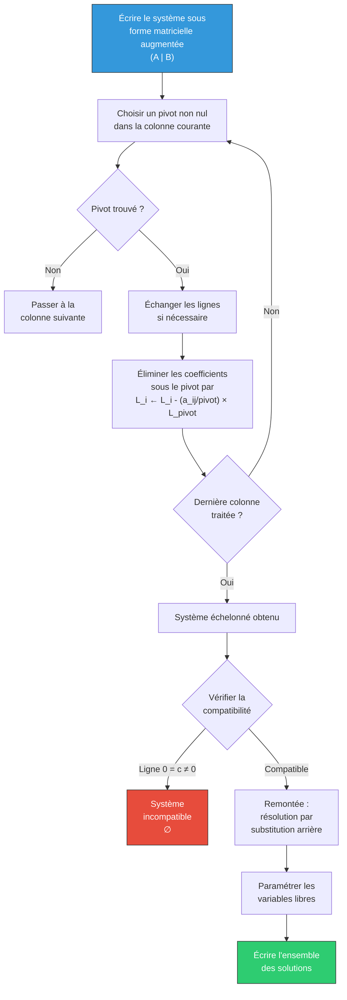

# Matrices et Déterminants

Les matrices sont l'outil de calcul privilégié de l'[[Algèbre Linéaire]]. Elles permettent de représenter les applications linéaires par des tableaux de nombres et de ramener les problèmes abstraits à des calculs concrets.

> [!abstract] Programme
> Matrices et opérations, matrice d'une application linéaire, changement de base, inversibilité, rang, systèmes linéaires (pivot de Gauss), déterminants, cofacteurs, formule de Cramer.

## 1. Matrices : définitions et opérations

### 1.1 Définition

> [!abstract] Définition — Matrice
> Une **matrice** $A \in \mathcal{M}_{n,p}(K)$ est un tableau de $n$ lignes et $p$ colonnes à coefficients dans $K$ :
> $$A = (a_{i,j})_{\substack{1 \leq i \leq n \\ 1 \leq j \leq p}} = \begin{pmatrix} a_{1,1} & a_{1,2} & \cdots & a_{1,p} \\ a_{2,1} & a_{2,2} & \cdots & a_{2,p} \\ \vdots & \vdots & \ddots & \vdots \\ a_{n,1} & a_{n,2} & \cdots & a_{n,p} \end{pmatrix}$$

$\mathcal{M}_{n,p}(K)$ est un $K$-espace vectoriel de dimension $np$.

Notation : $\mathcal{M}_n(K) = \mathcal{M}_{n,n}(K)$ (matrices carrées).

### 1.2 Opérations

**Somme :** $(A + B)_{i,j} = a_{i,j} + b_{i,j}$

**Produit par un scalaire :** $(\lambda A)_{i,j} = \lambda \cdot a_{i,j}$

**Produit matriciel :** Pour $A \in \mathcal{M}_{n,p}(K)$ et $B \in \mathcal{M}_{p,q}(K)$ :
$$(AB)_{i,j} = \sum_{k=1}^{p} a_{i,k} \cdot b_{k,j}$$

Le produit $AB$ est défini si et seulement si le nombre de colonnes de $A$ égale le nombre de lignes de $B$.

> [!warning] Attention — Le produit matriciel n'est PAS commutatif
> En général, $AB \neq BA$. Même si $A$ et $B$ sont carrées, $AB$ et $BA$ peuvent être différentes, et l'une peut exister sans l'autre (si les tailles diffèrent).

**Transposée :** $({}^t\!A)_{i,j} = a_{j,i}$. Propriétés :
- ${}^t\!(A + B) = {}^t\!A + {}^t\!B$
- ${}^t\!(\lambda A) = \lambda \,{}^t\!A$
- ${}^t\!(AB) = {}^t\!B \cdot {}^t\!A$ (inversion de l'ordre !)
- ${}^t\!({}^t\!A) = A$

### 1.3 Matrices particulières

| Type | Définition |
|------|-----------|
| Matrice identité $I_n$ | $(\delta_{i,j})$ (symbole de Kronecker) |
| Matrice diagonale | $a_{i,j} = 0$ si $i \neq j$ |
| Matrice triangulaire supérieure | $a_{i,j} = 0$ si $i > j$ |
| Matrice triangulaire inférieure | $a_{i,j} = 0$ si $i < j$ |
| Matrice symétrique | ${}^t\!A = A$ |
| Matrice antisymétrique | ${}^t\!A = -A$ |
| Matrice nilpotente | $\exists\, p \in \mathbb{N}^*,\; A^p = 0$ |

> [!tip] Décomposition symétrique / antisymétrique
> Toute matrice carrée $A$ s'écrit de manière unique :
> $$A = \underbrace{\frac{A + {}^t\!A}{2}}_{\text{symétrique}} + \underbrace{\frac{A - {}^t\!A}{2}}_{\text{antisymétrique}}$$

## 2. Matrice d'une application linéaire

### 2.1 Construction

> [!abstract] Définition
> Soient $E$ de base $\mathcal{B} = (e_1, \ldots, e_p)$ et $F$ de base $\mathcal{C} = (f_1, \ldots, f_n)$. La **matrice de $f \in \mathcal{L}(E, F)$ dans les bases $\mathcal{B}$ et $\mathcal{C}$** est la matrice $M = \text{Mat}_{\mathcal{B}, \mathcal{C}}(f) \in \mathcal{M}_{n,p}(K)$ dont la **$j$-ème colonne** contient les coordonnées de $f(e_j)$ dans la base $\mathcal{C}$ :
> $$f(e_j) = \sum_{i=1}^{n} m_{i,j} f_i$$

### 2.2 Lien avec les coordonnées

Si $X = \text{Mat}_\mathcal{B}(u)$ est le vecteur colonne des coordonnées de $u$ dans $\mathcal{B}$ et $Y = \text{Mat}_\mathcal{C}(f(u))$ celles de $f(u)$ dans $\mathcal{C}$, alors :
$$Y = MX$$

### 2.3 Composition et produit

$$\text{Mat}(g \circ f) = \text{Mat}(g) \times \text{Mat}(f)$$

L'isomorphisme $\mathcal{L}(E, F) \xrightarrow{\sim} \mathcal{M}_{n,p}(K)$ est un isomorphisme d'espaces vectoriels (et d'algèbres quand $E = F$).

## 3. Changement de base

### 3.1 Matrice de passage

> [!abstract] Définition — Matrice de passage
> Soient $\mathcal{B} = (e_1, \ldots, e_n)$ et $\mathcal{B}' = (e_1', \ldots, e_n')$ deux bases de $E$. La **matrice de passage** de $\mathcal{B}$ à $\mathcal{B}'$ est :
> $$P = P_{\mathcal{B} \to \mathcal{B}'} = \text{Mat}_\mathcal{B}(\text{Id}_E) \text{ lu de } \mathcal{B}' \text{ vers } \mathcal{B}$$
> La $j$-ème colonne de $P$ contient les coordonnées de $e_j'$ dans la base $\mathcal{B}$.

$P$ est toujours inversible, et $P^{-1} = P_{\mathcal{B}' \to \mathcal{B}}$.

### 3.2 Formules de changement de base

**Coordonnées d'un vecteur :** Si $X$ et $X'$ sont les coordonnées de $u$ dans $\mathcal{B}$ et $\mathcal{B}'$ :
$$X = PX'$$

**Matrice d'un endomorphisme :** Si $M = \text{Mat}_\mathcal{B}(f)$ et $M' = \text{Mat}_{\mathcal{B}'}(f)$ :
$$\boxed{M' = P^{-1} M P}$$

Deux matrices liées par cette relation sont dites **semblables**.

**Matrice d'une application linéaire :** Si $f : E \to F$ avec changement $\mathcal{B} \to \mathcal{B}'$ dans $E$ (passage $P$) et $\mathcal{C} \to \mathcal{C}'$ dans $F$ (passage $Q$) :
$$M' = Q^{-1} M P$$

## 4. Matrices inversibles

### 4.1 Définition

> [!abstract] Définition
> $A \in \mathcal{M}_n(K)$ est **inversible** s'il existe $B \in \mathcal{M}_n(K)$ telle que $AB = BA = I_n$. On note $B = A^{-1}$.

Le groupe des matrices inversibles est noté $GL_n(K)$.

### 4.2 Critères d'inversibilité

$A$ est inversible $\iff$ l'une des conditions équivalentes suivantes est vérifiée :
- $\det(A) \neq 0$
- Les colonnes de $A$ forment une famille libre (ou une base) de $K^n$
- Le système $AX = 0$ admet uniquement la solution triviale $X = 0$
- L'endomorphisme associé est bijectif
- $\text{rg}(A) = n$

### 4.3 Calcul de l'inverse par la méthode du pivot

On forme le tableau augmenté $(A \mid I_n)$ et on effectue des opérations élémentaires sur les lignes pour obtenir $(I_n \mid A^{-1})$.

> [!example] Exemple
> $$A = \begin{pmatrix} 1 & 2 \\ 3 & 7 \end{pmatrix}$$
> $$(A \mid I_2) = \left(\begin{array}{cc|cc} 1 & 2 & 1 & 0 \\ 3 & 7 & 0 & 1 \end{array}\right) \xrightarrow{L_2 \leftarrow L_2 - 3L_1} \left(\begin{array}{cc|cc} 1 & 2 & 1 & 0 \\ 0 & 1 & -3 & 1 \end{array}\right) \xrightarrow{L_1 \leftarrow L_1 - 2L_2} \left(\begin{array}{cc|cc} 1 & 0 & 7 & -2 \\ 0 & 1 & -3 & 1 \end{array}\right)$$
> Donc $A^{-1} = \begin{pmatrix} 7 & -2 \\ -3 & 1 \end{pmatrix}$. Vérification : $\det(A) = 7 - 6 = 1$, et $A^{-1} = \frac{1}{1}\begin{pmatrix} 7 & -2 \\ -3 & 1 \end{pmatrix}$.

## 5. Rang d'une matrice

> [!abstract] Définition
> Le **rang** d'une matrice $A \in \mathcal{M}_{n,p}(K)$ est la dimension du sous-espace vectoriel engendré par ses colonnes (ou de manière équivalente, par ses lignes) :
> $$\text{rg}(A) = \dim(\text{Im}(f_A))$$
> où $f_A$ est l'application linéaire canoniquement associée.

**Propriétés :**
- $\text{rg}(A) = \text{rg}({}^t\!A)$
- $\text{rg}(AB) \leq \min(\text{rg}(A), \text{rg}(B))$
- Si $P$ ou $Q$ est inversible : $\text{rg}(PAQ) = \text{rg}(A)$
- Le rang est le nombre de pivots non nuls après échelonnement

## 6. Systèmes linéaires

### 6.1 Écriture matricielle

Le système de $n$ équations à $p$ inconnues :
$$\begin{cases} a_{1,1}x_1 + \cdots + a_{1,p}x_p = b_1 \\ \vdots \\ a_{n,1}x_1 + \cdots + a_{n,p}x_p = b_n \end{cases}$$

s'écrit $AX = B$ avec $A \in \mathcal{M}_{n,p}(K)$, $X \in \mathcal{M}_{p,1}(K)$, $B \in \mathcal{M}_{n,1}(K)$.

### 6.2 Structure de l'ensemble des solutions

> [!abstract] Théorème — Structure affine
> L'ensemble des solutions de $AX = B$ est :
> - Vide si le système est incompatible
> - Un sous-espace affine $x_0 + \ker(A)$ sinon, où $x_0$ est une solution particulière
>
> En particulier, les solutions du système homogène $AX = 0$ forment un sev de dimension $p - \text{rg}(A)$.

### 6.3 Méthode du pivot de Gauss

> [!example] Exemple complet
> Résoudre :
> $$\begin{cases} x + 2y + z = 1 \\ 2x + 5y + 3z = 3 \\ x + 3y + 2z = 2 \end{cases}$$
>
> Tableau augmenté :
> $$\left(\begin{array}{ccc|c} 1 & 2 & 1 & 1 \\ 2 & 5 & 3 & 3 \\ 1 & 3 & 2 & 2 \end{array}\right) \xrightarrow[\substack{L_3 \leftarrow L_3 - L_1}]{L_2 \leftarrow L_2 - 2L_1} \left(\begin{array}{ccc|c} 1 & 2 & 1 & 1 \\ 0 & 1 & 1 & 1 \\ 0 & 1 & 1 & 1 \end{array}\right) \xrightarrow{L_3 \leftarrow L_3 - L_2} \left(\begin{array}{ccc|c} 1 & 2 & 1 & 1 \\ 0 & 1 & 1 & 1 \\ 0 & 0 & 0 & 0 \end{array}\right)$$
>
> Le rang est $2$, il y a $3 - 2 = 1$ variable libre. On pose $z = t \in \mathbb{R}$ :
> - $y = 1 - t$
> - $x = 1 - 2(1-t) - t = -1 + t$
>
> **Solutions :** $\{(-1 + t,\; 1 - t,\; t) \mid t \in \mathbb{R}\} = (-1, 1, 0) + \text{Vect}(1, -1, 1)$.

## 7. Déterminants

### 7.1 Définition par les permutations

> [!abstract] Définition — Déterminant
> Le **déterminant** d'une matrice carrée $A = (a_{i,j}) \in \mathcal{M}_n(K)$ est :
> $$\det(A) = \sum_{\sigma \in \mathfrak{S}_n} \varepsilon(\sigma) \prod_{i=1}^{n} a_{i,\sigma(i)}$$
> où $\mathfrak{S}_n$ est le groupe des permutations de $\{1, \ldots, n\}$ et $\varepsilon(\sigma)$ la signature de $\sigma$.

Pour $n = 2$ :
$$\det\begin{pmatrix} a & b \\ c & d \end{pmatrix} = ad - bc$$

Pour $n = 3$ (règle de Sarrus) :
$$\det\begin{pmatrix} a & b & c \\ d & e & f \\ g & h & i \end{pmatrix} = aei + bfg + cdh - ceg - bdi - afh$$

### 7.2 Propriétés fondamentales

Le déterminant est caractérisé comme l'unique application $\det : \mathcal{M}_n(K) \to K$ vérifiant :

1. **$n$-linéarité** : linéaire par rapport à chaque colonne (ou ligne)
2. **Alternée** : s'annule dès que deux colonnes sont égales
3. **Normalisation** : $\det(I_n) = 1$

> [!important] Propriétés opératoires
> - $\det({}^t\!A) = \det(A)$
> - $\det(AB) = \det(A) \cdot \det(B)$ (morphisme multiplicatif)
> - $\det(\lambda A) = \lambda^n \det(A)$
> - $\det(A^{-1}) = \frac{1}{\det(A)}$ (si $A$ inversible)
> - **Échange** de deux lignes (ou colonnes) : change le signe
> - **Ajout** d'un multiple d'une ligne à une autre : ne change pas le déterminant
> - **Multiplication** d'une ligne par $\lambda$ : multiplie le déterminant par $\lambda$

> [!abstract] Théorème — Critère d'inversibilité
> $$A \text{ inversible} \iff \det(A) \neq 0$$

### 7.3 Déterminant de matrices triangulaires

$$\det\begin{pmatrix} a_{1,1} & * & \cdots & * \\ 0 & a_{2,2} & \cdots & * \\ \vdots & \ddots & \ddots & \vdots \\ 0 & \cdots & 0 & a_{n,n} \end{pmatrix} = \prod_{i=1}^n a_{i,i}$$

Le déterminant d'une matrice triangulaire (supérieure ou inférieure) est le **produit de ses coefficients diagonaux**.

## 8. Développement selon une ligne ou colonne

### 8.1 Cofacteurs

> [!abstract] Définition — Cofacteur
> Le **cofacteur** $C_{i,j}$ est :
> $$C_{i,j} = (-1)^{i+j} M_{i,j}$$
> où $M_{i,j}$ est le **mineur** d'ordre $(i,j)$, c'est-à-dire le déterminant de la matrice obtenue en supprimant la $i$-ème ligne et la $j$-ème colonne.

### 8.2 Formule de développement

> [!abstract] Théorème — Développement par rapport à la $i$-ème ligne
> $$\det(A) = \sum_{j=1}^{n} a_{i,j} C_{i,j} = \sum_{j=1}^{n} (-1)^{i+j} a_{i,j} M_{i,j}$$

De même, développement par rapport à la $j$-ème colonne :
$$\det(A) = \sum_{i=1}^{n} a_{i,j} C_{i,j}$$

> [!tip] Stratégie
> Développer par rapport à la ligne ou colonne contenant le **plus de zéros** pour minimiser les calculs.

> [!example] Exemple
> $$\det\begin{pmatrix} 2 & 0 & 1 \\ 3 & 1 & 0 \\ 1 & 0 & 4 \end{pmatrix}$$
> Développement selon la 2e colonne (deux zéros) :
> $$= 0 \cdot C_{1,2} + 1 \cdot C_{2,2} + 0 \cdot C_{3,2} = (-1)^{2+2} \det\begin{pmatrix} 2 & 1 \\ 1 & 4 \end{pmatrix} = 8 - 1 = 7$$

## 9. Comatrice et formule de Cramer

### 9.1 Comatrice

> [!abstract] Définition
> La **comatrice** (ou matrice des cofacteurs) de $A$ est $\text{Com}(A) = (C_{i,j})_{1 \leq i,j \leq n}$.

> [!abstract] Formule fondamentale
> $$A \cdot {}^t\!\text{Com}(A) = {}^t\!\text{Com}(A) \cdot A = \det(A) \cdot I_n$$
> En particulier, si $\det(A) \neq 0$ :
> $$A^{-1} = \frac{1}{\det(A)} \,{}^t\!\text{Com}(A)$$

### 9.2 Formules de Cramer

> [!abstract] Théorème — Formules de Cramer
> Pour le système $AX = B$ avec $A \in GL_n(K)$ :
> $$x_j = \frac{\det(A_j)}{\det(A)}$$
> où $A_j$ est la matrice obtenue en remplaçant la $j$-ème colonne de $A$ par $B$.

> [!warning] Attention
> Les formules de Cramer sont théoriquement élégantes mais **coûteuses en calcul** pour $n$ grand. En pratique, on préfère le pivot de Gauss.

> [!example] Exemple — Cramer en dimension 2
> $$\begin{cases} 3x + 2y = 7 \\ x + 4y = 9 \end{cases}$$
> $$\det(A) = \det\begin{pmatrix} 3 & 2 \\ 1 & 4 \end{pmatrix} = 10$$
> $$x = \frac{\det\begin{pmatrix} 7 & 2 \\ 9 & 4 \end{pmatrix}}{10} = \frac{28-18}{10} = 1, \quad y = \frac{\det\begin{pmatrix} 3 & 7 \\ 1 & 9 \end{pmatrix}}{10} = \frac{27-7}{10} = 2$$

## 10. Déterminants classiques

### 10.1 Déterminant de Vandermonde

> [!abstract] Théorème — Déterminant de Vandermonde
> $$V_n(x_1, \ldots, x_n) = \det\begin{pmatrix} 1 & 1 & \cdots & 1 \\ x_1 & x_2 & \cdots & x_n \\ x_1^2 & x_2^2 & \cdots & x_n^2 \\ \vdots & \vdots & \ddots & \vdots \\ x_1^{n-1} & x_2^{n-1} & \cdots & x_n^{n-1} \end{pmatrix} = \prod_{1 \leq i < j \leq n} (x_j - x_i)$$

> [!tip] Esquisse de preuve
> On considère $V_n$ comme un polynôme en $x_n$. En effectuant $C_n \leftarrow C_n - C_i$ pour chaque $i < n$, on montre que $x_n - x_i$ divise $V_n$ pour tout $i < n$. Par récurrence et argument de degré, on obtient la formule.

**Conséquence :** $V_n \neq 0 \iff$ les $x_i$ sont deux à deux distincts.

### 10.2 Déterminant par blocs

Si $A$ est triangulaire par blocs :
$$\det\begin{pmatrix} A_1 & * \\ 0 & A_2 \end{pmatrix} = \det(A_1) \cdot \det(A_2)$$

## 11. Exercices types corrigés

### Exercice 1 : Calcul de déterminant par opérations

> [!example] Énoncé
> Calculer $D = \det\begin{pmatrix} 1 & 1 & 1 & 1 \\ 1 & 2 & 3 & 4 \\ 1 & 3 & 6 & 10 \\ 1 & 4 & 10 & 20 \end{pmatrix}$.

**Solution :** Opérations $C_j \leftarrow C_j - C_{j-1}$ pour $j = 4, 3, 2$ :

$$D = \det\begin{pmatrix} 1 & 0 & 0 & 0 \\ 1 & 1 & 1 & 1 \\ 1 & 2 & 3 & 4 \\ 1 & 3 & 6 & 10 \end{pmatrix}$$

On recommence : $C_j \leftarrow C_j - C_{j-1}$ :

$$D = \det\begin{pmatrix} 1 & 0 & 0 & 0 \\ 1 & 1 & 0 & 0 \\ 1 & 2 & 1 & 1 \\ 1 & 3 & 3 & 4 \end{pmatrix}$$

Encore une fois :

$$D = \det\begin{pmatrix} 1 & 0 & 0 & 0 \\ 1 & 1 & 0 & 0 \\ 1 & 2 & 1 & 0 \\ 1 & 3 & 3 & 1 \end{pmatrix} = 1 \times 1 \times 1 \times 1 = 1$$

(Matrice triangulaire inférieure.)

### Exercice 2 : Matrice d'une application linéaire et changement de base

> [!example] Énoncé
> Soit $f : \mathbb{R}^2 \to \mathbb{R}^2$ définie par $f(x,y) = (2x+y, x+2y)$. Écrire la matrice de $f$ dans la base canonique, puis dans la base $\mathcal{B}' = ((1,1), (1,-1))$.

**Solution :**

**Base canonique $\mathcal{B} = (e_1, e_2)$ :**
$f(e_1) = f(1,0) = (2,1)$ et $f(e_2) = f(0,1) = (1,2)$.
$$M = \begin{pmatrix} 2 & 1 \\ 1 & 2 \end{pmatrix}$$

**Changement de base :** La matrice de passage $P$ de $\mathcal{B}$ à $\mathcal{B}'$ a pour colonnes les coordonnées de $(1,1)$ et $(1,-1)$ dans $\mathcal{B}$ :
$$P = \begin{pmatrix} 1 & 1 \\ 1 & -1 \end{pmatrix}, \quad P^{-1} = \frac{1}{-2}\begin{pmatrix} -1 & -1 \\ -1 & 1 \end{pmatrix} = \begin{pmatrix} 1/2 & 1/2 \\ 1/2 & -1/2 \end{pmatrix}$$

$$M' = P^{-1}MP = \begin{pmatrix} 1/2 & 1/2 \\ 1/2 & -1/2 \end{pmatrix}\begin{pmatrix} 2 & 1 \\ 1 & 2 \end{pmatrix}\begin{pmatrix} 1 & 1 \\ 1 & -1 \end{pmatrix}$$

$$P^{-1}M = \begin{pmatrix} 3/2 & 3/2 \\ 1/2 & -1/2 \end{pmatrix}, \quad M' = \begin{pmatrix} 3/2 & 3/2 \\ 1/2 & -1/2 \end{pmatrix}\begin{pmatrix} 1 & 1 \\ 1 & -1 \end{pmatrix} = \begin{pmatrix} 3 & 0 \\ 0 & 1 \end{pmatrix}$$

Dans la base $\mathcal{B}'$, la matrice est **diagonale** ! Les vecteurs $(1,1)$ et $(1,-1)$ sont des vecteurs propres de $f$, de valeurs propres $3$ et $1$.

### Exercice 3 : Système linéaire paramétrique

> [!example] Énoncé
> Discuter et résoudre selon $m \in \mathbb{R}$ :
> $$\begin{cases} x + y + z = 1 \\ x + my + z = m \\ x + y + mz = m^2 \end{cases}$$

**Solution :**

$$\det(A) = \det\begin{pmatrix} 1 & 1 & 1 \\ 1 & m & 1 \\ 1 & 1 & m \end{pmatrix}$$

$C_2 \leftarrow C_2 - C_1$, $C_3 \leftarrow C_3 - C_1$ :
$$= \det\begin{pmatrix} 1 & 0 & 0 \\ 1 & m-1 & 0 \\ 1 & 0 & m-1 \end{pmatrix} = (m-1)^2$$

**Cas $m \neq 1$ :** $\det(A) = (m-1)^2 \neq 0$. Système de Cramer, solution unique. Par Cramer ou substitution :
- $L_2 - L_1$ : $(m-1)y = m - 1$, d'où $y = 1$
- $L_3 - L_1$ : $(m-1)z = m^2 - 1 = (m-1)(m+1)$, d'où $z = m + 1$
- $L_1$ : $x = 1 - y - z = 1 - 1 - (m+1) = -(m+1) = -m - 1$

Solution : $(x,y,z) = (-m-1, 1, m+1)$.

**Cas $m = 1$ :** Le système devient $x + y + z = 1$ (trois fois la même équation). Solutions : $\{(1-s-t, s, t) \mid s, t \in \mathbb{R}\}$, sous-espace affine de dimension $2$.

## Liens

- [[Algèbre Linéaire]] : cadre théorique des applications linéaires
- [[Développements Limités]] : applications au calcul de limites via des systèmes
- [[Suites et Séries Numériques]] : récurrences linéaires et matrices compagnon
