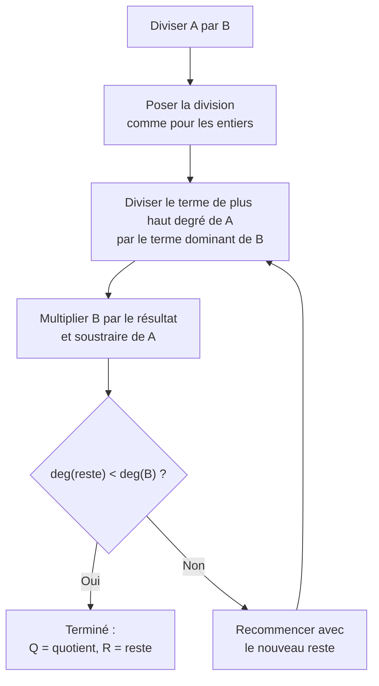
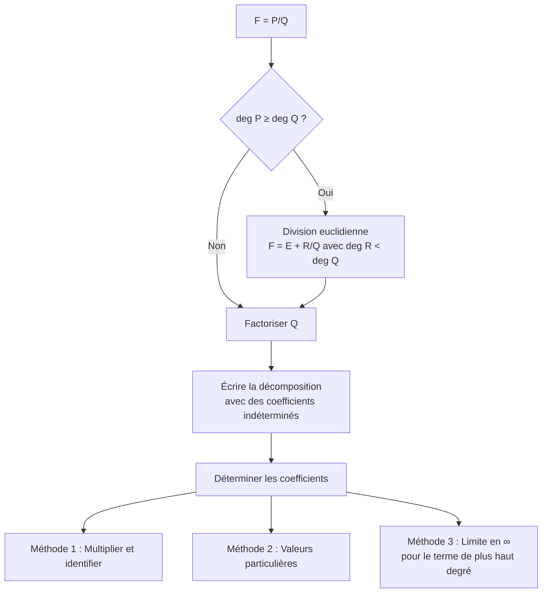

# Polynômes

Les polynômes sont des objets fondamentaux en algèbre. Ils forment un anneau qui possède une structure très riche, analogue à celle de $\mathbb{Z}$, avec une division euclidienne, un PGCD, et une factorisation en irréductibles.

> [!quote] Prérequis
> [[Structures Algébriques]], [[Arithmétique]], [[Calcul Algébrique]]

## L'anneau $K[X]$

### Définition

Soit $K$ un corps ($\mathbb{Q}$, $\mathbb{R}$ ou $\mathbb{C}$). Un **polynôme** à coefficients dans $K$ est une expression formelle :

$$P = \sum_{k=0}^{n} a_k X^k = a_0 + a_1 X + a_2 X^2 + \cdots + a_n X^n$$

avec $a_k \in K$ et $a_n \neq 0$.

> [!important] Distinction polynôme / fonction polynomiale
> Le polynôme $P \in K[X]$ est un objet **formel** (suite de coefficients). La fonction polynomiale $\tilde{P} : x \mapsto P(x)$ est une **fonction**. Sur un corps infini ($\mathbb{R}$, $\mathbb{C}$), il y a bijection entre les deux. Sur un corps fini, ce n'est plus vrai !

### Degré

- $\deg(P) = n$ si $a_n \neq 0$ (le plus grand indice non nul)
- $\deg(0) = -\infty$ par convention
- $\deg(P + Q) \leq \max(\deg P, \deg Q)$
- $\deg(PQ) = \deg(P) + \deg(Q)$

> [!tip] Conséquence
> $K[X]$ est un anneau **intègre** : si $PQ = 0$, alors $P = 0$ ou $Q = 0$.

### Opérations

$(K[X], +, \times)$ est un anneau commutatif unitaire intègre. Ses inversibles sont les polynômes constants non nuls (les éléments de $K^*$).

## Division euclidienne

> [!abstract] Théorème — Division euclidienne
> Soient $A, B \in K[X]$ avec $B \neq 0$. Il existe un unique couple $(Q, R) \in K[X]^2$ tel que :
> $$A = BQ + R \quad \text{avec} \quad \deg(R) < \deg(B)$$

> [!example] Exemple
> Diviser $A = X^4 + 2X^3 - X + 3$ par $B = X^2 + 1$ :
>
> - $X^4 \div X^2 = X^2$ → on soustrait $X^2(X^2+1) = X^4 + X^2$
> - Reste : $2X^3 - X^2 - X + 3$
> - $2X^3 \div X^2 = 2X$ → on soustrait $2X(X^2+1) = 2X^3 + 2X$
> - Reste : $-X^2 - 3X + 3$
> - $-X^2 \div X^2 = -1$ → on soustrait $-1(X^2+1) = -X^2 - 1$
> - Reste : $-3X + 4$
>
> Résultat : $Q = X^2 + 2X - 1$, $R = -3X + 4$.

## Racines et factorisation

### Racine d'un polynôme

> [!abstract] Définition
> $\alpha \in K$ est une **racine** de $P \in K[X]$ si $P(\alpha) = 0$, c'est-à-dire si $(X - \alpha) \mid P$.

### Multiplicité

$\alpha$ est racine de **multiplicité** $m \geq 1$ si :
$$(X - \alpha)^m \mid P \quad \text{et} \quad (X - \alpha)^{m+1} \nmid P$$

Autrement dit : $P(\alpha) = P'(\alpha) = \cdots = P^{(m-1)}(\alpha) = 0$ et $P^{(m)}(\alpha) \neq 0$.

> [!important] Nombre de racines
> Un polynôme de degré $n$ a **au plus** $n$ racines comptées avec multiplicité.

### Théorème de d'Alembert-Gauss

> [!abstract] Théorème fondamental de l'algèbre
> Tout polynôme de degré $n \geq 1$ à coefficients dans $\mathbb{C}$ admet **exactement** $n$ racines dans $\mathbb{C}$ comptées avec multiplicité.
>
> Autrement dit : $\mathbb{C}$ est **algébriquement clos**.

**Conséquence :** Tout $P \in \mathbb{C}[X]$ de degré $n$ se factorise :

$$P = a_n \prod_{i=1}^{n} (X - z_i)$$

où $z_1, \ldots, z_n$ sont les racines (avec répétition).

## Polynômes irréductibles

> [!abstract] Définition
> $P \in K[X]$ est **irréductible** s'il est de degré $\geq 1$ et s'il ne peut s'écrire $P = AB$ qu'avec $\deg(A) = 0$ ou $\deg(B) = 0$.

### Irréductibles de $\mathbb{C}[X]$

Les seuls irréductibles sont les polynômes de **degré 1** : $aX + b$ avec $a \neq 0$.

### Irréductibles de $\mathbb{R}[X]$

Ce sont :
- Les polynômes de **degré 1** : $aX + b$
- Les polynômes de **degré 2** à **discriminant strictement négatif** : $aX^2 + bX + c$ avec $\Delta < 0$

> [!tip] Factorisation dans $\mathbb{R}[X]$
> Tout $P \in \mathbb{R}[X]$ se factorise en produit de polynômes de degré 1 et de degré 2 à discriminant négatif. Les racines complexes viennent par paires conjuguées : si $z$ est racine, alors $\bar{z}$ aussi.

## Relations coefficients-racines (Viète)

Pour $P = a_n X^n + a_{n-1}X^{n-1} + \cdots + a_0$ de racines $x_1, \ldots, x_n$ :

$$\begin{cases}
x_1 + x_2 + \cdots + x_n = -\dfrac{a_{n-1}}{a_n} \\[8pt]
\displaystyle\sum_{i < j} x_i x_j = \dfrac{a_{n-2}}{a_n} \\[8pt]
x_1 x_2 \cdots x_n = (-1)^n \dfrac{a_0}{a_n}
\end{cases}$$

> [!example] Cas du degré 2
> Pour $P = aX^2 + bX + c$ de racines $x_1, x_2$ :
> $$x_1 + x_2 = -\frac{b}{a}, \quad x_1 x_2 = \frac{c}{a}$$

## PGCD et PPCM de polynômes

La division euclidienne permet de définir le PGCD par l'**algorithme d'Euclide**, exactement comme dans $\mathbb{Z}$.

> [!abstract] Théorème de Bézout (version polynomiale)
> Soient $A, B \in K[X]$ non tous nuls. Alors :
> $$\text{PGCD}(A, B) = D \iff \exists U, V \in K[X], \quad AU + BV = D$$

> [!warning] Attention
> Le PGCD est défini **à constante multiplicative près**. On le normalise souvent en polynôme unitaire (coefficient dominant = 1).

## Fractions rationnelles

### Définition

Une **fraction rationnelle** est un quotient $F = \dfrac{P}{Q}$ avec $P, Q \in K[X]$, $Q \neq 0$.

L'ensemble des fractions rationnelles $K(X)$ est un **corps** (le corps des fractions de $K[X]$).

### Décomposition en éléments simples

> [!abstract] Théorème
> Toute fraction rationnelle $F = P/Q$ avec $\deg(P) < \deg(Q)$ se décompose de manière unique en somme d'**éléments simples**.

### Sur $\mathbb{C}$

Si $Q = a \prod (X - z_i)^{m_i}$, alors :

$$\frac{P}{Q} = E(X) + \sum_i \sum_{k=1}^{m_i} \frac{\lambda_{i,k}}{(X - z_i)^k}$$

### Sur $\mathbb{R}$

On a en plus des éléments simples de **seconde espèce** :

$$\frac{\alpha X + \beta}{(X^2 + bX + c)^k} \quad \text{avec } \Delta = b^2 - 4c < 0$$

> [!example] Exemple
> Décomposer $F = \dfrac{1}{X^2 - 1} = \dfrac{1}{(X-1)(X+1)}$ :
>
> $$F = \frac{A}{X-1} + \frac{B}{X+1}$$
>
> - $X = 1$ : $A = \frac{1}{2}$
> - $X = -1$ : $B = -\frac{1}{2}$
>
> $$\frac{1}{X^2 - 1} = \frac{1}{2} \cdot \frac{1}{X-1} - \frac{1}{2} \cdot \frac{1}{X+1}$$

## Interpolation de Lagrange

> [!abstract] Théorème
> Étant donnés $n+1$ points $(x_0, y_0), \ldots, (x_n, y_n)$ avec les $x_i$ deux à deux distincts, il existe un **unique** polynôme $P$ de degré $\leq n$ tel que $P(x_i) = y_i$ pour tout $i$.

La formule explicite est :

$$P(X) = \sum_{i=0}^{n} y_i \prod_{\substack{j=0 \\ j \neq i}}^{n} \frac{X - x_j}{x_i - x_j}$$

Les polynômes $L_i(X) = \prod_{j \neq i} \frac{X - x_j}{x_i - x_j}$ sont les **polynômes de Lagrange** : ils vérifient $L_i(x_j) = \delta_{ij}$.

> [!example] Exemple
> Trouver $P$ de degré $\leq 2$ tel que $P(0) = 1$, $P(1) = 0$, $P(2) = 3$.
>
> $$L_0 = \frac{(X-1)(X-2)}{(0-1)(0-2)} = \frac{(X-1)(X-2)}{2}$$
> $$L_1 = \frac{X(X-2)}{1 \cdot (1-2)} = -X(X-2)$$
> $$L_2 = \frac{X(X-1)}{2 \cdot 1} = \frac{X(X-1)}{2}$$
> $$P = 1 \cdot L_0 + 0 \cdot L_1 + 3 \cdot L_2 = \frac{(X-1)(X-2)}{2} + \frac{3X(X-1)}{2} = 2X^2 - 2X + 1$$

## Exercices types

> [!example] Exercice 1 — Division euclidienne
> Effectuer la division euclidienne de $X^4 - 3X^2 + 2$ par $X^2 - X + 1$.
>
> **Solution :** $Q = X^2 + X - 3$, $R = 2X + 5$.

> [!example] Exercice 2 — Factorisation
> Factoriser $P = X^4 - 1$ dans $\mathbb{R}[X]$ puis dans $\mathbb{C}[X]$.
>
> **Dans $\mathbb{R}$ :** $P = (X-1)(X+1)(X^2+1)$
>
> **Dans $\mathbb{C}$ :** $P = (X-1)(X+1)(X-i)(X+i)$

> [!example] Exercice 3 — Décomposition en éléments simples
> Décomposer $F = \dfrac{X}{(X-1)^2(X+1)}$.
>
> **Solution :** $F = \dfrac{1/2}{(X-1)^2} + \dfrac{1/4}{X-1} - \dfrac{1/4}{X+1}$

## À retenir

> [!important] Les points clés
> 1. **Division euclidienne** dans $K[X]$ : analogue à celle dans $\mathbb{Z}$
> 2. **d'Alembert-Gauss** : tout polynôme de degré $n$ a exactement $n$ racines dans $\mathbb{C}$
> 3. **Irréductibles de $\mathbb{R}[X]$** : degré 1 ou degré 2 avec $\Delta < 0$
> 4. Les racines complexes de polynômes réels viennent par **paires conjuguées**
> 5. La **décomposition en éléments simples** est l'outil clé pour intégrer des fractions rationnelles
