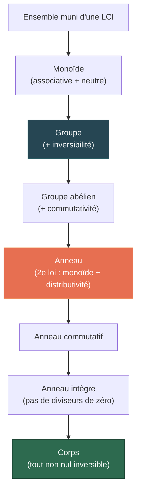

# Structures Algébriques

L'algèbre abstraite étudie les structures munies de lois de composition interne. Ce chapitre introduit les trois structures fondamentales — groupes, anneaux, corps — et les morphismes qui les relient.

## 1. Lois de composition interne

### 1.1 Définition

> [!abstract] Définition
> Une **loi de composition interne** (LCI) sur un ensemble $E$ est une application $\star : E \times E \to E$, notée $(x, y) \mapsto x \star y$.

### 1.2 Propriétés d'une LCI

Soit $\star$ une LCI sur $E$.

| Propriété | Définition |
|---|---|
| **Associativité** | $\forall x, y, z \in E,\; (x \star y) \star z = x \star (y \star z)$ |
| **Commutativité** | $\forall x, y \in E,\; x \star y = y \star x$ |
| **Élément neutre** | $\exists e \in E,\; \forall x \in E,\; e \star x = x \star e = x$ |
| **Symétrique** | Si $e$ est neutre : $\forall x \in E,\; \exists x' \in E,\; x \star x' = x' \star x = e$ |

> [!important]
> L'élément neutre, s'il existe, est **unique**. De même, dans un monoïde (associatif avec neutre), le symétrique d'un élément, s'il existe, est unique.

> [!tip] Preuve de l'unicité du neutre
> Si $e$ et $e'$ sont deux neutres, alors $e = e \star e' = e'$. $\blacksquare$

## 2. Groupes

### 2.1 Définition

> [!abstract] Définition
> Un **groupe** est un couple $(G, \star)$ où $G$ est un ensemble non vide et $\star$ une LCI sur $G$ vérifiant :
> 1. $\star$ est **associative**,
> 2. Il existe un **élément neutre** $e \in G$,
> 3. Tout élément admet un **symétrique** (inverse).
>
> Si de plus $\star$ est commutative, on dit que $(G, \star)$ est un groupe **abélien** (ou commutatif).

> [!tip] Notation
> - Notation **multiplicative** : neutre = $1$ ou $e$, inverse de $x$ = $x^{-1}$.
> - Notation **additive** (groupes abéliens) : neutre = $0$, opposé de $x$ = $-x$.

### 2.2 Exemples fondamentaux

| Groupe | Loi | Neutre | Inverse |
|---|---|---|---|
| $(\mathbb{Z}, +)$ | addition | $0$ | $-n$ |
| $(\mathbb{Q}^*, \times)$ | multiplication | $1$ | $1/q$ |
| $(\mathbb{R}^*, \times)$ | multiplication | $1$ | $1/x$ |
| $(\mathbb{Z}/n\mathbb{Z}, +)$ | addition modulaire | $\overline{0}$ | $\overline{-k}$ |
| $(S_n, \circ)$ | composition | $\mathrm{Id}$ | $\sigma^{-1}$ |
| $(\mathrm{GL}_n(\mathbb{R}), \times)$ | produit matriciel | $I_n$ | $A^{-1}$ |

> [!warning]
> $(\mathbb{N}, +)$ n'est **pas** un groupe : les éléments non nuls n'ont pas d'opposé dans $\mathbb{N}$.

### 2.3 Propriétés élémentaires

> [!abstract] Propositions
> Soit $(G, \star)$ un groupe. Pour tous $a, b, c \in G$ :
> 1. **Régularité** : $a \star b = a \star c \Rightarrow b = c$ (simplification à gauche, et à droite).
> 2. $(a^{-1})^{-1} = a$.
> 3. $(a \star b)^{-1} = b^{-1} \star a^{-1}$.
> 4. L'équation $a \star x = b$ admet une unique solution : $x = a^{-1} \star b$.

### 2.4 Ordre d'un élément

> [!abstract] Définition
> L'**ordre** d'un élément $g \in G$ est le plus petit entier $n \geq 1$ tel que $g^n = e$, s'il existe. Sinon, $g$ est d'**ordre infini**.

### 2.5 Sous-groupes

> [!abstract] Définition
> Un sous-ensemble $H \subset G$ est un **sous-groupe** de $(G, \star)$ si $(H, \star)$ est lui-même un groupe.

> [!abstract] Théorème (Caractérisation)
> $H \subset G$ est un sous-groupe de $(G, \star)$ si et seulement si :
> 1. $H \neq \emptyset$ (ou $e \in H$),
> 2. $\forall a, b \in H,\; a \star b^{-1} \in H$.

> [!example] Exemples
> - $n\mathbb{Z} = \{nk \mid k \in \mathbb{Z}\}$ est un sous-groupe de $(\mathbb{Z}, +)$.
> - $\mathrm{SL}_n(\mathbb{R}) = \{A \in \mathrm{GL}_n(\mathbb{R}) \mid \det A = 1\}$ est un sous-groupe de $\mathrm{GL}_n(\mathbb{R})$.

### 2.6 Théorème de Lagrange

> [!abstract] Théorème (Lagrange)
> Soit $G$ un groupe fini et $H$ un sous-groupe de $G$. Alors $|H|$ divise $|G|$.
>
> Plus précisément : $|G| = |H| \cdot [G : H]$ où $[G : H]$ est l'**indice** de $H$ dans $G$ (nombre de classes à gauche).

> [!tip] Esquisse de preuve
> Les classes à gauche $gH = \{gh \mid h \in H\}$ forment une partition de $G$. Chaque classe a le même cardinal que $H$ (la translation $h \mapsto gh$ est une bijection). Si on note $k$ le nombre de classes, alors $|G| = k \cdot |H|$. $\blacksquare$

> [!important] Corollaire
> L'ordre de tout élément d'un groupe fini divise le cardinal du groupe. En particulier, pour tout $g \in G$ : $g^{|G|} = e$.

## 3. Morphismes de groupes

### 3.1 Définition

> [!abstract] Définition
> Soient $(G, \star)$ et $(G', \bullet)$ deux groupes. Un **morphisme de groupes** est une application $\varphi : G \to G'$ telle que :
> $$\forall a, b \in G,\quad \varphi(a \star b) = \varphi(a) \bullet \varphi(b)$$

> [!abstract] Propriétés immédiates
> Si $\varphi : G \to G'$ est un morphisme :
> - $\varphi(e_G) = e_{G'}$
> - $\varphi(a^{-1}) = \varphi(a)^{-1}$
> - $\varphi(a^n) = \varphi(a)^n$ pour tout $n \in \mathbb{Z}$

### 3.2 Noyau et image

> [!abstract] Définition
> - Le **noyau** de $\varphi$ est $\ker \varphi = \{g \in G \mid \varphi(g) = e_{G'}\}$.
> - L'**image** de $\varphi$ est $\mathrm{Im}\, \varphi = \{\varphi(g) \mid g \in G\}$.

> [!abstract] Théorème
> - $\ker \varphi$ est un sous-groupe de $G$.
> - $\mathrm{Im}\, \varphi$ est un sous-groupe de $G'$.
> - $\varphi$ est injective $\Leftrightarrow$ $\ker \varphi = \{e_G\}$.

> [!example] Exemple
> Le déterminant $\det : \mathrm{GL}_n(\mathbb{R}) \to (\mathbb{R}^*, \times)$ est un morphisme de groupes. Son noyau est $\mathrm{SL}_n(\mathbb{R})$ et il est surjectif.

### 3.3 Terminologie

| Type | Définition |
|---|---|
| **Endomorphisme** | Morphisme de $G$ dans $G$ |
| **Isomorphisme** | Morphisme bijectif |
| **Automorphisme** | Endomorphisme bijectif |

## 4. Anneaux

### 4.1 Définition

> [!abstract] Définition
> Un **anneau** est un triplet $(A, +, \times)$ où :
> 1. $(A, +)$ est un **groupe abélien** (neutre noté $0_A$),
> 2. $\times$ est **associative** et possède un **élément neutre** $1_A$,
> 3. $\times$ est **distributive** par rapport à $+$ :
> $$\forall a, b, c \in A,\quad a \times (b + c) = a \times b + a \times c \quad \text{et} \quad (a + b) \times c = a \times c + b \times c$$
>
> Si de plus $\times$ est commutative, l'anneau est dit **commutatif**.

> [!important]
> On demande $1_A \neq 0_A$ pour exclure l'anneau trivial $\{0\}$ (selon certaines conventions).

### 4.2 Exemples fondamentaux

| Anneau | Commutatif ? | Intègre ? |
|---|---|---|
| $(\mathbb{Z}, +, \times)$ | Oui | Oui |
| $(\mathbb{Z}/n\mathbb{Z}, +, \times)$ | Oui | Ssi $n$ premier |
| $(K[X], +, \times)$ | Oui | Oui |
| $(\mathcal{M}_n(\mathbb{R}), +, \times)$ | Non ($n \geq 2$) | Non ($n \geq 2$) |

### 4.3 Éléments remarquables

> [!abstract] Définitions
> Soit $(A, +, \times)$ un anneau.
> - $a \in A$ est **inversible** (ou unité) s'il existe $b \in A$ tel que $ab = ba = 1_A$.
> - L'ensemble des éléments inversibles est noté $A^\times$ ; c'est un groupe pour $\times$.
> - $a \neq 0$ est un **diviseur de zéro** s'il existe $b \neq 0$ tel que $ab = 0$.
> - Un anneau commutatif **intègre** est un anneau sans diviseurs de zéro.

> [!example] Exemple
> Dans $\mathbb{Z}/6\mathbb{Z}$ : $\overline{2} \times \overline{3} = \overline{0}$, donc $\overline{2}$ et $\overline{3}$ sont diviseurs de zéro.
>
> Les inversibles de $\mathbb{Z}/6\mathbb{Z}$ sont $\overline{1}$ et $\overline{5}$ (ceux premiers avec $6$).

### 4.4 Idéaux et anneaux quotients

> [!abstract] Définition
> Un **idéal** d'un anneau commutatif $(A, +, \times)$ est une partie $I \subset A$ telle que :
> 1. $(I, +)$ est un sous-groupe de $(A, +)$,
> 2. $\forall a \in A,\; \forall x \in I,\; ax \in I$ (stabilité par multiplication externe).

> [!example] Exemple
> $n\mathbb{Z}$ est un idéal de $\mathbb{Z}$. L'anneau quotient $\mathbb{Z}/n\mathbb{Z}$ est l'anneau des classes de congruence modulo $n$.

## 5. Corps

### 5.1 Définition

> [!abstract] Définition
> Un **corps** est un anneau commutatif $(K, +, \times)$ dans lequel tout élément non nul est inversible, c'est-à-dire $K^\times = K \setminus \{0\}$.
>
> De manière équivalente : $(K, +, \times)$ est un corps si :
> 1. $(K, +)$ est un groupe abélien,
> 2. $(K \setminus \{0\}, \times)$ est un groupe abélien,
> 3. $\times$ est distributive par rapport à $+$.

### 5.2 Exemples

| Corps | Caractéristique |
|---|---|
| $(\mathbb{Q}, +, \times)$ | $0$ |
| $(\mathbb{R}, +, \times)$ | $0$ |
| $(\mathbb{C}, +, \times)$ | $0$ |
| $(\mathbb{F}_p = \mathbb{Z}/p\mathbb{Z}, +, \times)$ pour $p$ premier | $p$ |

> [!abstract] Théorème
> $\mathbb{Z}/n\mathbb{Z}$ est un corps si et seulement si $n$ est premier.

> [!tip] Preuve
> $\overline{a}$ est inversible dans $\mathbb{Z}/n\mathbb{Z}$ si et seulement si $\gcd(a, n) = 1$ (Bézout). Si $n$ est premier, tout $a \in \{1, \ldots, n-1\}$ vérifie $\gcd(a, n) = 1$, donc tout élément non nul est inversible. Réciproquement, si $n = ab$ avec $1 < a, b < n$, alors $\overline{a}$ est diviseur de zéro, pas inversible. $\blacksquare$

### 5.3 Caractéristique d'un corps

> [!abstract] Définition
> La **caractéristique** d'un corps $K$ est le plus petit entier $p \geq 1$ tel que $\underbrace{1_K + \cdots + 1_K}_{p} = 0_K$, s'il existe. Sinon, $\mathrm{car}(K) = 0$.

> [!abstract] Théorème
> La caractéristique d'un corps est $0$ ou un nombre premier.

## 6. Hiérarchie des structures

## 7. Groupes de permutations $S_n$

### 7.1 Définition

> [!abstract] Définition
> Le **groupe symétrique** $S_n$ est le groupe des bijections de $\{1, \ldots, n\}$ dans lui-même, muni de la composition.
>
> $|S_n| = n!$

### 7.2 Cycles et transpositions

> [!abstract] Définition
> Un **cycle** de longueur $k$ (ou $k$-cycle) est une permutation $(a_1\; a_2\; \cdots\; a_k)$ qui envoie $a_i \mapsto a_{i+1}$ (indices mod $k$) et fixe les autres éléments.
>
> Une **transposition** est un $2$-cycle.

> [!abstract] Théorème
> Toute permutation se décompose en produit de cycles à supports disjoints (à l'ordre près). Toute permutation se décompose en produit de transpositions.

### 7.3 Signature

> [!abstract] Définition
> La **signature** d'une permutation $\sigma \in S_n$ est $\varepsilon(\sigma) = (-1)^{N(\sigma)}$ où $N(\sigma)$ est le nombre de transpositions dans une décomposition de $\sigma$.

L'application $\varepsilon : S_n \to \{-1, +1\}$ est un morphisme de groupes. Son noyau est le **groupe alterné** $A_n$ (permutations paires), de cardinal $n!/2$.

## 8. Exercices types

> [!example] Exercice 1 — Sous-groupe
> Montrer que $H = \{z \in \mathbb{C}^* \mid |z| = 1\}$ est un sous-groupe de $(\mathbb{C}^*, \times)$.
>
> *Indication* : Vérifier le critère : $H \neq \emptyset$ et $\forall z_1, z_2 \in H,\; z_1 z_2^{-1} \in H$.

> [!example] Exercice 2 — Morphisme
> Soit $\varphi : (\mathbb{Z}, +) \to (\mathbb{Z}/n\mathbb{Z}, +)$ défini par $\varphi(k) = \overline{k}$.
> 1. Montrer que $\varphi$ est un morphisme de groupes surjectif.
> 2. Déterminer $\ker \varphi$.

> [!example] Exercice 3 — Anneau
> Soit $A = \mathbb{Z}[\sqrt{2}] = \{a + b\sqrt{2} \mid a, b \in \mathbb{Z}\}$.
> 1. Montrer que $(A, +, \times)$ est un anneau commutatif intègre.
> 2. Déterminer les inversibles de $A$.

> [!example] Exercice 4 — Corps $\mathbb{F}_5$
> Construire la table de multiplication de $\mathbb{Z}/5\mathbb{Z}$. Vérifier que c'est un corps et trouver l'inverse de chaque élément non nul.

> [!example] Exercice 5 — Théorème de Lagrange
> Soit $G$ un groupe de cardinal $p$ premier. Montrer que $G$ est cyclique (c'est-à-dire isomorphe à $\mathbb{Z}/p\mathbb{Z}$).
>
> *Indication* : Considérer un élément $g \neq e$ et le sous-groupe engendré $\langle g \rangle$. Par Lagrange, $|\langle g \rangle|$ divise $p$.

> [!example] Exercice 6 — Permutations
> Soit $\sigma = \begin{pmatrix} 1 & 2 & 3 & 4 & 5 \\ 3 & 5 & 4 & 2 & 1 \end{pmatrix} \in S_5$.
> 1. Décomposer $\sigma$ en produit de cycles à supports disjoints.
> 2. Déterminer l'ordre et la signature de $\sigma$.
> 3. Calculer $\sigma^{-1}$.

## Liens

- [[Logique et Raisonnement]] — Raisonnements utilisés dans les preuves
- [[Ensembles et Applications]] — Bijections, relations d'équivalence (quotients)
- [[Arithmétique]] — $\mathbb{Z}/n\mathbb{Z}$ et applications à la théorie des nombres
- [[Polynômes]] — $K[X]$ comme anneau
