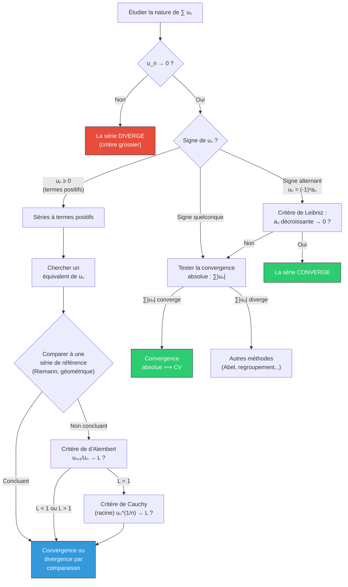

# Suites et Séries Numériques

Ce chapitre approfondit l'étude des suites réelles (au-delà du programme de terminale) et introduit les séries numériques, outil fondamental de l'analyse. On travaille dans $\mathbb{R}$ ou $\mathbb{C}$.

> [!abstract] Programme
> Suites de Cauchy, théorème de Bolzano-Weierstrass, suites récurrentes. Séries numériques : convergence, séries à termes positifs, critères de comparaison, d'Alembert, Cauchy, séries alternées, convergence absolue.

## Partie I : Suites numériques

### 1. Rappels et compléments sur la convergence

#### 1.1 Définition $\varepsilon$ de la convergence

> [!abstract] Définition — Convergence
> Une suite $(u_n)_{n \in \mathbb{N}}$ de réels **converge** vers $\ell \in \mathbb{R}$ si :
> $$\forall\, \varepsilon > 0,\; \exists\, N \in \mathbb{N},\; \forall\, n \geq N,\; |u_n - \ell| < \varepsilon$$
> On note $\lim_{n \to +\infty} u_n = \ell$ ou $u_n \xrightarrow[n \to +\infty]{} \ell$.

> [!abstract] Théorème — Unicité de la limite
> Si une suite converge, sa limite est **unique**.

> [!tip] Preuve
> Supposons $u_n \to \ell$ et $u_n \to \ell'$ avec $\ell \neq \ell'$. Posons $\varepsilon = \frac{|\ell - \ell'|}{2} > 0$. Il existe $N_1, N_2$ tels que pour $n \geq \max(N_1, N_2)$ : $|u_n - \ell| < \varepsilon$ et $|u_n - \ell'| < \varepsilon$. Par l'inégalité triangulaire :
> $$|\ell - \ell'| \leq |u_n - \ell| + |u_n - \ell'| < 2\varepsilon = |\ell - \ell'|$$
> Contradiction. Donc $\ell = \ell'$.

#### 1.2 Propriétés des suites convergentes

Toute suite convergente est **bornée** (la réciproque est fausse : $(-1)^n$).

**Opérations sur les limites :** Si $u_n \to \ell$ et $v_n \to \ell'$ :
- $u_n + v_n \to \ell + \ell'$
- $u_n \cdot v_n \to \ell \cdot \ell'$
- $u_n / v_n \to \ell / \ell'$ si $\ell' \neq 0$
- $\lambda u_n \to \lambda \ell$

> [!important] Théorèmes de passage à la limite
> - **Théorème des gendarmes :** Si $a_n \leq u_n \leq b_n$ et $a_n \to \ell$, $b_n \to \ell$, alors $u_n \to \ell$.
> - **Passage à la limite dans les inégalités :** Si $u_n \leq v_n$ pour tout $n$ et si les deux suites convergent, alors $\ell \leq \ell'$ (inégalité large !).

### 2. Suites extraites (sous-suites)

> [!abstract] Définition — Suite extraite
> Soit $(u_n)$ une suite et $\varphi : \mathbb{N} \to \mathbb{N}$ strictement croissante. La suite $(u_{\varphi(n)})_{n \in \mathbb{N}}$ est une **suite extraite** (ou sous-suite) de $(u_n)$.

> [!abstract] Théorème
> Si $u_n \to \ell$, alors **toute** suite extraite de $(u_n)$ converge vers $\ell$.

**Contraposée (utile pour montrer la divergence) :** Si deux sous-suites convergent vers des limites distinctes, la suite diverge.

> [!example] Exemple
> La suite $u_n = (-1)^n$ diverge car $u_{2n} \to 1$ et $u_{2n+1} \to -1$.

### 3. Théorème de Bolzano-Weierstrass

> [!abstract] Théorème de Bolzano-Weierstrass
> De toute suite **bornée** de réels, on peut extraire une sous-suite **convergente**.

> [!tip] Esquisse de preuve (dichotomie)
> Soit $(u_n)$ bornée dans $[a, b]$. On coupe $[a,b]$ en deux moitiés : au moins l'une contient une infinité de termes. On l'appelle $[a_1, b_1]$ avec $b_1 - a_1 = \frac{b-a}{2}$. On itère : on obtient des intervalles emboîtés $[a_k, b_k]$ de longueur $\frac{b-a}{2^k} \to 0$, et une sous-suite dont les termes sont dans chacun de ces intervalles. Cette sous-suite converge par le théorème des intervalles emboîtés.

> [!warning] Attention
> Ce théorème est fondamentalement lié à la complétude de $\mathbb{R}$. Il est **faux** dans $\mathbb{Q}$ : la suite des décimales de $\sqrt{2}$ tronquées est bornée dans $\mathbb{Q}$ mais n'a aucune sous-suite convergeant dans $\mathbb{Q}$.

### 4. Suites de Cauchy

> [!abstract] Définition — Suite de Cauchy
> $(u_n)$ est une **suite de Cauchy** si :
> $$\forall\, \varepsilon > 0,\; \exists\, N \in \mathbb{N},\; \forall\, p, q \geq N,\; |u_p - u_q| < \varepsilon$$

> [!abstract] Théorème fondamental (complétude de $\mathbb{R}$)
> Dans $\mathbb{R}$ (ou $\mathbb{C}$), une suite est convergente **si et seulement si** elle est de Cauchy.

L'intérêt du critère de Cauchy est qu'il ne nécessite **pas de connaître la limite** pour prouver la convergence.

> [!tip] Preuve ($\Rightarrow$)
> Si $u_n \to \ell$, alors pour $\varepsilon > 0$, il existe $N$ tel que pour $n \geq N$ : $|u_n - \ell| < \varepsilon/2$. Donc pour $p, q \geq N$ : $|u_p - u_q| \leq |u_p - \ell| + |u_q - \ell| < \varepsilon$.

### 5. Suites adjacentes

> [!abstract] Définition — Suites adjacentes
> Deux suites $(a_n)$ et $(b_n)$ sont **adjacentes** si :
> 1. $(a_n)$ est croissante
> 2. $(b_n)$ est décroissante
> 3. $b_n - a_n \to 0$

> [!abstract] Théorème
> Si $(a_n)$ et $(b_n)$ sont adjacentes, elles convergent vers une **même limite** $\ell$, et :
> $$\forall\, n \in \mathbb{N},\; a_n \leq \ell \leq b_n$$

### 6. Suites récurrentes $u_{n+1} = f(u_n)$

#### 6.1 Étude générale

Soit $f : I \to I$ continue et $(u_n)$ définie par $u_0 \in I$ et $u_{n+1} = f(u_n)$.

> [!abstract] Théorème — Point fixe
> Si $u_n \to \ell$ et $f$ est continue, alors $\ell$ est un **point fixe** de $f$ : $f(\ell) = \ell$.

> [!tip] Preuve
> $u_{n+1} = f(u_n) \xrightarrow{n \to +\infty} f(\ell)$ par continuité. Mais aussi $u_{n+1} \to \ell$. Par unicité de la limite, $\ell = f(\ell)$.

#### 6.2 Étude de la monotonie

La position de $u_1$ par rapport à $u_0$ (et le sens de variation de $f$) détermine la monotonie :
- Si $f$ est **croissante** : $(u_n)$ est monotone (croissante si $u_1 \geq u_0$, décroissante sinon)
- Si $f$ est **décroissante** : les sous-suites $(u_{2n})$ et $(u_{2n+1})$ sont monotones de sens contraires

#### 6.3 Convergence par contraction

> [!abstract] Théorème du point fixe de Banach (version suites)
> Si $f : I \to I$ est **$k$-contractante** ($|f(x) - f(y)| \leq k|x-y|$ avec $0 \leq k < 1$) sur un intervalle fermé $I$, alors :
> 1. $f$ admet un **unique** point fixe $\ell \in I$
> 2. Pour tout $u_0 \in I$, la suite $u_{n+1} = f(u_n)$ converge vers $\ell$
> 3. Estimation de la vitesse : $|u_n - \ell| \leq \frac{k^n}{1-k}|u_1 - u_0|$

> [!example] Exemple
> Soit $u_0 = 1$ et $u_{n+1} = \cos(u_n)$.
>
> $f = \cos$ est contractante sur $[0,1]$ car $|f'(x)| = |\sin(x)| \leq \sin(1) \approx 0.84 < 1$.
>
> L'unique point fixe est la solution de $\cos(\ell) = \ell$, soit $\ell \approx 0.7391$ (point de Dottie).
>
> La suite converge vers $\ell$ pour tout $u_0 \in [0,1]$.

## Partie II : Séries numériques

### 7. Définitions

> [!abstract] Définition — Série
> Soit $(u_n)_{n \geq 0}$ une suite. La **série** de terme général $u_n$, notée $\sum u_n$, est la suite des **sommes partielles** :
> $$S_N = \sum_{n=0}^{N} u_n$$

> [!abstract] Définition — Convergence d'une série
> La série $\sum u_n$ est **convergente** si la suite $(S_N)$ converge. Dans ce cas, la **somme** de la série est :
> $$\sum_{n=0}^{+\infty} u_n = \lim_{N \to +\infty} S_N$$
> Le **reste** d'ordre $N$ est $R_N = \sum_{n=N+1}^{+\infty} u_n = S - S_N \xrightarrow{N \to +\infty} 0$.

### 8. Exemples fondamentaux

#### 8.1 Série géométrique

> [!abstract] Théorème — Série géométrique
> Pour $q \in \mathbb{C}$ :
> $$\sum_{n=0}^{+\infty} q^n \text{ converge} \iff |q| < 1, \quad \text{et dans ce cas : } \sum_{n=0}^{+\infty} q^n = \frac{1}{1-q}$$

#### 8.2 Séries de Riemann

> [!abstract] Théorème — Séries de Riemann
> $$\sum_{n=1}^{+\infty} \frac{1}{n^\alpha} \text{ converge} \iff \alpha > 1$$

Cas particuliers :
- $\alpha = 1$ : série harmonique $\sum \frac{1}{n}$ **diverge**
- $\alpha = 2$ : $\sum \frac{1}{n^2} = \frac{\pi^2}{6}$ (problème de Bâle, Euler 1735)

#### 8.3 Série exponentielle

$$\sum_{n=0}^{+\infty} \frac{x^n}{n!} = e^x \quad \text{pour tout } x \in \mathbb{R}$$

### 9. Condition nécessaire de convergence

> [!abstract] Théorème — Condition nécessaire
> Si $\sum u_n$ converge, alors $u_n \to 0$.

> [!warning] Réciproque fausse !
> La série harmonique $\sum \frac{1}{n}$ diverge bien que $\frac{1}{n} \to 0$. La condition $u_n \to 0$ est **nécessaire mais pas suffisante**.

**Contraposée (critère de divergence grossier) :** Si $u_n \not\to 0$, la série diverge.

### 10. Séries à termes positifs

À partir d'ici, on suppose $u_n \geq 0$ pour tout $n$ (ou à partir d'un certain rang).

> [!important] Propriété fondamentale
> Une série à termes positifs converge **si et seulement si** la suite de ses sommes partielles est **majorée**.

#### 10.1 Comparaison directe

> [!abstract] Théorème — Comparaison
> Si $0 \leq u_n \leq v_n$ à partir d'un certain rang :
> - $\sum v_n$ converge $\implies$ $\sum u_n$ converge
> - $\sum u_n$ diverge $\implies$ $\sum v_n$ diverge

#### 10.2 Comparaison par équivalents

> [!abstract] Théorème — Équivalents
> Si $u_n \geq 0$, $v_n > 0$ et $u_n \sim v_n$ (i.e. $u_n/v_n \to 1$), alors :
> $$\sum u_n \text{ et } \sum v_n \text{ sont de même nature}$$

> [!example] Exemple
> $\sum \frac{1}{n^2 + 3n + 1}$ : on a $\frac{1}{n^2+3n+1} \sim \frac{1}{n^2}$. Comme $\sum \frac{1}{n^2}$ converge, la série converge.

#### 10.3 Critère de d'Alembert

> [!abstract] Théorème — Critère de d'Alembert
> Soit $u_n > 0$ et supposons que $\frac{u_{n+1}}{u_n} \to L$ :
> - Si $L < 1$ : la série **converge**
> - Si $L > 1$ : la série **diverge**
> - Si $L = 1$ : on ne peut **pas conclure**

> [!example] Exemple
> $\sum \frac{n!}{n^n}$ : $\frac{u_{n+1}}{u_n} = \frac{(n+1)! \cdot n^n}{(n+1)^{n+1} \cdot n!} = \frac{n^n}{(n+1)^n} = \left(\frac{n}{n+1}\right)^n = \frac{1}{\left(1+\frac{1}{n}\right)^n} \to \frac{1}{e} < 1$.
>
> La série **converge**.

#### 10.4 Critère de Cauchy (racine)

> [!abstract] Théorème — Critère de Cauchy
> Soit $u_n \geq 0$ et supposons que $(u_n)^{1/n} \to L$ :
> - Si $L < 1$ : la série **converge**
> - Si $L > 1$ : la série **diverge**
> - Si $L = 1$ : on ne peut **pas conclure**

> [!tip] Remarque
> Le critère de Cauchy est **plus fin** que celui de d'Alembert : si d'Alembert conclut, Cauchy conclut aussi (et avec la même réponse), mais l'inverse est faux.

### 11. Séries alternées

> [!abstract] Théorème — Critère de Leibniz (séries alternées)
> Si $(a_n)$ est une suite de réels vérifiant :
> 1. $a_n \geq 0$ pour tout $n$
> 2. $(a_n)$ est **décroissante**
> 3. $a_n \to 0$
>
> Alors la série alternée $\sum (-1)^n a_n$ **converge**, et :
> - Le reste vérifie $|R_N| \leq a_{N+1}$
> - La somme est encadrée entre deux sommes partielles consécutives

> [!example] Exemple — Série harmonique alternée
> $\sum_{n=1}^{+\infty} \frac{(-1)^{n+1}}{n} = 1 - \frac{1}{2} + \frac{1}{3} - \frac{1}{4} + \cdots = \ln 2$
>
> La suite $a_n = \frac{1}{n}$ est bien positive, décroissante, et tend vers $0$.

### 12. Convergence absolue

> [!abstract] Définition — Convergence absolue
> La série $\sum u_n$ est **absolument convergente** si la série $\sum |u_n|$ converge.

> [!abstract] Théorème
> Toute série absolument convergente est **convergente**.
>
> (La réciproque est fausse : $\sum \frac{(-1)^n}{n}$ converge mais pas absolument.)

Une série convergente mais non absolument convergente est dite **semi-convergente**.

> [!warning] Attention
> Pour les séries semi-convergentes, l'ordre des termes compte ! Le **théorème de Riemann** montre qu'en réarrangeant les termes d'une série semi-convergente, on peut obtenir n'importe quelle somme (ou la faire diverger).

### 13. Stratégie de convergence d'une série

### 14. Exercices types corrigés

#### Exercice 1 : Suite récurrente

> [!example] Énoncé
> Soit $u_0 = 2$ et $u_{n+1} = \frac{1}{2}\left(u_n + \frac{3}{u_n}\right)$. Montrer que $(u_n)$ converge et déterminer sa limite.

**Solution :**

**1) La suite est bien définie et $u_n > 0$.** Par récurrence immédiate (si $u_n > 0$, alors $u_{n+1} > 0$).

**2) On montre que $u_n \geq \sqrt{3}$ pour $n \geq 1$.**
Par l'inégalité arithmético-géométrique :
$$u_{n+1} = \frac{1}{2}\left(u_n + \frac{3}{u_n}\right) \geq \sqrt{u_n \cdot \frac{3}{u_n}} = \sqrt{3}$$

**3) $(u_n)$ est décroissante pour $n \geq 1$.**
$$u_{n+1} - u_n = \frac{1}{2}\left(\frac{3}{u_n} - u_n\right) = \frac{3 - u_n^2}{2u_n} \leq 0 \quad \text{car } u_n \geq \sqrt{3}$$

**4) Convergence et limite.** Suite décroissante minorée par $\sqrt{3}$ : elle converge vers $\ell \geq \sqrt{3}$.
Passage à la limite dans la relation de récurrence :
$$\ell = \frac{1}{2}\left(\ell + \frac{3}{\ell}\right) \implies 2\ell = \ell + \frac{3}{\ell} \implies \ell = \frac{3}{\ell} \implies \ell^2 = 3 \implies \ell = \sqrt{3}$$

(On exclut $\ell = -\sqrt{3}$ car $\ell > 0$.)

> [!tip] Remarque
> C'est la **méthode de Héron** (ou de Newton) pour calculer $\sqrt{3}$. La convergence est **quadratique** : le nombre de décimales exactes double à chaque itération.

#### Exercice 2 : Nature d'une série

> [!example] Énoncé
> Déterminer la nature de $\displaystyle\sum_{n=1}^{+\infty} \frac{n^2}{3^n}$.

**Solution :**

On applique le critère de d'Alembert :
$$\frac{u_{n+1}}{u_n} = \frac{(n+1)^2}{3^{n+1}} \cdot \frac{3^n}{n^2} = \frac{1}{3}\left(\frac{n+1}{n}\right)^2 = \frac{1}{3}\left(1 + \frac{1}{n}\right)^2 \xrightarrow{n \to +\infty} \frac{1}{3} < 1$$

La série **converge**.

On peut aussi remarquer que $\frac{n^2}{3^n} = o\!\left(\frac{1}{n^2}\right)$ car l'exponentielle l'emporte sur tout polynôme, puis comparer à la série de Riemann convergente $\sum \frac{1}{n^2}$.

#### Exercice 3 : Série alternée et convergence absolue

> [!example] Énoncé
> Étudier la convergence de $\displaystyle\sum_{n=1}^{+\infty} \frac{(-1)^n}{\sqrt{n}}$.

**Solution :**

**Convergence :** On pose $a_n = \frac{1}{\sqrt{n}}$. La suite $(a_n)$ est positive, décroissante et tend vers $0$. Par le critère de Leibniz, la série $\sum \frac{(-1)^n}{\sqrt{n}}$ **converge**.

**Convergence absolue :** $\sum \frac{1}{\sqrt{n}} = \sum \frac{1}{n^{1/2}}$ est une série de Riemann avec $\alpha = 1/2 < 1$ : elle **diverge**.

Conclusion : la série converge **semi-convergente** (non absolument convergente).

#### Exercice 4 : Bolzano-Weierstrass en action

> [!example] Énoncé
> Montrer que toute suite bornée de réels admet une valeur d'adhérence.

**Solution :**

C'est précisément le contenu du théorème de Bolzano-Weierstrass. Si $(u_n)$ est bornée, il existe une suite extraite $(u_{\varphi(n)})$ convergente vers $\ell$. Par définition, $\ell$ est une **valeur d'adhérence** de $(u_n)$.

Rappelons qu'une valeur d'adhérence est la limite d'au moins une suite extraite. L'ensemble des valeurs d'adhérence est fermé et non vide pour toute suite bornée.

#### Exercice 5 : Séries télescopiques

> [!example] Énoncé
> Calculer $\displaystyle\sum_{n=1}^{+\infty} \frac{1}{n(n+1)}$.

**Solution :**

Décomposition en éléments simples :
$$\frac{1}{n(n+1)} = \frac{1}{n} - \frac{1}{n+1}$$

Somme partielle (télescopage) :
$$S_N = \sum_{n=1}^{N}\left(\frac{1}{n} - \frac{1}{n+1}\right) = 1 - \frac{1}{N+1} \xrightarrow{N \to +\infty} 1$$

Donc $\displaystyle\sum_{n=1}^{+\infty} \frac{1}{n(n+1)} = 1$.

## Liens

- [[Fonctions d'une Variable Réelle]] : continuité et convergence des suites récurrentes
- [[Développements Limités]] : séries entières comme prolongement
- [[Algèbre Linéaire]] : espaces de suites convergentes
