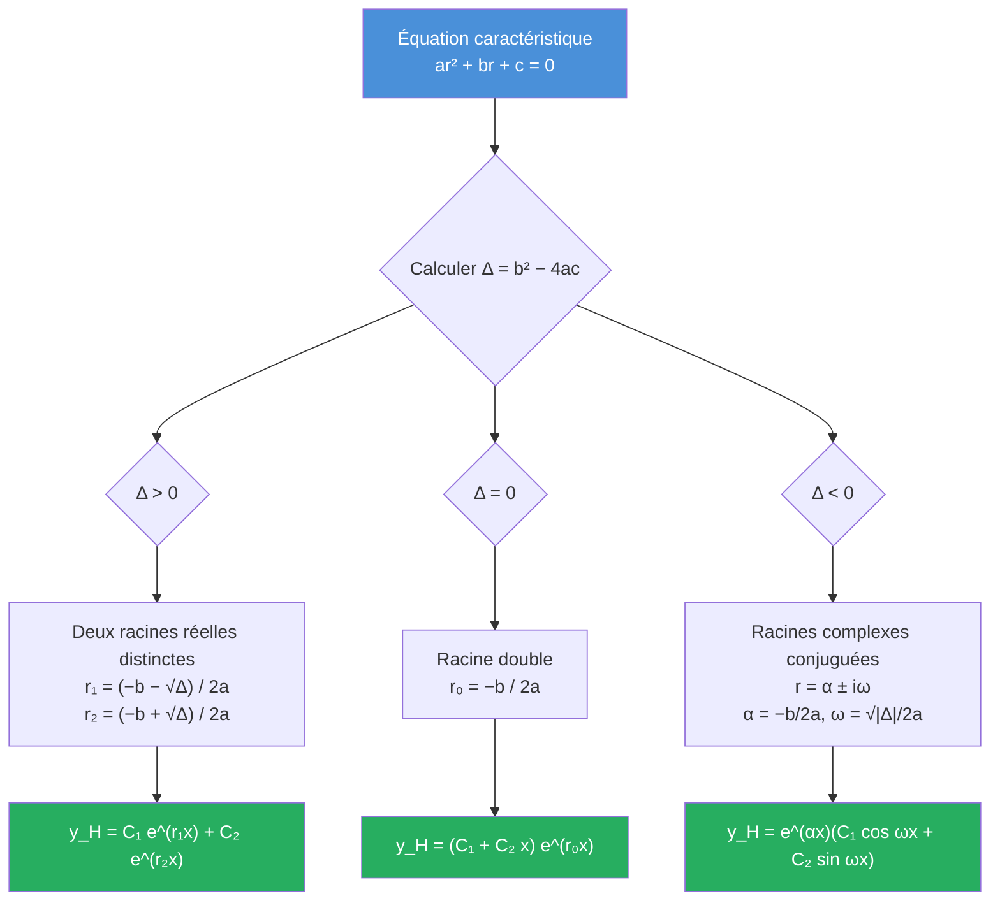
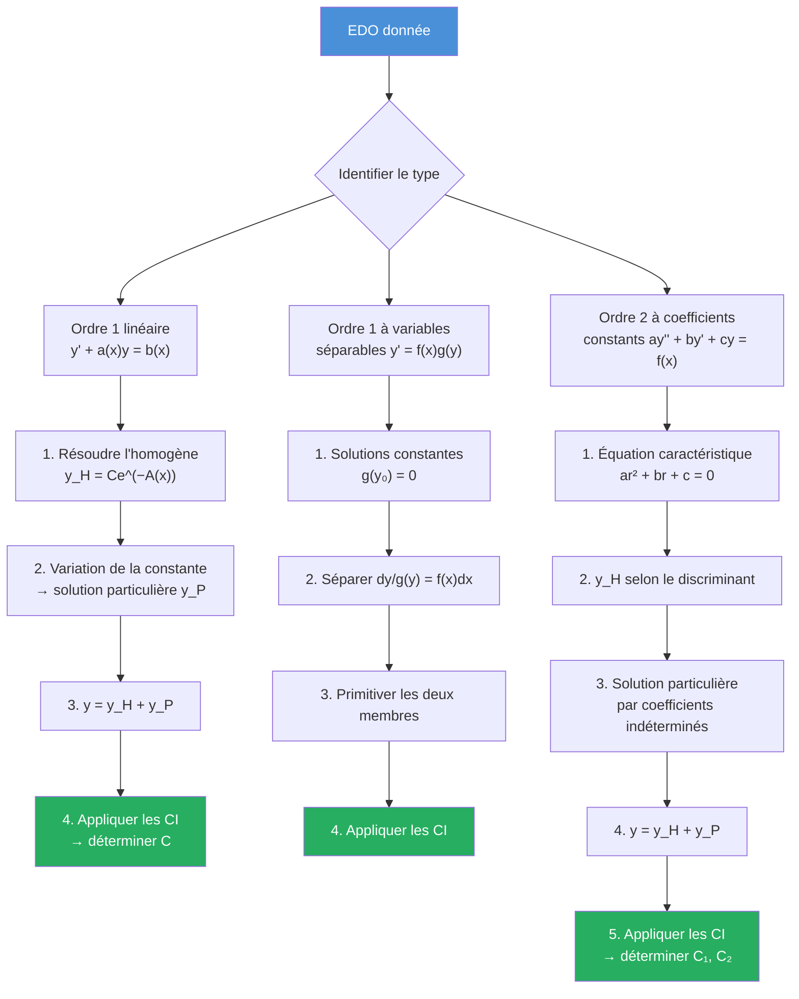

# Équations Différentielles

Les équations différentielles ordinaires (EDO) modélisent l'évolution de systèmes physiques, biologiques, économiques. Ce chapitre couvre les EDO linéaires du premier et du second ordre au programme de MPSI, avec les méthodes systématiques de résolution.

## 1. Généralités

> [!abstract] Définition -- Équation différentielle ordinaire
> Une **EDO** est une équation reliant une fonction inconnue $y$ d'une variable réelle $x$, et ses dérivées successives :
> $$F\big(x, y(x), y'(x), \dots, y^{(n)}(x)\big) = 0$$
> L'**ordre** de l'EDO est l'ordre le plus élevé de dérivation qui apparaît.

> [!abstract] Définition -- Problème de Cauchy
> Un **problème de Cauchy** (ou **problème à valeur initiale**) consiste à trouver $y$ vérifiant l'EDO et une **condition initiale** :
> $$y(x_0) = y_0 \quad (\text{ordre 1}), \qquad \text{ou} \quad y(x_0) = y_0,\; y'(x_0) = y_1 \quad (\text{ordre 2})$$

> [!abstract] Théorème -- Cauchy-Lipschitz (admis en MPSI)
> Soit $f : I \times \mathbb{R} \to \mathbb{R}$ continue et **localement lipschitzienne** en $y$. Alors pour tout $(x_0, y_0) \in I \times \mathbb{R}$, le problème de Cauchy :
> $$y' = f(x, y), \quad y(x_0) = y_0$$
> admet une **unique solution maximale**.

> [!warning] Attention
> Le théorème de Cauchy-Lipschitz est **admis** en MPSI. Il faut néanmoins en connaître l'énoncé précis et savoir l'utiliser : deux solutions d'une EDO linéaire qui coïncident en un point sont identiques.

## 2. EDO linéaires du premier ordre

### 2.1. Forme générale

On considère l'équation :

$$y'(x) + a(x)\, y(x) = b(x) \tag{E}$$

où $a, b : I \to \mathbb{R}$ (ou $\mathbb{C}$) sont des fonctions continues sur un intervalle $I$.

### 2.2. Équation homogène associée

L'**équation homogène** est :

$$y'(x) + a(x)\, y(x) = 0 \tag{E_0}$$

> [!abstract] Théorème -- Solutions de l'équation homogène
> Les solutions de $(E_0)$ sur $I$ sont :
> $$y_H(x) = C \exp\!\left(-\int_{x_0}^{x} a(t)\, dt\right), \quad C \in \mathbb{R}$$
> L'ensemble des solutions est un **espace vectoriel de dimension 1**.

> [!tip] Preuve
> Si $y$ est solution non nulle, $y'/ y = -a$, donc $\ln|y|$ est une primitive de $-a$, d'où $y = C e^{-A}$ avec $A$ une primitive de $a$.

### 2.3. Méthode de variation de la constante

Pour trouver une solution particulière de $(E)$, on **varie la constante** : on cherche $y_P$ sous la forme :

$$y_P(x) = C(x) \exp\!\left(-\int_{x_0}^{x} a(t)\, dt\right)$$

En substituant dans $(E)$, on obtient :

$$C'(x) = b(x) \exp\!\left(\int_{x_0}^{x} a(t)\, dt\right)$$

On primitive pour trouver $C(x)$.

> [!abstract] Théorème -- Solution générale
> La **solution générale** de $(E)$ est :
> $$y(x) = y_H(x) + y_P(x)$$
> où $y_H$ est la solution générale de $(E_0)$ et $y_P$ est une solution particulière de $(E)$.

> [!example] Exemple -- Résolution complète
> Résoudre $y' - 2xy = x$ sur $\mathbb{R}$.
>
> **Étape 1 : Équation homogène.** $y' - 2xy = 0$ donne $y_H = Ce^{x^2}$.
>
> **Étape 2 : Variation de la constante.** On pose $y_P = C(x)e^{x^2}$.
> $$C'(x) e^{x^2} = x \implies C'(x) = x e^{-x^2} \implies C(x) = -\frac{1}{2}e^{-x^2}$$
>
> Donc $y_P = -\dfrac{1}{2}$.
>
> **Solution générale** : $\boxed{y(x) = Ce^{x^2} - \dfrac{1}{2}}$, $C \in \mathbb{R}$.

### 2.4. Équations à variables séparables

> [!abstract] Définition
> Une EDO est **à variables séparables** si elle s'écrit :
> $$y' = f(x)\, g(y)$$

**Méthode** : si $g(y) \neq 0$, on sépare $\dfrac{dy}{g(y)} = f(x)\, dx$ et on primitive chaque membre.

> [!warning] Attention aux solutions constantes
> Les valeurs $y_0$ telles que $g(y_0) = 0$ donnent des **solutions constantes** $y \equiv y_0$ qu'il ne faut pas oublier.

> [!example] Exemple -- Variables séparables
> Résoudre $y' = y^2 \sin x$.
>
> **Solutions constantes** : $g(y) = y^2 = 0 \Rightarrow y \equiv 0$.
>
> Si $y \neq 0$ : $\dfrac{dy}{y^2} = \sin x\, dx$, d'où $-\dfrac{1}{y} = -\cos x + C$, soit $y = \dfrac{1}{\cos x - C}$.
>
> **Solution générale** : $y = 0$ ou $y(x) = \dfrac{1}{\cos x - C}$, $C \in \mathbb{R}$.

## 3. EDO linéaires du second ordre à coefficients constants

### 3.1. Forme générale

$$ay'' + by' + cy = f(x) \tag{E}$$

avec $a, b, c \in \mathbb{R}$, $a \neq 0$, et $f$ continue.

### 3.2. Équation homogène

L'**équation caractéristique** associée à l'équation homogène $ay'' + by' + cy = 0$ est :

$$ar^2 + br + c = 0 \tag{EC}$$

Le discriminant est $\Delta = b^2 - 4ac$.

> [!abstract] Théorème -- Solution générale de l'équation homogène
> Selon le signe du discriminant $\Delta = b^2 - 4ac$ :
>
> | $\Delta$ | Racines | Solution générale |
> |---|---|---|
> | $\Delta > 0$ | $r_1 \neq r_2 \in \mathbb{R}$ | $y_H = C_1 e^{r_1 x} + C_2 e^{r_2 x}$ |
> | $\Delta = 0$ | $r_0 \in \mathbb{R}$ double | $y_H = (C_1 + C_2 x) e^{r_0 x}$ |
> | $\Delta < 0$ | $r = \alpha \pm i\omega$ | $y_H = e^{\alpha x}(C_1 \cos\omega x + C_2 \sin\omega x)$ |
>
> avec $\alpha = -b/(2a)$ et $\omega = \sqrt{|\Delta|}/(2a)$.

> [!important] Structure
> L'ensemble des solutions de l'équation homogène est un **espace vectoriel de dimension 2**. Les deux fonctions indiquées forment un **système fondamental** de solutions.

### 3.3. Solution particulière : méthode des coefficients indéterminés

Le principe : on cherche $y_P$ sous une **forme analogue** au second membre $f(x)$, éventuellement multipliée par $x$ ou $x^2$.

#### Cas 1 : Second membre $f(x) = P(x) e^{\alpha x}$

On cherche $y_P = Q(x) e^{\alpha x}$ avec $\deg Q = \deg P + m$, où $m$ est la **multiplicité** de $\alpha$ comme racine de l'équation caractéristique ($m = 0, 1$ ou $2$).

> [!warning] Règle de multiplication par $x^m$
> - Si $\alpha$ n'est **pas** racine de $(EC)$ : $m = 0$, on cherche $y_P = Q(x)e^{\alpha x}$ avec $\deg Q = \deg P$.
> - Si $\alpha$ est racine **simple** : $m = 1$, on cherche $y_P = x\, Q(x) e^{\alpha x}$.
> - Si $\alpha$ est racine **double** : $m = 2$, on cherche $y_P = x^2 Q(x) e^{\alpha x}$.

#### Cas 2 : Second membre $f(x) = P(x) e^{\alpha x}\cos(\omega x)$ ou $P(x)e^{\alpha x}\sin(\omega x)$

On passe par les **complexes** : on cherche une solution particulière de l'équation avec second membre $P(x) e^{(\alpha + i\omega)x}$, puis on prend la partie réelle ou imaginaire.

#### Cas 3 : Principe de superposition

> [!abstract] Théorème -- Principe de superposition
> Si $y_1$ est solution particulière de $ay'' + by' + cy = f_1(x)$ et $y_2$ est solution particulière de $ay'' + by' + cy = f_2(x)$, alors $y_1 + y_2$ est solution particulière de :
> $$ay'' + by' + cy = f_1(x) + f_2(x)$$

### 3.4. Solution générale complète

> [!abstract] Théorème -- Structure des solutions
> La **solution générale** de $(E)$ est :
> $$y = y_H + y_P$$
> où $y_H$ est la solution générale de l'homogène et $y_P$ est une solution particulière de $(E)$.

> [!example] Exemple complet -- Résolution d'une EDO d'ordre 2
> Résoudre $y'' - 3y' + 2y = e^x$ avec $y(0) = 0$, $y'(0) = 1$.
>
> **Étape 1 : Équation caractéristique.** $r^2 - 3r + 2 = 0$, soit $(r-1)(r-2) = 0$, racines $r_1 = 1$, $r_2 = 2$.
>
> **Étape 2 : Solution homogène.** $y_H = C_1 e^x + C_2 e^{2x}$.
>
> **Étape 3 : Solution particulière.** Le second membre est $e^x$. Or $\alpha = 1$ est racine **simple** de $(EC)$, donc $m = 1$ et on cherche $y_P = Axe^x$.
>
> $y_P' = A(1 + x)e^x$, $y_P'' = A(2 + x)e^x$.
>
> Substitution : $A(2+x)e^x - 3A(1+x)e^x + 2Axe^x = Ae^x(2+x-3-3x+2x) = A(-1)e^x = e^x$.
>
> Donc $A = -1$ et $y_P = -xe^x$.
>
> **Étape 4 : Solution générale.** $y = C_1 e^x + C_2 e^{2x} - xe^x$.
>
> **Étape 5 : Conditions initiales.**
> - $y(0) = C_1 + C_2 = 0$
> - $y'(0) = C_1 + 2C_2 - 1 = 1$, soit $C_1 + 2C_2 = 2$
>
> On résout : $C_2 = 2$, $C_1 = -2$.
>
> **Solution** : $\boxed{y(x) = -2e^x + 2e^{2x} - xe^x = 2e^{2x} - (2+x)e^x}$

> [!example] Exemple -- Second membre trigonométrique
> Résoudre $y'' + y = \cos(2x)$.
>
> **Équation caractéristique** : $r^2 + 1 = 0$, racines $r = \pm i$, donc $y_H = C_1\cos x + C_2\sin x$.
>
> **Solution particulière** : $\cos(2x) = \text{Re}(e^{2ix})$. On résout $y'' + y = e^{2ix}$. On cherche $y_P = Ae^{2ix}$.
>
> $(2i)^2 A e^{2ix} + Ae^{2ix} = e^{2ix}$, soit $(-4 + 1)A = 1$, donc $A = -1/3$.
>
> $y_P = \text{Re}(-e^{2ix}/3) = -\cos(2x)/3$.
>
> **Solution générale** : $\boxed{y = C_1\cos x + C_2\sin x - \dfrac{\cos(2x)}{3}}$

## 4. Méthode générale de résolution

## 5. Systèmes différentiels linéaires (introduction)

### 5.1. Forme générale

Un **système différentiel linéaire** d'ordre 1 s'écrit :

$$X'(t) = A(t)\, X(t) + B(t)$$

où $X(t) \in \mathbb{R}^n$ est le vecteur des inconnues et $A(t) \in \mathcal{M}_n(\mathbb{R})$.

En MPSI, on se restreint au cas $n = 2$ à coefficients constants :

$$\begin{cases} x' = ax + by + f_1(t) \\ y' = cx + dy + f_2(t) \end{cases}$$

### 5.2. Méthode de résolution pour $n = 2$

**Méthode 1 : Réduction à une EDO d'ordre 2.** On exprime $y$ en fonction de $x$ et $x'$ à partir de la première équation, puis on substitue dans la seconde pour obtenir une EDO d'ordre 2 en $x$.

**Méthode 2 : Valeurs propres.** Si $A$ est diagonalisable avec valeurs propres $\lambda_1, \lambda_2$ et vecteurs propres $v_1, v_2$ :

$$X_H(t) = C_1 e^{\lambda_1 t} v_1 + C_2 e^{\lambda_2 t} v_2$$

> [!example] Exemple -- Système différentiel
> Résoudre $\begin{cases} x' = 3x - 2y \\ y' = 2x - y \end{cases}$
>
> **Matrice** : $A = \begin{pmatrix} 3 & -2 \\ 2 & -1 \end{pmatrix}$. Le polynôme caractéristique est $\lambda^2 - 2\lambda + 1 = (\lambda - 1)^2$, donc $\lambda = 1$ est valeur propre double.
>
> La matrice $A - I = \begin{pmatrix} 2 & -2 \\ 2 & -2 \end{pmatrix}$ est de rang 1, donc l'espace propre est de dimension 1, engendré par $v = \begin{pmatrix} 1 \\ 1 \end{pmatrix}$.
>
> $A$ n'est pas diagonalisable. On utilise la méthode par réduction à l'ordre 2.
>
> De la première équation : $y = \dfrac{3x - x'}{2}$, donc $y' = \dfrac{3x' - x''}{2}$.
>
> Substitution dans la seconde : $\dfrac{3x' - x''}{2} = 2x - \dfrac{3x - x'}{2}$
>
> $3x' - x'' = 4x - 3x + x' = x + x'$, soit $x'' - 2x' + x = 0$.
>
> Équation caractéristique : $r^2 - 2r + 1 = (r-1)^2 = 0$, racine double $r = 1$.
>
> $x(t) = (C_1 + C_2 t) e^t$, puis $y(t) = \dfrac{3x - x'}{2} = (C_1 + C_2 t - C_2/2 - C_2 t/2 \cdot 0)$...
>
> En calculant proprement : $x' = (C_2 + C_1 + C_2 t)e^t$, donc $y = \frac{3(C_1 + C_2 t) - (C_1 + C_2 + C_2 t)}{2}e^t = \frac{2C_1 + 2C_2 t - C_2}{2}e^t$.
>
> $$\boxed{x(t) = (C_1 + C_2 t)e^t, \quad y(t) = \left(C_1 - \frac{C_2}{2} + C_2 t\right)e^t}$$

## 6. Résultats complémentaires

### 6.1. Wronskien

> [!abstract] Définition -- Wronskien
> Pour deux solutions $y_1, y_2$ de l'équation homogène $ay'' + by' + cy = 0$, le **wronskien** est :
> $$W(x) = \begin{vmatrix} y_1(x) & y_2(x) \\ y_1'(x) & y_2'(x) \end{vmatrix} = y_1(x)y_2'(x) - y_2(x)y_1'(x)$$

> [!abstract] Théorème
> $(y_1, y_2)$ forment un système fondamental de solutions si et seulement si $W(x) \neq 0$ pour tout $x$ (ou de manière équivalente, pour un $x$).

### 6.2. Variation de la constante pour l'ordre 2

Quand le second membre ne rentre pas dans les cas standards, on peut utiliser la **variation des constantes** : on cherche $y_P = C_1(x) y_1(x) + C_2(x) y_2(x)$ avec les conditions :

$$\begin{cases} C_1' y_1 + C_2' y_2 = 0 \\ C_1' y_1' + C_2' y_2' = f(x)/a \end{cases}$$

Ce système se résout grâce au wronskien :

$$C_1' = \frac{-y_2 f}{a W}, \quad C_2' = \frac{y_1 f}{a W}$$

## 7. Exercices types corrigés

### Exercice 1 : EDO linéaire d'ordre 1

> [!example] Exercice -- Résolution avec condition initiale
> Résoudre $y' + \dfrac{y}{x} = \ln x$ sur $]0, +\infty[$, avec $y(1) = 0$.
>
> **Homogène** : $y' + y/x = 0 \Rightarrow y'/y = -1/x \Rightarrow y_H = C/x$.
>
> **Variation de la constante** : $y_P = C(x)/x$, donc $C'(x)/x = \ln x$, soit $C'(x) = x\ln x$.
>
> On intègre par parties : $C(x) = \dfrac{x^2}{2}\ln x - \dfrac{x^2}{4}$.
>
> Solution particulière : $y_P = \dfrac{x}{2}\ln x - \dfrac{x}{4}$.
>
> Solution générale : $y = \dfrac{C}{x} + \dfrac{x}{2}\ln x - \dfrac{x}{4}$.
>
> Condition initiale $y(1) = 0$ : $C - 1/4 = 0$, soit $C = 1/4$.
>
> $$\boxed{y(x) = \frac{1}{4x} + \frac{x}{2}\ln x - \frac{x}{4} = \frac{1}{4x} + \frac{x(2\ln x - 1)}{4}}$$

### Exercice 2 : EDO d'ordre 2 avec résonance

> [!example] Exercice -- Résonance
> Résoudre $y'' + 4y = \cos(2x)$.
>
> **Équation caractéristique** : $r^2 + 4 = 0$, racines $r = \pm 2i$. Donc $y_H = C_1\cos 2x + C_2\sin 2x$.
>
> **Solution particulière** : $\cos 2x = \text{Re}(e^{2ix})$. Or $2i$ est **racine simple** de $r^2 + 4 = 0$, donc on cherche $y_P$ de la forme $\text{Re}(Axe^{2ix})$.
>
> On résout $y'' + 4y = e^{2ix}$ avec $y_P = Axe^{2ix}$ :
>
> $y_P' = A(1 + 2ix)e^{2ix}$, $y_P'' = A(4i - 4x)e^{2ix}$.
>
> $y_P'' + 4y_P = A(4i - 4x + 4x)e^{2ix} = 4iAe^{2ix} = e^{2ix}$, soit $A = 1/(4i) = -i/4$.
>
> $y_P = \text{Re}\!\left(-\dfrac{ix}{4}e^{2ix}\right) = \text{Re}\!\left(-\dfrac{ix}{4}(\cos 2x + i\sin 2x)\right) = \dfrac{x\sin 2x}{4}$.
>
> $$\boxed{y = C_1\cos 2x + C_2\sin 2x + \frac{x\sin 2x}{4}}$$
>
> On observe le terme en $x\sin 2x$ : c'est le phénomène de **résonance**, où l'amplitude croît linéairement.

### Exercice 3 : Équation à variables séparables

> [!example] Exercice -- Équation logistique
> Résoudre $y' = y(1 - y)$ sur $\mathbb{R}$, avec $y(0) = 1/2$.
>
> **Solutions constantes** : $y \equiv 0$ et $y \equiv 1$.
>
> Si $y \notin \{0, 1\}$ : $\dfrac{dy}{y(1-y)} = dx$. Par décomposition en éléments simples :
>
> $$\frac{1}{y(1-y)} = \frac{1}{y} + \frac{1}{1-y}$$
>
> En intégrant : $\ln|y| - \ln|1-y| = x + C_0$, soit $\dfrac{y}{1-y} = Ke^x$ ($K \neq 0$).
>
> Donc $y = \dfrac{Ke^x}{1 + Ke^x} = \dfrac{1}{1 + K^{-1}e^{-x}}$.
>
> Condition initiale $y(0) = 1/2$ : $\dfrac{K}{1+K} = \dfrac{1}{2}$, soit $K = 1$.
>
> $$\boxed{y(x) = \frac{e^x}{1 + e^x} = \frac{1}{1 + e^{-x}}}$$
>
> C'est la **fonction logistique** (ou sigmoïde), croissante de $0$ à $1$.

### Exercice 4 : Problème de Cauchy et unicité

> [!example] Exercice -- Application de Cauchy-Lipschitz
> Montrer que la seule solution de $y' = 2\sqrt{|y|}$ telle que $y(0) = 0$ et $y \geqslant 0$ n'est **pas** unique.
>
> On remarque que $f(x, y) = 2\sqrt{|y|}$ n'est **pas** lipschitzienne en $y$ au voisinage de $y = 0$ ($f$ n'est pas dérivable en $y = 0$). Le théorème de Cauchy-Lipschitz ne s'applique donc pas.
>
> En effet, on vérifie que $y_1(x) = 0$ et $y_2(x) = x^2$ (pour $x \geqslant 0$, prolongée par $0$ pour $x < 0$) sont toutes deux solutions, avec $y_1(0) = y_2(0) = 0$.
>
> Cet exemple montre l'importance de la condition de Lipschitz.

## 8. Liens

- [[Intégration]] -- les primitives sont essentielles pour résoudre les EDO
- [[Espaces Euclidiens]] -- les systèmes différentiels utilisent l'algèbre linéaire
- [[Polynômes]] -- l'équation caractéristique est un polynôme
- [[Séries entières]] -- résolution d'EDO par séries entières (Math Spé)
