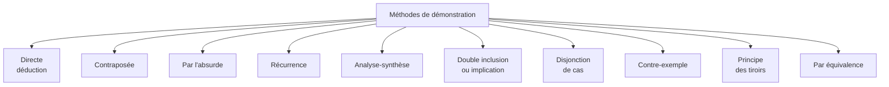

# Méthodes de Démonstration

Une démonstration mathématique est une chaîne d'arguments rigoureuse qui mène d'hypothèses à une conclusion. Au-delà du contenu, **la forme** d'une démonstration suit quelques patrons classiques qu'il faut savoir reconnaître et reproduire. Cette note recense les méthodes les plus utiles avec un exemple emblématique pour chacune.

> [!abstract] Pourquoi connaître ces méthodes
> Face à une question « démontrer que… », identifier la méthode adaptée est déjà la moitié du travail. Une démonstration n'a pas à être inventée de zéro : elle suit presque toujours un patron connu, qu'il s'agit d'adapter à la situation.

## Vue d'ensemble

## 1. Démonstration directe

**Principe** : enchaîner des implications $A_0 \Rightarrow A_1 \Rightarrow \cdots \Rightarrow A_n$ depuis l'hypothèse jusqu'à la conclusion. C'est la méthode la plus simple.

> [!example] La somme de deux nombres pairs est paire
> Soit $a = 2k$ et $b = 2k'$ deux entiers pairs. Alors $a + b = 2k + 2k' = 2(k + k')$, qui est pair par définition.

**Quand l'utiliser** : quand on voit clairement les étapes intermédiaires. C'est le cas par défaut.

## 2. Contraposée

> [!important] Principe
> $(P \Rightarrow Q)$ est logiquement équivalent à $(\lnot Q \Rightarrow \lnot P)$.

Au lieu de prouver « $P$ implique $Q$ », on prouve « non $Q$ implique non $P$ ».

**Quand l'utiliser** : quand la négation de $Q$ donne plus d'information à manipuler que $P$.

> [!example] Si $n^2$ est pair, alors $n$ est pair
> *Contraposée* : si $n$ est impair, alors $n^2$ est impair.
>
> Si $n = 2k + 1$, alors $n^2 = 4k^2 + 4k + 1 = 2(2k^2 + 2k) + 1$, qui est impair. CQFD.
>
> *Tentative directe* : on ne sait pas grand-chose de la racine carrée d'un nombre pair. La contraposée est plus naturelle.

## 3. Par l'absurde (raisonnement apagogique)

> [!important] Principe
> Pour démontrer $P$, on suppose $\lnot P$ et on déduit une contradiction (absurdité).

**Quand l'utiliser** : quand l'hypothèse $\lnot P$ est riche en conséquences manipulables, surtout pour des résultats de **non-existence** ou d'**infinité**.

> [!example] L'infinité des nombres premiers (Euclide)
> Supposons qu'il existe un nombre fini de premiers $p_1, p_2, \dots, p_n$.
> Posons $N = p_1 p_2 \cdots p_n + 1$.
> $N$ admet un diviseur premier $p$ (car $N \geq 2$). Or $p$ serait dans la liste : $p = p_i$ pour un $i$. Alors $p \mid p_1 \cdots p_n$, et comme $p \mid N$, on aurait $p \mid 1$ — absurde.

> [!example] $\sqrt{2}$ est irrationnel
> Supposons $\sqrt{2} = p/q$ avec $p, q$ entiers, $\gcd(p, q) = 1$.
> Alors $p^2 = 2q^2$, donc $p^2$ pair, donc $p$ pair (cf. exemple 2). Écrire $p = 2k$.
> Alors $4k^2 = 2q^2$, donc $q^2 = 2k^2$, donc $q$ pair.
> Mais alors $2 \mid \gcd(p, q)$ — contradiction.

## 4. Récurrence

> [!important] Principe (récurrence simple)
> Pour prouver $\forall n \in \mathbb{N},\; P(n)$ :
> 1. **Initialisation** : montrer $P(n_0)$ pour un certain $n_0$ (souvent $0$ ou $1$)
> 2. **Hérédité** : pour tout $n \geq n_0$, supposer $P(n)$ et montrer $P(n+1)$
> 3. **Conclusion** : par récurrence, $P(n)$ est vraie pour tout $n \geq n_0$

> [!example] Somme des $n$ premiers entiers
> Montrer que pour tout $n \geq 1$, $\sum_{k=1}^n k = \frac{n(n+1)}{2}$.
>
> *Initialisation* : pour $n = 1$, somme = $1 = \frac{1 \cdot 2}{2}$. OK.
>
> *Hérédité* : supposons $\sum_{k=1}^n k = \frac{n(n+1)}{2}$. Alors
> $$\sum_{k=1}^{n+1} k = \frac{n(n+1)}{2} + (n+1) = \frac{(n+1)(n+2)}{2}$$
> CQFD.

### Variantes

| Variante | Quand |
|---|---|
| **Récurrence forte** | On suppose $P(k)$ pour tout $k \leq n$, et on montre $P(n+1)$. Utile quand $P(n+1)$ dépend de plusieurs prédécesseurs (Fibonacci, factorisation en premiers). |
| **Récurrence à deux pas** | Initialisation sur deux valeurs ($P(0)$ et $P(1)$), hérédité de $\{P(n), P(n+1)\} \to P(n+2)$. |
| **Récurrence finie** | Sur $\{0, 1, \dots, N\}$ avec un $N$ fixé. |
| **Récurrence descendante** | $P(N) \Rightarrow P(N-1) \Rightarrow \cdots$ — rare mais utile. |

> [!warning] Pièges de la récurrence
> - Bien **identifier** $P(n)$ et l'écrire explicitement
> - L'initialisation est **essentielle** — sans elle, l'hérédité ne sert à rien
> - L'hérédité doit fonctionner pour **tout** $n \geq n_0$, pas juste pour un cas particulier

## 5. Analyse-synthèse

> [!important] Principe
> Pour prouver qu'un objet existe et le caractériser :
> 1. **Analyse** : supposer le problème résolu, déduire les conditions nécessaires sur l'objet
> 2. **Synthèse** : construire l'objet à partir des conditions trouvées et vérifier qu'il convient

**Quand l'utiliser** : recherche d'existence + unicité, identification d'inconnues, équations fonctionnelles.

> [!example] Existence d'une décomposition pair + impair
> Montrer que toute fonction $f: \mathbb{R} \to \mathbb{R}$ s'écrit de façon unique $f = p + i$ avec $p$ paire et $i$ impaire.
>
> *Analyse* : Si $f = p + i$, alors $f(-x) = p(-x) + i(-x) = p(x) - i(x)$.
> Donc $p(x) = \frac{f(x) + f(-x)}{2}$ et $i(x) = \frac{f(x) - f(-x)}{2}$.
>
> *Synthèse* : Posons $p(x) = \frac{f(x)+f(-x)}{2}$ et $i(x) = \frac{f(x)-f(-x)}{2}$.
> On vérifie : $p$ est paire, $i$ est impaire, et $p + i = f$. CQFD.

## 6. Double inclusion / double implication

### 6.1 Égalité d'ensembles

Pour montrer $A = B$, on montre $A \subset B$ **et** $B \subset A$.

> [!example] $A \cap (B \cup C) = (A \cap B) \cup (A \cap C)$
> *Sens ⊂* : Soit $x \in A \cap (B \cup C)$. Alors $x \in A$ et ($x \in B$ ou $x \in C$).
> Donc ($x \in A \cap B$) ou ($x \in A \cap C$), soit $x \in (A \cap B) \cup (A \cap C)$.
>
> *Sens ⊃* : Soit $x \in (A \cap B) \cup (A \cap C)$. Alors $x \in A \cap B$ ou $x \in A \cap C$. Dans les deux cas $x \in A$ et $x \in B \cup C$, donc $x \in A \cap (B \cup C)$.

### 6.2 Équivalence ($\Leftrightarrow$)

Pour montrer $P \Leftrightarrow Q$, on montre $P \Rightarrow Q$ **et** $Q \Rightarrow P$.

## 7. Disjonction de cas

> [!important] Principe
> Décomposer l'ensemble des situations possibles en cas exhaustifs et mutuellement exclusifs, traiter chacun.

**Quand l'utiliser** : quand l'objet à étudier a plusieurs régimes (positif/négatif, pair/impair, $n \leq k$ / $n > k$).

> [!example] Inégalité avec valeur absolue
> Montrer que $|x + y| \leq |x| + |y|$.
>
> *Cas 1* : $x \geq 0$ et $y \geq 0$. Alors $|x+y| = x+y = |x|+|y|$.
> *Cas 2* : $x < 0$ et $y < 0$. Alors $|x+y| = -(x+y) = (-x)+(-y) = |x|+|y|$.
> *Cas 3* : signes opposés, par exemple $x \geq 0 > y$. Alors $|x+y| = \max(x, -y) - 0 \leq x + (-y) = |x| + |y|$.

## 8. Contre-exemple

Pour réfuter une assertion universelle $\forall x,\; P(x)$, **un seul** contre-exemple suffit. Inversement, **aucun** nombre fini d'exemples ne prouve une propriété universelle.

> [!example] La conjecture de Pólya (1919)
> Pólya conjecture que pour tout $n \geq 2$, plus de la moitié des entiers $\leq n$ ont un nombre **impair** de facteurs premiers (comptés avec multiplicité).
>
> Vérifiée numériquement jusqu'à $n = 906\,150\,256$… avant qu'**Haselgrove** ne trouve en 1958 que $n = 906\,150\,257$ est un contre-exemple.
>
> *Morale* : les vérifications numériques ne sont pas des démonstrations.

## 9. Principe des tiroirs (pigeonhole)

> [!important] Principe
> Si on range $n+1$ objets dans $n$ tiroirs, au moins un tiroir contient au moins 2 objets.

Trivial dans l'énoncé, redoutable en applications combinatoires.

> [!example] Cheveux des Parisiens
> Paris a ~10 millions d'habitants. Personne n'a plus de ~150 000 cheveux. Si on associe à chaque Parisien son nombre de cheveux, on range 10⁷ personnes dans 1{,}5 × 10⁵ tiroirs. **Au moins deux Parisiens ont exactement le même nombre de cheveux.**

Voir [[Combinatoire Avancée]] pour plus d'applications.

## 10. Démonstration par récurrence transfinie / Zorn

(Hors programme, mais à mentionner.) Pour des structures infinies non dénombrables, on utilise l'**axiome du choix** ou ses équivalents (**lemme de Zorn**, théorème de Zermelo). Apparaît en algèbre (existence d'une base de tout espace vectoriel), en topologie (théorème de Tychonoff), en logique.

## 11. Démonstration constructive vs non constructive

| Type | Principe | Exemple |
|---|---|---|
| **Constructive** | On exhibe explicitement l'objet | « Voici un nombre premier > 10⁹ : … » |
| **Non constructive** | On prouve l'existence sans la construction | « Il existe deux irrationnels $a, b$ tels que $a^b$ rationnel : si $\sqrt{2}^{\sqrt{2}}$ est rationnel, prendre $a = b = \sqrt{2}$ ; sinon prendre $a = \sqrt{2}^{\sqrt{2}}$ et $b = \sqrt{2}$. » |

La **méthode probabiliste d'Erdős** est l'exemple type d'une démonstration non constructive : on prouve qu'un objet existe en montrant que sa probabilité est non nulle, sans le construire.

## 12. Conseils pratiques

> [!tip] Choix de la méthode
> - **Conclusion négative ou non-existence** → souvent absurde ou contraposée
> - **Conclusion sur tout entier $n$** → récurrence
> - **Existence + unicité** → analyse-synthèse
> - **Égalité d'ensembles** → double inclusion
> - **Disposition de cas claire** → disjonction
> - **Contre-exemple potentiel** → tester sur petits cas avant de chercher une preuve

> [!warning] Pièges à éviter
> - **Confondre $\Rightarrow$ et $\Leftrightarrow$** : une équivalence est strictement plus forte
> - **Quantificateurs implicites** : « pour tout $x$ » sous-entendu est dangereux
> - **« On voit que »** : sauf cas trivial, à proscrire — c'est l'aveu d'un saut logique
> - **Récurrence avec hérédité prouvée pour $n = 5$ seulement** : ne marche pas
> - **Absurde où la « contradiction » est circulaire** : on suppose $\lnot P$, on déduit $\lnot P$, on dit « contradiction » — non, c'est juste répéter l'hypothèse

Pour les preuves canoniques à connaître, voir [[Démonstrations Classiques]]. Pour des recettes par type de question, voir [[Comment Montrer Que]].
