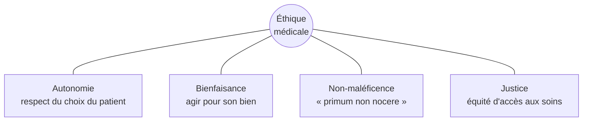

# Enjeux Contemporains en Médecine

La médecine du XXIe siècle affronte une double transition : épidémiologique (les maladies chroniques remplacent les maladies infectieuses dans les pays riches) et éthique (les progrès techniques posent des choix de société). Quatre fronts dominent.

## Santé publique mondiale

### Le poids des maladies chroniques

Dans les pays développés, ce sont désormais elles qui dominent — pas les microbes.

| Maladie | Cas mondiaux (2024) | Mortalité |
|---|---|---|
| **Maladies cardiovasculaires** | ~520 millions de cas | 1re cause mondiale (~17,9 M morts/an) |
| **Cancer** | ~20 millions de nouveaux cas/an | ~10 M morts/an (1 décès sur 6) |
| **Diabète** | ~540 millions d'adultes | x2 depuis 1990 |
| **Maladies respiratoires chroniques** (BPCO, asthme) | ~545 millions | ~3,2 M morts/an |

**Facteurs communs** : tabac, alcool, sédentarité, alimentation ultra-transformée, pollution de l'air. La prévention pèserait davantage que les traitements — mais elle est politiquement plus lente à mettre en œuvre.

### Maladies infectieuses — pas finies

Malgré les vaccins et antibiotiques, les pathogènes restent un enjeu majeur.

| Maladie | Charge mondiale | Situation |
|---|---|---|
| **VIH/SIDA** | ~39 millions de personnes vivant avec le VIH | Trithérapies efficaces, mais accès inégal ; objectif ONUSIDA « 95-95-95 » d'ici 2025 |
| **Tuberculose** | ~10 millions de nouveaux cas/an | Retour des formes multi-résistantes (MDR-TB, XDR-TB) |
| **Paludisme** | ~250 millions de cas/an, ~600 000 morts | Premier vaccin RTS,S/AS01 (Mosquirix) déployé en Afrique depuis 2023 |
| **COVID-19** | ~775 millions de cas confirmés | Endémique depuis 2023, surveillance des nouveaux variants |
| **Grippe aviaire H5N1** | Cas humains depuis 2024 (USA, Cambodge) | Sous surveillance OMS |

### Résistance aux antibiotiques (AMR)

L'OMS la classe parmi les **dix principales menaces sanitaires mondiales**.
- ~1,3 million de morts/an directement attribuables (étude *The Lancet*, 2022)
- Projection : 10 millions/an d'ici 2050 si rien ne change
- Coût économique projeté : 100 000 milliards $ cumulés d'ici 2050

**Causes** : prescription abusive (rhumes viraux traités par antibiotiques), usage massif en élevage (~70 % de la consommation mondiale), sous-investissement R&D (aucune nouvelle classe majeure depuis 1987).

## Éthique médicale — les quatre principes

Depuis Beauchamp et Childress (*Principles of Biomedical Ethics*, 1979), quatre principes structurent les décisions médicales difficiles.

| Principe | Origine | Application concrète |
|---|---|---|
| **Autonomie** | tradition libérale moderne | Consentement éclairé obligatoire avant tout acte (loi Kouchner 2002 en France) |
| **Bienfaisance** | Hippocrate, Antiquité | Le médecin doit chercher activement le bien du patient |
| **Non-maléficence** | « D'abord ne pas nuire » | Refuser un traitement plus risqué que le bénéfice attendu |
| **Justice** | éthique moderne (Rawls) | Allocation équitable des ressources (greffons, lits de réanimation, doses de vaccin) |

Ces principes entrent parfois en **conflit** — c'est précisément là que la décision devient éthique :
- Un Témoin de Jéhovah refuse une transfusion vitale : autonomie vs bienfaisance
- Réanimer un grand vieillard polypathologique : bienfaisance vs non-maléficence (acharnement thérapeutique)
- Trier les patients en pandémie : autonomie individuelle vs justice collective

## Fin de vie

Un débat majeur de toutes les sociétés vieillissantes. La position varie radicalement selon les pays.

| Pays | Cadre légal | Année |
|---|---|---|
| **Pays-Bas** | Euthanasie active autorisée (mineurs inclus depuis 2023) | 2002 |
| **Belgique** | Euthanasie active (sans limite d'âge depuis 2014) | 2002 |
| **Suisse** | Suicide assisté autorisé (associations type Exit, Dignitas) | Pratique tolérée depuis 1942 |
| **Canada** | Aide médicale à mourir (MAID) | 2016 |
| **Espagne, Portugal** | Euthanasie | 2021, 2023 |
| **France** | Sédation profonde continue (loi Claeys-Leonetti) ; projet de loi « aide à mourir » en débat parlementaire | 2016 / 2024-2025 |
| **Royaume-Uni** | Interdit, débat parlementaire 2024-2025 | — |

**Distinctions importantes** :
- *Euthanasie active* : geste médical qui provoque la mort
- *Suicide assisté* : le médecin fournit la substance, le patient l'absorbe lui-même
- *Sédation profonde* : on endort jusqu'à la mort naturelle (sans accélérer)
- *Soins palliatifs* : on accompagne sans hâter ni retarder

## Génétique, transplantation, recherche

### Modifications embryonnaires

L'affaire **He Jiankui** (Chine, 2018) — premières naissances de bébés CRISPR — a déclenché un moratoire international de fait. Les comités d'éthique (Académies nationales, OMS) maintiennent que les modifications **germinales** (transmissibles à la descendance) ne sont pas acceptables tant que les risques ne sont pas maîtrisés.

### Discrimination génétique

Le séquençage devient bon marché (~200 € en 2024). Risques :
- Refus d'assurance ou d'embauche selon le profil génétique
- Aux USA, *Genetic Information Nondiscrimination Act* (GINA, 2008) interdit cela pour l'emploi et l'assurance santé — pas pour l'assurance-vie
- En France, le **secret génétique** protégé par la loi (Code de la santé publique)

### Allocation des organes

Plus de besoins que de greffons disponibles. Critères de répartition en France (Agence de la biomédecine) :
- Urgence vitale
- Compatibilité (HLA, groupe sanguin)
- Durée d'attente
- Distance géographique (ischémie froide limitée)

Solutions à l'étude : **xénotransplantation** (cœur de porc génétiquement modifié — premières transplantations chez l'humain en 2022-2024), organes bioartificiels.

### Recherche sur l'humain

Encadrée par la *Déclaration d'Helsinki* (1964, révisée régulièrement) — héritage des procès de Nuremberg contre les expérimentations nazies. Principes clés : consentement libre et éclairé, bénéfice/risque favorable, comité d'éthique indépendant, transparence des résultats.

Enjeux contemporains : essais cliniques dans les pays à faibles revenus (risque d'exploitation), vitesse d'urgence (vaccins COVID, *challenge studies* éthiquement débattues).
