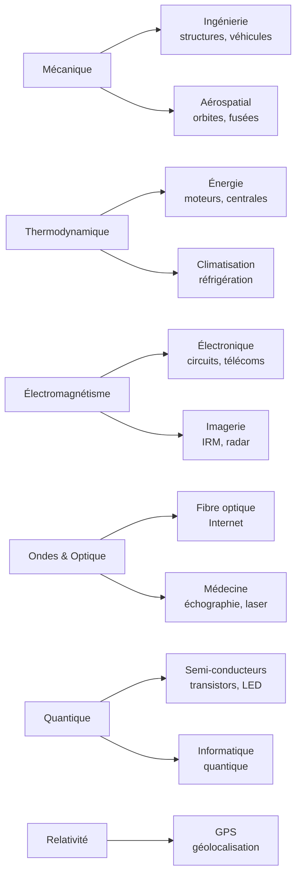

# Applications de la Physique

Vue panoramique des usages de la physique. Chaque domaine théorique irrigue des technologies concrètes ; cette note relie les chapitres du vault à leurs applications.

## 1. Carte des domaines vers les usages

## 2. Énergie

> [!important] La thermodynamique au cœur de la production d'énergie
> Centrales thermiques, nucléaires et moteurs à combustion convertissent de la chaleur en travail. Le **rendement de Carnot** $\eta = 1 - T_f/T_c$ fixe la limite théorique : c'est pourquoi on cherche des sources chaudes les plus chaudes possibles.

- **Moteurs thermiques** : automobile, aviation, centrales (voir [[Thermodynamique]]).
- **Pompes à chaleur et réfrigérateurs** : transfert de chaleur du froid vers le chaud.
- **Énergies renouvelables** : éolien (mécanique des fluides), solaire photovoltaïque (effet photoélectrique, voir [[Mécanique Quantique]]).

## 3. Électronique et télécommunications

- **Circuits et filtres** : tout appareil électronique repose sur l'[[Électrocinétique]] (RC, RLC, impédances).
- **Semi-conducteurs** : transistors, diodes, LED — applications directes de la [[Mécanique Quantique]] (bandes d'énergie).
- **Télécommunications** : les [[Ondes Électromagnétiques]] (radio, micro-ondes) et la [[Interférences et Diffraction|fibre optique]] (réflexion totale) transportent l'information.
- **Antennes et radars** : rayonnement et propagation des ondes ([[Équations de Maxwell]]).

## 4. Médecine

> [!important] La physique au service du diagnostic et du soin
> L'imagerie médicale est entièrement physique : ultrasons (échographie), champs magnétiques (IRM), rayons X (radiographie), positons (TEP).

- **Échographie** : ondes ultrasonores et leur réflexion ([[Ondes Mécaniques et Son]]).
- **IRM** : résonance magnétique nucléaire (champs intenses, [[Électrostatique et Magnétostatique]]).
- **Radiothérapie et lasers chirurgicaux** : interaction rayonnement-matière.
- **TEP** : annihilation électron-positon ([[Physique des Particules]]).

## 5. Aérospatial et géolocalisation

- **Orbites et trajectoires** : lois de Kepler et gravitation ([[Mécanique du Point]], [[Astrophysique et Cosmologie]]).
- **GPS** : les satellites corrigent les effets de la [[Relativité Restreinte]] (et générale) ; sans correction, l'erreur de position dériverait de plusieurs km par jour.
- **Propulsion** : conservation de la quantité de mouvement (fusées).

## 6. Informatique et matériaux

- **Transistors** : la brique de tout processeur, fondée sur la physique des semi-conducteurs ([[Mécanique Quantique]]).
- **Stockage magnétique et optique** : disques durs (magnétisme), Blu-ray (laser, diffraction).
- **Refroidissement des puces** : [[Transferts Thermiques]] (conduction, convection).
- **Ordinateur quantique** : exploitation de la superposition et de l'intrication.

## 7. Tableau récapitulatif

| Domaine de physique | Applications phares |
|---------------------|---------------------|
| Mécanique | génie civil, véhicules, robotique, aérospatial |
| Thermodynamique | moteurs, centrales, froid, climat |
| Électromagnétisme | électronique, télécoms, IRM, moteurs électriques |
| Ondes et optique | fibre, échographie, lasers, imagerie |
| Quantique | semi-conducteurs, LED, lasers, informatique quantique |
| Relativité | GPS, accélérateurs de particules |
| Physique statistique | matériaux, météo, finance, machine learning |

## 8. À retenir

> [!tip] À retenir
> - Chaque grande théorie physique a des **retombées technologiques massives** : pas de transistor sans quantique, pas de GPS sans relativité, pas de centrale sans thermodynamique.
> - La physique fondamentale d'hier est l'ingénierie d'aujourd'hui : le délai entre découverte et application n'a cessé de se réduire.
> - Comprendre les **principes** permet d'innover ; appliquer des recettes ne suffit pas.

*Voir aussi* : [[Index]] | [[Formulaire]] | [[Applications des Mathématiques]]
