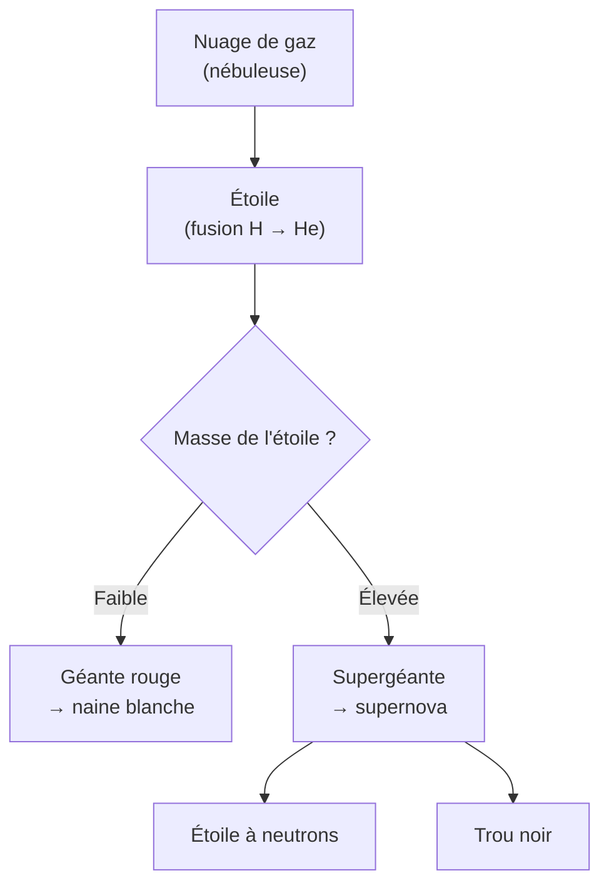

# Astrophysique et Cosmologie

L'astrophysique applique toute la physique aux objets célestes ; la cosmologie étudie l'univers dans son ensemble — son origine, sa structure, son destin. Ces domaines mobilisent la [[Mécanique du Point|gravitation]], la [[Relativité Restreinte|relativité]], la [[Mécanique Quantique|quantique]] et la [[Thermodynamique]].

## 1. La gravitation, architecte du cosmos

> [!important] La force qui structure l'univers
> À grande échelle, seule la **gravitation** compte (les autres forces s'annulent ou ont une portée trop courte). Elle gouverne les orbites, la formation des étoiles, la dynamique des galaxies. Les [[Mécanique du Point|lois de Kepler]] en sont la première description.

### Visualisation animée (Manim)

> [!note] Ce que montre l'animation
> Une planète décrit une **orbite elliptique** autour d'une étoile placée à un foyer. Le rayon vecteur balaie des aires égales en temps égaux (2e loi de Kepler) : on voit la planète **accélérer au périhélie** (proche de l'étoile) et ralentir à l'aphélie. On *voit* géométriquement la conservation du moment cinétique.

```manim
# Rendu : manimgl kepler.py OrbiteKeplerienne
from manimlib import *


class OrbiteKeplerienne(Scene):
    def construct(self):
        a, e = 3.5, 0.6              # demi-grand axe, excentricité
        b = a * np.sqrt(1 - e**2)
        c = a * e                   # distance centre-foyer
        centre = LEFT * 0.0

        ellipse = Ellipse(width=2 * a, height=2 * b, color=BLUE).move_to(centre)
        foyer = np.array([centre[0] + c, 0, 0])
        etoile = Dot(foyer, color=YELLOW, radius=0.2)
        self.play(ShowCreation(ellipse), FadeIn(etoile))

        # Paramétrage par l'anomalie ; vitesse plus grande près du foyer (loi des aires)
        theta = ValueTracker(0.0)

        def pos():
            th = theta.get_value()
            x = centre[0] + a * np.cos(th)
            y = centre[1] + b * np.sin(th)
            return np.array([x, y, 0])

        planete = always_redraw(lambda: Dot(pos(), color=WHITE, radius=0.12))
        rayon = always_redraw(lambda: Line(foyer, pos(), color=GREY_B))
        self.add(planete, rayon)

        note = Tex(r"\text{Loi des aires : plus rapide près de l'étoile}").to_edge(UP).set_backstroke()
        self.add(note)

        # On module la vitesse angulaire pour imiter la loi des aires (rapide au périhélie)
        self.play(theta.animate.set_value(TAU), run_time=8, rate_func=linear)
        self.wait()
```

## 2. La vie des étoiles

> [!important] Un équilibre entre gravité et pression
> Une étoile est un équilibre entre la **gravité** (qui comprime) et la **pression** issue des réactions de fusion nucléaire (qui dilate). La fusion de l'hydrogène en hélium libère l'énergie via $E = mc^2$ (voir [[Relativité Restreinte]]).



> [!important] La fin dépend de la masse
> - Étoile peu massive (comme le Soleil) : géante rouge puis **naine blanche**.
> - Étoile massive : **supernova**, laissant une **étoile à neutrons** ou un **trou noir**.

## 3. Les trous noirs

> [!important] Quand la gravité l'emporte sur tout
> Si la masse est concentrée sous un rayon critique (rayon de Schwarzschild $R_S = \dfrac{2GM}{c^2}$), même la lumière ne peut s'échapper : c'est un **trou noir**. Son horizon est une frontière de non-retour. La relativité générale est nécessaire pour les décrire correctement.

> [!example] Rayon de Schwarzschild du Soleil
> $$R_S = \frac{2GM_\odot}{c^2} = \frac{2 \times 6{,}67\times10^{-11} \times 2\times10^{30}}{(3\times10^8)^2} \approx 3000 \text{ m}$$
> Il faudrait comprimer tout le Soleil dans une sphère de $3$ km de rayon pour en faire un trou noir.

## 4. L'expansion de l'univers

> [!important] La loi de Hubble
> Les galaxies s'éloignent les unes des autres d'autant plus vite qu'elles sont lointaines :
> $$v = H_0\,d$$
> Mesurée par le **décalage vers le rouge** (effet Doppler, voir [[Physique des Ondes]]) de leur lumière. L'univers est en **expansion**.

> [!important] Le Big Bang
> En remontant l'expansion, l'univers était jadis extrêmement dense et chaud : c'est le **Big Bang** (il y a $\approx 13{,}8$ milliards d'années). Preuves : expansion, **fond diffus cosmologique** (rayonnement fossile à $\approx 2{,}7$ K), abondance des éléments légers.

## 5. Matière noire et énergie noire

> [!warning] 95 % de l'univers nous échappe
> - La **matière noire** ($\sim 27\%$) : invisible, détectée par ses effets gravitationnels (rotation des galaxies trop rapide pour la seule matière visible).
> - L'**énergie noire** ($\sim 68\%$) : responsable de l'**accélération** de l'expansion.
> La matière ordinaire ne représente que $\sim 5\%$ de l'univers. Comprendre les $95\%$ restants est l'un des plus grands défis de la physique (voir aussi [[Physique des Particules]]).

## 6. Exercices types corrigés

### Exercice 1 : troisième loi de Kepler

**Énoncé** : Une planète orbite à $a = 4$ UA autour d'une étoile de même masse que le Soleil. Quelle est sa période ?

> [!example] Correction
> Avec $T^2 \propto a^3$ et la référence Terre ($1$ an à $1$ UA) :
> $$T = a^{3/2} = 4^{3/2} = 8 \text{ ans}$$

### Exercice 2 : âge de l'univers

**Énoncé** : Estimer l'âge de l'univers à partir de $H_0 \approx 70$ km·s⁻¹·Mpc⁻¹.

> [!example] Correction
> L'âge caractéristique est $t \approx \dfrac{1}{H_0}$. En convertissant $H_0$ en s⁻¹ ($1$ Mpc $\approx 3{,}1\times10^{19}$ km) :
> $$H_0 \approx \frac{70}{3{,}1\times10^{19}} \approx 2{,}3\times10^{-18} \text{ s}^{-1}, \quad t \approx \frac{1}{H_0} \approx 4{,}4\times10^{17} \text{ s} \approx 14 \text{ Gan}$$
> Cohérent avec les $13{,}8$ milliards d'années.

### Exercice 3 : vitesse d'une galaxie lointaine

**Énoncé** : Une galaxie est à $d = 100$ Mpc. À quelle vitesse s'éloigne-t-elle ?

> [!example] Correction
> $$v = H_0 d = 70 \times 100 = 7000 \text{ km·s}^{-1}$$
> Soit environ $0{,}023c$ : son spectre est notablement décalé vers le rouge.

## 7. À retenir

> [!tip] À retenir
> - La **gravitation** structure l'univers ; orbites régies par **Kepler** (loi des aires = moment cinétique conservé).
> - **Étoiles** : équilibre gravité / pression de fusion ; fin (naine blanche, étoile à neutrons, trou noir) selon la masse.
> - **Trou noir** : $R_S = 2GM/c^2$ ; même la lumière n'en sort pas.
> - **Expansion** : loi de Hubble $v = H_0 d$, mesurée par le redshift ; **Big Bang** il y a $\approx 13{,}8$ Gan (fond diffus cosmologique).
> - **$95\%$** de l'univers est matière noire + énergie noire : grande énigme ouverte.

*Voir aussi* : [[Mécanique du Point]] | [[Relativité Restreinte]] | [[Physique des Particules]] | [[Physique des Ondes]] | [[Thermodynamique]]
