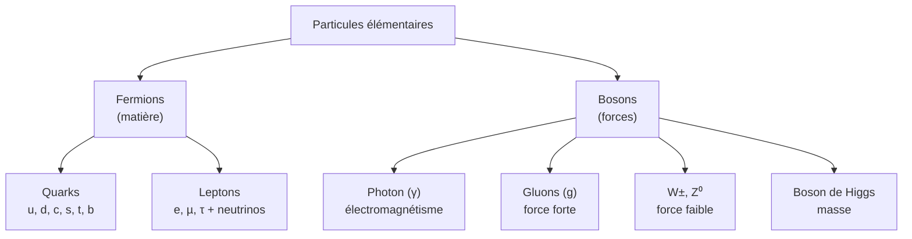

# Physique des Particules

De quoi la matière est-elle faite, au niveau le plus fondamental ? La physique des particules décrit les briques élémentaires de l'univers et leurs interactions via le **Modèle Standard**, l'une des théories les plus précisément vérifiées de l'histoire. Elle prolonge la [[Mécanique Quantique]] et la [[Relativité Restreinte]].

## 1. Les particules élémentaires

> [!important] Deux grandes familles
> - **Fermions** (constituants de la matière) : quarks et leptons, de spin demi-entier.
> - **Bosons** (médiateurs des forces) : porteurs des interactions, de spin entier.

### 1.1 Les quarks

> [!important] Quarks et confinement
> Il existe six quarks (up, down, charm, strange, top, bottom), de charge fractionnaire ($+\tfrac23 e$ ou $-\tfrac13 e$). Ils ne s'observent jamais seuls (**confinement**) : ils s'assemblent en **hadrons**.
> - **Baryons** (3 quarks) : proton (uud), neutron (udd).
> - **Mésons** (quark + antiquark).

### 1.2 Les leptons

Les six leptons : électron, muon, tau, et leurs trois **neutrinos** associés (quasi sans masse, n'interagissant que faiblement).

## 2. Les quatre interactions fondamentales

> [!important] Quatre forces, des médiateurs
> | Interaction | Portée | Médiateur | Intensité relative |
> |-------------|--------|-----------|--------------------|
> | Forte | $\sim 10^{-15}$ m | gluons | $1$ |
> | Électromagnétique | infinie | photon | $\sim 10^{-2}$ |
> | Faible | $\sim 10^{-18}$ m | $W^\pm$, $Z^0$ | $\sim 10^{-6}$ |
> | Gravitationnelle | infinie | (graviton ?) | $\sim 10^{-39}$ |

> [!tip] Chaque force a son rôle
> La **forte** lie les quarks (et les noyaux) ; l'**électromagnétique** régit atomes et chimie ; la **faible** gouverne certaines désintégrations radioactives ($\beta$) ; la **gravité**, négligeable à l'échelle des particules, domine à l'échelle cosmique.

## 3. Le boson de Higgs

> [!important] L'origine de la masse
> Le champ de Higgs, qui emplit tout l'espace, confère leur masse aux particules par interaction. Plus une particule interagit avec ce champ, plus elle est massive. Sa particule associée, le **boson de Higgs**, a été découverte au LHC en 2012, complétant le Modèle Standard.

## 4. Antimatière

> [!important] À chaque particule, son antiparticule
> Chaque particule a une **antiparticule** de même masse mais de charges opposées (positron pour l'électron, antiproton…). Une particule et son antiparticule s'**annihilent** en libérant de l'énergie ($E = mc^2$, voir [[Relativité Restreinte]]).

> [!example] Application médicale : la TEP
> La tomographie par émission de positons (TEP) exploite l'annihilation positon-électron : les deux photons gamma émis dos à dos sont détectés pour reconstruire une image du métabolisme. Voir [[Applications de la Physique]].

## 5. Détecter l'invisible : les accélérateurs

> [!important] Sonder la matière
> Pour explorer l'infiniment petit, on accélère des particules à des vitesses proches de $c$ et on les fait entrer en collision. L'énergie de collision crée de nouvelles particules ($E = mc^2$). Le **LHC** (CERN) atteint des énergies de plusieurs TeV.

> [!tip] Plus d'énergie = plus petit
> D'après de Broglie ($\lambda = h/p$), une grande quantité de mouvement donne une petite longueur d'onde, donc une meilleure « résolution » pour sonder de petites structures. C'est pourquoi explorer le plus petit exige toujours plus d'énergie.

## 6. Limites du Modèle Standard

> [!warning] Une théorie incomplète
> Le Modèle Standard décrit remarquablement trois forces mais **n'inclut pas la gravité**, n'explique ni la **matière noire**, ni l'**énergie noire** (voir [[Astrophysique et Cosmologie]]), ni la masse des neutrinos, ni l'asymétrie matière-antimatière. La recherche d'une théorie plus complète (supersymétrie, théorie des cordes, gravité quantique) reste ouverte.

## 7. Questions et ordres de grandeur

### Exercice 1 : composition d'un proton

**Énoncé** : Vérifier que la charge d'un proton (uud) vaut bien $+e$.

> [!example] Correction
> $$q = \tfrac23 e + \tfrac23 e - \tfrac13 e = \frac{4 - 1}{3}e = +e$$
> Le neutron (udd) : $\tfrac23 e - \tfrac13 e - \tfrac13 e = 0$, neutre, cohérent.

### Exercice 2 : énergie d'annihilation

**Énoncé** : Quelle est l'énergie totale libérée par l'annihilation d'un électron et d'un positon au repos ?

> [!example] Correction
> Deux masses $m_e$ converties : $E = 2 m_e c^2 = 2 \times 9{,}1\times10^{-31} \times (3\times10^8)^2 \approx 1{,}6\times10^{-13}$ J $\approx 1{,}02$ MeV, soit deux photons gamma de $511$ keV.

### Exercice 3 : hiérarchie des forces

**Énoncé** : Pourquoi la gravité, pourtant familière, est-elle négligée en physique des particules ?

> [!example] Correction
> Entre deux protons, la répulsion électromagnétique est environ $10^{36}$ fois plus intense que leur attraction gravitationnelle. À l'échelle des particules, la gravité est totalement négligeable ; elle ne domine qu'à grande échelle car elle est toujours **attractive** et s'accumule.

## 8. À retenir

> [!tip] À retenir
> - **Fermions** (matière) : 6 quarks + 6 leptons. **Bosons** (forces) : photon, gluons, $W/Z$, Higgs.
> - **Quatre interactions** : forte, électromagnétique, faible, gravitationnelle (de la plus à la moins intense à courte portée).
> - **Higgs** : donne la masse. **Antimatière** : annihilation → énergie ($E = mc^2$).
> - **Accélérateurs** : créer des particules par collision ; plus d'énergie = sonder plus petit (de Broglie).
> - Le **Modèle Standard** est très précis mais incomplet (gravité, matière/énergie noires).

*Voir aussi* : [[Mécanique Quantique]] | [[Relativité Restreinte]] | [[Astrophysique et Cosmologie]] | [[Applications de la Physique]]
