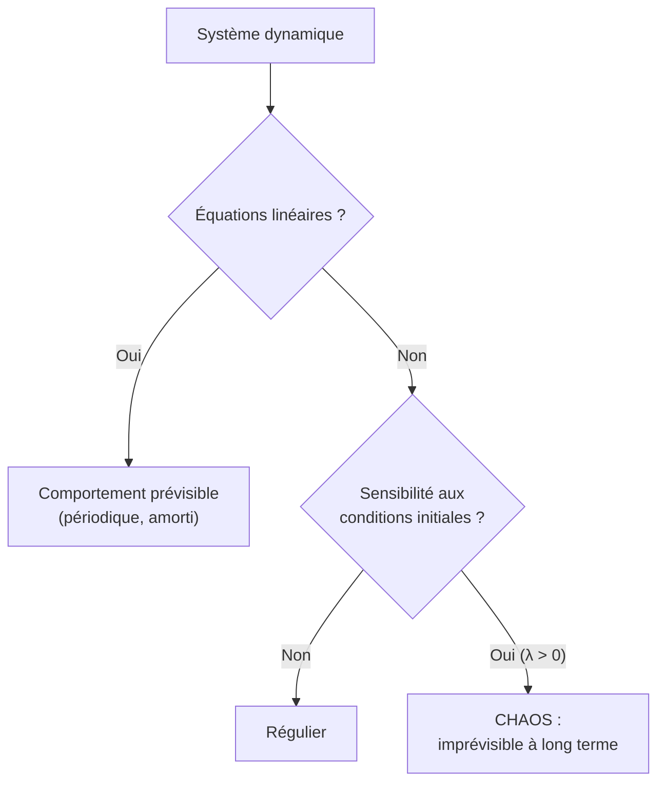

# Physique du Chaos

Certains systèmes parfaitement **déterministes** sont pourtant **imprévisibles** à long terme : une infime différence initiale conduit à des évolutions radicalement différentes. C'est le chaos déterministe, qui relie physique, mathématiques et météorologie. Prérequis : [[Équations Différentielles]], [[Mécanique du Point]].

## 1. Déterminisme et imprévisibilité

> [!important] Le paradoxe du chaos
> Un système chaotique obéit à des lois déterministes (les équations fixent entièrement l'évolution), mais sa **sensibilité aux conditions initiales** rend toute prédiction à long terme impossible : on ne connaît jamais l'état initial avec une précision infinie.

> [!important] Sensibilité aux conditions initiales (effet papillon)
> Deux trajectoires partant de conditions voisines **divergent exponentiellement** :
> $$\delta(t) \approx \delta_0\,e^{\lambda t}$$
> où $\lambda > 0$ est l'**exposant de Lyapunov**. L'horizon de prévisibilité est fini, d'où l'expression « effet papillon » de Lorenz.

> [!warning] Chaos n'est pas hasard
> Le chaos est **déterministe** : pas d'aléa, pas de bruit. L'imprévisibilité vient de l'amplification des écarts, pas d'un tirage au sort. C'est une imprévisibilité **pratique**, pas de principe.

## 2. Origine : la non-linéarité

> [!important] Pas de chaos sans non-linéarité
> Les systèmes linéaires sont prévisibles. Le chaos exige des équations **non linéaires** (couplages, termes en $x^2$, produits…) et au moins trois dimensions pour un système continu. Le pendule double, les fluides turbulents, certains circuits en sont des exemples.



## 3. L'attracteur de Lorenz

> [!important] Le modèle fondateur (1963)
> En simplifiant la convection atmosphérique, Edward Lorenz obtint un système de trois équations couplées non linéaires :
> $$\dot x = \sigma(y - x), \qquad \dot y = x(\rho - z) - y, \qquad \dot z = xy - \beta z$$
> Pour certaines valeurs des paramètres, les trajectoires ne se referment jamais mais restent confinées sur un **attracteur étrange** en forme d'ailes de papillon.

### Visualisation animée (Manim)

> [!note] Ce que montre l'animation
> La trajectoire du système de Lorenz dans l'espace des phases $(x, y, z)$ : elle s'enroule indéfiniment autour de deux « ailes » sans jamais se recouper, formant l'**attracteur étrange**. Deux trajectoires de conditions initiales presque identiques (deux couleurs) restent d'abord superposées puis **divergent** : c'est la sensibilité aux conditions initiales rendue visible.

```manim
# Rendu : manimgl lorenz.py AttracteurDeLorenz
from manimlib import *


class AttracteurDeLorenz(ThreeDScene):
    def construct(self):
        sigma, rho, beta = 10.0, 28.0, 8.0 / 3.0

        def pas_lorenz(p, dt):
            x, y, z = p
            dx = sigma * (y - x)
            dy = x * (rho - z) - y
            dz = x * y - beta * z
            return p + np.array([dx, dy, dz]) * dt

        def trajectoire(p0, color, n=4000, dt=0.005, echelle=0.12):
            pts, p = [], np.array(p0, dtype=float)
            for _ in range(n):
                p = pas_lorenz(p, dt)
                pts.append(np.array([p[0], p[1], p[2] - 27]) * echelle)
            return VMobject().set_points_smoothly(pts).set_color(color)

        self.frame.reorient(30, 70)
        axes = ThreeDAxes(x_range=(-4, 4), y_range=(-4, 4), z_range=(-4, 4))
        self.add(axes)

        # Deux conditions initiales presque identiques
        t1 = trajectoire([1.0, 1.0, 1.0], BLUE)
        t2 = trajectoire([1.001, 1.0, 1.0], RED)

        legende = VGroup(
            Tex(r"\text{deux départs quasi identiques}"),
            Tex(r"\to \text{trajectoires divergentes}"),
        ).arrange(DOWN).scale(0.7).fix_in_frame().to_corner(UL)
        self.add(legende)

        self.play(ShowCreation(t1), ShowCreation(t2), run_time=8, rate_func=linear)
        self.play(self.frame.animate.reorient(120, 70), run_time=4)
        self.wait()
```

## 4. La route vers le chaos : les bifurcations

> [!important] Doublement de période
> Beaucoup de systèmes deviennent chaotiques par **doublements de période** successifs quand on varie un paramètre : un cycle de période $T$, puis $2T$, $4T$, $8T$… jusqu'au chaos. La **suite logistique** $x_{n+1} = r\,x_n(1 - x_n)$ en est l'exemple canonique (voir aussi [[Équations Différentielles]] pour le modèle logistique continu).

> [!tip] L'universalité de Feigenbaum
> Le rapport entre intervalles de bifurcations successifs tend vers une **constante universelle** $\delta \approx 4{,}669$, identique pour des systèmes très différents. Le chaos a des lois quantitatives.

## 5. Le chaos dans la nature

| Système | Manifestation du chaos |
|---------|------------------------|
| Atmosphère | imprévisibilité météo au-delà de ~10 jours |
| Pendule double | mouvement erratique |
| Système solaire | instabilité à très long terme |
| Cœur, neurones | rythmes complexes, arythmies |
| Turbulence des fluides | tourbillons imbriqués |

> [!important] Le chaos peut être structuré
> Malgré l'imprévisibilité, le chaos a une **géométrie** : attracteurs étranges, structures **fractales** (autosimilaires à toutes les échelles), lois statistiques. L'imprévisibilité locale coexiste avec un ordre global.

## 6. Exercices types corrigés

### Exercice 1 : horizon de prévisibilité

**Énoncé** : Un système a un exposant de Lyapunov $\lambda = 0{,}5$ jour⁻¹. Si l'incertitude initiale est $\delta_0 = 10^{-3}$, au bout de combien de temps atteint-elle $\delta = 1$ (ordre de la grandeur elle-même) ?

> [!example] Correction
> $$\delta = \delta_0 e^{\lambda t} \implies t = \frac{1}{\lambda}\ln\frac{\delta}{\delta_0} = \frac{1}{0{,}5}\ln\frac{1}{10^{-3}} = 2\ln(1000) \approx 13{,}8 \text{ jours}$$
> Au-delà, la prédiction n'a plus de sens — d'où la limite de la météo.

### Exercice 2 : linéaire vs non linéaire

**Énoncé** : Pourquoi un oscillateur harmonique ne peut-il jamais être chaotique ?

> [!example] Correction
> Son équation $\ddot x + \omega_0^2 x = 0$ est **linéaire** : ses solutions sont des sinusoïdes prévisibles, sans sensibilité exponentielle aux conditions initiales. Le chaos requiert la non-linéarité (voir [[Oscillateurs]]). Un pendule à **grande** amplitude, lui, devient non linéaire.

### Exercice 3 : effet papillon qualitatif

**Énoncé** : Si l'on connaissait l'état de l'atmosphère avec deux fois plus de précision, gagnerait-on beaucoup en horizon de prévision ?

> [!example] Correction
> Avec $\delta_0 \to \delta_0/2$, le gain de temps est $\Delta t = \dfrac{1}{\lambda}\ln 2$ : une **constante**, pas un doublement. La croissance exponentielle fait que diviser l'erreur initiale par $2$ n'ajoute qu'un temps fixe et modeste : l'horizon est fondamentalement borné.

## 7. À retenir

> [!tip] À retenir
> - Le chaos est **déterministe mais imprévisible** : sensibilité aux conditions initiales, divergence $\delta \sim \delta_0 e^{\lambda t}$ ($\lambda > 0$).
> - Il exige la **non-linéarité** (et $\geq 3$ dimensions en continu) ; chaos $\neq$ hasard.
> - **Attracteur de Lorenz** : attracteur étrange, géométrie fractale.
> - Route vers le chaos par **doublements de période** (suite logistique, constante de Feigenbaum).
> - Présent partout (météo, pendule double, cœur, turbulence) ; imprévisibilité locale, ordre global.

*Voir aussi* : [[Équations Différentielles]] | [[Oscillateurs]] | [[Mécanique du Point]] | [[Physique Statistique]] | [[Théorie des Graphes]]
