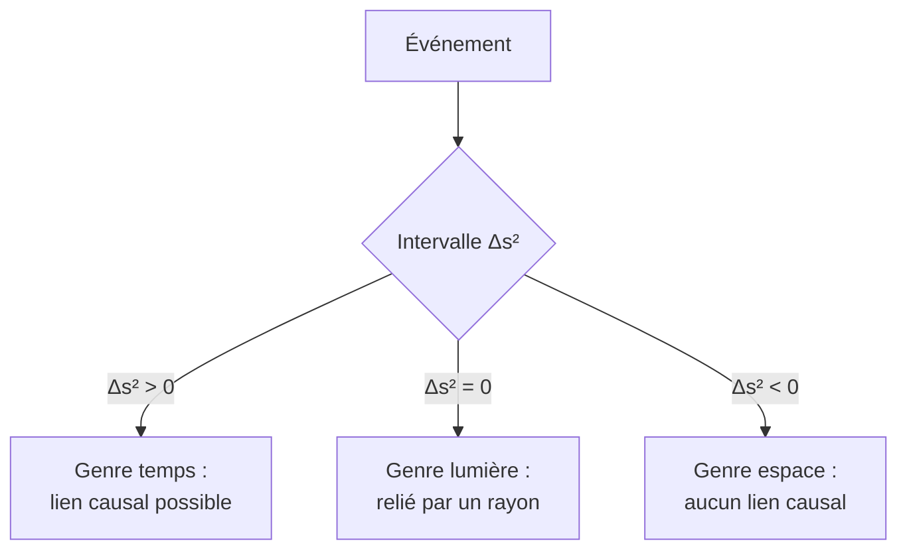

# Relativité Restreinte

En 1905, Einstein révolutionne notre conception de l'espace et du temps. À partir de deux postulats simples, il bouleverse la mécanique de Newton : le temps n'est plus absolu, masse et énergie sont équivalentes. La relativité restreinte décrit la physique à grande vitesse (proche de $c$).

## 1. Les deux postulats

> [!important] Postulats d'Einstein
> 1. **Principe de relativité** : les lois de la physique sont identiques dans tous les référentiels galiléens.
> 2. **Invariance de $c$** : la vitesse de la lumière dans le vide vaut $c$ dans **tous** les référentiels galiléens, indépendamment du mouvement de la source ou de l'observateur.

> [!warning] L'idée contre-intuitive
> Le second postulat est en contradiction frontale avec l'addition classique des vitesses. Si vous poursuivez un rayon lumineux à $0{,}9c$, il s'éloigne toujours de vous à $c$ — pas à $0{,}1c$. Toutes les étrangetés de la relativité découlent de là.

## 2. Le facteur de Lorentz

> [!important] Facteur de Lorentz
> $$\gamma = \frac{1}{\sqrt{1 - \dfrac{v^2}{c^2}}} \geq 1$$
> Il quantifie les effets relativistes. Pour $v \ll c$, $\gamma \approx 1$ (on retrouve Newton) ; quand $v \to c$, $\gamma \to \infty$.

| $v/c$ | $\gamma$ |
|-------|----------|
| $0{,}1$ | $1{,}005$ |
| $0{,}5$ | $1{,}15$ |
| $0{,}9$ | $2{,}29$ |
| $0{,}99$ | $7{,}09$ |
| $0{,}999$ | $22{,}4$ |

## 3. Dilatation du temps et contraction des longueurs

> [!important] Dilatation du temps
> Une horloge en mouvement bat plus lentement vue d'un observateur fixe :
> $$\Delta t = \gamma\,\Delta t_0$$
> où $\Delta t_0$ est le **temps propre** (mesuré dans le référentiel de l'horloge). « Les horloges en mouvement ralentissent. »

> [!important] Contraction des longueurs
> Une longueur en mouvement est contractée dans le sens du déplacement :
> $$L = \frac{L_0}{\gamma}$$
> où $L_0$ est la **longueur propre** (mesurée au repos).

> [!example] Les muons atmosphériques
> Les muons créés en haute atmosphère ont une durée de vie si courte qu'en mécanique classique ils ne devraient jamais atteindre le sol. Pourtant on les détecte : leur temps propre est dilaté (vu du sol), ou de leur point de vue, l'atmosphère est contractée. C'est une preuve expérimentale quotidienne.

## 4. L'espace-temps de Minkowski

> [!important] Un univers à quatre dimensions
> Espace et temps fusionnent en un **espace-temps** quadridimensionnel. L'invariant fondamental (identique dans tous les référentiels) est l'**intervalle d'espace-temps** :
> $$\Delta s^2 = c^2\Delta t^2 - \Delta x^2$$



### Visualisation animée (Manim)

> [!note] Ce que montre l'animation
> Le **diagramme de Minkowski** : le temps $ct$ en ordonnée, l'espace $x$ en abscisse. Le **cône de lumière** (droites à $45°$, pente $c$) sépare le futur et le passé causaux de l'« ailleurs » inaccessible. Quand on change de référentiel (boost), les axes se « pincent » vers la diagonale, mais le cône de lumière reste fixe : on *voit* l'invariance de $c$ et la relativité de la simultanéité.

```manim
# Rendu : manimgl minkowski.py DiagrammeMinkowski
from manimlib import *


class DiagrammeMinkowski(Scene):
    def construct(self):
        axes = Axes(x_range=(-4, 4), y_range=(-4, 4), height=7, width=7)
        labels = axes.get_axis_labels("x", "ct")
        self.play(ShowCreation(axes), Write(labels))

        # Cône de lumière (droites ct = ±x)
        cone1 = Line(axes.c2p(-4, -4), axes.c2p(4, 4), color=YELLOW)
        cone2 = Line(axes.c2p(4, -4), axes.c2p(-4, 4), color=YELLOW)
        zone_futur = Polygon(axes.c2p(0, 0), axes.c2p(-4, 4), axes.c2p(4, 4),
                             color=BLUE, fill_opacity=0.15, stroke_width=0)
        futur = Tex(r"\text{futur}").scale(0.7).move_to(axes.c2p(0, 2.7))
        self.play(ShowCreation(cone1), ShowCreation(cone2))
        self.play(FadeIn(zone_futur), Write(futur))

        # Axes d'un référentiel en mouvement (boost) : ils se pincent vers la diagonale
        beta = ValueTracker(0.0)

        def axe_ct_prime():
            b = beta.get_value()
            return Line(axes.c2p(-4 * b, -4), axes.c2p(4 * b, 4), color=RED)

        def axe_x_prime():
            b = beta.get_value()
            return Line(axes.c2p(-4, -4 * b), axes.c2p(4, 4 * b), color=GREEN)

        ctp = always_redraw(axe_ct_prime)
        xp = always_redraw(axe_x_prime)
        legende = VGroup(
            Tex(r"ct'", color=RED), Tex(r"x'", color=GREEN),
        ).arrange(RIGHT, buff=0.8).scale(0.8).to_corner(UR).set_backstroke()
        self.add(ctp, xp)
        self.play(Write(legende))

        # On augmente la vitesse : les axes s'inclinent vers le cône de lumière (fixe)
        self.play(beta.animate.set_value(0.6), run_time=4)
        note = Tex(r"\text{Le cône de lumière reste invariant}").to_edge(DOWN).set_backstroke()
        self.play(Write(note))
        self.wait(2)
```

## 5. Composition relativiste des vitesses

> [!important] Addition des vitesses
> Pour deux vitesses colinéaires :
> $$w = \frac{u + v}{1 + \dfrac{uv}{c^2}}$$
> Le résultat ne dépasse **jamais** $c$ : même $0{,}9c + 0{,}9c$ donne $\approx 0{,}994c < c$. La vitesse de la lumière est une limite infranchissable.

## 6. Équivalence masse-énergie

> [!important] La relation la plus célèbre de la physique
> $$E = \gamma m c^2$$
> Au repos ($v = 0$), il reste une **énergie de masse** :
> $$E_0 = m c^2$$
> Masse et énergie sont deux formes d'une même grandeur. Une perte de masse libère une énergie colossale (facteur $c^2 \approx 9\times10^{16}$).

> [!example] Énergie nucléaire
> Dans la fusion ou la fission, une infime fraction de masse se convertit en énergie. C'est ce qui alimente le Soleil et les centrales nucléaires : $E_0 = mc^2$ chiffre cette conversion.

## 7. Exercices types corrigés

### Exercice 1 : dilatation du temps

**Énoncé** : Un vaisseau voyage à $v = 0{,}8c$. Combien de temps s'écoule à bord pendant que $10$ ans passent sur Terre ?

> [!example] Correction
> $$\gamma = \frac{1}{\sqrt{1 - 0{,}8^2}} = \frac{1}{\sqrt{0{,}36}} = \frac{1}{0{,}6} \approx 1{,}67$$
> Le temps propre à bord : $\Delta t_0 = \dfrac{\Delta t}{\gamma} = \dfrac{10}{1{,}67} \approx 6$ ans. L'équipage vieillit moins (paradoxe des jumeaux).

### Exercice 2 : énergie de masse

**Énoncé** : Quelle énergie correspond à $1$ g de matière entièrement convertie ?

> [!example] Correction
> $$E = mc^2 = 10^{-3} \times (3\times10^8)^2 = 9\times10^{13} \text{ J}$$
> Soit l'équivalent de plusieurs kilotonnes de TNT : la densité d'énergie de la masse est gigantesque.

### Exercice 3 : addition de vitesses

**Énoncé** : Deux vaisseaux foncent l'un vers l'autre, chacun à $0{,}6c$ vu de la Terre. À quelle vitesse l'un voit-il l'autre s'approcher ?

> [!example] Correction
> $$w = \frac{0{,}6c + 0{,}6c}{1 + \dfrac{0{,}6 \times 0{,}6 c^2}{c^2}} = \frac{1{,}2c}{1 + 0{,}36} = \frac{1{,}2c}{1{,}36} \approx 0{,}88c$$
> Bien inférieur à $1{,}2c$ : la limite $c$ n'est jamais dépassée.

## 8. À retenir

> [!tip] À retenir
> - **Deux postulats** : lois identiques dans tout référentiel galiléen, invariance de $c$.
> - **Facteur de Lorentz** $\gamma = 1/\sqrt{1 - v^2/c^2}$ ; $\approx 1$ pour $v \ll c$ (retour à Newton).
> - **Dilatation du temps** $\Delta t = \gamma\Delta t_0$ ; **contraction des longueurs** $L = L_0/\gamma$.
> - **Espace-temps** de Minkowski ; intervalle $\Delta s^2 = c^2\Delta t^2 - \Delta x^2$ invariant ; cône de lumière.
> - **Addition** des vitesses bornée par $c$ ; **équivalence** $E = \gamma mc^2$, énergie de masse $E_0 = mc^2$.

*Voir aussi* : [[Référentiels Non Galiléens]] | [[Mécanique du Point]] | [[Physique des Particules]] | [[Astrophysique et Cosmologie]] | [[Géométrie Non-Euclidienne]]
