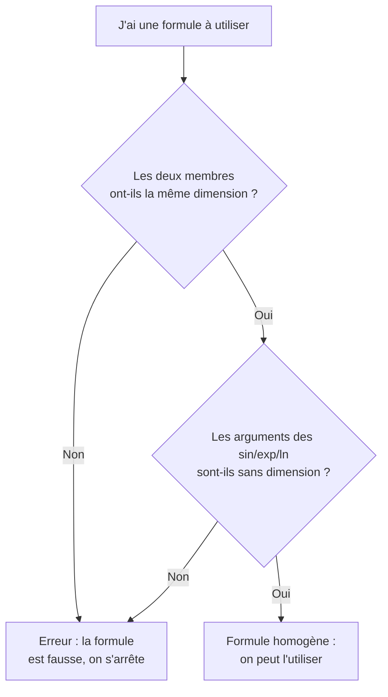

# Constantes et Unités

Toute grandeur physique est un **nombre accompagné d'une unité**. Maîtriser le système d'unités et les constantes fondamentales est la base de tout calcul correct : une formule fausse se repère souvent à une unité incohérente.

## 1. Le Système International (SI)

### 1.1 Les sept unités de base

> [!important] Unités de base du SI
> Toutes les autres unités s'expriment à partir de ces sept-là.

| Grandeur | Unité | Symbole |
|----------|-------|---------|
| Longueur | mètre | $\text{m}$ |
| Masse | kilogramme | $\text{kg}$ |
| Temps | seconde | $\text{s}$ |
| Intensité électrique | ampère | $\text{A}$ |
| Température | kelvin | $\text{K}$ |
| Quantité de matière | mole | $\text{mol}$ |
| Intensité lumineuse | candela | $\text{cd}$ |

### 1.2 Unités dérivées courantes

| Grandeur | Unité | Symbole | En unités de base |
|----------|-------|---------|-------------------|
| Force | newton | $\text{N}$ | $\text{kg·m·s}^{-2}$ |
| Énergie, travail | joule | $\text{J}$ | $\text{kg·m}^2\text{·s}^{-2}$ |
| Puissance | watt | $\text{W}$ | $\text{kg·m}^2\text{·s}^{-3}$ |
| Pression | pascal | $\text{Pa}$ | $\text{kg·m}^{-1}\text{·s}^{-2}$ |
| Charge électrique | coulomb | $\text{C}$ | $\text{A·s}$ |
| Tension | volt | $\text{V}$ | $\text{kg·m}^2\text{·s}^{-3}\text{·A}^{-1}$ |
| Résistance | ohm | $\Omega$ | $\text{kg·m}^2\text{·s}^{-3}\text{·A}^{-2}$ |
| Fréquence | hertz | $\text{Hz}$ | $\text{s}^{-1}$ |

### 1.3 Préfixes multiplicateurs

| Préfixe | Symbole | Facteur | Préfixe | Symbole | Facteur |
|---------|---------|---------|---------|---------|---------|
| téra | $\text{T}$ | $10^{12}$ | milli | $\text{m}$ | $10^{-3}$ |
| giga | $\text{G}$ | $10^{9}$ | micro | $\mu$ | $10^{-6}$ |
| méga | $\text{M}$ | $10^{6}$ | nano | $\text{n}$ | $10^{-9}$ |
| kilo | $\text{k}$ | $10^{3}$ | pico | $\text{p}$ | $10^{-12}$ |

## 2. Constantes fondamentales

> [!important] Constantes à connaître
> Depuis la réforme du SI (2019), plusieurs de ces constantes ont une **valeur exacte** par définition.

| Constante | Symbole | Valeur | Unité |
|-----------|---------|--------|-------|
| Vitesse de la lumière (vide) | $c$ | $299\,792\,458$ (exact) | $\text{m·s}^{-1}$ |
| Constante de Planck | $h$ | $6{,}626 \times 10^{-34}$ | $\text{J·s}$ |
| Planck réduite | $\hbar = \frac{h}{2\pi}$ | $1{,}055 \times 10^{-34}$ | $\text{J·s}$ |
| Charge élémentaire | $e$ | $1{,}602 \times 10^{-19}$ | $\text{C}$ |
| Constante de Boltzmann | $k_B$ | $1{,}381 \times 10^{-23}$ | $\text{J·K}^{-1}$ |
| Constante des gaz parfaits | $R$ | $8{,}314$ | $\text{J·mol}^{-1}\text{·K}^{-1}$ |
| Nombre d'Avogadro | $N_A$ | $6{,}022 \times 10^{23}$ | $\text{mol}^{-1}$ |
| Constante gravitationnelle | $G$ | $6{,}674 \times 10^{-11}$ | $\text{m}^3\text{·kg}^{-1}\text{·s}^{-2}$ |
| Masse de l'électron | $m_e$ | $9{,}109 \times 10^{-31}$ | $\text{kg}$ |
| Masse du proton | $m_p$ | $1{,}673 \times 10^{-27}$ | $\text{kg}$ |
| Permittivité du vide | $\varepsilon_0$ | $8{,}854 \times 10^{-12}$ | $\text{F·m}^{-1}$ |
| Perméabilité du vide | $\mu_0$ | $1{,}257 \times 10^{-6}$ | $\text{H·m}^{-1}$ |

> [!tip] Relation à retenir
> Les constantes de l'électromagnétisme sont liées à la vitesse de la lumière :
> $$c = \frac{1}{\sqrt{\varepsilon_0 \mu_0}}$$
> C'est cette relation qui a révélé à Maxwell que la lumière **est** une onde électromagnétique.

## 3. Constantes utiles (valeurs usuelles)

| Grandeur | Valeur approchée |
|----------|------------------|
| Accélération de pesanteur (Terre) | $g \approx 9{,}81 \text{ m·s}^{-2}$ |
| Pression atmosphérique standard | $P_0 = 1{,}013 \times 10^5 \text{ Pa}$ |
| Masse volumique de l'eau | $\rho_{\text{eau}} = 1000 \text{ kg·m}^{-3}$ |
| Zéro absolu | $0 \text{ K} = -273{,}15 \text{ °C}$ |
| Année-lumière | $1 \text{ al} \approx 9{,}46 \times 10^{15} \text{ m}$ |
| Électron-volt | $1 \text{ eV} = 1{,}602 \times 10^{-19} \text{ J}$ |

## 4. Analyse dimensionnelle

### 4.1 Principe

> [!important] Équation aux dimensions
> Toute grandeur $G$ a une **dimension** notée $[G]$, exprimée à partir des dimensions de base :
> longueur $\mathsf{L}$, masse $\mathsf{M}$, temps $\mathsf{T}$, courant $\mathsf{I}$, température $\Theta$.
>
> Exemple : une vitesse est une longueur par un temps, donc $[v] = \mathsf{L}\,\mathsf{T}^{-1}$.

| Grandeur | Dimension |
|----------|-----------|
| Vitesse $v$ | $\mathsf{L}\,\mathsf{T}^{-1}$ |
| Accélération $a$ | $\mathsf{L}\,\mathsf{T}^{-2}$ |
| Force $F$ | $\mathsf{M}\,\mathsf{L}\,\mathsf{T}^{-2}$ |
| Énergie $E$ | $\mathsf{M}\,\mathsf{L}^2\,\mathsf{T}^{-2}$ |
| Puissance $P$ | $\mathsf{M}\,\mathsf{L}^2\,\mathsf{T}^{-3}$ |
| Pression $p$ | $\mathsf{M}\,\mathsf{L}^{-1}\,\mathsf{T}^{-2}$ |

### 4.2 Règle d'homogénéité

> [!warning] Une formule physique est forcément homogène
> Les deux membres d'une égalité doivent avoir la **même dimension**. On ne peut additionner que des grandeurs de même dimension. Un argument de fonction ($\sin$, $\exp$, $\ln$) doit être **sans dimension**.

> [!example] Vérifier l'homogénéité de $T = 2\pi\sqrt{\dfrac{\ell}{g}}$ (période d'un pendule)
> $$\left[\sqrt{\frac{\ell}{g}}\right] = \sqrt{\frac{\mathsf{L}}{\mathsf{L}\,\mathsf{T}^{-2}}} = \sqrt{\mathsf{T}^2} = \mathsf{T}$$
> La période est bien un temps : la formule est homogène. Le facteur $2\pi$ est sans dimension, donc invisible à ce contrôle.

## 5. À retenir

> [!tip] À retenir
> - Le **SI** repose sur 7 unités de base ; toutes les autres en dérivent.
> - Connaître $c$, $h$, $e$, $k_B$, $R$, $N_A$, $G$, $g$ et leurs ordres de grandeur.
> - $c = \dfrac{1}{\sqrt{\varepsilon_0\mu_0}}$ relie optique et électromagnétisme.
> - **Toujours vérifier l'homogénéité** : c'est le contrôle le plus rapide d'une formule.
> - Les arguments de $\sin$, $\cos$, $\exp$, $\ln$ sont **sans dimension**.

*Voir aussi* : [[Formulaire]] | [[Méthodes de Résolution]] | [[Erreurs Classiques]]
