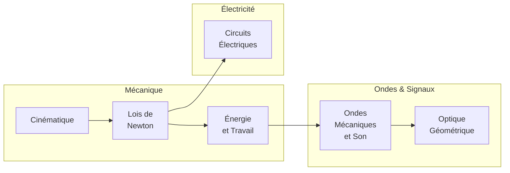
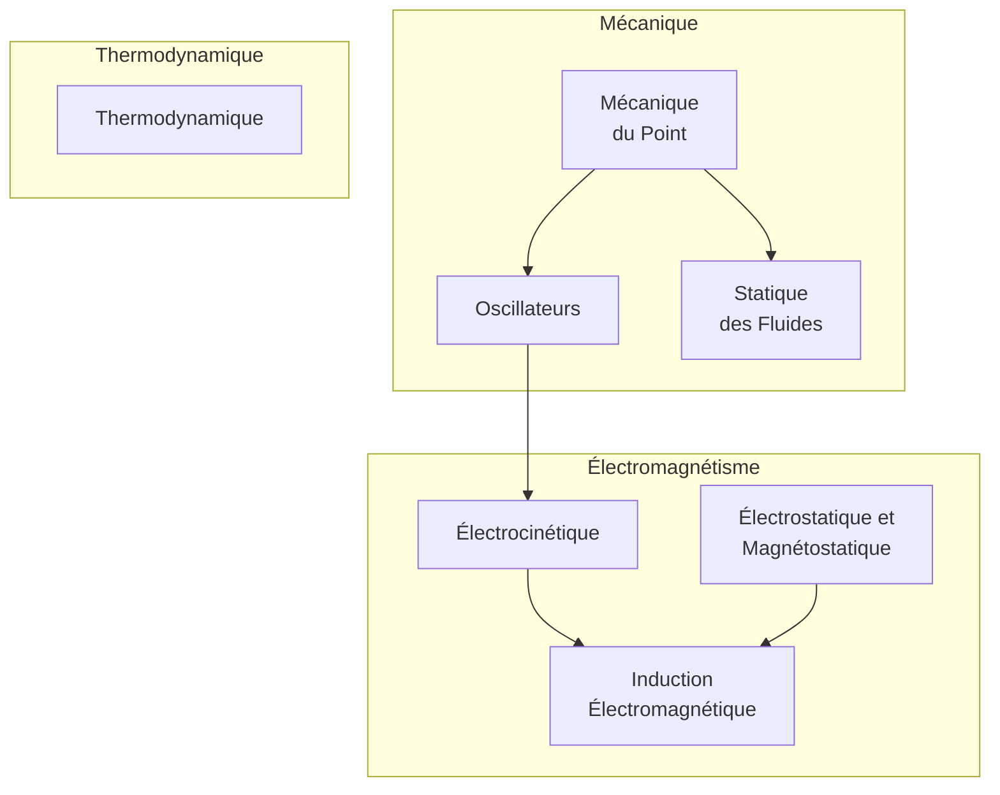
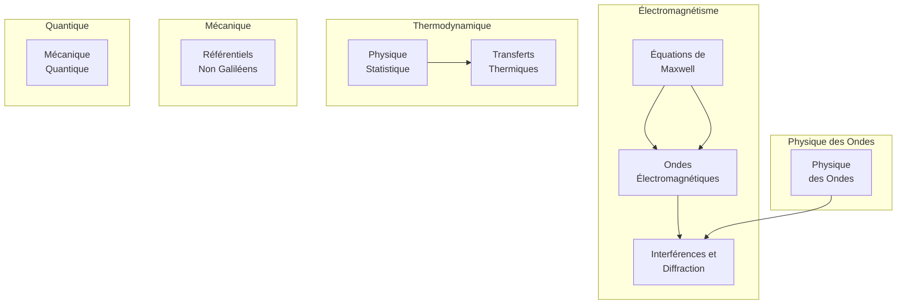

# Physique — Index et Roadmap

Cette note est la **porte d'entrée** de la partie Physique du vault. Elle organise les chapitres par niveau, montre les dépendances entre concepts (et avec les mathématiques), et indique l'ordre dans lequel les aborder.

## Structure du dossier

```
Physics/
├── Index.md                       (ce fichier)
├── Formulaire.md                  (toutes les formules clés par domaine)
├── Constantes et Unités.md        (constantes fondamentales, SI, dimensions)
├── Méthodes de Résolution.md      (analyse dimensionnelle, ordres de grandeur, démarche)
├── Erreurs Classiques.md          (pièges courants en physique)
├── Applications de la Physique.md (usages : ingénierie, médecine, espace…)
├── Lycée/                         (Seconde — Terminale spécialité)
│   ├── Mécanique/
│   ├── Ondes & Signaux/
│   └── Électricité/
├── Prépa Sup/                     (MPSI/PCSI, 1re année prépa)
├── Prépa Spé/                     (MP/PC, 2e année prépa)
└── Approfondissements/            (relativité, particules, cosmologie, chaos)
```

## Roadmap par niveau

### Lycée (Seconde → Terminale)



### Prépa Sup (MPSI/PCSI) — Année 1 de prépa



### Prépa Spé (MP/PC) — Année 2 de prépa



## Dépendances avec les mathématiques

La physique de prépa repose lourdement sur l'outillage mathématique. Travailler ces notes de maths en parallèle :

| Outil mathématique | Sert en physique pour |
|---|---|
| [[Dérivation]], [[Primitives et Intégrales]] | Cinématique, travail, énergie |
| [[Équations Différentielles]] | Oscillateurs, circuits RLC, désintégration |
| [[Nombres Complexes]] | Régime sinusoïdal forcé, impédances, ondes |
| [[Trigonométrie]] | Ondes, oscillations, projection de forces |
| [[Algèbre Linéaire]], [[Espaces Euclidiens]] | Mécanique vectorielle, repères, tenseurs |
| [[Fonctions de Plusieurs Variables]] | Champs, gradient, opérateurs (div, rot) |
| [[Séries de Fourier]] | Décomposition de signaux, ondes périodiques |
| [[Probabilités]], [[Probabilités Prépa]] | Physique statistique, mécanique quantique |

## Approfondissements — hors programme

Pour aller au-delà du curriculum standard :

- [[Relativité Restreinte]] — espace-temps, dilatation du temps, $E = mc^2$
- [[Physique des Particules]] — modèle standard, quarks, bosons
- [[Astrophysique et Cosmologie]] — étoiles, trous noirs, Big Bang
- [[Physique du Chaos]] — systèmes non-linéaires, attracteurs, sensibilité aux conditions initiales

## Ressources transversales

Toujours utiles à avoir sous la main :

- [[Formulaire]] — formules essentielles par domaine
- [[Constantes et Unités]] — constantes fondamentales et système SI
- [[Méthodes de Résolution]] — analyse dimensionnelle, ordres de grandeur, démarche type
- [[Erreurs Classiques]] — pièges habituels à éviter
- [[Applications de la Physique]] — vue panoramique des usages

## Conseils d'apprentissage

> [!tip] Comment travailler la physique efficacement
> 1. **Comprendre avant de calculer** : un schéma clair (forces, axes, signes) résout la moitié du problème.
> 2. **Toujours vérifier l'homogénéité** d'une formule (analyse dimensionnelle) avant de l'appliquer.
> 3. **Estimer un ordre de grandeur** attendu : un résultat aberrant se repère immédiatement.
> 4. **Distinguer le modèle de la réalité** : « point matériel », « gaz parfait », « fil sans résistance » sont des idéalisations.
> 5. **Refaire les exercices types** sans la correction — c'est la production qui ancre la méthode.

> [!warning] Le piège du « j'ai compris le cours »
> Lire un cours de physique et le comprendre ≠ savoir poser le problème, choisir le système, projeter les équations et mener le calcul. Le vrai test est la résolution d'exercices, pas la relecture.

> [!quote] Richard Feynman
> « Ce que je ne peux pas créer, je ne le comprends pas. »
