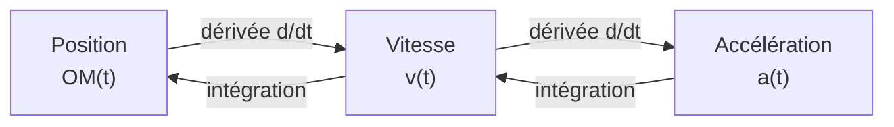

# Cinématique

La cinématique est l'étude du **mouvement** d'un objet sans s'intéresser à ses causes (les forces, étudiées en [[Lois de Newton|dynamique]]). Elle décrit position, vitesse et accélération au cours du temps.

## 1. Repérer un mouvement

### 1.1 Système, référentiel, repère

> [!important] Définitions
> - Le **système** est l'objet étudié, souvent modélisé par un **point matériel** (objet sans dimension concentrant toute la masse).
> - Le **référentiel** est le solide par rapport auquel on décrit le mouvement (référentiel terrestre, géocentrique, héliocentrique).
> - Le **repère** associe au référentiel une origine et des axes pour mesurer les positions.

> [!warning] Le mouvement est relatif
> Un passager assis dans un train est immobile dans le référentiel du train, mais en mouvement dans le référentiel terrestre. **Préciser le référentiel est indispensable.**

### 1.2 Vecteur position

Dans un repère $(O, \vec{i}, \vec{j}, \vec{k})$, la position du point $M$ est donnée par le vecteur :
$$\vec{OM} = x\,\vec{i} + y\,\vec{j} + z\,\vec{k}$$

La **trajectoire** est l'ensemble des positions successives de $M$.

## 2. Vecteur vitesse

### 2.1 Définition

> [!important] Vitesse instantanée
> Le vecteur vitesse est la dérivée du vecteur position par rapport au temps :
> $$\vec{v} = \frac{\mathrm{d}\vec{OM}}{\mathrm{d}t} = \dot{x}\,\vec{i} + \dot{y}\,\vec{j} + \dot{z}\,\vec{k}$$
> Sa norme $v = \|\vec{v}\|$ est la **vitesse** (en m·s⁻¹). Le vecteur vitesse est **tangent à la trajectoire**, orienté dans le sens du mouvement.

### 2.2 Vitesse moyenne et instantanée

| Vitesse moyenne | Vitesse instantanée |
|-----------------|---------------------|
| $v_{\text{moy}} = \dfrac{\text{distance parcourue}}{\text{durée}}$ | $v = \dfrac{\mathrm{d}s}{\mathrm{d}t}$ |
| sur un intervalle de temps | à un instant précis |

> [!example] Vitesse moyenne d'un trajet
> Une voiture parcourt $120$ km en $1$ h $30$ min $= 1{,}5$ h.
> $$v_{\text{moy}} = \frac{120}{1{,}5} = 80 \text{ km·h}^{-1} \approx 22{,}2 \text{ m·s}^{-1}$$
> Conversion : diviser des km·h⁻¹ par $3{,}6$ donne des m·s⁻¹.

## 3. Vecteur accélération

> [!important] Accélération
> Le vecteur accélération est la dérivée de la vitesse :
> $$\vec{a} = \frac{\mathrm{d}\vec{v}}{\mathrm{d}t} = \ddot{x}\,\vec{i} + \ddot{y}\,\vec{j} + \ddot{z}\,\vec{k} \qquad (\text{en m·s}^{-2})$$

L'accélération traduit toute **variation du vecteur vitesse**, en norme ou en direction.



## 4. Mouvements rectilignes

### 4.1 Mouvement rectiligne uniforme (MRU)

> [!important] MRU
> Vitesse constante, accélération nulle :
> $$\vec{a} = \vec{0}, \qquad x(t) = x_0 + v\,t$$

### 4.2 Mouvement rectiligne uniformément accéléré (MRUA)

> [!important] MRUA
> Accélération constante $a$ :
> $$v(t) = v_0 + a\,t, \qquad x(t) = x_0 + v_0\,t + \tfrac{1}{2}a\,t^2$$
> Relation indépendante du temps :
> $$v^2 - v_0^2 = 2a\,(x - x_0)$$

> [!example] Distance de freinage
> Une voiture à $v_0 = 20$ m·s⁻¹ freine avec $a = -5$ m·s⁻². À l'arrêt $v = 0$ :
> $$0 - 20^2 = 2 \times (-5) \times d \implies d = \frac{400}{10} = 40 \text{ m}$$

## 5. Chute libre et mouvement de projectile

### 5.1 Chute libre verticale

> [!important] Chute libre
> Un objet en chute libre n'est soumis qu'à son poids. Son accélération est $\vec{g}$, dirigée vers le bas, de norme $g \approx 9{,}81$ m·s⁻². Sans vitesse initiale :
> $$v(t) = g\,t, \qquad z(t) = z_0 - \tfrac{1}{2}g\,t^2$$

### 5.2 Mouvement de projectile

Lancé avec une vitesse initiale $\vec{v}_0$ faisant un angle $\alpha$ avec l'horizontale, le projectile a deux mouvements indépendants :

| Axe horizontal $(x)$ | Axe vertical $(z)$ |
|----------------------|--------------------|
| $a_x = 0$ (MRU) | $a_z = -g$ (MRUA) |
| $v_x = v_0\cos\alpha$ | $v_z = -gt + v_0\sin\alpha$ |
| $x = (v_0\cos\alpha)\,t$ | $z = -\tfrac{1}{2}gt^2 + (v_0\sin\alpha)\,t$ |

> [!tip] L'idée clé
> Les mouvements horizontal et vertical sont **indépendants**. La trajectoire qui en résulte est une **parabole**.

### Visualisation animée (Manim)

> [!note] Ce que montre l'animation
> Un projectile lancé en biais suit une parabole. On décompose son vecteur vitesse en deux composantes : la composante **horizontale** (flèche verte) reste constante, tandis que la composante **verticale** (flèche rouge) diminue, s'annule au sommet, puis s'inverse. On *voit* ainsi que la trajectoire courbe résulte de la combinaison d'un mouvement uniforme et d'une chute libre.

```manim
# Rendu : manimgl projectile.py MouvementProjectile
from manimlib import *


class MouvementProjectile(Scene):
    def construct(self):
        g = 9.81
        v0 = 7.0          # vitesse initiale
        alpha = 60 * DEGREES
        vx = v0 * np.cos(alpha)
        vz = v0 * np.sin(alpha)

        axes = Axes(x_range=(0, 6), y_range=(0, 3.5), height=5, width=11)
        self.play(ShowCreation(axes))

        # Équations horaires du projectile (mise à l'échelle douce)
        def pos(t):
            x = vx * t
            z = vz * t - 0.5 * g * t**2
            return axes.c2p(x, z)

        t_vol = 2 * vz / g            # durée totale du vol
        traj = ParametricCurve(lambda t: pos(t), t_range=(0, t_vol, 0.02), color=BLUE)

        t = ValueTracker(0.001)
        balle = always_redraw(lambda: Dot(pos(t.get_value()), color=YELLOW))

        # Composantes du vecteur vitesse à l'instant courant
        def fleche_h():
            p = pos(t.get_value())
            return Arrow(p, p + RIGHT * vx * 0.4, buff=0, color=GREEN)

        def fleche_v():
            tt = t.get_value()
            p = pos(tt)
            vz_t = vz - g * tt
            return Arrow(p, p + UP * vz_t * 0.4, buff=0, color=RED)

        vh = always_redraw(fleche_h)
        vv = always_redraw(fleche_v)

        legende = VGroup(
            Tex(r"v_x = \text{cste}", color=GREEN),
            Tex(r"v_z : \text{diminue, s'annule, s'inverse}", color=RED),
        ).arrange(DOWN, aligned_edge=LEFT).to_corner(UR).set_backstroke()

        self.add(balle, vh, vv)
        self.play(Write(legende))
        self.play(ShowCreation(traj), t.animate.set_value(t_vol), run_time=6, rate_func=linear)
        self.wait(2)
```

### 5.3 Mouvement dans un champ électrique uniforme

> [!important] Analogie avec la chute libre
> Une particule de charge $q$ et de masse $m$ placée dans un champ électrique uniforme $\vec{E}$ (entre deux plaques d'un condensateur) subit la force $\vec{F} = q\vec{E}$, donc une accélération constante :
> $$\vec{a} = \frac{q\vec{E}}{m}$$
> Le mouvement est **exactement analogue** à celui d'un projectile : si la particule entre perpendiculairement au champ, sa trajectoire est une **parabole**. Le poids est ici souvent négligeable devant la force électrique.

> [!example] Déviation dans un tube cathodique
> Un électron de vitesse horizontale $v_0$ entre dans une zone où règne un champ vertical $E$ sur une longueur $L$. Comme pour un projectile, le mouvement horizontal est uniforme ($x = v_0 t$) et le mouvement vertical uniformément accéléré ($y = \tfrac{1}{2}\dfrac{eE}{m}t^2$). En éliminant $t$, on obtient la parabole $y = \dfrac{eE}{2mv_0^2}x^2$. C'est le principe historique de la déviation des électrons dans les oscilloscopes et téléviseurs cathodiques.

## 6. Exercices types corrigés

### Exercice 1 : conversion et vitesse moyenne

**Énoncé** : Un sprinteur court le $100$ m en $10{,}0$ s. Calculer sa vitesse moyenne en m·s⁻¹ puis en km·h⁻¹.

> [!example] Correction
> $$v_{\text{moy}} = \frac{100}{10{,}0} = 10{,}0 \text{ m·s}^{-1}$$
> Conversion : $10{,}0 \times 3{,}6 = 36{,}0$ km·h⁻¹.

### Exercice 2 : chute libre

**Énoncé** : On lâche une bille sans vitesse initiale du haut d'un immeuble. Elle touche le sol au bout de $2{,}0$ s. Quelle est la hauteur de l'immeuble ? ($g = 9{,}81$ m·s⁻²)

> [!example] Correction
> $$h = \tfrac{1}{2}g\,t^2 = \tfrac{1}{2} \times 9{,}81 \times 2{,}0^2 = 19{,}6 \text{ m}$$

### Exercice 3 : portée d'un projectile

**Énoncé** : Un ballon est lancé depuis le sol avec $v_0 = 20$ m·s⁻¹ et $\alpha = 45°$. Déterminer la portée (distance horizontale au point de chute). ($g = 9{,}81$ m·s⁻²)

> [!example] Correction
> Le ballon retombe au sol quand $z = 0$ : $-\tfrac{1}{2}gt^2 + (v_0\sin\alpha)t = 0$, soit $t = \dfrac{2v_0\sin\alpha}{g}$.
>
> $$t = \frac{2 \times 20 \times \sin 45°}{9{,}81} \approx 2{,}88 \text{ s}$$
>
> Portée : $x = (v_0\cos\alpha)\,t = 20 \times \cos45° \times 2{,}88 \approx 40{,}8$ m.
>
> (Formule générale : portée $= \dfrac{v_0^2 \sin(2\alpha)}{g}$, maximale pour $\alpha = 45°$.)

## 7. À retenir

> [!tip] À retenir
> - **Vitesse** = dérivée de la position ; **accélération** = dérivée de la vitesse. Le vecteur vitesse est tangent à la trajectoire.
> - **MRU** : $\vec{a} = \vec{0}$, $x = x_0 + vt$. **MRUA** : $v = v_0 + at$, $x = x_0 + v_0 t + \tfrac{1}{2}at^2$, $v^2 - v_0^2 = 2a\Delta x$.
> - **Chute libre** : accélération $\vec{g}$ vers le bas.
> - **Projectile** : mouvements horizontal (uniforme) et vertical (chute) **indépendants** → trajectoire parabolique. Portée maximale à $45°$.
> - Toujours **préciser le référentiel** : le mouvement est relatif.

*Voir aussi* : [[Lois de Newton]] | [[Énergie et Travail]] | [[Dérivation]] | [[Mécanique du Point]]
