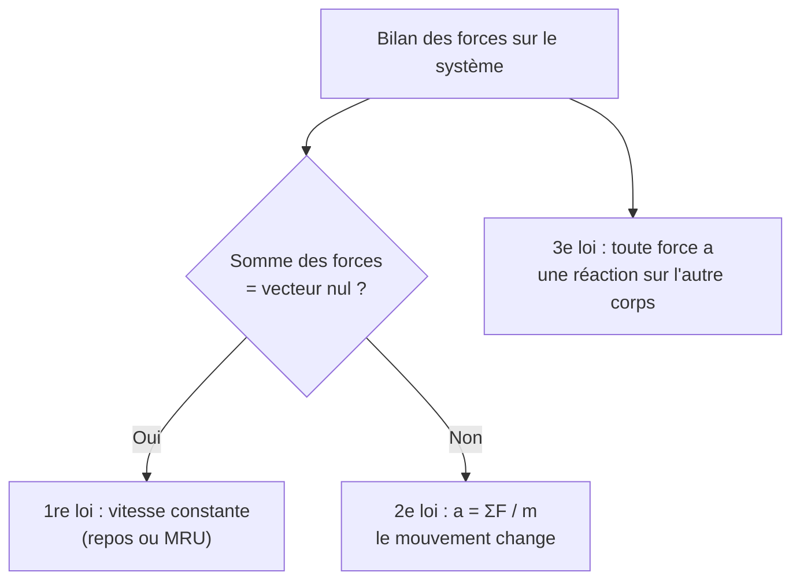

# Lois de Newton

Les trois lois de Newton fondent la **dynamique** : elles relient les forces appliquées à un objet au mouvement qui en résulte. Là où la [[Cinématique]] décrit le mouvement, la dynamique en explique les causes.

## 1. Notion de force

> [!important] Force
> Une **force** modélise une action mécanique. C'est une grandeur **vectorielle** caractérisée par : un point d'application, une direction, un sens et une intensité (en newtons, N).

### 1.1 Forces usuelles

| Force | Expression | Direction |
|-------|------------|-----------|
| Poids | $\vec{P} = m\vec{g}$, $P = mg$ | verticale, vers le bas |
| Réaction normale | $\vec{N}$ | perpendiculaire au support |
| Frottement | $\vec{f}$ | opposée au mouvement |
| Tension d'un fil | $\vec{T}$ | le long du fil |
| Force de rappel d'un ressort | $\vec{F} = -k\,x\,\vec{i}$ | vers la position d'équilibre |

### 1.2 Diagramme des forces

> [!tip] Le réflexe : faire le bilan des forces
> Avant tout calcul, lister **toutes** les forces s'exerçant sur le système et les représenter sur un schéma. C'est l'étape qui détermine la réussite du problème (voir [[Méthodes de Résolution]]).

## 2. Première loi : le principe d'inertie

> [!important] Principe d'inertie
> Dans un **référentiel galiléen**, si la somme des forces s'exerçant sur un système est nulle, alors son vecteur vitesse est **constant** (mouvement rectiligne uniforme ou repos), et réciproquement.
> $$\sum \vec{F} = \vec{0} \iff \vec{v} = \overrightarrow{\text{cste}}$$

> [!warning] Une force n'est pas nécessaire pour maintenir un mouvement
> Contrairement à l'intuition, un objet lancé dans l'espace (sans force) continue à vitesse constante indéfiniment. C'est l'**inertie**. Les frottements, omniprésents sur Terre, masquent ce principe.

## 3. Deuxième loi : le principe fondamental de la dynamique (PFD)

> [!important] Deuxième loi de Newton (PFD)
> Dans un référentiel galiléen, la somme des forces est égale à la dérivée de la quantité de mouvement $\vec{p} = m\vec{v}$ :
> $$\sum \vec{F} = \frac{\mathrm{d}\vec{p}}{\mathrm{d}t}$$
> Si la masse est constante, cela se simplifie en :
> $$\boxed{\sum \vec{F} = m\vec{a}}$$

C'est l'équation centrale de la mécanique : connaître les forces, c'est connaître l'accélération, donc le mouvement.

> [!example] Bloc tiré horizontalement
> Un bloc de masse $m = 2{,}0$ kg est tiré par une force horizontale $F = 10$ N, avec un frottement $f = 4{,}0$ N. Quelle est son accélération ?
> $$\sum F_x = F - f = ma \implies a = \frac{10 - 4{,}0}{2{,}0} = 3{,}0 \text{ m·s}^{-2}$$

### Visualisation animée (Manim)

> [!note] Ce que montre l'animation
> Un bloc glisse sur un plan incliné d'angle $\alpha$. On décompose le poids $\vec{P}$ en deux composantes : l'une **le long de la pente** ($P\sin\alpha$, motrice) et l'autre **perpendiculaire** ($P\cos\alpha$, équilibrée par la réaction $\vec{N}$). Seule la composante le long de la pente accélère le bloc. On *voit* pourquoi un plan plus incliné accélère davantage, et pourquoi la réaction normale vaut $mg\cos\alpha$ et non $mg$.

```manim
# Rendu : manimgl plan_incline.py PlanIncline
from manimlib import *


class PlanIncline(Scene):
    def construct(self):
        alpha = 30 * DEGREES

        # Le triangle du plan incliné
        A = LEFT * 5 + DOWN * 2.5
        B = RIGHT * 5 + DOWN * 2.5
        C = RIGHT * 5 + DOWN * 2.5 + UP * (10 * np.tan(alpha))
        # On construit plutôt une pente montant vers la gauche
        base = Line(LEFT * 5 + DOWN * 2.5, RIGHT * 5 + DOWN * 2.5)
        sommet = LEFT * 5 + DOWN * 2.5 + UP * (10 * np.sin(alpha))
        pente = Line(sommet, RIGHT * 5 + DOWN * 2.5, color=GREY_B)
        vert = Line(LEFT * 5 + DOWN * 2.5, sommet, color=GREY_B)
        triangle = VGroup(base, pente, vert)
        self.play(ShowCreation(triangle))

        # Le bloc, posé sur la pente
        milieu = pente.point_from_proportion(0.5)
        bloc = Square(side_length=0.8, color=BLUE, fill_opacity=0.5)
        bloc.move_to(milieu).rotate(-alpha)
        self.play(FadeIn(bloc))

        centre = bloc.get_center()
        ech = 1.5
        # Poids (vertical, vers le bas)
        P = Arrow(centre, centre + DOWN * ech, buff=0, color=YELLOW)
        labelP = Tex(r"\vec{P}", color=YELLOW).next_to(P, DOWN, buff=0.1)

        # Composantes du poids
        u_pente = np.array([np.cos(-alpha), np.sin(-alpha), 0])   # le long de la descente
        u_perp = np.array([np.sin(alpha), np.cos(alpha), 0])      # perpendiculaire (vers l'extérieur)
        Pt = Arrow(centre, centre + u_pente * ech * np.sin(alpha), buff=0, color=RED)
        Pn = Arrow(centre, centre - u_perp * ech * np.cos(alpha), buff=0, color=GREEN)

        self.play(GrowArrow(P), Write(labelP))
        self.wait()
        self.play(GrowArrow(Pt), GrowArrow(Pn))

        legende = VGroup(
            Tex(r"P_{\parallel} = mg\sin\alpha \;(\text{motrice})", color=RED),
            Tex(r"P_{\perp} = mg\cos\alpha \;(\text{compensée par } \vec{N})", color=GREEN),
        ).arrange(DOWN, aligned_edge=LEFT).to_corner(UL).set_backstroke()
        self.play(Write(legende))

        # Le bloc descend sous l'effet de la composante motrice
        self.play(bloc.animate.shift(u_pente * 2.0), run_time=3)
        self.wait(2)
```

## 4. Troisième loi : actions réciproques

> [!important] Troisième loi de Newton
> Si un corps A exerce une force $\vec{F}_{A/B}$ sur un corps B, alors B exerce simultanément sur A une force opposée :
> $$\vec{F}_{A/B} = -\vec{F}_{B/A}$$
> Mêmes droite d'action et intensité, sens opposés.

> [!warning] Les deux forces ne se compensent pas
> Action et réaction s'appliquent sur **deux corps différents** : elles ne s'additionnent jamais dans le bilan d'un seul système. C'est ce qui permet la propulsion (la fusée pousse les gaz, les gaz poussent la fusée).



## 5. Mouvement circulaire et satellites

### 5.1 Le mouvement circulaire uniforme

> [!important] Une accélération dirigée vers le centre
> Dans un mouvement circulaire **uniforme** (vitesse de norme constante $v$, rayon $R$), le vecteur vitesse change sans cesse de **direction** : il y a donc une accélération, dirigée vers le centre (**centripète**), de norme :
> $$a = \frac{v^2}{R}$$
> D'après le PFD, cela exige une **force résultante centripète** $F = \dfrac{mv^2}{R}$. Sans cette force (tension d'un fil, gravitation, frottement), pas de trajectoire circulaire.

### 5.2 Satellites et lois de Kepler

> [!important] La gravitation comme force centripète
> Pour un satellite en orbite circulaire de rayon $r$ autour d'un astre de masse $M$, c'est la gravitation qui joue le rôle de force centripète :
> $$\frac{GMm}{r^2} = \frac{mv^2}{r} \implies v = \sqrt{\frac{GM}{r}}$$
> La vitesse ne dépend que du rayon de l'orbite, pas de la masse du satellite.

> [!important] Les trois lois de Kepler
> 1. Les planètes décrivent des **ellipses** dont le Soleil occupe un foyer.
> 2. Le rayon Soleil-planète balaie des **aires égales en temps égaux** (la planète va plus vite près du Soleil).
> 3. Le carré de la période est proportionnel au cube du demi-grand axe : $\dfrac{T^2}{a^3} = \text{constante}$.

> [!example] Satellite géostationnaire
> Un satellite géostationnaire reste au-dessus du même point de l'équateur : sa période vaut $24$ h. La 3e loi de Kepler impose alors une altitude d'environ $36\,000$ km. Étude approfondie (énergie, vitesse de libération) dans [[Mécanique du Point]].

## 6. Méthode de résolution d'un problème de dynamique

> [!important] Les étapes
> 1. Définir le **système** et le **référentiel** (galiléen).
> 2. Faire le **bilan des forces** et le schéma.
> 3. Appliquer le **PFD** : $\sum \vec{F} = m\vec{a}$.
> 4. **Projeter** sur des axes bien choisis.
> 5. Résoudre pour obtenir l'accélération, puis intégrer pour la vitesse et la position.

## 7. Exercices types corrigés

### Exercice 1 : ascenseur

**Énoncé** : Une personne de masse $m = 70$ kg est dans un ascenseur qui accélère vers le haut avec $a = 1{,}5$ m·s⁻². Quelle force le sol exerce-t-il sur elle ? ($g = 9{,}81$ m·s⁻²)

> [!example] Correction
> Forces : poids $\vec{P}$ (bas) et réaction $\vec{N}$ (haut). PFD projeté sur la verticale ascendante :
> $$N - mg = ma \implies N = m(g + a) = 70 \times (9{,}81 + 1{,}5) \approx 792 \text{ N}$$
> La personne se sent « plus lourde » : $N > mg$.

### Exercice 2 : plan incliné avec frottement

**Énoncé** : Un objet de masse $m = 5{,}0$ kg est posé sur un plan incliné à $\alpha = 30°$. Le frottement vaut $f = 10$ N et s'oppose à la descente. Calculer l'accélération. ($g = 9{,}81$ m·s⁻²)

> [!example] Correction
> Projection le long de la pente (sens descendant positif) :
> $$mg\sin\alpha - f = ma$$
> $$a = \frac{mg\sin\alpha - f}{m} = \frac{5{,}0 \times 9{,}81 \times \sin30° - 10}{5{,}0} = \frac{24{,}5 - 10}{5{,}0} \approx 2{,}9 \text{ m·s}^{-2}$$

### Exercice 3 : la troisième loi en action

**Énoncé** : Expliquer comment une fusée accélère dans le vide spatial, sans air pour « s'appuyer ».

> [!example] Correction
> La fusée éjecte des gaz vers l'arrière : elle exerce sur eux une force $\vec{F}_{\text{fusée/gaz}}$. Par la troisième loi, les gaz exercent sur la fusée une force opposée $\vec{F}_{\text{gaz/fusée}}$ vers l'avant. C'est cette force de réaction qui propulse la fusée. Aucun appui extérieur n'est nécessaire : c'est la conservation de la **quantité de mouvement**.

## 8. À retenir

> [!tip] À retenir
> - **1re loi (inertie)** : $\sum\vec{F} = \vec{0} \iff$ vitesse constante. Une force modifie le mouvement, ne le maintient pas.
> - **2e loi (PFD)** : $\sum\vec{F} = m\vec{a}$. C'est l'équation maîtresse de la mécanique.
> - **3e loi** : action = réaction opposée, sur **deux corps différents**.
> - Toujours faire le **bilan des forces** sur un schéma avant de calculer.
> - Sur un plan incliné : $N = mg\cos\alpha$, composante motrice $mg\sin\alpha$.
> - **Mouvement circulaire** : force centripète $F = mv^2/R$. **Satellite** : $v = \sqrt{GM/r}$ ; lois de Kepler.

*Voir aussi* : [[Cinématique]] | [[Énergie et Travail]] | [[Mécanique du Point]] | [[Méthodes de Résolution]]
