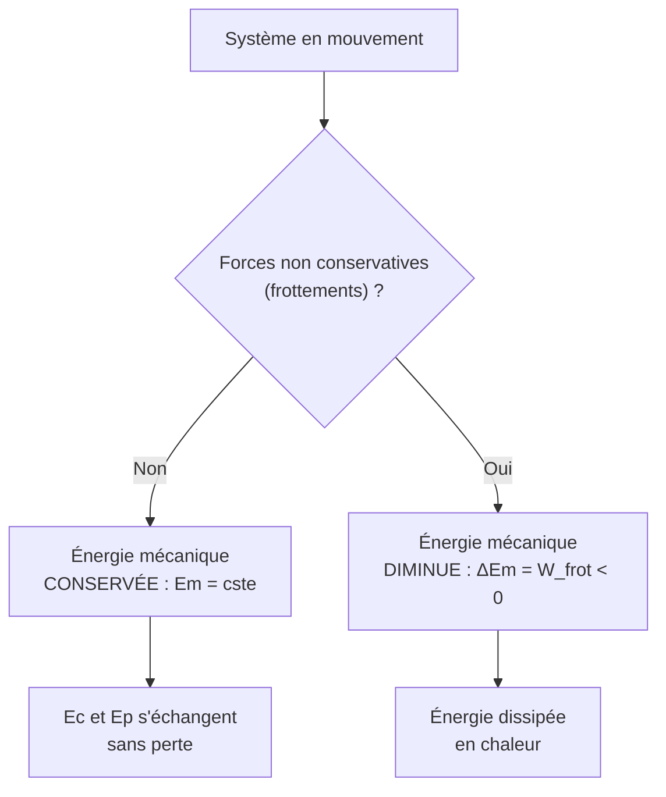

# Énergie et Travail

L'approche énergétique est un point de vue puissant : au lieu de suivre les forces instant par instant (PFD, voir [[Lois de Newton]]), on raisonne sur des **bilans globaux**. Beaucoup de problèmes deviennent simples sous cet angle.

## 1. Travail d'une force

### 1.1 Définition

> [!important] Travail d'une force constante
> Pour une force constante $\vec{F}$ lors d'un déplacement $\vec{AB}$ :
> $$W_{AB}(\vec{F}) = \vec{F}\cdot\vec{AB} = F \times AB \times \cos\theta$$
> où $\theta$ est l'angle entre la force et le déplacement. Le travail s'exprime en **joules** (J).

> [!important] Cas d'une force variable
> Pour une force variable le long du trajet :
> $$W_{AB}(\vec{F}) = \int_A^B \vec{F}\cdot\mathrm{d}\vec{r}$$

### 1.2 Signe du travail

| $\theta$ | $\cos\theta$ | Travail | Effet |
|----------|--------------|---------|-------|
| $0° \leq \theta < 90°$ | $> 0$ | **moteur** ($W > 0$) | accélère |
| $\theta = 90°$ | $0$ | **nul** | ne modifie pas l'énergie |
| $90° < \theta \leq 180°$ | $< 0$ | **résistant** ($W < 0$) | freine |

> [!warning] Une force perpendiculaire au déplacement ne travaille pas
> La réaction normale d'un support, ou la force centripète d'un mouvement circulaire, sont perpendiculaires au déplacement : leur travail est **nul**. Elles changent la direction sans changer l'énergie cinétique.

> [!example] Travail du poids
> Le travail du poids ne dépend que de la dénivellation $h = z_A - z_B$, pas du chemin suivi :
> $$W_{AB}(\vec{P}) = mg(z_A - z_B) = mgh$$
> Positif si l'objet descend, négatif s'il monte.

## 2. Énergie cinétique

> [!important] Énergie cinétique
> Un point matériel de masse $m$ et de vitesse $v$ possède une énergie cinétique :
> $$E_c = \tfrac{1}{2}mv^2 \qquad (\text{en joules})$$

> [!important] Théorème de l'énergie cinétique (TEC)
> Dans un référentiel galiléen, la variation d'énergie cinétique d'un système est égale à la somme des travaux des forces qui s'y exercent :
> $$\Delta E_c = E_c(B) - E_c(A) = \sum W_{AB}(\vec{F})$$

> [!example] Distance de freinage par le TEC
> Une voiture ($m = 1000$ kg) roulant à $v = 20$ m·s⁻¹ freine et s'arrête. La force de freinage est $f = 5000$ N. Distance ?
> $$\Delta E_c = -W_{\text{frein}} : \quad 0 - \tfrac{1}{2}mv^2 = -f\,d$$
> $$d = \frac{\tfrac{1}{2}mv^2}{f} = \frac{0{,}5 \times 1000 \times 20^2}{5000} = 40 \text{ m}$$

## 3. Énergie potentielle

### 3.1 Énergie potentielle de pesanteur

> [!important] Énergie potentielle de pesanteur
> $$E_{pp} = mgz \quad (\text{axe vertical orienté vers le haut})$$
> Elle dépend de l'**altitude** : c'est l'énergie « stockée » par la position dans le champ de pesanteur.

### 3.2 Énergie potentielle élastique

> [!important] Énergie potentielle élastique (ressort)
> Pour un ressort de raideur $k$ allongé de $x$ :
> $$E_{pe} = \tfrac{1}{2}kx^2$$

## 4. Énergie mécanique et conservation

> [!important] Énergie mécanique
> $$E_m = E_c + E_p$$

> [!important] Conservation de l'énergie mécanique
> Si le système n'est soumis qu'à des **forces conservatives** (poids, ressort), son énergie mécanique se **conserve** :
> $$E_m = E_c + E_p = \text{constante}$$
> En présence de frottements (forces non conservatives), $E_m$ **diminue** ; l'énergie « perdue » est dissipée en chaleur :
> $$\Delta E_m = W_{\text{frottements}} < 0$$



### Visualisation animée (Manim)

> [!note] Ce que montre l'animation
> Un pendule oscille sans frottement. Deux barres d'énergie évoluent en temps réel : l'**énergie cinétique** $E_c$ (rouge) et l'**énergie potentielle** $E_p$ (bleu). Au point le plus bas, toute l'énergie est cinétique ; aux extrémités, toute l'énergie est potentielle. Leur somme (la barre verte, $E_m$) reste **constante** : on voit la conservation de l'énergie mécanique.

```manim
# Rendu : manimgl energie_pendule.py EchangeEnergie
from manimlib import *


class EchangeEnergie(Scene):
    def construct(self):
        L = 2.5                      # longueur du pendule
        theta0 = 50 * DEGREES        # amplitude
        pivot = UP * 2.5 + LEFT * 3
        g, m = 9.81, 1.0
        omega = np.sqrt(g / L)

        def theta(t):
            return theta0 * np.cos(omega * t)

        def bob_pos(t):
            th = theta(t)
            return pivot + L * np.array([np.sin(th), -np.cos(th), 0])

        t = ValueTracker(0.0)
        tige = always_redraw(lambda: Line(pivot, bob_pos(t.get_value()), color=GREY_B))
        bob = always_redraw(lambda: Dot(bob_pos(t.get_value()), radius=0.18, color=YELLOW))
        self.add(tige, bob, Dot(pivot, color=WHITE))

        # Référence d'énergie : Ep = 0 au point le plus bas
        Em = m * g * L * (1 - np.cos(theta0))    # énergie totale (constante)

        def hauteur(t):
            return L * (1 - np.cos(theta(t)))    # hauteur au-dessus du point bas

        def Ep(t):
            return m * g * hauteur(t)

        def Ec(t):
            return Em - Ep(t)

        # Barres d'énergie à droite
        base = RIGHT * 2.5 + DOWN * 2.5
        ech = 3.5 / Em

        def barre(get_val, x_off, color):
            return always_redraw(lambda: Rectangle(
                width=0.6, height=max(0.001, get_val(t.get_value()) * ech),
                color=color, fill_opacity=0.8, fill_color=color,
            ).move_to(base + RIGHT * x_off, aligned_edge=DOWN))

        bEc = barre(Ec, 0, RED)
        bEp = barre(Ep, 1.0, BLUE)
        bEm = barre(lambda tt: Em, 2.0, GREEN)
        labels = VGroup(
            Tex("E_c", color=RED), Tex("E_p", color=BLUE), Tex("E_m", color=GREEN),
        )
        for lab, x in zip(labels, [0, 1.0, 2.0]):
            lab.next_to(base + RIGHT * x, DOWN)

        self.add(bEc, bEp, bEm, labels)
        self.play(t.animate.set_value(2 * TAU / omega), run_time=8, rate_func=linear)
        self.wait(2)
```

## 5. Puissance

> [!important] Puissance
> La puissance mesure la rapidité d'un transfert d'énergie :
> $$P = \frac{W}{\Delta t} \quad (\text{en watts}), \qquad P = \vec{F}\cdot\vec{v} \text{ (puissance instantanée)}$$

> [!example] Puissance d'un cycliste
> Un cycliste fournit un travail de $30$ kJ en $2$ min $= 120$ s.
> $$P = \frac{30\,000}{120} = 250 \text{ W}$$

## 6. Exercices types corrigés

### Exercice 1 : vitesse en bas d'une pente

**Énoncé** : Un skieur ($m = 70$ kg) part du repos en haut d'une pente sans frottement de dénivelé $h = 50$ m. Quelle est sa vitesse en bas ? ($g = 9{,}81$ m·s⁻²)

> [!example] Correction
> Conservation de l'énergie mécanique (pas de frottement) :
> $$\tfrac{1}{2}mv^2 = mgh \implies v = \sqrt{2gh} = \sqrt{2 \times 9{,}81 \times 50} \approx 31{,}3 \text{ m·s}^{-1}$$
> Remarque : la masse n'intervient pas.

### Exercice 2 : avec frottements

**Énoncé** : Même skieur, mais il arrive en bas à $v = 25$ m·s⁻¹. Quelle énergie a été dissipée par les frottements ?

> [!example] Correction
> $$\Delta E_m = \tfrac{1}{2}mv^2 - mgh = 0{,}5 \times 70 \times 25^2 - 70 \times 9{,}81 \times 50$$
> $$\Delta E_m = 21\,875 - 34\,335 = -12\,460 \text{ J} \approx -12{,}5 \text{ kJ}$$
> Environ $12{,}5$ kJ ont été dissipés en chaleur par frottement.

### Exercice 3 : ressort

**Énoncé** : Un ressort de raideur $k = 200$ N·m⁻¹ est comprimé de $x = 10$ cm puis relâché, propulsant une bille de $m = 50$ g. Vitesse de la bille au décollage ? (pas de frottement)

> [!example] Correction
> L'énergie élastique se convertit en énergie cinétique :
> $$\tfrac{1}{2}kx^2 = \tfrac{1}{2}mv^2 \implies v = x\sqrt{\frac{k}{m}} = 0{,}10 \times \sqrt{\frac{200}{0{,}050}} = 0{,}10 \times 63{,}2 \approx 6{,}3 \text{ m·s}^{-1}$$

## 7. À retenir

> [!tip] À retenir
> - **Travail** : $W = \vec{F}\cdot\vec{d} = Fd\cos\theta$. Moteur si $W > 0$, résistant si $W < 0$, nul si $\vec{F}\perp\vec{d}$.
> - **TEC** : $\Delta E_c = \sum W(\vec{F})$.
> - **Énergies potentielles** : pesanteur $mgz$, élastique $\tfrac{1}{2}kx^2$.
> - **Conservation** : $E_m = E_c + E_p$ constante sans frottement ; sinon $\Delta E_m = W_{\text{frottements}} < 0$ (dissipé en chaleur).
> - **Puissance** : $P = W/\Delta t = \vec{F}\cdot\vec{v}$.

*Voir aussi* : [[Cinématique]] | [[Lois de Newton]] | [[Primitives et Intégrales]] | [[Thermodynamique]]
