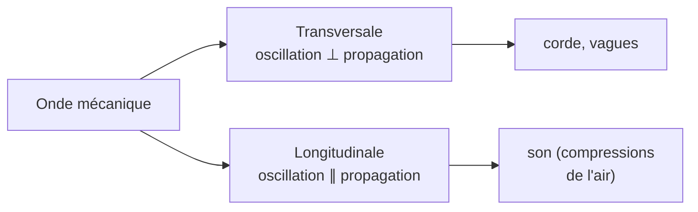

# Ondes Mécaniques et Son

Une onde transporte de l'**énergie sans transport de matière**. Le son en est l'exemple le plus familier. Comprendre les ondes mécaniques prépare l'étude de la lumière (voir [[Optique Géométrique]]) et des ondes en prépa ([[Physique des Ondes]]).

## 1. Qu'est-ce qu'une onde ?

> [!important] Onde mécanique progressive
> Une **onde mécanique** est la propagation d'une perturbation dans un milieu matériel, **sans déplacement global de matière**. Chaque point du milieu reproduit, avec un retard, le mouvement de la source.

> [!warning] Le milieu oscille sur place
> Lors du passage d'une onde, les particules du milieu **oscillent autour de leur position d'équilibre** : elles ne sont pas emportées par l'onde. Un bouchon sur l'eau monte et descend sans avancer avec la vague.

### 1.1 Deux types d'ondes

| Type | Direction de l'oscillation | Exemple |
|------|----------------------------|---------|
| **Transversale** | perpendiculaire à la propagation | corde, vague, lumière |
| **Longitudinale** | parallèle à la propagation | son, ressort comprimé |



## 2. Célérité d'une onde

> [!important] Célérité
> La **célérité** $v$ est la vitesse de propagation de la perturbation :
> $$v = \frac{d}{\Delta t}$$
> où $\Delta t$ est le retard mis par l'onde pour parcourir la distance $d$. Elle dépend du **milieu**, pas de la source.

| Milieu | Célérité du son |
|--------|-----------------|
| Air ($20$ °C) | $\approx 340$ m·s⁻¹ |
| Eau | $\approx 1500$ m·s⁻¹ |
| Acier | $\approx 5000$ m·s⁻¹ |

> [!tip] Compter pour estimer la distance d'un orage
> La lumière de l'éclair arrive quasi instantanément ; le son met $\approx 3$ s par km. Compter les secondes entre l'éclair et le tonnerre, diviser par 3 : on a la distance en km.

## 3. Ondes périodiques

> [!important] Période, fréquence, longueur d'onde
> Pour une onde périodique :
> - **Période** $T$ : durée d'un cycle (en s).
> - **Fréquence** $f = \dfrac{1}{T}$ : nombre de cycles par seconde (en Hz).
> - **Longueur d'onde** $\lambda$ : distance parcourue pendant une période (en m).
>
> Relation fondamentale :
> $$\boxed{\lambda = v\,T = \frac{v}{f}}$$

> [!example] Longueur d'onde d'un son
> Un diapason émet un La à $f = 440$ Hz. Dans l'air ($v = 340$ m·s⁻¹) :
> $$\lambda = \frac{v}{f} = \frac{340}{440} \approx 0{,}77 \text{ m}$$

### Visualisation animée (Manim)

> [!note] Ce que montre l'animation
> Une onde sinusoïdale progresse vers la droite. Un point du milieu (en rouge) est suivi : il **oscille verticalement sur place** sans avancer, tandis que le motif de l'onde, lui, se déplace. La double flèche illustre la longueur d'onde $\lambda$ (période spatiale). On *voit* la distinction essentielle : la perturbation se propage, la matière oscille.

```manim
# Rendu : manimgl onde_progressive.py OndeProgressive
from manimlib import *


class OndeProgressive(Scene):
    def construct(self):
        axes = Axes(x_range=(0, 10), y_range=(-2, 2), height=4.5, width=12)
        self.play(ShowCreation(axes))

        A, k, w = 1.0, TAU / 2.5, TAU / 2.0   # amplitude, nb d'onde, pulsation
        t = ValueTracker(0.0)

        onde = always_redraw(lambda: axes.get_graph(
            lambda x: A * np.sin(k * x - w * t.get_value()), color=BLUE))
        self.add(onde)

        # Un point du milieu fixé en x0 : il ne fait qu'osciller verticalement
        x0 = 5.0
        point = always_redraw(lambda: Dot(
            axes.c2p(x0, A * np.sin(k * x0 - w * t.get_value())), color=RED, radius=0.12))
        rail = DashedLine(axes.c2p(x0, -A), axes.c2p(x0, A), color=GREY_B)
        self.add(rail, point)

        # Indication de la longueur d'onde lambda = 2*pi/k (fixe : segment à deux pointes)
        lam = TAU / k
        fleche = Line(axes.c2p(1, 1.6), axes.c2p(1 + lam, 1.6), color=YELLOW)
        fleche.add_tip(at_start=True).add_tip()
        labLam = Tex(r"\lambda").next_to(axes.c2p(1 + lam / 2, 1.6), UP).set_backstroke()
        self.add(fleche, labLam)

        note = Tex(r"\text{Le point rouge oscille sur place}", color=RED)
        note.to_edge(DOWN).set_backstroke()
        self.play(Write(note))
        self.play(t.animate.set_value(8.0), run_time=8, rate_func=linear)
        self.wait()
```

## 4. Le son

### 4.1 Nature du son

> [!important] Le son est une onde longitudinale de pression
> Une source sonore (haut-parleur, corde vocale) crée des **compressions et dilatations** successives de l'air, qui se propagent jusqu'à l'oreille. Sans milieu matériel, pas de son : **le son ne se propage pas dans le vide**.

### 4.2 Caractéristiques d'un son

| Grandeur physique | Perception |
|-------------------|------------|
| Fréquence $f$ | **Hauteur** (grave / aigu) |
| Amplitude / intensité | **Volume** (fort / faible) |
| Spectre (harmoniques) | **Timbre** (distinction des instruments) |

> [!important] Domaine audible
> L'oreille humaine perçoit de $20$ Hz à $20\,000$ Hz. En dessous : **infrasons** ; au-dessus : **ultrasons** (utilisés en échographie, voir [[Applications de la Physique]]).

### 4.3 Niveau sonore

> [!important] Niveau d'intensité sonore
> $$L = 10\log\!\left(\frac{I}{I_0}\right) \quad (\text{en décibels, dB})$$
> avec $I_0 = 10^{-12}$ W·m⁻² (seuil d'audibilité). L'échelle est **logarithmique** : $+10$ dB correspond à une intensité $\times 10$.

## 5. Phénomènes ondulatoires

- **Réflexion** : l'onde rebondit sur un obstacle (écho).
- **Réfraction** : changement de direction au passage d'un milieu à un autre.
- **Diffraction** : l'onde contourne un obstacle ou s'étale après une ouverture, d'autant plus que $\lambda$ est proche de la taille de l'ouverture.
- **Interférences** : superposition de deux ondes (voir [[Interférences et Diffraction]]).

## 6. Effet Doppler

> [!important] Effet Doppler
> Lorsqu'une source sonore et un observateur sont en mouvement relatif, la **fréquence perçue change** : plus aiguë si la source s'approche, plus grave si elle s'éloigne. C'est ce qu'on entend au passage d'une sirène.

Applications : radar de vitesse, mesure de la vitesse des étoiles (décalage vers le rouge, voir [[Astrophysique et Cosmologie]]).

## 7. Exercices types corrigés

### Exercice 1 : distance par écho

**Énoncé** : Un sonar émet une salve d'ultrasons et reçoit l'écho du fond marin $0{,}8$ s plus tard. Quelle est la profondeur ? (célérité dans l'eau : $1500$ m·s⁻¹)

> [!example] Correction
> L'onde fait l'aller-retour, donc parcourt $2d$ en $0{,}8$ s :
> $$2d = v\,\Delta t = 1500 \times 0{,}8 = 1200 \text{ m} \implies d = 600 \text{ m}$$

### Exercice 2 : longueur d'onde et milieu

**Énoncé** : Un son de fréquence $f = 200$ Hz se propage dans l'air ($340$ m·s⁻¹) puis dans l'eau ($1500$ m·s⁻¹). Comparer les longueurs d'onde.

> [!example] Correction
> La **fréquence ne change pas** (elle est imposée par la source). Seule $\lambda$ change :
> $$\lambda_{\text{air}} = \frac{340}{200} = 1{,}7 \text{ m}, \qquad \lambda_{\text{eau}} = \frac{1500}{200} = 7{,}5 \text{ m}$$

### Exercice 3 : niveau sonore

**Énoncé** : Deux haut-parleurs identiques émettent chacun $70$ dB. Quel est le niveau sonore total ?

> [!example] Correction
> Les intensités s'additionnent (pas les décibels !). Doubler l'intensité ajoute $10\log 2 \approx 3$ dB :
> $$L = 70 + 3 = 73 \text{ dB}$$
> Deux sources de $70$ dB ne font pas $140$ dB.

## 8. À retenir

> [!tip] À retenir
> - Une onde transporte de l'**énergie sans transport de matière** ; le milieu oscille sur place.
> - **Transversale** (oscillation ⊥) ou **longitudinale** (oscillation ∥, comme le son).
> - Relation clé : $\lambda = vT = \dfrac{v}{f}$. La célérité dépend du milieu, la fréquence de la source.
> - Le **son** est une onde longitudinale de pression, inaudible dans le vide. Fréquence → hauteur, amplitude → volume, spectre → timbre.
> - Niveau sonore en **dB** (échelle log) : $+3$ dB = intensité doublée.

*Voir aussi* : [[Optique Géométrique]] | [[Physique des Ondes]] | [[Interférences et Diffraction]] | [[Trigonométrie]]
