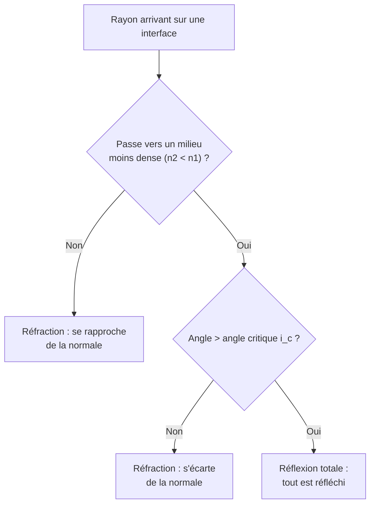

# Optique Géométrique

L'optique géométrique modélise la lumière par des **rayons** se propageant en ligne droite. Cette approximation, valable tant que les obstacles sont grands devant la longueur d'onde, décrit miroirs, lentilles et instruments d'optique. Les effets ondulatoires (interférences, diffraction) sont traités dans [[Interférences et Diffraction]].

## 1. La lumière et sa propagation

> [!important] Propagation rectiligne
> Dans un milieu **homogène et transparent**, la lumière se propage en **ligne droite**. On la modélise par des **rayons lumineux**, droites orientées dans le sens de propagation.

> [!important] Vitesse de la lumière et indice
> Dans le vide, la lumière se propage à $c = 3{,}00 \times 10^8$ m·s⁻¹. Dans un milieu, elle ralentit. On définit l'**indice de réfraction** :
> $$n = \frac{c}{v} \geq 1$$

| Milieu | Indice $n$ |
|--------|-----------|
| Vide | $1$ (exact) |
| Air | $\approx 1{,}00$ |
| Eau | $1{,}33$ |
| Verre | $\approx 1{,}5$ |
| Diamant | $2{,}42$ |

## 2. Réflexion et réfraction

### 2.1 Loi de la réflexion

> [!important] Réflexion
> Le rayon réfléchi est dans le plan d'incidence ; l'angle de réflexion est égal à l'angle d'incidence (mesurés par rapport à la **normale**) :
> $$i_r = i_1$$

### 2.2 Lois de Snell-Descartes (réfraction)

> [!important] Réfraction
> À l'interface entre deux milieux d'indices $n_1$ et $n_2$, le rayon change de direction selon :
> $$n_1 \sin i_1 = n_2 \sin i_2$$
> où les angles sont mesurés par rapport à la normale.

> [!tip] Sens de la déviation
> En passant dans un milieu **plus réfringent** ($n_2 > n_1$, ex. air → eau), le rayon se **rapproche de la normale**. Inversement, il s'en écarte en allant vers un milieu moins dense.

### 2.3 Réflexion totale

> [!important] Réflexion totale
> En passant d'un milieu dense vers un milieu moins dense ($n_1 > n_2$), si l'angle d'incidence dépasse l'**angle critique** $i_c$, le rayon ne se réfracte plus : il est entièrement réfléchi.
> $$\sin i_c = \frac{n_2}{n_1}$$

C'est le principe de la **fibre optique** : la lumière reste piégée par réflexions totales successives (voir [[Applications de la Physique]]).



## 3. Lentilles minces convergentes

### 3.1 Vocabulaire

> [!important] Éléments d'une lentille convergente
> - **Centre optique** $O$ : un rayon le traversant n'est pas dévié.
> - **Foyer image** $F'$ : un rayon parallèle à l'axe en ressort en passant par $F'$.
> - **Foyer objet** $F$ : un rayon passant par $F$ en ressort parallèle à l'axe.
> - **Distance focale** $f' = \overline{OF'} > 0$ pour une lentille convergente.
> - **Vergence** : $V = \dfrac{1}{f'}$ en dioptries (δ) ; plus $V$ est grande, plus la lentille est convergente.

### 3.2 Les trois rayons de construction

> [!tip] Construire l'image d'un point objet
> 1. Le rayon **parallèle à l'axe** ressort par $F'$.
> 2. Le rayon passant par le **centre** $O$ n'est pas dévié.
> 3. Le rayon passant par $F$ ressort **parallèle à l'axe**.
> L'image se forme à l'intersection des rayons émergents.

### Visualisation animée (Manim)

> [!note] Ce que montre l'animation
> Un objet (flèche) est placé devant une lentille convergente. On trace les trois rayons caractéristiques : le rayon parallèle qui ressort par $F'$, le rayon central non dévié, et le rayon passant par $F$ qui ressort parallèle. Leur intersection donne l'image, ici **renversée et réelle**. On *voit* comment la position de l'objet par rapport à $F$ détermine la nature de l'image.

```manim
# Rendu : manimgl lentille.py LentilleConvergente
from manimlib import *


class LentilleConvergente(Scene):
    def construct(self):
        f = 2.0                       # distance focale (unités d'écran)
        axe = Line(LEFT * 6, RIGHT * 6, color=GREY_B)
        lentille = Line(UP * 2.6, DOWN * 2.6, color=BLUE, stroke_width=6)
        # Petites pointes pour marquer une lentille convergente
        haut = VGroup(Line(UP * 2.6, UP * 2.6 + UR * 0.3), Line(UP * 2.6, UP * 2.6 + UL * 0.3))
        bas = VGroup(Line(DOWN * 2.6, DOWN * 2.6 + DR * 0.3), Line(DOWN * 2.6, DOWN * 2.6 + DL * 0.3))
        O = Dot(ORIGIN, color=WHITE)
        F = Dot(LEFT * f, color=YELLOW)
        Fp = Dot(RIGHT * f, color=YELLOW)
        labels = VGroup(
            Tex("O").next_to(O, DOWN), Tex("F").next_to(F, DOWN), Tex("F'").next_to(Fp, DOWN),
        )
        self.play(ShowCreation(axe), ShowCreation(lentille), ShowCreation(haut), ShowCreation(bas))
        self.play(FadeIn(O), FadeIn(F), FadeIn(Fp), Write(labels))

        # Objet : flèche verticale à gauche
        xB = -4.0
        hB = 1.5
        B = np.array([xB, hB, 0])
        objet = Arrow(np.array([xB, 0, 0]), B, buff=0, color=GREEN)
        self.play(GrowArrow(objet))

        # Position de l'image par la relation de conjugaison 1/x' - 1/x = 1/f
        xp = 1.0 / (1.0 / f + 1.0 / xB)
        gamma = xp / xB
        hBp = gamma * hB
        Bp = np.array([xp, hBp, 0])

        # Rayon 1 : parallèle à l'axe -> ressort par F'
        r1a = Line(B, np.array([0, hB, 0]), color=RED)
        r1b = Line(np.array([0, hB, 0]), Bp + (Bp - np.array([0, hB, 0])) * 0.3, color=RED)
        # Rayon 2 : par le centre O, non dévié
        r2 = Line(B, Bp + (Bp - B) * 0.2, color=ORANGE)

        self.play(ShowCreation(r1a), ShowCreation(r2))
        self.play(ShowCreation(r1b))

        image = Arrow(np.array([xp, 0, 0]), Bp, buff=0, color=PURPLE)
        self.play(GrowArrow(image))
        note = Tex(r"\text{Image réelle et renversée}", color=PURPLE).to_edge(UP).set_backstroke()
        self.play(Write(note))
        self.wait(2)
```

## 4. Relation de conjugaison et grandissement

> [!important] Relation de conjugaison des lentilles minces
> Avec les mesures algébriques depuis le centre $O$ ($\overline{OA}$ pour l'objet, $\overline{OA'}$ pour l'image) :
> $$\frac{1}{\overline{OA'}} - \frac{1}{\overline{OA}} = \frac{1}{f'}$$

> [!important] Grandissement
> $$\gamma = \frac{\overline{A'B'}}{\overline{AB}} = \frac{\overline{OA'}}{\overline{OA}}$$
> - $\gamma < 0$ : image **renversée** ; $\gamma > 0$ : image **droite**.
> - $|\gamma| > 1$ : image agrandie ; $|\gamma| < 1$ : image réduite.

> [!warning] Distances algébriques
> Les grandeurs $\overline{OA}$, $\overline{OA'}$ sont **algébriques** (avec un signe selon le sens de la lumière). Travailler en valeurs absolues conduit à des erreurs sur la nature et la position de l'image.

## 5. L'œil et les instruments

> [!important] L'œil, un système convergent
> L'ensemble cornée + cristallin se comporte comme une lentille convergente formant une image réelle sur la rétine. L'**accommodation** ajuste la vergence du cristallin pour voir net de près comme de loin.

| Défaut | Cause | Correction |
|--------|-------|------------|
| Myopie | image avant la rétine | lentille **divergente** ($V < 0$) |
| Hypermétropie | image après la rétine | lentille **convergente** ($V > 0$) |
| Presbytie | perte d'accommodation (âge) | verres progressifs |

### 5.4 La lunette astronomique

> [!important] Un système à deux lentilles convergentes
> La lunette astronomique observe des objets lointains (donc à l'infini). Elle associe :
> - un **objectif** de grande distance focale $f'_1$, qui forme une image intermédiaire dans son plan focal,
> - un **oculaire** de courte distance focale $f'_2$, qui agit comme une loupe sur cette image.
> Une lunette **afocale** donne d'un objet à l'infini une image à l'infini (observation sans fatigue de l'œil). Le **grossissement** est alors :
> $$G = \frac{f'_1}{f'_2}$$

> [!tip] Pourquoi un grand objectif
> Plus l'objectif a une grande distance focale (et un grand diamètre), plus le grossissement et la luminosité sont importants — d'où la taille des lunettes et télescopes astronomiques (voir aussi le pouvoir de résolution dans [[Interférences et Diffraction]]).

## 6. Nature ondulatoire et particulaire de la lumière

### 6.1 Le modèle ondulatoire

> [!important] La lumière est une onde
> La lumière est une **onde électromagnétique** caractérisée par sa longueur d'onde $\lambda$ (ou sa fréquence $\nu = c/\lambda$). Le domaine visible s'étend d'environ $400$ nm (violet) à $800$ nm (rouge). Ce modèle explique les phénomènes que l'optique géométrique ignore : la **diffraction** (étalement par une petite ouverture, demi-largeur angulaire $\theta \approx \lambda/a$) et les **interférences** (figures de franges, expérience des fentes de Young). Étude approfondie dans [[Interférences et Diffraction]].

### 6.2 Le modèle particulaire : le photon

> [!important] La lumière est aussi un flux de photons
> La lumière est constituée de grains d'énergie, les **photons**, d'énergie :
> $$E = h\nu = \frac{hc}{\lambda}$$
> où $h = 6{,}63\times10^{-34}$ J·s est la constante de Planck. Plus la longueur d'onde est courte, plus le photon est énergétique (un photon UV est plus énergétique qu'un photon rouge).

> [!important] Dualité onde-corpuscule
> Selon l'expérience, la lumière se comporte comme une onde (diffraction, interférences) ou comme un flux de particules (effet photoélectrique). Les deux modèles sont **complémentaires** : c'est la porte d'entrée de la [[Mécanique Quantique]].

### 6.3 Niveaux d'énergie et spectres

> [!important] Quantification de l'énergie des atomes
> L'énergie d'un atome ne peut prendre que des **valeurs discrètes** (niveaux d'énergie $E_n$). Lors d'une transition d'un niveau $E_p$ vers un niveau $E_n$ plus bas, l'atome émet un photon d'énergie :
> $$E_{\text{photon}} = E_p - E_n = h\nu$$
> Cela explique les **spectres de raies** : chaque élément émet (ou absorbe) des longueurs d'onde précises, véritable « signature » utilisée en astrophysique pour identifier la composition des étoiles.

> [!example] Longueur d'onde émise lors d'une transition
> Un atome passe d'un niveau à $-3{,}0$ eV vers un niveau à $-5{,}4$ eV. L'énergie du photon émis est $\Delta E = 2{,}4$ eV $= 2{,}4 \times 1{,}6\times10^{-19} = 3{,}84\times10^{-19}$ J.
> $$\lambda = \frac{hc}{\Delta E} = \frac{6{,}63\times10^{-34}\times3\times10^8}{3{,}84\times10^{-19}} \approx 518 \text{ nm}$$
> Soit une lumière verte.

## 7. Exercices types corrigés

### Exercice 1 : réfraction air-eau

**Énoncé** : Un rayon arrive sur la surface de l'eau ($n = 1{,}33$) avec un angle d'incidence $i_1 = 40°$. Calculer l'angle de réfraction.

> [!example] Correction
> $$n_{\text{air}}\sin i_1 = n_{\text{eau}}\sin i_2 \implies \sin i_2 = \frac{1 \times \sin 40°}{1{,}33} = \frac{0{,}643}{1{,}33} = 0{,}483$$
> $$i_2 = \arcsin(0{,}483) \approx 28{,}9°$$
> Le rayon se rapproche de la normale (milieu plus dense).

### Exercice 2 : angle critique

**Énoncé** : Calculer l'angle critique pour un rayon passant de l'eau ($n_1 = 1{,}33$) à l'air ($n_2 = 1$).

> [!example] Correction
> $$\sin i_c = \frac{n_2}{n_1} = \frac{1}{1{,}33} = 0{,}752 \implies i_c = \arcsin(0{,}752) \approx 48{,}8°$$
> Au-delà de $48{,}8°$, réflexion totale.

### Exercice 3 : position d'une image

**Énoncé** : Un objet est placé à $30$ cm devant une lentille convergente de distance focale $f' = 10$ cm. Où se forme l'image et quel est le grandissement ?

> [!example] Correction
> Avec $\overline{OA} = -30$ cm (objet réel à gauche) :
> $$\frac{1}{\overline{OA'}} = \frac{1}{f'} + \frac{1}{\overline{OA}} = \frac{1}{10} + \frac{1}{-30} = \frac{3 - 1}{30} = \frac{2}{30}$$
> $$\overline{OA'} = 15 \text{ cm}$$
> $$\gamma = \frac{\overline{OA'}}{\overline{OA}} = \frac{15}{-30} = -0{,}5$$
> Image **réelle** (à $15$ cm derrière), **renversée** et **réduite** de moitié.

## 8. À retenir

> [!tip] À retenir
> - La lumière se propage en ligne droite dans un milieu homogène ; indice $n = c/v \geq 1$.
> - **Réflexion** : $i_r = i_1$. **Réfraction** : $n_1\sin i_1 = n_2\sin i_2$.
> - **Réflexion totale** au-delà de $i_c$ ($\sin i_c = n_2/n_1$) : base de la fibre optique.
> - **Lentille convergente** : trois rayons de construction (parallèle → $F'$, centre → non dévié, $F$ → parallèle).
> - **Conjugaison** : $\dfrac{1}{\overline{OA'}} - \dfrac{1}{\overline{OA}} = \dfrac{1}{f'}$ ; **grandissement** $\gamma = \dfrac{\overline{OA'}}{\overline{OA}}$. Soigner les signes algébriques.
> - **Lunette astronomique** (afocale) : deux lentilles convergentes, grossissement $G = f'_1/f'_2$.
> - **Dualité** : la lumière est onde (diffraction, interférences) et flux de **photons** d'énergie $E = h\nu = hc/\lambda$ ; transitions atomiques quantifiées $\Delta E = h\nu$ (spectres de raies).

*Voir aussi* : [[Ondes Mécaniques et Son]] | [[Interférences et Diffraction]] | [[Géométrie Plane]] | [[Trigonométrie]]
