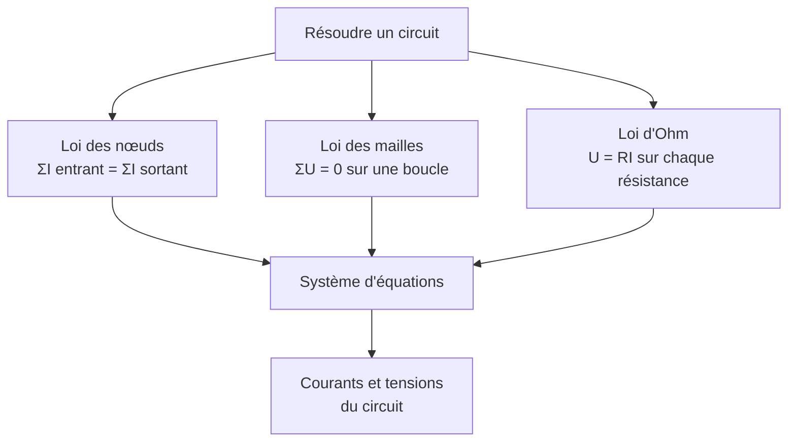

# Circuits Électriques

L'électricité est la base de toute l'électronique. Au lycée, on étudie les circuits en **régime continu** : les lois fondamentales (Ohm, Kirchhoff) et les associations de dipôles. Ces bases sont approfondies en prépa avec les régimes variables (voir [[Électrocinétique]]).

## 1. Grandeurs électriques

> [!important] Les grandeurs de base
> - **Courant** $I$ : débit de charges électriques (en ampères, A). $I = \dfrac{q}{\Delta t}$.
> - **Tension** $U$ : différence de potentiel entre deux points (en volts, V).
> - **Charge** $q$ : quantité d'électricité (en coulombs, C).
> - **Puissance** $P$ : énergie transférée par unité de temps (en watts, W).

> [!warning] Sens conventionnel du courant
> Par convention, le courant circule du pôle $+$ vers le pôle $-$ à l'extérieur du générateur. Les électrons, eux, se déplacent **en sens inverse**. Cette convention est source d'erreurs de signe : la fixer mentalement dès le départ.

### 1.1 Mesures

| Grandeur | Appareil | Branchement |
|----------|----------|-------------|
| Courant $I$ | ampèremètre | en **série** |
| Tension $U$ | voltmètre | en **dérivation** (parallèle) |

## 2. Loi d'Ohm

> [!important] Loi d'Ohm
> Pour un conducteur ohmique (résistance $R$ en ohms, Ω) :
> $$U = R\,I$$
> La tension aux bornes est proportionnelle au courant qui le traverse.

> [!example] Calcul d'un courant
> Une résistance $R = 220$ Ω est soumise à une tension $U = 5{,}0$ V. Le courant vaut :
> $$I = \frac{U}{R} = \frac{5{,}0}{220} \approx 0{,}023 \text{ A} = 23 \text{ mA}$$

## 3. Lois de Kirchhoff

> [!important] Loi des nœuds (conservation de la charge)
> En un nœud, la somme des courants entrants égale la somme des courants sortants :
> $$\sum I_{\text{entrant}} = \sum I_{\text{sortant}}$$

> [!important] Loi des mailles (additivité des tensions)
> Le long d'une maille (boucle fermée), la somme algébrique des tensions est nulle :
> $$\sum U = 0$$

## 4. Associations de résistances

> [!important] En série et en parallèle
> - **Série** (même courant) : $R_{\text{eq}} = R_1 + R_2 + \cdots$
> - **Parallèle** (même tension) : $\dfrac{1}{R_{\text{eq}}} = \dfrac{1}{R_1} + \dfrac{1}{R_2} + \cdots$

> [!tip] Vérifier ses calculs
> - En **série**, la résistance équivalente est **plus grande** que chacune.
> - En **parallèle**, elle est **plus petite** que la plus petite. Pour deux résistances : $R_{\text{eq}} = \dfrac{R_1 R_2}{R_1 + R_2}$.

> [!example] Pont diviseur de tension
> Deux résistances $R_1$ et $R_2$ en série sous une tension $U$. La tension aux bornes de $R_2$ est :
> $$U_2 = U \times \frac{R_2}{R_1 + R_2}$$
> Valable uniquement si **aucun courant n'est tiré** sur le point milieu.

## 5. Puissance et énergie électriques

> [!important] Puissance électrique
> $$P = U\,I$$
> Pour une résistance, en combinant avec la loi d'Ohm :
> $$P = R\,I^2 = \frac{U^2}{R}$$
> C'est l'**effet Joule** : l'énergie électrique dissipée en chaleur.

> [!important] Énergie consommée
> $$E = P \times \Delta t$$
> En pratique, l'énergie électrique se facture en kilowattheures : $1$ kWh $= 3{,}6 \times 10^6$ J.

## 6. Le condensateur (introduction)

> [!important] Condensateur
> Un condensateur stocke des charges. Sa charge est proportionnelle à la tension :
> $$q = C\,u_C$$
> où $C$ est la **capacité** (en farads, F). L'étude de sa charge et décharge (régime transitoire) est faite en prépa (voir [[Électrocinétique]]).

## 7. Exercices types corrigés

### Exercice 1 : circuit série

**Énoncé** : Trois résistances $R_1 = 100$ Ω, $R_2 = 220$ Ω, $R_3 = 330$ Ω sont en série sous $U = 12$ V. Calculer le courant et la tension aux bornes de $R_2$.

> [!example] Correction
> Résistance équivalente : $R_{\text{eq}} = 100 + 220 + 330 = 650$ Ω.
> $$I = \frac{U}{R_{\text{eq}}} = \frac{12}{650} \approx 18{,}5 \text{ mA}$$
> $$U_2 = R_2\,I = 220 \times 0{,}0185 \approx 4{,}1 \text{ V}$$

### Exercice 2 : association parallèle

**Énoncé** : Deux résistances $R_1 = 60$ Ω et $R_2 = 40$ Ω sont en parallèle. Calculer la résistance équivalente.

> [!example] Correction
> $$R_{\text{eq}} = \frac{R_1 R_2}{R_1 + R_2} = \frac{60 \times 40}{60 + 40} = \frac{2400}{100} = 24 \text{ Ω}$$
> Bien inférieure à la plus petite ($40$ Ω) : cohérent.

### Exercice 3 : effet Joule

**Énoncé** : Un radiateur de résistance $R = 24$ Ω est branché sur le secteur $U = 230$ V. Quelle puissance dissipe-t-il, et quelle énergie en $2$ h ?

> [!example] Correction
> $$P = \frac{U^2}{R} = \frac{230^2}{24} \approx 2204 \text{ W} \approx 2{,}2 \text{ kW}$$
> $$E = P \times \Delta t = 2{,}2 \times 2 = 4{,}4 \text{ kWh}$$

## 8. À retenir

> [!tip] À retenir
> - **Courant** = débit de charges ; sens conventionnel $+\to-$ (opposé aux électrons).
> - **Loi d'Ohm** : $U = RI$. **Effet Joule** : $P = RI^2 = U^2/R$.
> - **Kirchhoff** : loi des nœuds ($\sum I_{\text{ent}} = \sum I_{\text{sort}}$), loi des mailles ($\sum U = 0$).
> - **Série** : $R_{\text{eq}} = \sum R_i$ (plus grande). **Parallèle** : $1/R_{\text{eq}} = \sum 1/R_i$ (plus petite).
> - **Condensateur** : $q = Cu_C$ ; régimes variables étudiés en prépa.

*Voir aussi* : [[Électrocinétique]] | [[Électrostatique et Magnétostatique]] | [[Énergie et Travail]] | [[Constantes et Unités]]
