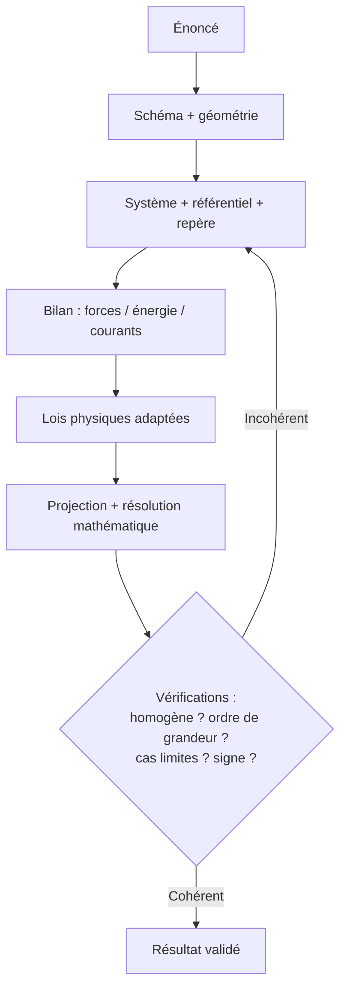

# Méthodes de Résolution

Réussir un problème de physique tient autant à la **méthode** qu'aux connaissances. Cette note rassemble les démarches transversales : poser le problème, analyser les dimensions, estimer un ordre de grandeur, et valider un résultat.

## 1. La démarche type d'un problème

> [!important] Les étapes incontournables
> 1. **Lire et schématiser** : faire un dessin, repérer la géométrie.
> 2. **Choisir le système** étudié (le point matériel, le gaz, le circuit…).
> 3. **Choisir le référentiel** (galiléen ?) et un repère (axes, sens positifs).
> 4. **Faire le bilan** des forces / des échanges d'énergie / des courants.
> 5. **Écrire les lois** physiques adaptées (Newton, principes, Kirchhoff…).
> 6. **Projeter et résoudre** mathématiquement.
> 7. **Vérifier** : homogénéité, ordre de grandeur, cas limites, signe.

## 2. L'analyse dimensionnelle

### 2.1 Vérifier une formule

> [!tip] Le réflexe n°1
> Avant tout calcul numérique, vérifier que la formule est **homogène** (mêmes dimensions des deux côtés). C'est le moyen le plus rapide de détecter une erreur. Voir [[Constantes et Unités]] pour les dimensions de base.

### 2.2 Retrouver une formule par analyse dimensionnelle

> [!example] Période d'un pendule simple
> On cherche $T$ en fonction de la longueur $\ell$, la masse $m$ et $g$. On postule $T = \ell^{a} m^{b} g^{c}$.
>
> Dimensions : $\mathsf{T} = \mathsf{L}^{a}\,\mathsf{M}^{b}\,(\mathsf{L}\,\mathsf{T}^{-2})^{c} = \mathsf{M}^{b}\,\mathsf{L}^{a+c}\,\mathsf{T}^{-2c}$.
>
> Identification : $b = 0$ (la masse n'intervient pas !), $-2c = 1 \Rightarrow c = -\tfrac{1}{2}$, $a + c = 0 \Rightarrow a = \tfrac{1}{2}$.
>
> D'où $T \propto \sqrt{\dfrac{\ell}{g}}$. L'analyse dimensionnelle donne la forme ; seul un calcul complet donne le facteur $2\pi$.

## 3. Les ordres de grandeur

> [!important] Estimer avant de calculer
> Un physicien sait **estimer** un résultat à un facteur 10 près sans calculatrice. Cela permet de repérer une erreur grossière et de juger si un effet est négligeable.

| Grandeur | Ordre de grandeur |
|----------|-------------------|
| Taille d'un atome | $10^{-10}$ m |
| Longueur d'onde du visible | $5 \times 10^{-7}$ m |
| Vitesse du son dans l'air | $340$ m·s⁻¹ |
| Vitesse de la lumière | $3 \times 10^{8}$ m·s⁻¹ |
| Énergie d'une liaison chimique | quelques eV |
| Rayon de la Terre | $6{,}4 \times 10^{6}$ m |
| Distance Terre–Soleil | $1{,}5 \times 10^{11}$ m |

> [!example] Estimation : nombre de respirations dans une vie
> $\sim 15$ respirations/min $\times\ 60 \times 24 \times 365 \times 80 \approx 6 \times 10^8$ respirations. L'objectif n'est pas la précision mais le **bon exposant**.

## 4. Étude des cas limites

> [!tip] Tester sa formule aux extrêmes
> Une fois un résultat obtenu, le valider dans des cas connus :
> - $v \to 0$ : retrouve-t-on la mécanique au repos ?
> - $v \ll c$ : la relativité doit redonner Newton ($\gamma \to 1$).
> - $t \to \infty$ : un régime transitoire doit tendre vers le régime permanent.
> - une masse, une résistance, un angle qui tend vers $0$ ou l'infini : le comportement est-il intuitif ?

## 5. Le rôle des modèles

> [!warning] Une formule a toujours un domaine de validité
> La physique procède par **idéalisations** : point matériel, gaz parfait, fil sans résistance, frottements négligés, faibles oscillations. Appliquer une formule hors de son modèle conduit à des absurdités. Toujours se demander : *« quelles hypothèses ai-je faites ? »*

| Modèle | Hypothèse | Limite |
|--------|-----------|--------|
| Point matériel | objet sans dimension | rotation propre ignorée |
| Gaz parfait | pas d'interaction entre molécules | haute pression / basse température |
| Petites oscillations | $\sin\theta \approx \theta$ | grands angles |
| Mécanique classique | $v \ll c$, échelle macroscopique | relativité, quantique |

## 6. À retenir

> [!tip] À retenir
> - Suivre la **démarche type** : schéma → système → référentiel → bilan → lois → résolution → vérification.
> - **Vérifier l'homogénéité** systématiquement ; au besoin, retrouver la forme d'une loi par analyse dimensionnelle.
> - **Estimer un ordre de grandeur** avant tout calcul numérique.
> - **Tester les cas limites** ($v \to 0$, $t \to \infty$, $v \ll c$…).
> - Connaître les **hypothèses du modèle** employé : une formule hors de son domaine est fausse.

*Voir aussi* : [[Constantes et Unités]] | [[Formulaire]] | [[Erreurs Classiques]]
