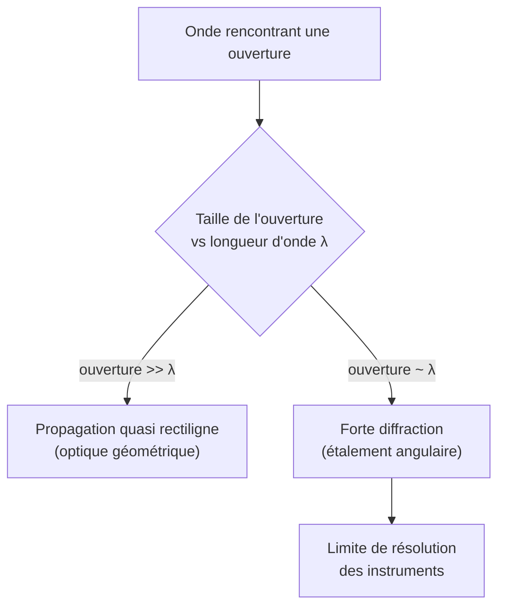

# Interférences et Diffraction

L'optique ondulatoire explique ce que l'[[Optique Géométrique|optique géométrique]] ignore : franges, irisations, limites de résolution. Ces phénomènes prouvent la **nature ondulatoire** de la lumière (et de toute onde, voir [[Ondes Mécaniques et Son]]).

## 1. Le phénomène d'interférences

> [!important] Superposition de deux ondes cohérentes
> Quand deux ondes de même fréquence se superposent, leurs amplitudes s'ajoutent. L'intensité résultante dépend de leur **déphasage**, lié à la **différence de marche** $\delta$ (différence de chemin optique) :
> $$\varphi = \frac{2\pi}{\lambda}\,\delta$$

| Condition | Différence de marche | Résultat |
|-----------|----------------------|----------|
| **Interférence constructive** | $\delta = k\lambda$ ($k \in \mathbb Z$) | intensité **maximale** |
| **Interférence destructive** | $\delta = \left(k + \tfrac12\right)\lambda$ | intensité **minimale** (nulle) |

> [!important] Condition de cohérence
> Pour observer des franges stables, les deux sources doivent être **cohérentes** : même fréquence et déphasage constant. En pratique, on divise une **même** source (fentes de Young, miroirs) — deux lampes distinctes ne sont jamais cohérentes.

## 2. Les fentes de Young

> [!important] Dispositif et interfrange
> Deux fentes séparées de $a$, éclairées par une source monochromatique, produisent sur un écran à distance $D$ un système de franges régulières. L'**interfrange** (distance entre deux franges brillantes) est :
> $$i = \frac{\lambda D}{a}$$
> La différence de marche en un point d'abscisse $x$ de l'écran est $\delta = \dfrac{a x}{D}$.

> [!tip] Mesurer une longueur d'onde
> En mesurant l'interfrange $i$, la distance $D$ et l'écart $a$, on remonte à $\lambda = \dfrac{i a}{D}$. C'est la méthode historique de mesure des longueurs d'onde lumineuses.

### Visualisation animée (Manim)

> [!note] Ce que montre l'animation
> Deux sources ponctuelles synchrones émettent des ondes circulaires. Là où deux crêtes (ou deux creux) se rencontrent, l'onde se renforce (constructif) ; là où une crête rencontre un creux, elles s'annulent (destructif). On *voit* apparaître les lignes d'interférence (hyperboles), et sur l'écran à droite, l'alternance de franges brillantes et sombres.

```manim
# Rendu : manimgl young.py FentesDeYoung
from manimlib import *


class FentesDeYoung(Scene):
    def construct(self):
        S1 = LEFT * 5 + UP * 0.8
        S2 = LEFT * 5 + DOWN * 0.8
        k = TAU / 0.7          # nombre d'onde
        t = ValueTracker(0.0)
        w = 2.0

        def amplitude(p):
            r1 = np.linalg.norm(p - S1)
            r2 = np.linalg.norm(p - S2)
            return np.cos(k * r1 - w * t.get_value()) + np.cos(k * r2 - w * t.get_value())

        # Champ d'interférence rendu par une grille de points colorés
        grille = VGroup()
        for x in np.arange(-4.5, 4.0, 0.18):
            for y in np.arange(-3.2, 3.2, 0.18):
                grille.add(Dot(np.array([x, y, 0]), radius=0.07))

        def maj_grille(g):
            for d in g:
                a = amplitude(d.get_center())
                d.set_color(interpolate_color(BLACK, BLUE, (a + 2) / 4))
        grille.add_updater(maj_grille)

        s1 = Dot(S1, color=YELLOW)
        s2 = Dot(S2, color=YELLOW)
        ecran = Line(RIGHT * 4 + UP * 3.2, RIGHT * 4 + DOWN * 3.2, color=WHITE)

        self.add(grille, s1, s2, ecran)
        legende = Tex(r"\text{Deux sources cohérentes} \to \text{franges}").to_edge(UP).set_backstroke()
        self.add(legende)
        self.play(t.animate.set_value(8.0), run_time=8, rate_func=linear)
        self.wait()
```

## 3. La diffraction

> [!important] Étalement par une ouverture
> Quand une onde traverse une ouverture (ou contourne un obstacle) de taille comparable à $\lambda$, elle **s'étale** au lieu de se propager en ligne droite. Pour une fente de largeur $b$, la tache centrale a une demi-largeur angulaire :
> $$\theta \approx \frac{\lambda}{b}$$
> La diffraction est d'autant plus marquée que l'ouverture est **petite** devant $\lambda$.

> [!important] Pouvoir de résolution (critère de Rayleigh)
> Un instrument de diamètre $D$ ne peut distinguer deux points que s'ils sont séparés d'au moins :
> $$\theta_{\min} \approx 1{,}22\,\frac{\lambda}{D}$$
> C'est la limite ultime des télescopes et microscopes : plus l'ouverture est grande, plus la résolution est fine.



## 4. Réseaux et applications

> [!important] Réseau de diffraction
> Un réseau de $N$ fentes très rapprochées disperse la lumière en spectres nets. Les maxima vérifient $a\sin\theta = k\lambda$. C'est l'outil de base de la **spectroscopie** (analyse de la composition de la lumière, donc de la matière).

- **Couleurs interférentielles** : irisation des bulles de savon, des plumes de paon, des CD (réseau gravé).
- **Interféromètre de Michelson** : mesure de très petites longueurs ; détection des ondes gravitationnelles (LIGO).
- **Holographie** : enregistrement du front d'onde complet par interférences.

## 5. Dualité onde-corpuscule

> [!important] Vers la quantique
> Refaite avec des électrons un par un, l'expérience des fentes de Young donne encore des franges : chaque particule « interfère avec elle-même ». C'est l'entrée dans la [[Mécanique Quantique]] et la dualité onde-corpuscule.

## 6. Exercices types corrigés

### Exercice 1 : interfrange

**Énoncé** : Des fentes de Young distantes de $a = 0{,}2$ mm, éclairées par un laser ($\lambda = 633$ nm), donnent des franges sur un écran à $D = 2{,}0$ m. Calculer l'interfrange.

> [!example] Correction
> $$i = \frac{\lambda D}{a} = \frac{633\times10^{-9} \times 2{,}0}{0{,}2\times10^{-3}} = \frac{1{,}266\times10^{-6}}{2\times10^{-4}} \approx 6{,}3\times10^{-3} \text{ m} = 6{,}3 \text{ mm}$$

### Exercice 2 : résolution d'un télescope

**Énoncé** : Quel est le pouvoir de résolution angulaire d'un télescope de $D = 1$ m dans le visible ($\lambda = 550$ nm) ?

> [!example] Correction
> $$\theta_{\min} = 1{,}22\,\frac{\lambda}{D} = 1{,}22 \times \frac{550\times10^{-9}}{1} \approx 6{,}7\times10^{-7} \text{ rad}$$
> Soit environ $0{,}14$ seconde d'arc — d'où l'intérêt des grands miroirs.

### Exercice 3 : nature constructive ou destructive

**Énoncé** : En un point de l'écran, la différence de marche vaut $\delta = 1{,}5\,\lambda$. L'interférence y est-elle constructive ou destructive ?

> [!example] Correction
> $\delta = 1{,}5\lambda = \left(1 + \tfrac12\right)\lambda$, de la forme $\left(k + \tfrac12\right)\lambda$ : interférence **destructive** (frange sombre).

## 7. À retenir

> [!tip] À retenir
> - **Interférences** : constructives si $\delta = k\lambda$, destructives si $\delta = (k+\tfrac12)\lambda$. Sources **cohérentes** nécessaires.
> - **Young** : interfrange $i = \dfrac{\lambda D}{a}$ ; sert à mesurer $\lambda$.
> - **Diffraction** : étalement $\theta \approx \lambda/b$, marquée pour les petites ouvertures.
> - **Résolution** (Rayleigh) : $\theta_{\min} \approx 1{,}22\,\lambda/D$ ; limite des instruments.
> - Ces phénomènes prouvent la **nature ondulatoire** de la lumière et ouvrent vers la quantique.

*Voir aussi* : [[Optique Géométrique]] | [[Ondes Électromagnétiques]] | [[Ondes Mécaniques et Son]] | [[Mécanique Quantique]]
