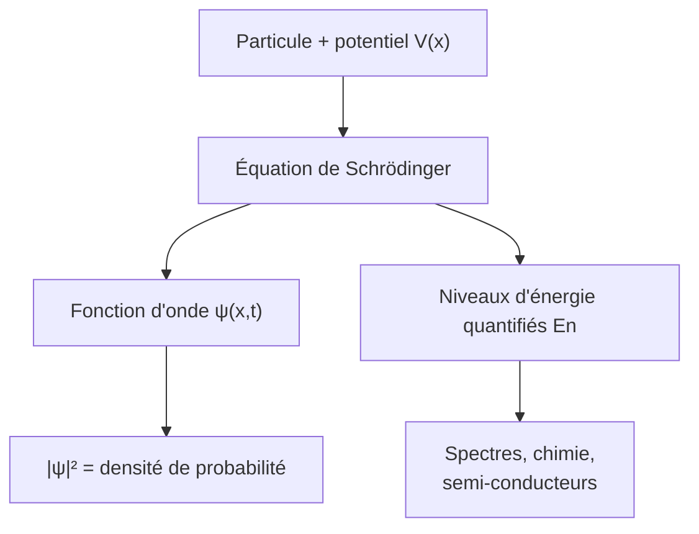

# Mécanique Quantique

À l'échelle atomique, la physique classique échoue. La mécanique quantique décrit un monde de **quantification**, de **dualité onde-corpuscule** et de **probabilités**. Elle fonde toute la physique moderne (semi-conducteurs, lasers, chimie). Prérequis : [[Physique des Ondes]], [[Probabilités]].

## 1. La naissance de la quantique

> [!important] Les anomalies que la physique classique ne peut expliquer
> - **Rayonnement du corps noir** : la physique classique prédit une énergie infinie (« catastrophe ultraviolette »). Planck (1900) postule des échanges d'énergie **quantifiés** $E = h\nu$.
> - **Effet photoélectrique** : Einstein (1905) montre que la lumière arrive par **paquets** (photons) d'énergie $h\nu$.
> - **Spectres atomiques** : les atomes n'émettent que certaines fréquences → niveaux d'énergie discrets.

## 2. La dualité onde-corpuscule

> [!important] Relation de de Broglie
> Toute particule de quantité de mouvement $p$ est associée à une onde de longueur d'onde :
> $$\lambda = \frac{h}{p}$$
> Confirmée par la diffraction d'électrons. La frontière onde/particule disparaît : tout objet est les deux à la fois.

> [!example] Pourquoi on ne « voit » pas la dualité au quotidien
> Pour une balle de tennis ($m = 60$ g, $v = 30$ m·s⁻¹), $\lambda = \dfrac{h}{mv} \approx 4\times10^{-34}$ m : indétectable. Pour un électron, $\lambda$ est de l'ordre de l'atome : les effets ondulatoires deviennent dominants.

## 3. La fonction d'onde

> [!important] Fonction d'onde et interprétation probabiliste
> L'état d'une particule est décrit par une **fonction d'onde** $\psi(x, t)$ (à valeurs complexes). Selon Born, $|\psi(x, t)|^2$ est la **densité de probabilité** de présence :
> $$P(x \in [a, b]) = \int_a^b |\psi(x, t)|^2\,\mathrm dx$$
> avec la condition de normalisation $\displaystyle\int_{-\infty}^{+\infty}|\psi|^2\,\mathrm dx = 1$.

> [!warning] On ne prédit que des probabilités
> La quantique est **intrinsèquement probabiliste** : on ne peut pas prédire le résultat d'une mesure individuelle, seulement les probabilités. Ce n'est pas une ignorance, c'est la nature même de la théorie.

## 4. L'équation de Schrödinger

> [!important] Équation de Schrödinger
> L'évolution de la fonction d'onde est régie par :
> $$i\hbar\frac{\partial\psi}{\partial t} = -\frac{\hbar^2}{2m}\frac{\partial^2\psi}{\partial x^2} + V(x)\psi$$
> Pour les **états stationnaires** $\psi(x,t) = \varphi(x)e^{-iEt/\hbar}$, on obtient l'équation indépendante du temps, dont les solutions donnent les **niveaux d'énergie** permis $E$.



## 5. Quantification et confinement

> [!important] Le puits de potentiel infini
> Une particule confinée dans un puits de largeur $L$ ne peut avoir que des énergies discrètes :
> $$E_n = \frac{n^2 h^2}{8mL^2}, \quad n \in \mathbb N^*$$
> Plus le confinement ($L$) est petit, plus les niveaux sont écartés. C'est l'origine de la quantification : confiner une onde sélectionne des modes (comme les harmoniques d'une [[Physique des Ondes|corde vibrante]]).

### Visualisation animée (Manim)

> [!note] Ce que montre l'animation
> Dans un puits de potentiel infini, les trois premiers états stationnaires : la fonction d'onde $\varphi_n(x)$ ressemble aux modes d'une corde vibrante (1, 2, 3 ventres), et la densité de probabilité $|\varphi_n|^2$ montre où la particule a le plus de chances d'être. On *voit* que l'énergie est **quantifiée** ($E_n \propto n^2$) et que l'état fondamental n'est jamais d'énergie nulle.

```manim
# Rendu : manimgl puits.py PuitsDePotentiel
from manimlib import *


class PuitsDePotentiel(Scene):
    def construct(self):
        L = 6.0
        x0 = -3.0
        # Parois du puits
        gauche = Line(np.array([x0, -1, 0]), np.array([x0, 3.5, 0]), color=GREY_B)
        droite = Line(np.array([x0 + L, -1, 0]), np.array([x0 + L, 3.5, 0]), color=GREY_B)
        fond = Line(np.array([x0, -1, 0]), np.array([x0 + L, -1, 0]), color=GREY_B)
        self.add(gauche, droite, fond)

        def etat(n, dens=False):
            # phi_n(x) = sin(n pi x / L) ; décalé verticalement par niveau d'énergie ~ n^2
            base = -1 + 0.5 * n**2
            pts = []
            for x in np.linspace(0, L, 200):
                phi = np.sin(n * PI * x / L)
                val = phi**2 if dens else phi
                pts.append(np.array([x0 + x, base + 0.7 * val, 0]))
            color = RED if dens else BLUE
            return VMobject().set_points_smoothly(pts).set_color(color), base

        for n in (1, 2, 3):
            phi, base = etat(n, dens=False)
            niveau = DashedLine(np.array([x0, base, 0]), np.array([x0 + L, base, 0]), color=GREY)
            lab = Tex(f"n={n}").scale(0.7).next_to(np.array([x0 + L, base, 0]), RIGHT).set_backstroke()
            self.play(ShowCreation(niveau), ShowCreation(phi), Write(lab), run_time=1.2)

        note = Tex(r"\varphi_n(x) = \sin\!\left(\tfrac{n\pi x}{L}\right), \quad E_n \propto n^2")
        note.to_edge(UP).set_backstroke()
        self.play(Write(note))
        self.wait(2)
```

## 6. Le principe d'incertitude

> [!important] Inégalité de Heisenberg
> On ne peut pas connaître simultanément avec une précision arbitraire la position et la quantité de mouvement :
> $$\Delta x\cdot\Delta p \geq \frac{\hbar}{2}$$
> Ce n'est pas une limite des appareils : c'est une propriété fondamentale, conséquence de la nature ondulatoire (voir le paquet d'ondes dans [[Physique des Ondes]]).

## 7. Effets quantiques remarquables

| Effet | Description | Application |
|-------|-------------|-------------|
| **Effet tunnel** | franchir une barrière classiquement infranchissable | microscope à effet tunnel, fusion stellaire |
| **Superposition** | un système dans plusieurs états à la fois | ordinateur quantique (qubits) |
| **Intrication** | corrélations non locales entre particules | cryptographie quantique |
| **Quantification du spin** | moment cinétique intrinsèque discret | IRM, électronique de spin |

> [!example] L'effet tunnel fait briller le Soleil
> Dans le cœur du Soleil, les protons n'ont classiquement pas assez d'énergie pour vaincre leur répulsion électrostatique et fusionner. C'est l'**effet tunnel** qui leur permet de franchir la barrière : sans la quantique, les étoiles ne s'allumeraient pas.

> [!important] Le laser : l'émission stimulée
> Un atome excité peut se désexciter de trois façons : absorption, **émission spontanée** (photon émis au hasard) et **émission stimulée** — un photon incident en déclenche un second, identique (même fréquence, même phase, même direction). En réalisant une **inversion de population** (plus d'atomes excités que d'atomes au repos) dans une cavité résonante, on amplifie la lumière : c'est le principe du **LASER** (*Light Amplification by Stimulated Emission of Radiation*). Le faisceau obtenu est cohérent, monochromatique et directif.

## 8. Exercices types corrigés

### Exercice 1 : énergie d'un photon

**Énoncé** : Quelle est l'énergie (en J et en eV) d'un photon UV de fréquence $\nu = 10^{15}$ Hz ?

> [!example] Correction
> $$E = h\nu = 6{,}63\times10^{-34} \times 10^{15} \approx 6{,}6\times10^{-19} \text{ J} \approx 4{,}1 \text{ eV}$$

### Exercice 2 : longueur d'onde de de Broglie

**Énoncé** : Calculer la longueur d'onde d'un électron ($m = 9{,}1\times10^{-31}$ kg) à $v = 10^6$ m·s⁻¹.

> [!example] Correction
> $$\lambda = \frac{h}{mv} = \frac{6{,}63\times10^{-34}}{9{,}1\times10^{-31} \times 10^6} \approx 7{,}3\times10^{-10} \text{ m}$$
> De l'ordre de l'atome : d'où la diffraction des électrons (microscopie électronique).

### Exercice 3 : niveaux d'un puits

**Énoncé** : Pour un électron confiné dans un puits de $L = 0{,}1$ nm, estimer l'énergie du niveau fondamental.

> [!example] Correction
> $$E_1 = \frac{h^2}{8mL^2} = \frac{(6{,}63\times10^{-34})^2}{8 \times 9{,}1\times10^{-31} \times (10^{-10})^2} \approx 6\times10^{-18} \text{ J} \approx 38 \text{ eV}$$
> Ordre de grandeur des énergies atomiques : cohérent.

## 9. À retenir

> [!tip] À retenir
> - **Quantification** : $E = h\nu$ (Planck-Einstein) ; **dualité** $\lambda = h/p$ (de Broglie).
> - **Fonction d'onde** $\psi$ : $|\psi|^2$ = densité de probabilité (Born) ; théorie intrinsèquement probabiliste.
> - **Schrödinger** : $i\hbar\,\partial_t\psi = \hat H\psi$ ; le confinement quantifie l'énergie ($E_n \propto n^2$ dans un puits).
> - **Heisenberg** : $\Delta x\,\Delta p \geq \hbar/2$ (fondamental, pas instrumental).
> - **Effets** : tunnel, superposition, intrication, émission stimulée (**laser**) — base des technologies quantiques.

*Voir aussi* : [[Physique des Ondes]] | [[Ondes Électromagnétiques]] | [[Physique Statistique]] | [[Physique des Particules]] | [[Probabilités]]
