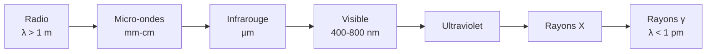

# Ondes Électromagnétiques

Les ondes électromagnétiques (lumière, radio, rayons X…) sont la propagation couplée des champs $\vec E$ et $\vec B$, prédite par les [[Équations de Maxwell]]. Elles n'ont besoin d'aucun milieu et transportent énergie et information à travers l'univers. Cette note prolonge la [[Physique des Ondes]] générale.

## 1. L'onde plane progressive monochromatique (OPPM)

> [!important] Structure de l'OPPM dans le vide
> Une onde plane se propageant selon $\vec u$ a la forme :
> $$\vec E = \vec{E_0}\cos(\omega t - \vec k\cdot\vec r), \qquad \vec k = \frac{\omega}{c}\vec u$$
> Elle vérifie la **structure transverse** :
> - $\vec E \perp \vec u$ et $\vec B \perp \vec u$ (onde transversale),
> - $\vec E \perp \vec B$, avec $\vec B = \dfrac{\vec u \wedge \vec E}{c}$,
> - $E = cB$ en norme, et $\vec E$, $\vec B$ **en phase**.

> [!important] Relation de dispersion dans le vide
> $$k = \frac{\omega}{c}, \qquad v_\varphi = \frac{\omega}{k} = c$$
> Dans le vide, toutes les fréquences vont à la même vitesse $c$ : pas de dispersion.

## 2. Le spectre électromagnétique

| Domaine | Longueur d'onde | Usage |
|---------|-----------------|-------|
| Radio | $> 1$ m | radio, TV, télécoms |
| Micro-ondes | mm – cm | four, radar, Wi-Fi |
| Infrarouge | µm | thermique, télécommandes |
| Visible | $400$–$800$ nm | vision |
| UV | $10$–$400$ nm | stérilisation, bronzage |
| Rayons X | pm – nm | radiographie |
| Rayons γ | $< 1$ pm | nucléaire, médecine |

> [!tip] Tout est la même onde
> Radio et rayons gamma sont la **même nature** d'onde : seule la fréquence (donc l'énergie $E = h\nu$ des photons) change. Les usages diffèrent radicalement à cause de cette énergie.

## 3. Polarisation

> [!important] État de polarisation
> La polarisation décrit la direction d'oscillation de $\vec E$ :
> - **Rectiligne** : $\vec E$ garde une direction fixe.
> - **Circulaire** : $\vec E$ tourne en gardant une norme constante.
> - **Elliptique** : cas général.
> Un **polariseur** ne transmet qu'une composante. Loi de Malus pour l'intensité transmise :
> $$I = I_0\cos^2\theta$$

> [!example] Lunettes de soleil polarisantes
> La lumière réfléchie par l'eau ou la route est partiellement polarisée horizontalement. Un polariseur vertical bloque cette composante : il supprime les reflets éblouissants.

## 4. Énergie et puissance

> [!important] Vecteur de Poynting et intensité
> L'énergie se propage dans le sens de $\vec\Pi = \dfrac{\vec E\wedge\vec B}{\mu_0}$. Pour une OPPM, l'**intensité** (puissance surfacique moyenne) est :
> $$I = \langle\|\vec\Pi\|\rangle = \frac{\varepsilon_0 c E_0^2}{2}$$
> Une onde EM transporte aussi une **quantité de mouvement** : elle exerce une **pression de radiation** (voiles solaires, refroidissement laser).

## 5. Propagation dans les milieux

> [!important] Indice et dispersion
> Dans un milieu transparent, l'onde ralentit : $v = \dfrac{c}{n}$. Si $n$ dépend de la fréquence, le milieu est **dispersif** : les couleurs se séparent (prisme, arc-en-ciel). La vitesse de l'énergie est alors la **vitesse de groupe** $v_g = \dfrac{\mathrm d\omega}{\mathrm dk}$, distincte de la vitesse de phase.

> [!important] Réflexion, absorption, conducteurs
> - Dans un **conducteur**, l'onde est rapidement absorbée (effet de peau) : les métaux sont opaques et réfléchissants.
> - Aux interfaces, une partie de l'onde est réfléchie, une partie transmise (coefficients de Fresnel).

## 6. Exercices types corrigés

### Exercice 1 : champ magnétique d'une OPPM

**Énoncé** : Une onde a un champ électrique d'amplitude $E_0 = 100$ V·m⁻¹. Quelle est l'amplitude de son champ magnétique ?

> [!example] Correction
> $$B_0 = \frac{E_0}{c} = \frac{100}{3\times10^8} \approx 3{,}3\times10^{-7} \text{ T}$$
> Le champ magnétique d'une onde lumineuse est très faible en valeur de tesla — ce qui ne l'empêche pas d'être physiquement essentiel.

### Exercice 2 : loi de Malus

**Énoncé** : Une lumière polarisée traverse un polariseur dont l'axe fait $30°$ avec la polarisation. Quelle fraction de l'intensité passe ?

> [!example] Correction
> $$\frac{I}{I_0} = \cos^2 30° = \left(\frac{\sqrt3}{2}\right)^2 = \frac{3}{4} = 75\%$$

### Exercice 3 : énergie du photon visible

**Énoncé** : Calculer l'énergie d'un photon de lumière verte ($\lambda = 550$ nm) en eV.

> [!example] Correction
> $$E = \frac{hc}{\lambda} = \frac{6{,}63\times10^{-34} \times 3\times10^8}{550\times10^{-9}} \approx 3{,}6\times10^{-19} \text{ J}$$
> En eV : $\dfrac{3{,}6\times10^{-19}}{1{,}6\times10^{-19}} \approx 2{,}3$ eV. Les photons visibles ont des énergies de quelques eV, l'échelle des transitions électroniques.

## 7. À retenir

> [!tip] À retenir
> - **OPPM** dans le vide : $\vec E\perp\vec B\perp\vec u$, en phase, $E = cB$, $\vec B = \dfrac{\vec u\wedge\vec E}{c}$.
> - Dispersion **nulle** dans le vide ($v_\varphi = c$ pour toutes les fréquences).
> - Le **spectre EM** est une même onde de fréquence variable ; énergie du photon $E = h\nu$.
> - **Polarisation** (rectiligne, circulaire) ; loi de Malus $I = I_0\cos^2\theta$.
> - L'onde transporte énergie (Poynting, $I = \tfrac12\varepsilon_0 c E_0^2$) et quantité de mouvement (pression de radiation).

*Voir aussi* : [[Équations de Maxwell]] | [[Physique des Ondes]] | [[Interférences et Diffraction]] | [[Optique Géométrique]] | [[Mécanique Quantique]]
