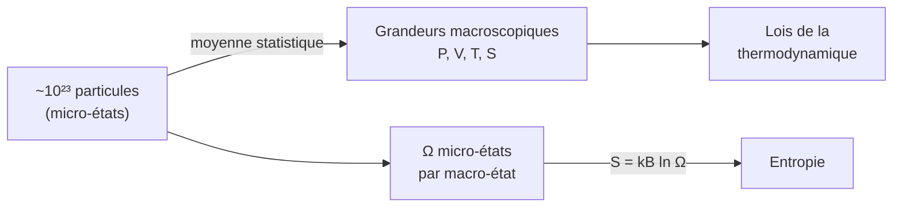

# Physique Statistique

La physique statistique fait le **pont entre le microscopique et le macroscopique** : elle déduit les lois de la [[Thermodynamique]] du comportement collectif d'un nombre immense de particules. Température, pression et entropie y trouvent leur origine probabiliste. Prérequis : [[Probabilités]], [[Thermodynamique]].

## 1. Du microscopique au macroscopique

> [!important] Le défi du grand nombre
> Un gaz contient $\sim 10^{23}$ molécules : suivre chaque trajectoire est impossible et inutile. La physique statistique adopte une approche **probabiliste** : on ne décrit pas chaque particule, mais la **distribution** des états possibles.

> [!important] Micro-états et macro-état
> - Un **micro-état** : la donnée complète des positions et vitesses de toutes les particules.
> - Un **macro-état** : décrit par quelques grandeurs globales ($P$, $V$, $T$, $E$).
> Un même macro-état correspond à un **nombre énorme $\Omega$ de micro-états**.

## 2. L'entropie statistique

> [!important] Formule de Boltzmann
> $$S = k_B\ln\Omega$$
> L'entropie mesure le **nombre de micro-états** compatibles avec l'état macroscopique, donc le « désordre ». Un système évolue spontanément vers le macro-état le **plus probable**, c'est-à-dire celui de plus grand $\Omega$ : c'est le second principe vu d'en bas.

> [!example] Pourquoi un gaz occupe tout le volume
> Un gaz rassemblé dans un coin correspond à très peu de micro-états ; réparti uniformément, à un nombre colossal. La probabilité de le voir spontanément se rassembler dans un coin est si faible qu'on ne l'observe jamais. L'irréversibilité est **statistique**, pas absolue.

## 3. Le facteur de Boltzmann

> [!important] Distribution de Boltzmann
> À l'équilibre thermique à température $T$, la probabilité qu'un système occupe un état d'énergie $E_i$ est proportionnelle au **facteur de Boltzmann** :
> $$P(E_i) \propto e^{-E_i / k_B T}$$
> Les états de basse énergie sont les plus peuplés ; l'agitation thermique ($k_B T$) permet d'atteindre les états plus élevés.

> [!tip] L'échelle d'énergie thermique
> $k_B T$ est l'énergie typique de l'agitation thermique. À température ambiante ($T \approx 300$ K), $k_B T \approx 0{,}025$ eV. On compare toujours les énergies en jeu à $k_B T$ : un effet est « gelé » si son énergie $\gg k_B T$, accessible sinon.

## 4. Le gaz parfait monoatomique

> [!important] Théorème d'équipartition
> À l'équilibre, chaque degré de liberté quadratique de l'énergie porte en moyenne $\tfrac12 k_B T$. Pour un gaz parfait monoatomique (3 directions de translation) :
> $$\langle E_c\rangle = \frac{3}{2}k_B T, \qquad U = \frac{3}{2}n R T$$
> La température est ainsi une **mesure de l'agitation** microscopique moyenne.

> [!important] Distribution des vitesses (Maxwell-Boltzmann)
> Les vitesses des molécules suivent une distribution caractéristique : vitesse la plus probable, vitesse moyenne et vitesse quadratique sont voisines mais distinctes. La largeur de la distribution croît avec $T$.

> [!example] Vitesse quadratique moyenne
> Pour le diazote ($M = 28$ g·mol⁻¹) à $300$ K :
> $$v_{\text{qm}} = \sqrt{\frac{3RT}{M}} = \sqrt{\frac{3 \times 8{,}314 \times 300}{0{,}028}} \approx 517 \text{ m·s}^{-1}$$
> Du même ordre que la vitesse du son dans l'air : cohérent.

## 5. Statistiques quantiques

> [!important] Quand la quantique s'invite
> À basse température ou haute densité, le caractère **indiscernable** des particules impose des statistiques quantiques :
> - **Fermions** (électrons, protons) : principe d'exclusion de Pauli → statistique de Fermi-Dirac (électrons d'un métal, naines blanches).
> - **Bosons** (photons, He-4) : pas d'exclusion → statistique de Bose-Einstein (condensat, superfluidité, rayonnement du corps noir).

## 6. Exercices types corrigés

### Exercice 1 : rapport de populations

**Énoncé** : Deux niveaux d'énergie sont séparés de $\Delta E = 0{,}05$ eV. Quel est le rapport de leurs populations à $300$ K ?

> [!example] Correction
> $$\frac{P_2}{P_1} = e^{-\Delta E / k_B T}, \quad k_B T \approx 0{,}025 \text{ eV}$$
> $$\frac{P_2}{P_1} = e^{-0{,}05 / 0{,}025} = e^{-2} \approx 0{,}14$$
> Le niveau supérieur est ~7 fois moins peuplé.

### Exercice 2 : énergie interne d'un gaz parfait

**Énoncé** : Quelle est l'énergie interne d'une mole de gaz parfait monoatomique à $300$ K ?

> [!example] Correction
> $$U = \frac{3}{2}nRT = \frac{3}{2} \times 1 \times 8{,}314 \times 300 \approx 3740 \text{ J}$$

### Exercice 3 : interprétation de l'entropie

**Énoncé** : On double le volume accessible à un gaz parfait (détente de Joule). Justifier que son entropie augmente, du point de vue statistique.

> [!example] Correction
> Doubler le volume double l'espace de positions accessibles à chaque molécule : le nombre de micro-états est multiplié par $2^N$ (pour $N$ molécules). Donc :
> $$\Delta S = k_B\ln(2^N) = N k_B\ln 2 = nR\ln 2 > 0$$
> Cohérent avec le second principe : la détente irréversible augmente l'entropie.

## 7. À retenir

> [!tip] À retenir
> - Physique statistique = pont **micro → macro** ; un macro-état ↔ $\Omega$ micro-états.
> - **Boltzmann** : $S = k_B\ln\Omega$ ; le système va vers le macro-état le plus probable (2e principe statistique).
> - **Facteur de Boltzmann** : $P(E_i)\propto e^{-E_i/k_B T}$ ; comparer toujours à l'échelle $k_B T$.
> - **Équipartition** : $\tfrac12 k_B T$ par degré de liberté ; $U = \tfrac32 nRT$ (GP monoatomique). $T$ mesure l'agitation.
> - À basse $T$ / haute densité : statistiques quantiques (Fermi-Dirac, Bose-Einstein).

*Voir aussi* : [[Thermodynamique]] | [[Transferts Thermiques]] | [[Mécanique Quantique]] | [[Probabilités]] | [[Probabilités Prépa]]
