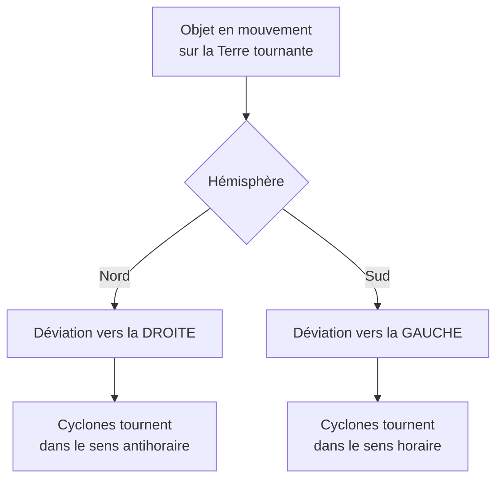

# Référentiels Non Galiléens

Les [[Lois de Newton]] ne valent que dans un référentiel galiléen. Dans un référentiel accéléré ou tournant (manège, voiture qui freine, Terre en rotation), il faut ajouter des **forces d'inertie** pour continuer à appliquer le PFD. C'est l'objet de cette note. Prérequis : [[Mécanique du Point]].

## 1. Pourquoi des forces d'inertie ?

> [!important] Le problème
> Dans un référentiel non galiléen $\mathcal R'$ (accéléré par rapport à un galiléen $\mathcal R$), l'accélération d'un point n'est pas la même que dans $\mathcal R$. Pour conserver la forme $\sum\vec F = m\vec a'$, on ajoute des termes correctifs : les **forces d'inertie**, qui ne correspondent à aucune interaction physique réelle.

> [!important] Composition des accélérations
> $$\vec a_{\mathcal R} = \vec a_{\mathcal R'} + \vec a_e + \vec a_c$$
> - $\vec a_e$ : accélération d'**entraînement** (mouvement de $\mathcal R'$),
> - $\vec a_c = 2\,\vec\Omega\wedge\vec v_{\mathcal R'}$ : accélération de **Coriolis** ($\vec\Omega$ vecteur rotation de $\mathcal R'$).

## 2. Le PFD dans un référentiel non galiléen

> [!important] PFD modifié
> $$m\vec a_{\mathcal R'} = \sum\vec F_{\text{réelles}} + \vec F_{ie} + \vec F_{ic}$$
> avec les **forces d'inertie** :
> $$\vec F_{ie} = -m\vec a_e \quad \text{(d'entraînement)}, \qquad \vec F_{ic} = -2m\,\vec\Omega\wedge\vec v_{\mathcal R'} \quad \text{(de Coriolis)}$$

| Force d'inertie | Quand elle apparaît | Effet ressenti |
|-----------------|---------------------|----------------|
| Entraînement (translation) | $\mathcal R'$ accélère en ligne droite | « plaqué au siège » d'une voiture |
| Centrifuge (cas tournant) | $\mathcal R'$ tourne | « éjecté vers l'extérieur » d'un manège |
| Coriolis | $\mathcal R'$ tourne **et** on s'y déplace | déviation latérale |

> [!warning] Une force d'inertie n'est pas une « vraie » force
> Elle n'a pas de réaction (pas de 3e loi de Newton), et elle disparaît si l'on se replace dans un référentiel galiléen. C'est un artefact du choix du référentiel — mais bien réel dans le ressenti.

## 3. La force centrifuge

> [!important] Cas du référentiel tournant
> Dans un référentiel en rotation uniforme $\vec\Omega$, la force d'inertie d'entraînement est dirigée vers l'extérieur :
> $$\vec F_{ie} = m\Omega^2\,\vec{HM}$$
> où $H$ est le projeté de $M$ sur l'axe de rotation. C'est la **force centrifuge** : elle « pousse vers l'extérieur » dans un manège, une essoreuse, une centrifugeuse.

## 4. La force de Coriolis

> [!important] Déviation des trajectoires
> La force de Coriolis $\vec F_{ic} = -2m\,\vec\Omega\wedge\vec v$ agit sur tout objet en mouvement dans un référentiel tournant. Sur Terre, elle dévie :
> - vers la **droite** dans l'hémisphère Nord,
> - vers la **gauche** dans l'hémisphère Sud.



> [!example] Effets géophysiques de Coriolis
> - **Cyclones et anticyclones** : enroulement caractéristique des masses d'air.
> - **Courants marins** et déviation des vents dominants.
> - **Pendule de Foucault** : son plan d'oscillation tourne lentement, prouvant la rotation de la Terre.

### Visualisation animée (Manim)

> [!note] Ce que montre l'animation
> Un objet est lancé en ligne droite vu d'un référentiel fixe (galiléen). Mais sur un plateau **tournant** (le référentiel non galiléen), sa trajectoire apparaît **courbée** : c'est l'effet de la force de Coriolis. On *voit* qu'aucune force réelle n'agit (la trajectoire est droite dans le référentiel fixe) ; la courbure naît uniquement de la rotation de l'observateur.

```manim
# Rendu : manimgl coriolis.py ForceDeCoriolis
from manimlib import *


class ForceDeCoriolis(Scene):
    def construct(self):
        Omega = 0.6
        plateau = Circle(radius=3.2, color=GREY_B).move_to(ORIGIN)
        centre = Dot(ORIGIN, color=WHITE)
        # Repères du plateau tournant (deux diamètres)
        rep = always_redraw(lambda: VGroup(
            Line(ORIGIN, 3.2 * np.array([np.cos(Omega * t.get_value()), np.sin(Omega * t.get_value()), 0]), color=GREY),
            Line(ORIGIN, 3.2 * np.array([-np.sin(Omega * t.get_value()), np.cos(Omega * t.get_value()), 0]), color=GREY),
        ))
        self.add(plateau, rep, centre)

        t = ValueTracker(0.0)
        v = 1.3
        # On dessine la trace dans le référentiel TOURNANT (ce que voit l'observateur)
        trace = VMobject(color=RED)
        pts = []

        def maj_trace(m):
            x_fixe = v * t.get_value()
            ang = -Omega * t.get_value()
            # rotation inverse pour exprimer dans le repère tournant
            xr = x_fixe * np.cos(ang)
            yr = x_fixe * np.sin(ang)
            pts.append(np.array([xr, yr, 0]))
            if len(pts) > 1:
                m.set_points_smoothly(pts)
        trace.add_updater(maj_trace)

        objet_fixe = always_redraw(lambda: Dot(np.array([v * t.get_value(), 0, 0]), color=YELLOW))
        self.add(trace, objet_fixe)

        legende = VGroup(
            Tex(r"\text{jaune : trajectoire réelle (droite)}", color=YELLOW),
            Tex(r"\text{rouge : vue du plateau tournant (courbée)}", color=RED),
        ).arrange(DOWN, aligned_edge=LEFT).scale(0.6).to_corner(UL).set_backstroke()
        self.add(legende)

        self.play(t.animate.set_value(2.4), run_time=7, rate_func=linear)
        self.wait(2)
```

## 5. La Terre est-elle galiléenne ?

> [!important] Une bonne approximation, sauf...
> Le référentiel terrestre est **approximativement galiléen** pour les expériences courantes (la rotation est lente, $\Omega \approx 7{,}3\times10^{-5}$ rad·s⁻¹). Mais à grande échelle ou pour les mouvements longs, Coriolis devient essentiel : météorologie, balistique longue portée, océanographie.

## 6. Exercices types corrigés

### Exercice 1 : poids apparent dans un ascenseur

**Énoncé** : Dans un ascenseur accélérant vers le haut à $a$, quelle force d'inertie ressent un passager, et quel est son poids apparent ?

> [!example] Correction
> Dans le référentiel de l'ascenseur (non galiléen), s'ajoute $\vec F_{ie} = -m\vec a$, dirigée vers le **bas**. Le poids apparent devient $m(g + a)$ : le passager se sent plus lourd. En chute libre ($a = -g$), le poids apparent s'annule : impesanteur.

### Exercice 2 : sens d'enroulement des cyclones

**Énoncé** : Expliquer pourquoi les cyclones de l'hémisphère Nord tournent dans le sens antihoraire.

> [!example] Correction
> L'air converge vers la zone de basse pression. Dans l'hémisphère Nord, Coriolis dévie chaque filet d'air **vers la droite** de son mouvement. Cette déviation systématique fait tourner l'ensemble dans le sens **antihoraire** (et horaire dans l'hémisphère Sud).

### Exercice 3 : force centrifuge dans une essoreuse

**Énoncé** : Une essoreuse à salade tourne à $\Omega = 30$ rad·s⁻¹. Quelle accélération centrifuge subit une goutte à $r = 10$ cm de l'axe ? Comparer à $g$.

> [!example] Correction
> $$a_{\text{centrifuge}} = \Omega^2 r = 30^2 \times 0{,}10 = 90 \text{ m·s}^{-2} \approx 9\,g$$
> Cette « pseudo-pesanteur » de $9\,g$ plaque les gouttes vers la paroi grillagée, d'où l'essorage.

## 7. À retenir

> [!tip] À retenir
> - Dans un référentiel **non galiléen**, ajouter au PFD les **forces d'inertie** : entraînement $-m\vec a_e$ et Coriolis $-2m\vec\Omega\wedge\vec v$.
> - Une force d'inertie n'a **pas de réaction** : elle disparaît dans un référentiel galiléen.
> - **Centrifuge** : $m\Omega^2\,\vec{HM}$ vers l'extérieur (manèges, centrifugeuses).
> - **Coriolis** : dévie vers la droite (Nord) / la gauche (Sud) ; explique cyclones et pendule de Foucault.
> - La Terre est **quasi galiléenne**, sauf aux grandes échelles (météo, balistique).

*Voir aussi* : [[Mécanique du Point]] | [[Lois de Newton]] | [[Astrophysique et Cosmologie]] | [[Relativité Restreinte]]
