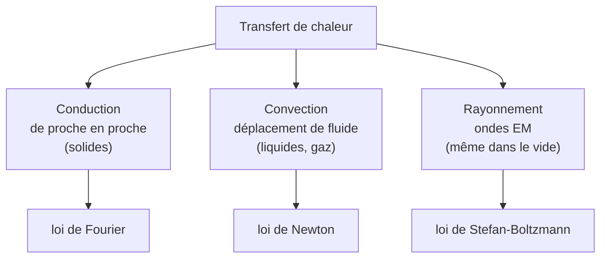

# Transferts Thermiques

Comment la chaleur se propage-t-elle ? Cette note décrit les trois modes de transfert thermique et l'équation de la chaleur (diffusion), qui régit aussi bien le refroidissement d'une pièce que la dissipation dans un processeur. Elle approfondit la [[Thermodynamique]].

## 1. Les trois modes de transfert



| Mode | Support | Loi |
|------|---------|-----|
| **Conduction** | matière (sans déplacement) | Fourier |
| **Convection** | fluide en mouvement | Newton |
| **Rayonnement** | aucun (ondes EM) | Stefan-Boltzmann |

## 2. La conduction et la loi de Fourier

> [!important] Loi de Fourier
> Le flux thermique (puissance) traverse la matière des zones chaudes vers les zones froides, proportionnellement au gradient de température :
> $$\vec{j}_Q = -\lambda\,\vec\nabla T$$
> où $\lambda$ est la **conductivité thermique** (W·m⁻¹·K⁻¹). Le signe « $-$ » : la chaleur va du chaud vers le froid.

| Matériau | $\lambda$ (W·m⁻¹·K⁻¹) |
|----------|----------------------|
| Cuivre | $\approx 400$ |
| Acier | $\approx 50$ |
| Eau | $0{,}6$ |
| Air | $0{,}025$ |
| Laine de verre | $0{,}04$ |

> [!tip] Pourquoi le métal semble plus froid que le bois
> À température ambiante égale, le métal (grand $\lambda$) évacue la chaleur de la main bien plus vite que le bois (petit $\lambda$) : on le perçoit « plus froid » alors qu'ils sont à la même température. Les isolants thermiques (laine, air) ont un $\lambda$ très faible.

## 3. L'équation de la chaleur

> [!important] Équation de diffusion thermique
> En combinant la loi de Fourier et le bilan d'énergie (sans source) :
> $$\frac{\partial T}{\partial t} = D\,\frac{\partial^2 T}{\partial x^2}, \qquad D = \frac{\lambda}{\rho c}$$
> $D$ est la **diffusivité thermique** (m²·s⁻¹). C'est une équation de **diffusion** (et non de propagation comme [[Physique des Ondes|d'Alembert]]) : elle est irréversible et lisse les écarts de température.

> [!important] Échelles caractéristiques de diffusion
> En diffusion, le temps pour parcourir une distance $\ell$ croît comme le **carré** de la distance :
> $$\tau \sim \frac{\ell^2}{D}$$
> Conséquence : la diffusion est efficace à petite échelle mais très lente à grande échelle (d'où l'importance de la convection dans les fluides).

> [!tip] Analogie avec la diffusion de particules (loi de Fick)
> La diffusion thermique a une jumelle : la **diffusion de particules**. Là où Fourier relie le flux de chaleur au gradient de température, la **loi de Fick** relie le flux de particules au gradient de concentration :
> $$\vec{j}_N = -D\,\vec\nabla n$$
> et la concentration obéit à la **même** équation de diffusion $\dfrac{\partial n}{\partial t} = D\,\dfrac{\partial^2 n}{\partial x^2}$. Mêmes mathématiques, mêmes propriétés (irréversibilité, $\tau \sim \ell^2/D$) : c'est pourquoi une goutte d'encre s'étale lentement dans l'eau immobile, comme la chaleur dans une barre.

### Visualisation animée (Manim)

> [!note] Ce que montre l'animation
> Une barre métallique est initialement chaude en son centre et froide aux extrémités. Au fil du temps, le profil de température (initialement pointu) s'**étale et s'aplatit** : la chaleur diffuse vers les zones froides. On *voit* le caractère irréversible et lissant de l'équation de la chaleur — jamais le profil ne se re-concentre spontanément.

```manim
# Rendu : manimgl diffusion.py DiffusionThermique
from manimlib import *


class DiffusionThermique(Scene):
    def construct(self):
        axes = Axes(x_range=(-5, 5), y_range=(0, 3, 1), height=5, width=12)
        labels = axes.get_axis_labels("x", "T")
        self.play(ShowCreation(axes), Write(labels))

        D = 1.0
        t = ValueTracker(0.05)

        # Solution fondamentale de l'équation de la chaleur (gaussienne qui s'étale)
        def profil(x):
            tt = t.get_value()
            return 2.5 / np.sqrt(1 + 4 * D * tt) * np.exp(-x**2 / (1 + 4 * D * tt))

        courbe = always_redraw(lambda: axes.get_graph(profil, color=RED))
        self.add(courbe)

        # Barre colorée illustrant la température
        note = Tex(r"\text{Le profil de température s'étale et s'aplatit}").to_edge(UP).set_backstroke()
        self.add(note)
        self.play(t.animate.set_value(6.0), run_time=7, rate_func=linear)
        self.wait(2)
```

## 4. Convection

> [!important] Loi de Newton du refroidissement
> Entre une paroi à $T_p$ et un fluide à $T_f$, le flux échangé par convection est :
> $$\phi = h\,S\,(T_p - T_f)$$
> $h$ est le **coefficient de convection** (W·m⁻²·K⁻¹), bien plus grand en convection forcée (ventilateur) qu'en convection naturelle.

> [!example] Refroidir un processeur
> Un radiateur augmente la surface $S$, un ventilateur augmente $h$ (convection forcée), et une pâte thermique réduit la résistance de contact : trois leviers de la même loi pour évacuer la chaleur.

## 5. Rayonnement thermique

> [!important] Loi de Stefan-Boltzmann
> Tout corps à température $T$ rayonne une puissance surfacique :
> $$\phi = \varepsilon\,\sigma\,T^4$$
> avec $\sigma = 5{,}67\times10^{-8}$ W·m⁻²·K⁻⁴ et $\varepsilon$ l'émissivité ($\varepsilon = 1$ pour un corps noir). La dépendance en $T^4$ rend le rayonnement dominant à haute température.

> [!important] Loi de Wien
> La longueur d'onde du maximum d'émission décroît avec la température : $\lambda_{\max} T = \text{cste} \approx 2{,}9\times10^{-3}$ m·K. C'est pourquoi un métal chauffé passe du rouge au blanc, et comment on mesure la température des étoiles.

## 6. Exercices types corrigés

### Exercice 1 : flux à travers un mur

**Énoncé** : Un mur de surface $S = 10$ m², d'épaisseur $e = 20$ cm, de conductivité $\lambda = 1{,}0$ W·m⁻¹·K⁻¹, sépare $20$ °C de $5$ °C. Quel est le flux thermique perdu ?

> [!example] Correction
> En régime permanent, le gradient est uniforme :
> $$\phi = \lambda S\frac{\Delta T}{e} = 1{,}0 \times 10 \times \frac{15}{0{,}20} = 750 \text{ W}$$
> D'où l'intérêt d'un isolant (petit $\lambda$) ou d'un mur plus épais.

### Exercice 2 : temps de diffusion

**Énoncé** : La diffusivité de l'acier est $D \approx 1{,}2\times10^{-5}$ m²·s⁻¹. Estimer le temps de diffusion thermique sur $1$ cm.

> [!example] Correction
> $$\tau \sim \frac{\ell^2}{D} = \frac{(10^{-2})^2}{1{,}2\times10^{-5}} = \frac{10^{-4}}{1{,}2\times10^{-5}} \approx 8 \text{ s}$$
> Sur $10$ cm, ce serait $100$ fois plus long ($\sim 14$ min) : la diffusion est très lente à grande échelle.

### Exercice 3 : rayonnement du corps humain

**Énoncé** : Estimer la puissance rayonnée par un corps humain ($S \approx 1{,}8$ m², $T = 307$ K, $\varepsilon \approx 1$), en négligeant le rayonnement reçu.

> [!example] Correction
> $$P = \varepsilon\sigma S T^4 = 1 \times 5{,}67\times10^{-8} \times 1{,}8 \times 307^4 \approx 900 \text{ W}$$
> En réalité, le corps **reçoit** aussi le rayonnement ambiant ($\approx 295$ K) ; le bilan net est de l'ordre de $100$ W.

## 7. À retenir

> [!tip] À retenir
> - Trois modes : **conduction** (Fourier, $\vec j_Q = -\lambda\vec\nabla T$), **convection** (Newton, $\phi = hS\Delta T$), **rayonnement** (Stefan, $\phi = \varepsilon\sigma T^4$).
> - **Équation de la chaleur** : $\partial_t T = D\,\partial_x^2 T$ — diffusion **irréversible** et lissante.
> - Temps de diffusion $\tau \sim \ell^2/D$ : très lent à grande échelle.
> - **Diffusion de particules** (loi de Fick, $\vec j_N = -D\vec\nabla n$) : même équation que la chaleur.
> - Métaux : grand $\lambda$ ; isolants : petit $\lambda$. Rayonnement dominant à haute $T$ (loi en $T^4$, Wien).

*Voir aussi* : [[Thermodynamique]] | [[Physique Statistique]] | [[Physique des Ondes]] | [[Ondes Électromagnétiques]]
