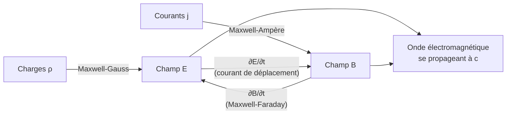

# Équations de Maxwell

Les quatre équations de Maxwell unifient électricité, magnétisme et optique. Elles synthétisent l'[[Électrostatique et Magnétostatique]] et l'[[Induction Électromagnétique]], et prédisent l'existence des [[Ondes Électromagnétiques]]. C'est l'un des plus grands accomplissements de la physique. Prérequis : opérateurs différentiels ([[Fonctions de Plusieurs Variables]]).

## 1. Les opérateurs différentiels

> [!important] Trois opérateurs vectoriels
> - **Gradient** $\vec\nabla f$ : d'un scalaire vers un vecteur (direction de plus forte pente).
> - **Divergence** $\vec\nabla\cdot\vec A$ : d'un vecteur vers un scalaire (mesure les « sources » du champ).
> - **Rotationnel** $\vec\nabla\wedge\vec A$ : d'un vecteur vers un vecteur (mesure le « tourbillon » du champ).

| Opérateur | Théorème intégral associé |
|-----------|---------------------------|
| Divergence | Green-Ostrogradski : $\displaystyle\iiint \vec\nabla\cdot\vec A\,\mathrm dV = \oiint \vec A\cdot\mathrm d\vec S$ |
| Rotationnel | Stokes : $\displaystyle\iint (\vec\nabla\wedge\vec A)\cdot\mathrm d\vec S = \oint \vec A\cdot\mathrm d\vec\ell$ |

## 2. Les quatre équations (dans le vide)

> [!important] Équations de Maxwell
> $$\boxed{\vec\nabla\cdot\vec E = \frac{\rho}{\varepsilon_0}} \quad \text{(Maxwell-Gauss)}$$
> $$\boxed{\vec\nabla\cdot\vec B = 0} \quad \text{(Maxwell-flux)}$$
> $$\boxed{\vec\nabla\wedge\vec E = -\frac{\partial\vec B}{\partial t}} \quad \text{(Maxwell-Faraday)}$$
> $$\boxed{\vec\nabla\wedge\vec B = \mu_0\vec j + \mu_0\varepsilon_0\frac{\partial\vec E}{\partial t}} \quad \text{(Maxwell-Ampère)}$$

### 2.1 Interprétation physique

| Équation | Contenu physique |
|----------|------------------|
| Maxwell-Gauss | les charges sont sources du champ $\vec E$ |
| Maxwell-flux | pas de monopôle magnétique (lignes de $\vec B$ fermées) |
| Maxwell-Faraday | un champ $\vec B$ variable crée un champ $\vec E$ (induction) |
| Maxwell-Ampère | courants **et** champ $\vec E$ variable créent un champ $\vec B$ |



## 3. Le courant de déplacement : le coup de génie de Maxwell

> [!important] Le terme $\mu_0\varepsilon_0\dfrac{\partial\vec E}{\partial t}$
> Maxwell ajouta ce terme (le **courant de déplacement**) au théorème d'Ampère pour assurer la conservation de la charge. Conséquence inattendue : un champ électrique variable crée un champ magnétique, **même sans courant**. Couplé à la loi de Faraday, cela permet à $\vec E$ et $\vec B$ de s'auto-entretenir et de se propager : la lumière est une onde électromagnétique.

## 4. Conservation de la charge

> [!important] Équation de continuité
> Les équations de Maxwell impliquent :
> $$\vec\nabla\cdot\vec j + \frac{\partial\rho}{\partial t} = 0$$
> Traduction locale de la conservation de la charge : ce qui sort d'un volume diminue la charge à l'intérieur.

## 5. Propagation : l'équation d'onde

> [!important] La lumière émerge des équations
> Dans le vide sans charges ni courants, en combinant les équations de Maxwell on obtient l'équation de d'Alembert :
> $$\Delta\vec E = \frac{1}{c^2}\frac{\partial^2\vec E}{\partial t^2}, \qquad c = \frac{1}{\sqrt{\varepsilon_0\mu_0}}$$
> La valeur numérique de $c$ coïncide avec la vitesse de la lumière mesurée : Maxwell en déduisit que **la lumière est une onde électromagnétique**. Étude détaillée dans [[Ondes Électromagnétiques]].

### Visualisation animée (Manim)

> [!note] Ce que montre l'animation
> Une onde électromagnétique plane progressive : le champ électrique $\vec E$ (rouge) oscille dans un plan vertical, le champ magnétique $\vec B$ (bleu) dans un plan horizontal, **perpendiculaires entre eux et à la direction de propagation**. On *voit* qu'ils oscillent en phase et que la structure se propage le long de l'axe — c'est la lumière.

```manim
# Rendu : manimgl onde_em.py OndeElectromagnetique
from manimlib import *


class OndeElectromagnetique(ThreeDScene):
    def construct(self):
        axes = ThreeDAxes(x_range=(0, 8), y_range=(-2, 2), z_range=(-2, 2))
        self.frame.reorient(20, 70)   # orientation de la caméra (azimut, élévation)
        self.add(axes)

        t = ValueTracker(0.0)
        k, w = TAU / 2.0, 1.5

        def champ_E(x):
            return np.sin(k * x - w * t.get_value())

        # Vecteurs E (selon y) et B (selon z) le long de l'axe x
        def make_E():
            arrows = VGroup()
            for x in np.arange(0, 8, 0.4):
                amp = champ_E(x)
                arrows.add(Arrow(axes.c2p(x, 0, 0), axes.c2p(x, amp, 0), buff=0, color=RED))
            return arrows

        def make_B():
            arrows = VGroup()
            for x in np.arange(0, 8, 0.4):
                amp = champ_E(x)
                arrows.add(Arrow(axes.c2p(x, 0, 0), axes.c2p(x, 0, amp), buff=0, color=BLUE))
            return arrows

        E = always_redraw(make_E)
        B = always_redraw(make_B)
        self.add(E, B)

        legende = VGroup(
            Tex(r"\vec{E}", color=RED), Tex(r"\vec{B}", color=BLUE),
        ).arrange(RIGHT, buff=1).fix_in_frame().to_corner(UL)
        self.add(legende)

        self.play(t.animate.set_value(6.0), run_time=8, rate_func=linear)
        self.wait()
```

## 6. Énergie électromagnétique

> [!important] Vecteur de Poynting
> L'énergie transportée par le champ est décrite par le vecteur de Poynting :
> $$\vec\Pi = \frac{\vec E\wedge\vec B}{\mu_0}$$
> Il donne la **puissance surfacique** (W·m⁻²) et la direction de propagation de l'énergie. La densité volumique d'énergie est $u = \dfrac{\varepsilon_0 E^2}{2} + \dfrac{B^2}{2\mu_0}$.

## 7. Exercices types corrigés

### Exercice 1 : cohérence dimensionnelle de $c$

**Énoncé** : Vérifier que $\dfrac{1}{\sqrt{\varepsilon_0\mu_0}}$ a la dimension d'une vitesse et calculer sa valeur.

> [!example] Correction
> Avec $\varepsilon_0 = 8{,}854\times10^{-12}$ F·m⁻¹ et $\mu_0 = 1{,}257\times10^{-6}$ H·m⁻¹ :
> $$c = \frac{1}{\sqrt{8{,}854\times10^{-12} \times 1{,}257\times10^{-6}}} \approx 3{,}00\times10^8 \text{ m·s}^{-1}$$
> C'est exactement la vitesse de la lumière.

### Exercice 2 : absence de monopôle

**Énoncé** : Que traduit physiquement $\vec\nabla\cdot\vec B = 0$ ?

> [!example] Correction
> Le flux de $\vec B$ à travers toute surface fermée est nul : il n'existe pas de « charge magnétique » isolée (monopôle). Les lignes de champ magnétique sont toujours **fermées** — un aimant coupé en deux donne deux aimants complets, jamais un pôle Nord seul.

### Exercice 3 : courant de déplacement dans un condensateur

**Énoncé** : Pourquoi le théorème d'Ampère sans le courant de déplacement serait-il contradictoire pour un condensateur en charge ?

> [!example] Correction
> Entre les armatures d'un condensateur, aucun courant de conduction ne circule, pourtant un champ magnétique y existe (continuité avec les fils). Le terme $\mu_0\varepsilon_0\dfrac{\partial\vec E}{\partial t}$ (champ $\vec E$ croissant pendant la charge) joue le rôle d'un courant : il « ferme » le circuit et lève la contradiction.

## 8. À retenir

> [!tip] À retenir
> - **Maxwell-Gauss** : $\vec\nabla\cdot\vec E = \rho/\varepsilon_0$ (charges sources de $\vec E$).
> - **Maxwell-flux** : $\vec\nabla\cdot\vec B = 0$ (pas de monopôle).
> - **Maxwell-Faraday** : $\vec\nabla\wedge\vec E = -\partial_t\vec B$ (induction).
> - **Maxwell-Ampère** : $\vec\nabla\wedge\vec B = \mu_0\vec j + \mu_0\varepsilon_0\partial_t\vec E$ (courant + déplacement).
> - Conséquences : conservation de la charge, et **propagation d'ondes à $c = 1/\sqrt{\varepsilon_0\mu_0}$** → la lumière est électromagnétique.

*Voir aussi* : [[Ondes Électromagnétiques]] | [[Électrostatique et Magnétostatique]] | [[Induction Électromagnétique]] | [[Fonctions de Plusieurs Variables]]
