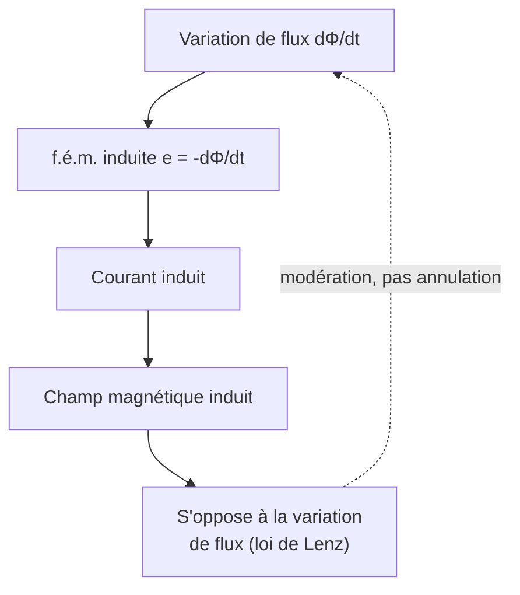

# Induction Électromagnétique

L'induction relie le magnétisme à l'électricité : un champ magnétique **variable** engendre un courant. C'est le principe des générateurs, transformateurs et plaques à induction. Elle fait le pont entre la [[Électrostatique et Magnétostatique|magnétostatique]] et les [[Équations de Maxwell]].

## 1. Flux magnétique

> [!important] Flux du champ magnétique
> À travers une surface $S$ orientée :
> $$\Phi = \iint_S \vec{B}\cdot\mathrm{d}\vec{S} \qquad (\text{en webers, Wb})$$
> Pour un champ uniforme et une surface plane : $\Phi = B S \cos\alpha$, où $\alpha$ est l'angle entre $\vec B$ et la normale.

> [!tip] Trois façons de faire varier le flux
> 1. Varier l'**intensité** de $\vec B$ (aimant qui approche, courant variable).
> 2. Varier la **surface** du circuit (circuit déformable).
> 3. Varier l'**orientation** (rotation d'une spire — principe de l'alternateur).

## 2. Loi de Faraday

> [!important] Loi de Faraday
> La variation de flux à travers un circuit induit une force électromotrice (f.é.m.) :
> $$e = -\frac{\mathrm{d}\Phi}{\mathrm{d}t}$$
> Cette f.é.m. fait circuler un courant induit dans le circuit.

> [!important] Loi de Lenz
> Le signe « $-$ » traduit la loi de Lenz : **le courant induit s'oppose, par ses effets, à la cause qui lui donne naissance**. C'est une manifestation de la conservation de l'énergie.

> [!example] Aimant approchant d'une bobine
> En approchant le pôle Nord d'un aimant d'une bobine, le flux augmente. Le courant induit crée un pôle Nord face à l'aimant pour le **repousser** (s'opposer à l'approche). En l'éloignant, il l'attire. On ressent physiquement cette force en déplaçant un aimant près d'un anneau conducteur.

## 3. Auto-induction

> [!important] Inductance propre
> Un circuit parcouru par un courant $i$ crée son propre flux $\Phi = L i$, où $L$ est l'**inductance propre** (en henrys, H). Toute variation de $i$ induit une f.é.m. d'auto-induction :
> $$e = -L\frac{\mathrm{d}i}{\mathrm{d}t}$$
> C'est ce qui explique la continuité du courant dans une bobine (voir [[Électrocinétique]]) et l'étincelle de rupture quand on coupe un circuit inductif.

## 4. Conversion électromécanique

> [!important] Le couplage électromécanique
> L'induction (Faraday-Lenz) et la force de Laplace ($\vec F = I\,\mathrm d\vec\ell\wedge\vec B$) forment un couple réciproque qui convertit l'énergie entre formes mécanique et électrique.

| Dispositif | Conversion | Phénomène moteur |
|------------|------------|------------------|
| **Alternateur / dynamo** | mécanique → électrique | induction (Faraday) |
| **Moteur électrique** | électrique → mécanique | force de Laplace |
| **Transformateur** | électrique → électrique | induction mutuelle |
| **Freinage par courants de Foucault** | mécanique → chaleur | courants induits |

> [!example] Rail de Laplace (cas d'école)
> Une barre conductrice glisse sur deux rails dans un champ $\vec B$ vertical. Son mouvement fait varier la surface du circuit, donc le flux : une f.é.m. apparaît, un courant circule, et la force de Laplace qui en résulte **freine** la barre (Lenz). L'énergie cinétique se dissipe par effet Joule. C'est le modèle de tous les freins à induction.

## 5. Applications

- **Production d'électricité** : centrales (hydraulique, thermique, nucléaire) — une turbine entraîne un alternateur.
- **Transformateurs** : élèvent/abaissent la tension pour le transport (induction mutuelle entre deux bobinages).
- **Plaques à induction** : courants de Foucault chauffant directement le récipient.
- **Cartes sans contact, recharge sans fil** : couplage inductif.

## 6. Exercices types corrigés

### Exercice 1 : f.é.m. d'une spire en rotation

**Énoncé** : Une spire plane de surface $S$ tourne à la vitesse angulaire $\omega$ dans un champ uniforme $\vec B$. Donner l'expression de la f.é.m. induite.

> [!example] Correction
> Le flux est $\Phi = BS\cos(\omega t)$. La f.é.m. :
> $$e = -\frac{\mathrm{d}\Phi}{\mathrm{d}t} = BS\omega\sin(\omega t)$$
> C'est une tension **sinusoïdale** : principe de l'alternateur (courant alternatif).

### Exercice 2 : loi de Lenz qualitative

**Énoncé** : On laisse tomber un aimant dans un tube de cuivre vertical. Pourquoi tombe-t-il beaucoup plus lentement que dans un tube en plastique ?

> [!example] Correction
> La chute de l'aimant fait varier le flux à travers chaque section du tube de cuivre (conducteur). Des courants de Foucault s'y développent et créent, par la loi de Lenz, une force qui **s'oppose au mouvement** (freinage magnétique). Dans le plastique (isolant), aucun courant ne circule : l'aimant tombe en chute libre.

### Exercice 3 : énergie d'une bobine

**Énoncé** : Une bobine de $L = 0{,}5$ H est parcourue par $i = 2$ A. Quelle énergie magnétique stocke-t-elle ?

> [!example] Correction
> $$E = \tfrac{1}{2}Li^2 = \tfrac{1}{2} \times 0{,}5 \times 2^2 = 1{,}0 \text{ J}$$
> Cette énergie est restituée (étincelle) si l'on coupe brusquement le circuit.

## 7. À retenir

> [!tip] À retenir
> - **Flux** : $\Phi = \iint\vec B\cdot\mathrm d\vec S$ ; varie par $B$, surface ou orientation.
> - **Faraday** : $e = -\dfrac{\mathrm d\Phi}{\mathrm dt}$. **Lenz** : le courant induit s'oppose à la cause qui le crée (conservation de l'énergie).
> - **Auto-induction** : $\Phi = Li$, $e = -L\dfrac{\mathrm di}{\mathrm dt}$ ; énergie $\tfrac12 Li^2$.
> - Induction + force de Laplace = **conversion électromécanique** (alternateurs, moteurs, transformateurs, freins de Foucault).

*Voir aussi* : [[Électrostatique et Magnétostatique]] | [[Électrocinétique]] | [[Équations de Maxwell]] | [[Oscillateurs]]
