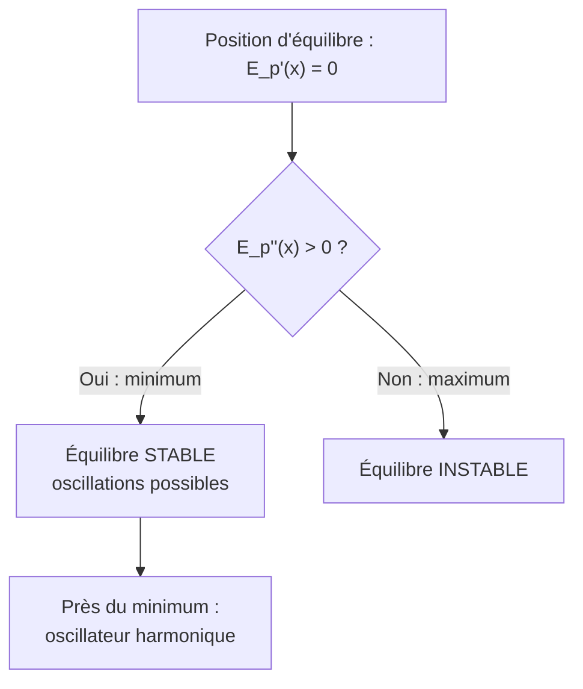

# Mécanique du Point

En prépa, la mécanique du point reprend les [[Lois de Newton]] avec un formalisme **vectoriel** rigoureux : systèmes de coordonnées, théorèmes généraux (quantité de mouvement, énergie, moment cinétique), et applications aux forces centrales. Les prérequis mathématiques sont la [[Dérivation]] vectorielle et les [[Équations Différentielles]].

## 1. Cinématique vectorielle

### 1.1 Systèmes de coordonnées

> [!important] Trois repères usuels
> Selon la symétrie du problème, on choisit :
> - **Cartésiennes** $(x, y, z)$ : $\vec{v} = \dot{x}\,\vec{e_x} + \dot{y}\,\vec{e_y} + \dot{z}\,\vec{e_z}$.
> - **Cylindriques** $(r, \theta, z)$ : adaptées aux rotations.
> - **Sphériques** $(r, \theta, \varphi)$ : adaptées aux forces centrales.

> [!important] Coordonnées polaires (plan)
> Avec la base mobile $(\vec{e_r}, \vec{e_\theta})$ :
> $$\vec{v} = \dot{r}\,\vec{e_r} + r\dot{\theta}\,\vec{e_\theta}$$
> $$\vec{a} = (\ddot{r} - r\dot{\theta}^2)\,\vec{e_r} + (r\ddot{\theta} + 2\dot{r}\dot{\theta})\,\vec{e_\theta}$$
> Le terme $-r\dot\theta^2$ est l'accélération **centripète**, le terme $2\dot r\dot\theta$ est l'accélération de **Coriolis**.

### 1.2 Base de Frenet

Le long de la trajectoire, avec $\vec{T}$ tangent et $\vec{N}$ normal (vers le centre de courbure) :
$$\vec{a} = \dot{v}\,\vec{T} + \frac{v^2}{R}\,\vec{N}$$
où $R$ est le rayon de courbure. La composante tangentielle change la **norme** de la vitesse, la composante normale change sa **direction**.

## 2. Théorèmes généraux

### 2.1 Quantité de mouvement

> [!important] Théorème de la quantité de mouvement (référentiel galiléen)
> $$\frac{\mathrm{d}\vec{p}}{\mathrm{d}t} = \sum \vec{F}_{\text{ext}}, \qquad \vec{p} = m\vec{v}$$
> Si $\sum\vec{F}_{\text{ext}} = \vec{0}$, $\vec{p}$ se **conserve** (utile pour les chocs).

### 2.2 Moment cinétique

> [!important] Théorème du moment cinétique (TMC)
> Par rapport à un point fixe $O$ :
> $$\frac{\mathrm{d}\vec{L}_O}{\mathrm{d}t} = \vec{\mathcal{M}}_O(\vec{F}), \qquad \vec{L}_O = \vec{OM}\wedge m\vec{v}$$
> Si le moment des forces est nul (force centrale), $\vec{L}_O$ se conserve : le mouvement est **plan** et la **loi des aires** s'applique.

### 2.3 Énergie

> [!important] Théorème de l'énergie cinétique et énergie mécanique
> $$\frac{\mathrm{d}E_c}{\mathrm{d}t} = \mathcal{P}(\vec{F}) = \vec{F}\cdot\vec{v}$$
> Pour une force conservative, $\vec{F} = -\vec{\nabla}E_p$. L'énergie mécanique $E_m = E_c + E_p$ se conserve si toutes les forces non conservatives ne travaillent pas.

## 3. Étude par l'énergie potentielle

> [!important] Lecture d'un profil $E_p(x)$
> Pour un mouvement à un degré de liberté avec $E_m$ fixée :
> - Le mouvement est possible là où $E_p(x) \leq E_m$ (puisque $E_c = E_m - E_p \geq 0$).
> - Les **positions d'équilibre** annulent $E_p'(x)$. Stable si $E_p''(x) > 0$ (minimum), instable si maximum.
> - Un **puits de potentiel** confine un état lié.



### Visualisation animée (Manim)

> [!note] Ce que montre l'animation
> Le **portrait de phase** d'un pendule : on trace la vitesse angulaire $\dot\theta$ en fonction de l'angle $\theta$. Pour de petites énergies, les trajectoires sont des **courbes fermées** (oscillations autour de l'équilibre stable) ; au-delà d'une énergie critique (la séparatrice), elles deviennent ouvertes (le pendule **tourne** sans s'arrêter). On *voit* géométriquement la distinction entre états liés et états de circulation.

```manim
# Rendu : manimgl portrait_phase.py PortraitDePhase
from manimlib import *


class PortraitDePhase(Scene):
    def construct(self):
        # Pendule : theta'' = -sin(theta) (unités réduites)
        axes = Axes(x_range=(-PI, PI, PI / 2), y_range=(-3, 3), height=6, width=11)
        labels = axes.get_axis_labels(r"\theta", r"\dot{\theta}")
        self.play(ShowCreation(axes), Write(labels))

        # Énergie conservée : E = (1/2) thetadot^2 - cos(theta)
        # On dessine plusieurs courbes de niveau E = cste
        def courbe_niveau(E, color):
            pts = []
            for th in np.linspace(-PI, PI, 400):
                val = 2 * (E + np.cos(th))
                if val >= 0:
                    pts.append(axes.c2p(th, np.sqrt(val)))
            neg = [axes.c2p(th, -np.sqrt(2 * (E + np.cos(th))))
                   for th in np.linspace(PI, -PI, 400) if 2 * (E + np.cos(th)) >= 0]
            if len(pts) < 2:
                return VGroup()
            return VMobject().set_points_smoothly(pts + neg).set_color(color)

        oscillations = VGroup(*[courbe_niveau(E, BLUE) for E in (-0.8, -0.4, 0.0)])
        separatrice = courbe_niveau(0.999, YELLOW)        # E = 1 : séparatrice
        circulations = VGroup(*[courbe_niveau(E, RED) for E in (1.5, 2.2)])

        self.play(ShowCreation(oscillations), run_time=3)
        self.play(ShowCreation(separatrice))
        self.play(ShowCreation(circulations), run_time=3)

        legende = VGroup(
            Tex(r"\text{bleu : oscillations (lié)}", color=BLUE),
            Tex(r"\text{jaune : séparatrice}", color=YELLOW),
            Tex(r"\text{rouge : circulation}", color=RED),
        ).arrange(DOWN, aligned_edge=LEFT).scale(0.7).to_corner(UR).set_backstroke()
        self.play(Write(legende))
        self.wait(2)
```

## 4. Forces centrales et gravitation

> [!important] Champ de force centrale newtonien
> Pour la gravitation, $\vec{F} = -\dfrac{GMm}{r^2}\vec{e_r}$ dérive de $E_p = -\dfrac{GMm}{r}$. Le moment cinétique se conserve : trajectoire **plane**, loi des aires (2e loi de Kepler).

> [!important] Lois de Kepler
> 1. Les planètes décrivent des **ellipses** dont le Soleil occupe un foyer.
> 2. Le rayon vecteur balaie des **aires égales en temps égaux** (conséquence de la conservation de $\vec{L}$).
> 3. $\dfrac{T^2}{a^3} = \dfrac{4\pi^2}{GM}$ (même rapport pour tous les corps en orbite autour de $M$).

> [!example] Vitesse de libération
> Pour échapper à l'attraction d'un astre de masse $M$ et rayon $R$, il faut $E_m \geq 0$ :
> $$\tfrac{1}{2}mv_{\text{lib}}^2 - \frac{GMm}{R} = 0 \implies v_{\text{lib}} = \sqrt{\frac{2GM}{R}}$$
> Pour la Terre : $v_{\text{lib}} \approx 11{,}2$ km·s⁻¹.

## 5. Exercices types corrigés

### Exercice 1 : satellite en orbite circulaire

**Énoncé** : Un satellite décrit une orbite circulaire de rayon $r$ autour de la Terre (masse $M$). Exprimer sa vitesse et sa période.

> [!example] Correction
> Le PFD en projection sur $\vec{e_r}$ (accélération centripète $v^2/r$) :
> $$\frac{GMm}{r^2} = \frac{mv^2}{r} \implies v = \sqrt{\frac{GM}{r}}$$
> Période : $T = \dfrac{2\pi r}{v} = 2\pi\sqrt{\dfrac{r^3}{GM}}$ — on retrouve la 3e loi de Kepler.

### Exercice 2 : conservation du moment cinétique

**Énoncé** : Une comète passe au plus près du Soleil (périhélie) à la distance $r_p$ avec la vitesse $v_p$, et au plus loin (aphélie) à $r_a$. Trouver $v_a$.

> [!example] Correction
> Au périhélie et à l'aphélie, $\vec{v} \perp \vec{r}$, donc $L = m r v$ se conserve :
> $$r_p v_p = r_a v_a \implies v_a = \frac{r_p}{r_a}\,v_p$$
> La comète va plus vite près du Soleil : c'est la loi des aires.

### Exercice 3 : puits de potentiel

**Énoncé** : Une particule évolue dans le potentiel $E_p(x) = \dfrac{a}{x^2} - \dfrac{b}{x}$ ($a, b > 0$, $x > 0$). Trouver la position d'équilibre et sa nature.

> [!example] Correction
> $$E_p'(x) = -\frac{2a}{x^3} + \frac{b}{x^2} = 0 \implies x_{\text{eq}} = \frac{2a}{b}$$
> $$E_p''(x) = \frac{6a}{x^4} - \frac{2b}{x^3}$$
> En $x_{\text{eq}} = 2a/b$ : $E_p''(x_{\text{eq}}) = \dfrac{b^4}{8a^3} > 0$, c'est un **minimum** : équilibre **stable**. La particule peut osciller autour.

## 6. À retenir

> [!tip] À retenir
> - En **polaires** : $\vec{v} = \dot r\,\vec{e_r} + r\dot\theta\,\vec{e_\theta}$ ; accélération avec termes centripète et de Coriolis.
> - **Trois théorèmes** : quantité de mouvement, moment cinétique (TMC), énergie. Chacun fournit une intégrale première utile.
> - **Force centrale** : $\vec{L}_O$ conservé → mouvement plan + loi des aires.
> - **Profil $E_p(x)$** : équilibre stable au minimum ($E_p'' > 0$) ; états liés dans les puits.
> - **Kepler** : ellipses, aires égales, $T^2/a^3 = 4\pi^2/GM$. Vitesse de libération $v_{\text{lib}} = \sqrt{2GM/R}$.

*Voir aussi* : [[Lois de Newton]] | [[Oscillateurs]] | [[Référentiels Non Galiléens]] | [[Équations Différentielles]] | [[Astrophysique et Cosmologie]]
