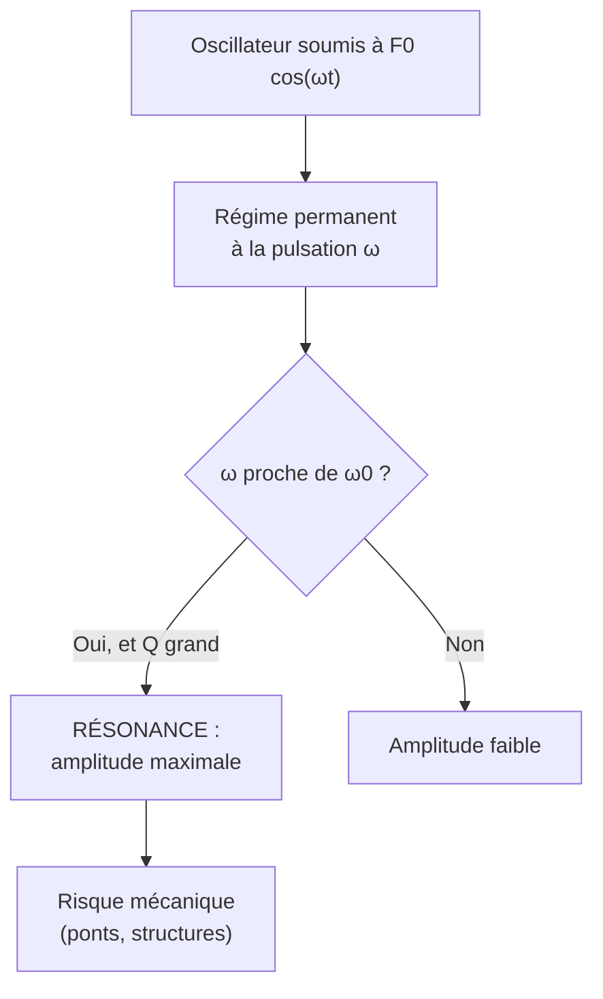

# Oscillateurs

L'oscillateur harmonique est le modèle le plus universel de la physique : tout système proche d'un équilibre stable oscille (mécanique, électrique, optique). Maîtriser ses régimes (libre, amorti, forcé) et la résonance est central en prépa. Outil mathématique clé : les [[Équations Différentielles]] linéaires du 2nd ordre.

## 1. L'oscillateur harmonique

### 1.1 Équation et solution

> [!important] Oscillateur harmonique non amorti
> Tout système ramené vers un équilibre par une force de rappel proportionnelle à l'écart obéit à :
> $$\ddot{x} + \omega_0^2\,x = 0$$
> de solution $x(t) = A\cos(\omega_0 t + \varphi)$, où $\omega_0$ est la **pulsation propre**.

| Système | Pulsation propre $\omega_0$ |
|---------|-----------------------------|
| Masse-ressort | $\sqrt{\dfrac{k}{m}}$ |
| Pendule simple (petits angles) | $\sqrt{\dfrac{g}{\ell}}$ |
| Circuit LC | $\dfrac{1}{\sqrt{LC}}$ |

Période propre : $T_0 = \dfrac{2\pi}{\omega_0}$, indépendante de l'amplitude (**isochronisme**).

### 1.2 Aspect énergétique

> [!important] Échange permanent $E_c \leftrightarrow E_p$
> Pour le ressort, $E_m = \tfrac{1}{2}m\dot x^2 + \tfrac{1}{2}kx^2 = \tfrac{1}{2}kA^2 = \text{cste}$. L'énergie oscille entre formes cinétique et potentielle à la pulsation $2\omega_0$.

## 2. L'oscillateur amorti

> [!important] Équation de l'oscillateur amorti
> En présence d'un frottement fluide ($-\lambda\dot x$) :
> $$\ddot{x} + \frac{\omega_0}{Q}\,\dot{x} + \omega_0^2\,x = 0$$
> où $Q$ est le **facteur de qualité** (sans dimension). Le comportement dépend de $Q$ (ou du discriminant).

| Régime | Condition | Comportement |
|--------|-----------|--------------|
| **Apériodique** | $Q < \tfrac{1}{2}$ | retour lent sans oscillation |
| **Critique** | $Q = \tfrac{1}{2}$ | retour le plus rapide sans oscillation |
| **Pseudo-périodique** | $Q > \tfrac{1}{2}$ | oscillations d'amplitude décroissante |

> [!tip] Interprétation de $Q$
> En régime pseudo-périodique, $Q \approx \pi \times \dfrac{\text{nombre d'oscillations}}{\text{avant amortissement notable}}$. Un $Q$ élevé signifie peu de pertes (cloche, circuit RLC de qualité).

### Visualisation animée (Manim)

> [!note] Ce que montre l'animation
> Trois oscillateurs partent de la même position initiale avec des amortissements croissants. On voit le régime **pseudo-périodique** (oscillations qui décroissent, enveloppe exponentielle en pointillés), le régime **critique** (retour le plus rapide sans dépassement) et le régime **apériodique** (retour lent). On *voit* pourquoi l'amortissement critique est recherché en ingénierie (suspensions, instruments de mesure).

```manim
# Rendu : manimgl amorti.py RegimesAmortissement
from manimlib import *


class RegimesAmortissement(Scene):
    def construct(self):
        axes = Axes(x_range=(0, 12, 2), y_range=(-1.2, 1.2), height=5.5, width=12)
        labels = axes.get_axis_labels("t", "x")
        self.play(ShowCreation(axes), Write(labels))

        w0 = 2.0
        # Pseudo-périodique : Q > 1/2
        lam_p = 0.3
        wd = np.sqrt(w0**2 - lam_p**2)
        pseudo = axes.get_graph(
            lambda t: np.exp(-lam_p * t) * np.cos(wd * t), color=BLUE)
        env_haut = axes.get_graph(lambda t: np.exp(-lam_p * t), color=BLUE_E).set_stroke(width=2)
        env_bas = axes.get_graph(lambda t: -np.exp(-lam_p * t), color=BLUE_E).set_stroke(width=2)
        # Critique : Q = 1/2 -> (1 + w0 t) e^{-w0 t}
        critique = axes.get_graph(
            lambda t: (1 + w0 * t) * np.exp(-w0 * t), color=GREEN)
        # Apériodique : Q < 1/2, deux exponentielles
        r1, r2 = -0.6, -6.0
        c1 = r2 / (r2 - r1)
        c2 = -r1 / (r2 - r1)
        aperiodique = axes.get_graph(
            lambda t: c1 * np.exp(r1 * t) + c2 * np.exp(r2 * t), color=RED)

        legende = VGroup(
            Tex(r"\text{pseudo-périodique } (Q>1/2)", color=BLUE),
            Tex(r"\text{critique } (Q=1/2)", color=GREEN),
            Tex(r"\text{apériodique } (Q<1/2)", color=RED),
        ).arrange(DOWN, aligned_edge=LEFT).scale(0.65).to_corner(UR).set_backstroke()

        self.play(ShowCreation(pseudo), ShowCreation(env_haut), ShowCreation(env_bas), run_time=2)
        self.play(ShowCreation(critique), run_time=1.5)
        self.play(ShowCreation(aperiodique), run_time=1.5)
        self.play(Write(legende))
        self.wait(2)
```

## 3. L'oscillateur forcé et la résonance

> [!important] Régime sinusoïdal forcé
> Soumis à une excitation $F_0\cos(\omega t)$, l'oscillateur atteint un régime permanent à la **pulsation d'excitation** $\omega$ (pas $\omega_0$) :
> $$\ddot{x} + \frac{\omega_0}{Q}\dot{x} + \omega_0^2 x = \frac{F_0}{m}\cos(\omega t)$$
> L'amplitude de la réponse dépend de $\omega$ : c'est le phénomène de **résonance**.

> [!important] Résonance en amplitude
> L'amplitude est maximale pour une pulsation proche de $\omega_0$ (résonance), d'autant plus piquée et haute que $Q$ est grand. Pour $Q \leq \tfrac{1}{\sqrt 2}$, il n'y a plus de résonance en amplitude.



> [!warning] La résonance peut être destructrice
> Une excitation proche de $\omega_0$ sur un système peu amorti conduit à des amplitudes énormes : c'est pourquoi les soldats rompent le pas sur un pont, et pourquoi les structures sont conçues pour éviter les résonances.

## 4. Analogie électromécanique

> [!important] Le même modèle partout
> Le circuit RLC série obéit à la même équation que la masse-ressort amortie.

| Mécanique | Électrique (RLC) |
|-----------|------------------|
| masse $m$ | inductance $L$ |
| raideur $k$ | inverse capacité $1/C$ |
| amortissement $\lambda$ | résistance $R$ |
| position $x$ | charge $q$ |
| force $F$ | tension $e$ |

Voir [[Électrocinétique]] pour le traitement par les impédances complexes.

## 5. Exercices types corrigés

### Exercice 1 : pendule et longueur

**Énoncé** : Un pendule simple a une période $T_0 = 2{,}0$ s. Quelle est sa longueur ? ($g = 9{,}81$ m·s⁻²)

> [!example] Correction
> $$T_0 = 2\pi\sqrt{\frac{\ell}{g}} \implies \ell = g\left(\frac{T_0}{2\pi}\right)^2 = 9{,}81 \times \left(\frac{2{,}0}{2\pi}\right)^2 \approx 0{,}99 \text{ m}$$

### Exercice 2 : facteur de qualité

**Énoncé** : Un oscillateur de pulsation propre $\omega_0 = 100$ rad·s⁻¹ perd son amplitude d'un facteur $e$ en $0{,}5$ s. Estimer $Q$.

> [!example] Correction
> L'enveloppe est $e^{-\lambda t}$ avec $\lambda = \dfrac{\omega_0}{2Q}$. L'amplitude divise par $e$ quand $\lambda t = 1$, soit $\lambda = 2$ s⁻¹.
> $$Q = \frac{\omega_0}{2\lambda} = \frac{100}{2 \times 2} = 25$$

### Exercice 3 : régime forcé

**Énoncé** : Pourquoi, en poussant une balançoire, faut-il pousser au rythme de ses oscillations naturelles ?

> [!example] Correction
> La balançoire est un oscillateur de pulsation propre $\omega_0$. En la poussant à $\omega \approx \omega_0$, on est à la résonance : chaque poussée arrive en phase avec le mouvement et l'amplitude croît fortement. Pousser à contretemps fournirait un travail négatif et freinerait.

## 6. À retenir

> [!tip] À retenir
> - **Harmonique** : $\ddot x + \omega_0^2 x = 0$, $x = A\cos(\omega_0 t + \varphi)$, période indépendante de l'amplitude.
> - **Amorti** : trois régimes selon $Q$ — apériodique ($Q<\tfrac12$), critique ($Q=\tfrac12$, retour le plus rapide), pseudo-périodique ($Q>\tfrac12$).
> - **Forcé** : réponse à la pulsation d'excitation $\omega$ ; **résonance** près de $\omega_0$, d'autant plus marquée que $Q$ est grand.
> - **Analogie** masse-ressort ↔ circuit RLC : même équation.
> - L'oscillateur harmonique modélise **tout** équilibre stable au premier ordre.

*Voir aussi* : [[Mécanique du Point]] | [[Électrocinétique]] | [[Équations Différentielles]] | [[Physique des Ondes]]
