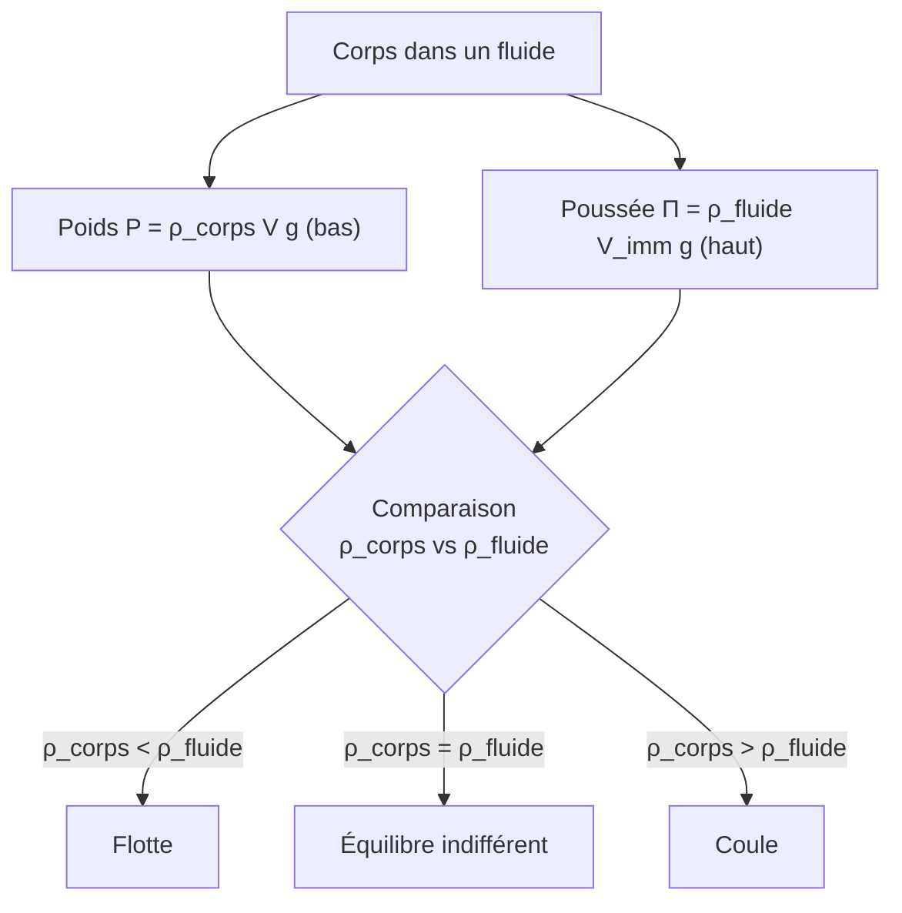

# Statique des Fluides

La statique des fluides étudie les fluides **au repos** : répartition de la pression, forces sur les parois, poussée d'Archimède. Elle explique pourquoi un bateau flotte, comment fonctionne un baromètre, et la pression au fond des océans.

## 1. La pression

> [!important] Pression dans un fluide
> La pression $P$ est le rapport de la force pressante à la surface sur laquelle elle s'exerce :
> $$P = \frac{F}{S} \qquad (\text{en pascals, Pa})$$
> Dans un fluide au repos, la pression en un point est **isotrope** (identique dans toutes les directions) et la force de pression sur une paroi lui est **perpendiculaire**.

| Unité | Équivalence |
|-------|-------------|
| pascal (Pa) | $1$ N·m⁻² |
| bar | $10^5$ Pa |
| atmosphère (atm) | $1{,}013 \times 10^5$ Pa |

## 2. Relation fondamentale de l'hydrostatique

> [!important] Loi de l'hydrostatique
> Dans un fluide incompressible au repos dans le champ de pesanteur, la pression varie avec l'altitude $z$ (orienté vers le haut) :
> $$\frac{\mathrm{d}P}{\mathrm{d}z} = -\rho g \quad \Longrightarrow \quad P_2 - P_1 = \rho g\,(z_1 - z_2)$$
> La pression **augmente avec la profondeur** : tous les points d'une même horizontale sont à la même pression.

> [!example] Pression au fond d'une piscine
> À $3$ m de profondeur dans l'eau ($\rho = 1000$ kg·m⁻³), la surpression par rapport à l'atmosphère :
> $$\Delta P = \rho g h = 1000 \times 9{,}81 \times 3 \approx 2{,}9 \times 10^4 \text{ Pa} \approx 0{,}29 \text{ bar}$$
> Pression totale : $\approx 1{,}3 \times 10^5$ Pa.

> [!warning] Cas des gaz
> Pour un gaz (compressible), $\rho$ dépend de $P$ : la pression atmosphérique décroît **exponentiellement** avec l'altitude, pas linéairement.

## 3. Théorème de Pascal

> [!important] Transmission de la pression
> Dans un fluide incompressible, **toute variation de pression se transmet intégralement** en tout point du fluide. C'est le principe de la presse hydraulique et des freins de voiture.

> [!example] Presse hydraulique
> Deux pistons de surfaces $S_1$ et $S_2$ ($S_2 > S_1$) reliés par un fluide. La même pression donne :
> $$\frac{F_1}{S_1} = \frac{F_2}{S_2} \implies F_2 = F_1 \frac{S_2}{S_1}$$
> Une petite force sur le petit piston produit une grande force sur le grand : **amplification de force**.

## 4. Poussée d'Archimède

> [!important] Théorème d'Archimède
> Tout corps immergé (totalement ou partiellement) subit une force verticale, dirigée vers le haut, égale au **poids du fluide déplacé** :
> $$\vec{\Pi} = -\rho_{\text{fluide}}\,V_{\text{immergé}}\,\vec{g}$$
> de norme $\Pi = \rho_{\text{fluide}}\,V_{\text{immergé}}\,g$.

> [!tip] Pourquoi un bateau en acier flotte
> L'acier est plus dense que l'eau, mais la **coque** englobe un grand volume d'air : la masse volumique **moyenne** du bateau (acier + air) est inférieure à celle de l'eau. Le volume d'eau déplacé suffit à équilibrer le poids total.

## 5. Ouverture : dynamique des fluides

Lorsque le fluide est **en mouvement**, la statique ne suffit plus. Pour un fluide parfait (sans viscosité), incompressible et en écoulement permanent, le bilan d'énergie le long d'une ligne de courant donne le **théorème de Bernoulli**.

> [!important] Théorème de Bernoulli
> $$P + \frac{1}{2}\rho v^2 + \rho g z = \text{constante (le long d'une ligne de courant)}$$
> Les trois termes représentent la pression, l'énergie cinétique volumique et l'énergie potentielle volumique. Là où la vitesse augmente, la pression diminue.

> [!example] L'effet Venturi et la portance
> Dans un rétrécissement de conduite, le fluide accélère (conservation du débit) donc sa pression chute : c'est l'**effet Venturi**, exploité par les trompes à eau et les carburateurs. Le même principe explique la **portance d'une aile** : l'air va plus vite au-dessus qu'en dessous, créant une dépression vers le haut. L'étude détaillée des fluides visqueux et de la turbulence relève de la mécanique des fluides de 2e année.

## 6. Exercices types corrigés

### Exercice 1 : baromètre de Torricelli

**Énoncé** : Un tube rempli de mercure ($\rho = 13\,600$ kg·m⁻³) est retourné dans une cuve. À quelle hauteur le mercure se stabilise-t-il sous la pression atmosphérique $P_0 = 1{,}013 \times 10^5$ Pa ?

> [!example] Correction
> La colonne de mercure équilibre la pression atmosphérique : $P_0 = \rho g h$.
> $$h = \frac{P_0}{\rho g} = \frac{1{,}013 \times 10^5}{13\,600 \times 9{,}81} \approx 0{,}76 \text{ m} = 760 \text{ mm}$$
> C'est l'origine de l'unité « mmHg ».

### Exercice 2 : fraction immergée d'un glaçon

**Énoncé** : Un glaçon ($\rho_{\text{glace}} = 917$ kg·m⁻³) flotte sur l'eau ($\rho_{\text{eau}} = 1000$ kg·m⁻³). Quelle fraction de son volume est immergée ?

> [!example] Correction
> À l'équilibre, poids = poussée : $\rho_{\text{glace}} V g = \rho_{\text{eau}} V_{\text{imm}} g$.
> $$\frac{V_{\text{imm}}}{V} = \frac{\rho_{\text{glace}}}{\rho_{\text{eau}}} = \frac{917}{1000} = 0{,}917$$
> Environ $92\%$ du glaçon est sous l'eau : la « partie émergée de l'iceberg » est bien petite.

### Exercice 3 : presse hydraulique

**Énoncé** : Une presse a des pistons de diamètres $5$ cm et $40$ cm. Quelle force obtient-on sur le grand piston en appuyant avec $200$ N sur le petit ?

> [!example] Correction
> Le rapport des surfaces est celui des carrés des diamètres :
> $$F_2 = F_1 \frac{S_2}{S_1} = F_1\left(\frac{d_2}{d_1}\right)^2 = 200 \times \left(\frac{40}{5}\right)^2 = 200 \times 64 = 12\,800 \text{ N}$$

## 7. À retenir

> [!tip] À retenir
> - **Pression** $P = F/S$ ; isotrope, force perpendiculaire à la paroi.
> - **Hydrostatique** : $P$ augmente avec la profondeur, $\Delta P = \rho g h$ (fluide incompressible).
> - **Pascal** : une variation de pression se transmet intégralement (presse hydraulique).
> - **Archimède** : poussée $\Pi = \rho_{\text{fluide}} V_{\text{imm}} g$ vers le haut. Flotte si $\rho_{\text{corps}} < \rho_{\text{fluide}}$.
> - **Bernoulli** (fluide en mouvement) : $P + \tfrac12\rho v^2 + \rho g z = \text{cste}$ ; vitesse ↑ ⟹ pression ↓ (Venturi, portance).

*Voir aussi* : [[Énergie et Travail]] | [[Lois de Newton]] | [[Constantes et Unités]] | [[Thermodynamique]]
