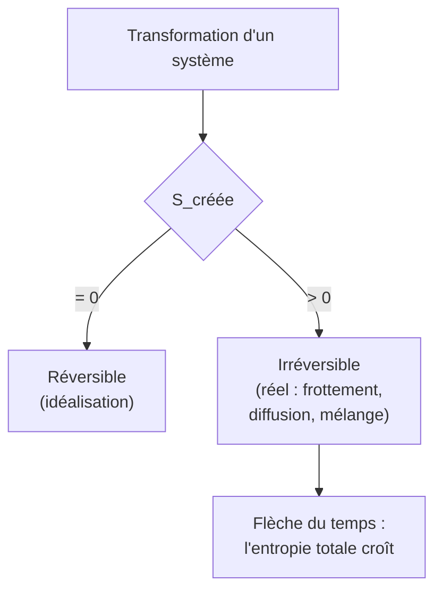
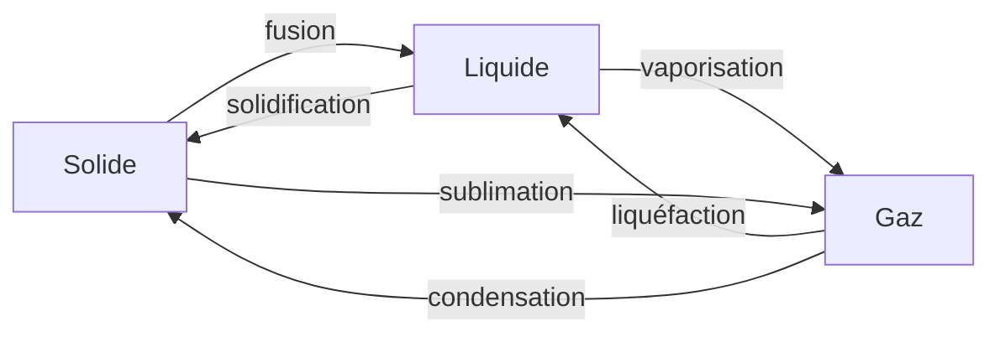

# Thermodynamique

La thermodynamique étudie les **transferts d'énergie** (chaleur et travail) et l'évolution des systèmes macroscopiques. Elle relie le microscopique (agitation des particules) au macroscopique (pression, température) via quelques principes universels. Elle prolonge la note lycée [[Énergie et Travail]].

## 1. Système et variables d'état

> [!important] Système thermodynamique
> Un **système** est une portion d'univers délimitée. On distingue : isolé (aucun échange), fermé (échange d'énergie mais pas de matière), ouvert (échange des deux).
> Son état est décrit par des **variables d'état** : pression $P$, volume $V$, température $T$, quantité de matière $n$.

> [!important] Le gaz parfait
> Modèle de référence : molécules ponctuelles sans interaction. Équation d'état :
> $$PV = nRT$$
> avec $T$ en **kelvins**, $R = 8{,}314$ J·mol⁻¹·K⁻¹.

> [!warning] Toujours en kelvins
> Toute formule de gaz parfait exige la température absolue. Utiliser des °C donne des résultats faux (et parfois des $T < 0$ absurdes).

## 2. Énergie interne et premier principe

> [!important] Premier principe (conservation de l'énergie)
> Pour un système fermé, la variation d'énergie interne est la somme des transferts reçus :
> $$\Delta U = Q + W$$
> où $Q$ est la chaleur **reçue** et $W$ le travail **reçu** (convention « énergie reçue comptée positivement »).

> [!note] Conventions de signe
> Cette note adopte $\Delta U = Q + W$ avec $W, Q$ reçus. D'autres références écrivent $\Delta U = Q - W_{\text{fourni}}$. L'essentiel est de fixer sa convention et de s'y tenir (voir [[Erreurs Classiques]]).

Travail des forces de pression : $W = -\displaystyle\int P_{\text{ext}}\,\mathrm{d}V$ (compté reçu).

### 2.1 Transformations et capacités thermiques

| Transformation | Condition | Conséquence (GP) |
|----------------|-----------|------------------|
| Isotherme | $T = \text{cste}$ | $PV = \text{cste}$ |
| Isobare | $P = \text{cste}$ | $V/T = \text{cste}$ |
| Isochore | $V = \text{cste}$ | $W = 0$, $\Delta U = Q$ |
| Adiabatique | $Q = 0$ | $PV^\gamma = \text{cste}$ (Laplace) |

Capacités thermiques : $C_V = \left(\dfrac{\partial U}{\partial T}\right)_V$ et $C_P = C_V + nR$ (relation de Mayer), avec $\gamma = C_P/C_V$.

## 3. Second principe et entropie

> [!important] Second principe
> Il existe une fonction d'état **entropie** $S$ telle que, pour toute transformation d'un système :
> $$\Delta S = S_{\text{échangée}} + S_{\text{créée}}, \qquad S_{\text{créée}} \geq 0$$
> $S_{\text{créée}} = 0$ pour une transformation **réversible**, $> 0$ pour une transformation irréversible. Pour un système isolé : $\Delta S \geq 0$.

> [!important] Interprétation statistique (Boltzmann)
> $$S = k_B \ln \Omega$$
> où $\Omega$ est le nombre de micro-états correspondant à l'état macroscopique. L'entropie mesure le **désordre** ; un système évolue spontanément vers l'état le plus probable (voir [[Physique Statistique]]).



> [!warning] L'entropie d'un sous-système peut diminuer
> Le second principe porte sur l'entropie **totale** (système + extérieur). Un réfrigérateur fait baisser l'entropie de son intérieur, mais en crée davantage à l'extérieur.

## 4. Machines thermiques

> [!important] Principe d'une machine cyclique
> Une machine fonctionne entre une source chaude ($T_c$) et une source froide ($T_f$). Sur un cycle, $\Delta U = 0$ donc $W = -(Q_c + Q_f)$.
> - **Moteur** : reçoit $Q_c > 0$, rejette $Q_f < 0$, fournit du travail. Rendement $\eta = \dfrac{|W|}{Q_c}$.
> - **Réfrigérateur / pompe à chaleur** : reçoit du travail pour extraire de la chaleur de la source froide.

> [!important] Théorème de Carnot
> Le rendement maximal d'un moteur entre $T_c$ et $T_f$ est celui du cycle réversible de Carnot :
> $$\eta_{\text{Carnot}} = 1 - \frac{T_f}{T_c}$$
> Aucun moteur réel ne peut le dépasser. C'est une conséquence directe du second principe.

### Visualisation animée (Manim)

> [!note] Ce que montre l'animation
> Le **cycle de Carnot** dans le diagramme de Clapeyron $(V, P)$ : deux isothermes (à $T_c$ et $T_f$) reliées par deux adiabatiques. L'aire enfermée par le cycle représente le **travail fourni** par le moteur sur un tour. On *voit* le sens de parcours (horaire = moteur) et comment l'aire — donc le travail — dépend de l'écart entre les deux isothermes.

```manim
# Rendu : manimgl carnot.py CycleDeCarnot
from manimlib import *


class CycleDeCarnot(Scene):
    def construct(self):
        axes = Axes(x_range=(0.5, 5, 1), y_range=(0, 5, 1), height=6, width=10)
        labels = axes.get_axis_labels("V", "P")
        self.play(ShowCreation(axes), Write(labels))

        # Constantes des isothermes (PV = cste) et adiabatiques (P V^gamma = cste)
        gamma = 1.4
        Tc_const, Tf_const = 8.0, 4.0     # PV = cste (chaude > froide)

        # Points du cycle (choisis pour rester dans le cadre)
        VA = 1.0
        PA = Tc_const / VA                # A sur l'isotherme chaude
        VB = 2.0
        PB = Tc_const / VB                # B sur l'isotherme chaude
        # B -> C adiabatique jusqu'à l'isotherme froide : P V^gamma = cste
        K_BC = PB * VB**gamma
        # C sur l'isotherme froide : P = Tf/V et P = K_BC / V^gamma
        VC = (K_BC / Tf_const)**(1 / (gamma - 1))
        PC = Tf_const / VC
        VD = VC * (VB / VA)               # par symétrie du cycle
        PD = Tf_const / VD

        def iso(const, v1, v2, color):
            return axes.get_graph(lambda v: const / v, x_range=(min(v1, v2), max(v1, v2)), color=color)

        def adia(K, v1, v2, color):
            return axes.get_graph(lambda v: K / v**gamma, x_range=(min(v1, v2), max(v1, v2)), color=color)

        ab = iso(Tc_const, VA, VB, RED)        # détente isotherme chaude
        bc = adia(K_BC, VB, VC, GREY_B)        # détente adiabatique
        cd = iso(Tf_const, VC, VD, BLUE)       # compression isotherme froide
        K_DA = PD * VD**gamma
        da = adia(K_DA, VD, VA, GREY_B)        # compression adiabatique

        for pt, name, d in [((VA, PA), "A", UL), ((VB, PB), "B", UR),
                            ((VC, PC), "C", DR), ((VD, PD), "D", DL)]:
            self.add(Dot(axes.c2p(*pt), color=YELLOW), Tex(name).next_to(axes.c2p(*pt), d, buff=0.1))

        self.play(ShowCreation(ab))
        self.play(ShowCreation(bc))
        self.play(ShowCreation(cd))
        self.play(ShowCreation(da))

        legende = VGroup(
            Tex(r"\text{rouge : isotherme chaude } T_c", color=RED),
            Tex(r"\text{bleu : isotherme froide } T_f", color=BLUE),
            Tex(r"\text{gris : adiabatiques}", color=GREY_B),
            Tex(r"\text{aire intérieure} = W \text{ fourni}"),
        ).arrange(DOWN, aligned_edge=LEFT).scale(0.6).to_corner(UR).set_backstroke()
        self.play(Write(legende))
        self.wait(2)
```

## 5. Changements d'état (transitions de phase)

> [!important] Corps pur sous plusieurs phases
> Un corps pur peut exister en phase solide, liquide ou gazeuse. Le **diagramme $(P, T)$** délimite ces domaines ; les courbes de transition se rejoignent au **point triple** (coexistence des trois phases) et la courbe de vaporisation s'arrête au **point critique** (au-delà, plus de distinction liquide-gaz).



> [!important] Enthalpie de changement d'état (chaleur latente)
> Une transition de phase se fait à **température et pression constantes**, en échangeant une chaleur latente. Pour une masse $m$ :
> $$Q = m\,L \qquad (L : \text{enthalpie massique de changement d'état, en J·kg}^{-1})$$
> Pendant le changement d'état, la chaleur reçue ne fait pas monter la température : elle sert à **rompre les liaisons** entre molécules.

> [!example] Faire fondre puis vaporiser de l'eau
> Pour l'eau : $L_{\text{fusion}} \approx 334$ kJ·kg⁻¹, $L_{\text{vaporisation}} \approx 2257$ kJ·kg⁻¹. Vaporiser $1$ kg d'eau déjà à $100$ °C demande $2257$ kJ — bien plus que pour la chauffer de $0$ à $100$ °C ($\approx 420$ kJ). C'est pourquoi l'évaporation de la sueur refroidit efficacement le corps.

## 6. Troisième principe

> [!important] Troisième principe (Nernst)
> Quand $T \to 0$ K, l'entropie d'un cristal parfait tend vers $0$. Le zéro absolu est **inatteignable** en un nombre fini d'opérations.

## 7. Exercices types corrigés

### Exercice 1 : détente isotherme

**Énoncé** : Une mole de gaz parfait subit une détente isotherme réversible de $V_1$ à $V_2 = 2V_1$ à $T = 300$ K. Calculer le travail reçu et la chaleur reçue.

> [!example] Correction
> Isotherme GP : $\Delta U = 0$, donc $Q = -W$.
> $$W = -\int_{V_1}^{V_2} \frac{nRT}{V}\mathrm{d}V = -nRT\ln\frac{V_2}{V_1} = -1 \times 8{,}314 \times 300 \times \ln 2 \approx -1729 \text{ J}$$
> Le gaz reçoit $W \approx -1729$ J (il fournit du travail) et $Q = +1729$ J (il absorbe de la chaleur).

### Exercice 2 : rendement de Carnot

**Énoncé** : Une centrale fonctionne entre une source chaude à $T_c = 550$ °C et une source froide (rivière) à $T_f = 20$ °C. Quel est le rendement maximal théorique ?

> [!example] Correction
> En kelvins : $T_c = 823$ K, $T_f = 293$ K.
> $$\eta_{\text{Carnot}} = 1 - \frac{293}{823} \approx 0{,}64 = 64\%$$
> Les centrales réelles plafonnent vers $40\%$ : irréversibilités et limites techniques.

### Exercice 3 : variation d'entropie

**Énoncé** : On met en contact deux corps identiques de capacité $C$, l'un à $T_1$, l'autre à $T_2$. Justifier qualitativement que l'entropie totale augmente.

> [!example] Correction
> La chaleur passe spontanément du chaud vers le froid jusqu'à la température commune $T_f = \dfrac{T_1 + T_2}{2}$. Le corps chaud perd de l'entropie, le froid en gagne davantage (car $\delta S = \delta Q/T$ et $T$ est plus petit côté froid). Le bilan $\Delta S_{\text{tot}} > 0$ : la transformation est irréversible, conforme au second principe.

## 8. À retenir

> [!tip] À retenir
> - **Gaz parfait** : $PV = nRT$ ($T$ en K). Adiabatique réversible : $PV^\gamma = \text{cste}$.
> - **1er principe** : $\Delta U = Q + W$ (conservation de l'énergie).
> - **2e principe** : $\Delta S = S_{\text{éch}} + S_{\text{créée}}$, $S_{\text{créée}} \geq 0$ ; $S = k_B\ln\Omega$ (désordre).
> - **Machines** : moteur $\eta = |W|/Q_c \leq \eta_{\text{Carnot}} = 1 - T_f/T_c$.
> - **Changements d'état** : à $T$ et $P$ constantes, chaleur latente $Q = mL$ ; diagramme $(P,T)$, point triple, point critique.
> - L'irréversibilité ($S_{\text{créée}} > 0$) donne la **flèche du temps**.

*Voir aussi* : [[Énergie et Travail]] | [[Transferts Thermiques]] | [[Physique Statistique]] | [[Erreurs Classiques]]
